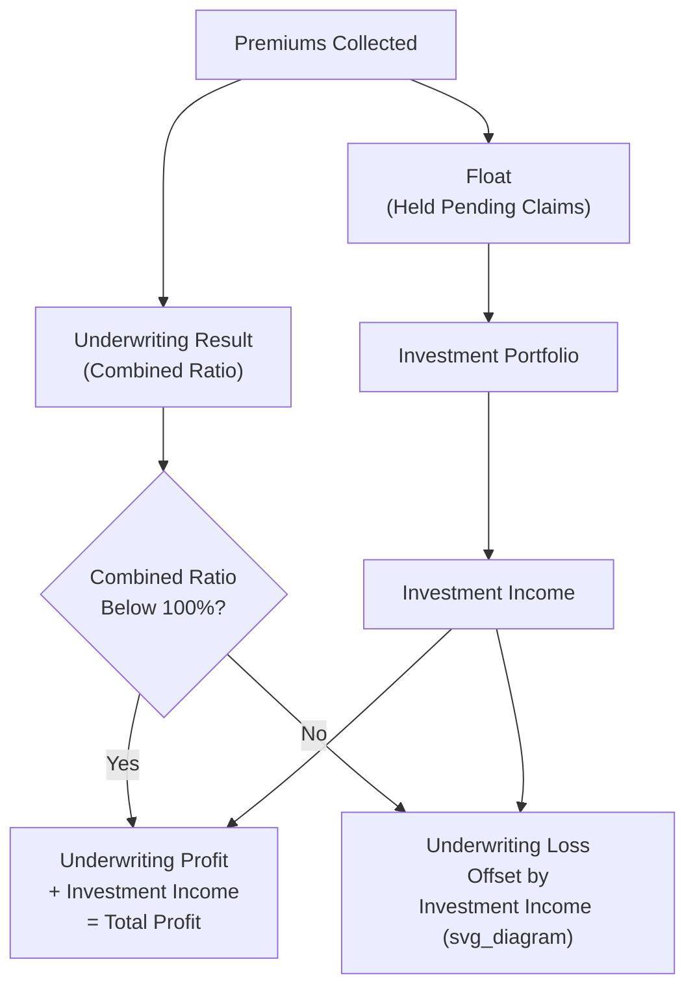

## Valuing Insurance Companies

### Overview

Valuing insurance companies requires a specialized framework that, like bank valuation, departs from standard corporate DCF and EV/EBITDA analysis, but for distinct reasons rooted in the unique nature of insurance liabilities and the industry's specific accounting and regulatory regimes. An insurer's core economics revolve around collecting premiums today in exchange for an uncertain, often long-dated obligation to pay claims in the future — the "float" generated between premium collection and claim payment, combined with investment income earned on that float, drives economics that differ fundamentally from a typical operating company's revenue-cost-profit structure.

### Why Standard Valuation Methods Require Adaptation

**1. Liabilities Are the Core Product, Not Financing**

Insurance reserves (liabilities for future claims) are not analogous to conventional corporate debt; they represent the insurer's core obligation under the policies it has written, funded by premiums already collected. Like bank deposits, insurance reserves are operating in nature rather than a discretionary financing choice, which similarly breaks the standard enterprise value framework that separates operating performance from capital structure.

**2. Revenue Recognition and Profitability Timing Are Structurally Delayed and Uncertain**

Premiums are collected upfront (or over a policy period), but the ultimate cost of claims may not be known for years or, for certain long-tail liability lines, decades — this creates substantial estimation uncertainty in reported earnings, since current period profitability depends heavily on actuarial reserve estimates for claims that have not yet been finally settled.

**3. Investment Income Is a Core Profit Driver, Not a Peripheral Item**

Because insurers hold substantial investment portfolios funded by float (premiums collected but not yet paid out as claims), investment income and investment portfolio management are central to overall profitability, not a secondary treasury function as in most non-financial companies — insurer valuation must therefore explicitly address both underwriting economics and investment portfolio economics as distinct, significant profit drivers.

**4. Different Lines of Business Have Fundamentally Different Risk and Duration Profiles**

Property and casualty (P&C) insurance, life insurance, health insurance, and reinsurance each have distinct claim development patterns, capital requirements, and valuation considerations, such that a single unified insurance valuation framework must be adapted meaningfully depending on the specific line(s) of business involved.

### Key Insurance-Specific Concepts

**1. Float**

$$\text{Float} = \text{Unearned Premium Reserves} + \text{Loss Reserves} - \text{Deferred Acquisition Costs (Net)}$$

Float represents funds the insurer holds and can invest during the period between premium collection and claim payment. A larger float relative to the insurer's size, combined with a low cost of float (see below), is a significant value driver, since it effectively provides the insurer with investable capital at potentially very low or even negative cost.

**2. Combined Ratio**

$$\text{Combined Ratio} = \text{Loss Ratio} + \text{Expense Ratio} = \frac{\text{Incurred Losses} + \text{Loss Adjustment Expenses}}{\text{Earned Premiums}} + \frac{\text{Underwriting Expenses}}{\text{Earned Premiums}}$$

A combined ratio below 100% indicates an underwriting profit (premiums exceed losses and expenses before investment income); above 100% indicates an underwriting loss, which must then be offset by investment income to achieve overall profitability. The combined ratio is one of the single most closely watched metrics in P&C insurer analysis.

**3. Cost of Float**

$$\text{Cost of Float} \approx \frac{\text{Underwriting Loss (or Gain)}}{\text{Average Float}}$$

When an insurer achieves an underwriting profit (combined ratio below 100%), the cost of float is effectively negative — the insurer is being paid to hold and invest other people's money, a particularly attractive economic position frequently highlighted in insurance-focused investment analysis (this concept is closely associated with commentary on well-known insurance-centric holding company investment strategies).

**4. Loss Reserve Adequacy and Reserve Development**

Reserves are actuarial estimates, and their adequacy is only confirmed with certainty as claims are ultimately settled over subsequent years. "Favorable development" occurs when prior-year reserves prove to have been more than sufficient (reducing current-period reported losses as the excess is released); "adverse development" occurs when prior reserves prove insufficient, requiring additional current-period charges. Persistent patterns of favorable or adverse development are an important signal of the conservatism (or aggressiveness) of an insurer's historical reserving practices, and normalized earnings analysis should account for this pattern rather than taking reported figures purely at face value.

### Primary Valuation Approaches for Insurance Companies

**1. Price-to-Book and Price-to-Tangible-Book Multiples**

As with banks, book value is a more economically meaningful metric for insurers than for typical non-financial companies, since insurance balance sheets consist substantially of financial assets (investment portfolios) and liabilities (reserves) that are more closely tied to fair or carrying value than, for example, a manufacturer's fixed assets.

$$P/B = \frac{\text{Market Capitalization}}{\text{Total Shareholders' Equity}}$$

P/B is particularly central to P&C insurer valuation and is frequently analyzed in conjunction with ROE, since insurers generating sustainably higher ROE than their cost of equity warrant higher P/B multiples, analogous to the ROE-P/B relationship discussed in bank valuation.

**2. Dividend Discount Model / Excess Return Model**

As with banks, DDM and excess return (residual income) models are commonly applied to insurers, valuing equity directly based on projected dividends or the present value of ROE in excess of cost of equity applied to the book value base, since these frameworks appropriately handle the operating nature of insurance liabilities without requiring an artificial unlevered free cash flow construction.

$$V_{equity} = BV_0 + \sum_{t=1}^{n} \frac{(ROE_t - k_e) \times BV_{t-1}}{(1 + k_e)^t}$$

**3. Embedded Value (Primarily for Life Insurance)**

Embedded value is a specialized valuation metric developed specifically for life insurance companies, reflecting the present value of future profits expected to emerge from the in-force policy book, plus adjusted net worth (shareholder capital not required to support the in-force business):

$$\text{Embedded Value} = \text{Adjusted Net Worth} + \text{Present Value of In-Force Business}$$

Where the present value of in-force business discounts projected future statutory or GAAP profits emerging from currently existing policies (net of the cost of holding required regulatory capital against those policies) at a risk-adjusted discount rate. Embedded value is widely used in life insurance industry analysis, particularly outside the U.S. (embedded value reporting has historically been more standardized and prevalent in European life insurance markets), and forms the basis for the related "appraisal value" concept, which adds the value of expected future new business production to embedded value to arrive at a total franchise value estimate.

[Unverified: specific embedded value methodologies (traditional embedded value, European Embedded Value, Market-Consistent Embedded Value) differ in their treatment of risk discounting and market consistency assumptions, and the specific framework used should be identified explicitly when embedded value figures are compared across companies, since results are not necessarily directly comparable across different methodological standards.]

**4. Precedent Insurance M&A Transactions**

Precedent transaction multiples (commonly price/book value, and for life insurers, price/embedded value) provide relevant benchmarks, again subject to insurance-specific regulatory approval considerations (state insurance regulator approval in the U.S. context, or equivalent national/regional insurance regulators elsewhere) that can affect deal timelines and structuring relative to non-financial M&A.

### Key Insurance-Specific Financial Metrics

| Metric | Definition | Significance |
| --- | --- | --- |
| Combined Ratio | Loss Ratio + Expense Ratio | Core P&C underwriting profitability measure |
| Loss Ratio | Incurred Losses / Earned Premiums | Measures claims cost relative to premium income |
| Expense Ratio | Underwriting Expenses / Earned Premiums (or Written Premiums, depending on convention) | Measures operating efficiency of underwriting operations |
| Return on Equity (ROE) | Net Income / Average Shareholders' Equity | Core overall profitability measure, central to P/B multiple analysis |
| Net Premiums Written (NPW) / Net Premiums Earned (NPE) | Written premiums retained after ceding to reinsurers / Portion of written premiums recognized as revenue over the policy period | Core top-line growth and revenue recognition measures |
| Reserve-to-Surplus Ratio | Loss Reserves / Policyholder Surplus | Leverage and capital adequacy measure specific to P&C insurers |
| Risk-Based Capital (RBC) Ratio | Actual Capital / Regulatory Required Capital (based on a risk-weighted formula) | Core regulatory capital adequacy measure in many jurisdictions (e.g., the NAIC RBC framework in the U.S.) |
| Persistency Ratio (Life Insurance) | Percentage of in-force policies renewed/retained over a period | Measures retention of the in-force policy book, a key driver of embedded value realization |

### Reinsurance and Its Effect on Valuation

Reinsurance — insurance purchased by insurers themselves to cede a portion of their risk to other (re)insurers — materially affects both reported financials and valuation analysis:

- **Ceded premiums and recoverables**: Net premiums (after ceding) rather than gross premiums are generally the more relevant figure for assessing an insurer's retained economic exposure and profitability.
- **Counterparty credit risk on reinsurance recoverables**: An insurer's reported reserves may rely on the expectation of recovery from reinsurers for ceded claims; the creditworthiness of reinsurance counterparties is a relevant risk factor, particularly for older, long-tail claims where recoverables may remain outstanding for extended periods.
- **Catastrophe reinsurance and capital markets risk transfer (e.g., catastrophe bonds)**: Insurers with significant catastrophe exposure (property insurers in hurricane- or earthquake-prone regions) rely heavily on reinsurance and alternative risk transfer mechanisms to manage tail risk, and the cost and availability of this protection is a meaningful input to sustainable underwriting profitability projections.

### Illustrative Simplified Example: P&C Insurer Valuation via Excess Return Model

An insurer has current book value of $800 million, a combined ratio of 96% (a 4-point underwriting profit margin on earned premiums of $1 billion, i.e., $40 million underwriting profit), investment income of $60 million on its float and capital base, yielding total pre-tax income of $100 million, and an assumed sustainable ROE of 11% against a cost of equity of 9.5%.

$$\text{Annual Excess Return} = (11\% - 9.5\%) \times BV_{t-1} = 1.5\% \times BV_{t-1}$$

As with the bank example, the present value of this excess return stream over an explicit projection period, added to current book value, yields the excess-return-model-implied equity value, with the actual result depending on the detailed multi-year book value growth trajectory (driven by retained earnings) and discounting mechanics.

### Application Contexts

- **Public insurer equity research**: P/B, ROE analysis, combined ratio trend analysis, and excess return/DDM models form the standard analytical toolkit.
- **Life insurance company valuation and appraisal**: Embedded value and appraisal value are the specialized, industry-standard frameworks, particularly relevant for M&A, demutualization transactions, and value-based management within life insurers.
- **Insurance M&A and reinsurance transaction analysis**: Price/book and price/embedded value multiples, combined with reserve adequacy due diligence, are central to negotiating and evaluating insurance sector transactions.
- **Insurance-linked securities and catastrophe bond analysis**: A specialized adjacent area requiring actuarial modeling of catastrophe risk alongside standard fixed-income-style yield analysis, relevant to insurers' own risk transfer economics as well as to investors in these instruments directly.

### Common Pitfalls

- **Applying standard EV/EBITDA or unlevered FCF DCF analysis to insurers**: Misapplies the enterprise value framework to a business where reserves are core operating liabilities, not discretionary financing, analogous to the equivalent error in bank valuation.
- **Taking reported earnings at face value without considering reserve development history**: Failing to adjust for a pattern of favorable or adverse prior-year reserve development can materially misstate a normalized, sustainable earnings run-rate.
- **Ignoring investment portfolio risk and duration mismatch**: Failing to assess whether an insurer's investment portfolio duration and risk profile is appropriately matched to its liability duration (particularly relevant for long-tail P&C lines and life insurance) can miss a material risk factor affecting sustainable profitability and capital adequacy.
- **Treating combined ratio in isolation without investment income context**: A combined ratio above 100% is not automatically a sign of a poorly-run insurer if investment income reliably and sufficiently offsets the underwriting loss to produce attractive overall returns — the two must be assessed together, not the underwriting result alone.
- **Applying life insurance embedded value methodology to P&C insurers (or vice versa) without adaptation**: Embedded value is specifically designed around the long-duration, contractual nature of life insurance policies and is not directly transferable to shorter-tail P&C business without significant methodological modification.
- **Overlooking reinsurance counterparty risk in reserve and recoverable analysis**: Assuming full recoverability of ceded reserves without considering the creditworthiness and claims-paying history of reinsurance counterparties, particularly for aged, long-tail recoverables.

**Related Topics**

- Valuing Banks and Financial Institutions
- Dividend Discount Model Mechanics and Terminal Value
- Excess Return / Residual Income Valuation Models
- Regulatory Capital Frameworks and Basel III Requirements
- Precedent Transaction Analysis and Control Premiums
- Weighting Valuation Methods by Context
- Reinsurance Structures and Risk Transfer Mechanisms