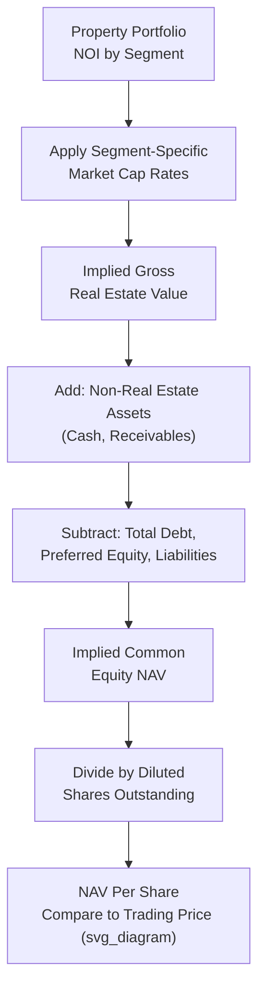

## Valuing Real Estate and REITs Using NAV, FFO, and AFFO

### Overview

Valuing real estate companies and Real Estate Investment Trusts (REITs) requires specialized metrics — Net Asset Value (NAV), Funds From Operations (FFO), and Adjusted Funds From Operations (AFFO) — that address the ways standard GAAP net income and conventional corporate valuation multiples fail to capture the true economics of real estate ownership. Because real estate assets are subject to GAAP depreciation charges that frequently do not reflect actual economic value decline (many well-maintained properties appreciate over time rather than depreciate), and because REITs are structured around distributing the substantial majority of taxable income to shareholders, the industry has developed its own standardized set of metrics to better reflect cash-generating capacity and underlying asset value.

### Why Standard Metrics Are Inadequate for Real Estate

**1. GAAP Depreciation Distorts Reported Earnings**

Real estate is depreciated over a standard useful life (commonly 27.5 or 39 years for U.S. tax purposes depending on property type, with GAAP book depreciation periods that may differ) regardless of the property's actual physical condition or market value trend. A well-located, well-maintained commercial property may be appreciating in economic value while GAAP net income reflects a substantial non-cash depreciation charge, causing reported net income to significantly understate the property's true cash-generating economics.

**2. Gains and Losses on Property Sales Create Earnings Volatility Unrelated to Ongoing Operations**

REITs and real estate companies periodically sell properties as part of normal portfolio management (capital recycling), generating gains or losses that can significantly distort period-to-period GAAP net income comparisons if not separately identified and excluded from operating performance measures.

**3. REIT Structure Requires Specialized Distribution-Focused Analysis**

REITs are generally required (under applicable tax regimes, such as the U.S. REIT rules) to distribute the substantial majority of their taxable income to shareholders to maintain favorable tax treatment (avoiding corporate-level income tax), making cash flow available for distribution a particularly central analytical focus, more so than for a typical corporation where dividend policy is a more discretionary capital allocation choice.

### Funds From Operations (FFO)

**Definition and Standard Calculation**

FFO is the primary, industry-standardized earnings metric for REITs, developed and defined by the National Association of Real Estate Investment Trusts (Nareit) to provide a more meaningful measure of operating performance than GAAP net income.

$$FFO = \text{Net Income} + \text{Depreciation and Amortization (Real Estate-Related)} - \text{Gains on Sale of Property} + \text{Losses on Sale of Property}$$

**Rationale for Each Adjustment**

- **Adding back depreciation and amortization**: Removes the non-cash charge that, as discussed above, frequently does not reflect actual economic value decline for real estate assets.
- **Removing gains on property sales**: Excludes one-time, non-operating gains from the ongoing operating performance measure, since these reflect portfolio management/capital recycling activity rather than recurring operations.
- **Adding back losses on property sales**: Symmetrically excludes one-time losses for the same reason.

**Nareit Standardized Definition**

Because FFO comparability across companies depends on consistent application, Nareit has published and periodically updated a standardized definition that REITs are encouraged (though not always strictly required, depending on jurisdiction and specific reporting practice) to follow, which helps analysts compare FFO across different REITs with greater confidence than would be possible if each company defined the metric idiosyncratically.

### Adjusted Funds From Operations (AFFO)

**Definition and Rationale**

While FFO addresses the primary distortion from real estate depreciation, it does not capture certain other cash outflows necessary to maintain a property's revenue-generating capacity over time, nor certain non-cash income statement items unrelated to depreciation. AFFO (sometimes also referred to by other similar labels such as Cash Available for Distribution, or CAD, with some variation in exact methodology across firms and analysts) refines FFO further:

$$AFFO = FFO - \text{Recurring Capital Expenditures} - \text{Straight-Line Rent Adjustments} - \text{Leasing Commissions and Tenant Improvement Costs (Recurring)} + \text{Other Non-Cash Adjustments}$$

**Key AFFO Adjustments Explained**

- **Recurring capital expenditures**: Capital spending required to maintain (not expand) the existing property portfolio's competitive position and revenue-generating capacity (e.g., roof replacements, HVAC system maintenance, common area updates) — this is genuine cash outflow necessary for the business to continue generating its current revenue stream, unlike the accounting depreciation charge added back in FFO.
- **Straight-line rent adjustments**: Under GAAP, rental income from leases with scheduled rent escalations is often recognized on a straight-line basis over the lease term (averaging the total contracted rent evenly across the period) rather than reflecting the actual cash rent received in each period; AFFO removes this non-cash timing difference to reflect actual cash rental receipts.
- **Leasing commissions and tenant improvements**: Costs incurred to secure new tenants or renew existing leases (leasing agent commissions, build-out allowances for tenant improvements) represent real, recurring cash costs of maintaining occupancy that are not captured in FFO.

**Why AFFO Is Considered a More Refined Cash Flow Measure**

Because AFFO removes both the non-cash distortions addressed by FFO and captures the additional recurring cash outflows needed to sustain the property portfolio's earning power, it is often viewed by analysts as a closer approximation of true sustainable cash available for distribution to shareholders than FFO alone, and is frequently used as the basis for assessing dividend/distribution coverage and sustainability.

$$\text{AFFO Payout Ratio} = \frac{\text{Dividends/Distributions Paid}}{AFFO}$$

A payout ratio meaningfully below 100% suggests a more comfortably sustainable distribution level, while a ratio approaching or exceeding 100% may signal distribution sustainability concerns absent offsetting factors (e.g., planned near-term earnings growth, or comfort that the company can and intends to fund distributions partly from debt or equity capital raises rather than solely from operating AFFO, which carries its own separate financial risk considerations).

### Net Asset Value (NAV)

**Conceptual Foundation**

NAV values a REIT or real estate company based on the estimated current market value of its underlying real estate portfolio, rather than an earnings-multiple-based approach — analogous in spirit to a sum-of-the-parts valuation, but specifically applying property-level market valuation techniques to each asset or portfolio segment.

**Standard NAV Calculation Methodology**

$$NAV = \frac{\text{Portfolio Net Operating Income (NOI)}}{\text{Market Capitalization Rate}} + \text{Non-Real Estate Assets} - \text{Total Debt and Other Liabilities} - \text{Preferred Equity}$$

**Step-by-Step Construction**

1. **Estimate stabilized, forward Net Operating Income (NOI)** for the property portfolio: rental revenue plus other property income, less property-level operating expenses (excluding depreciation, interest, and corporate overhead, which are addressed separately in the NAV build).
2. **Apply an appropriate market capitalization rate** to the NOI, segmented by property type and geography where the portfolio is diversified, since different property types (office, retail, industrial, multifamily, healthcare, data centers, etc.) and different markets command materially different cap rates reflecting their relative risk, growth prospects, and liquidity.
3. **Add the value of non-real estate assets**: cash, receivables, and any other balance sheet items not captured in the property-level NOI capitalization.
4. **Subtract total debt, preferred equity, and other liabilities** to arrive at implied common equity NAV.
5. **Divide by diluted shares outstanding** to arrive at NAV per share, the figure most commonly compared against the REIT's actual trading price.

$$\text{Property Value} = \frac{NOI}{\text{Cap Rate}}$$

**NAV Premium/Discount Analysis**

$$\text{Premium/(Discount) to NAV} = \frac{\text{Share Price} - NAV \text{ per Share}}{NAV \text{ per Share}}$$

REITs trading at a premium to NAV may reflect market expectations of superior future growth, external growth opportunities (accretive acquisitions funded at a cost of capital below the implied cap rate), or superior management execution; REITs trading at a discount to NAV may reflect market skepticism about the estimated NAV inputs, concerns about specific portfolio or balance sheet risks, or broader sector sentiment, and are sometimes viewed by some investors as a signal of potential relative undervaluation, subject to independently assessing why the discount exists.

### Capitalization Rate Selection

Cap rate selection is the single most influential and judgment-intensive input in NAV analysis:

- **Observed private market transaction cap rates**: Recent arm's-length sales of comparable properties (similar property type, quality/class, location, and lease profile) provide the primary empirical benchmark.
- **Property type and quality differentiation**: Class A office in a prime central business district typically commands a materially lower cap rate (higher value per dollar of NOI) than a Class C property in a secondary market, reflecting differences in perceived risk, tenant quality, and growth prospects.
- **Interest rate environment sensitivity**: Cap rates have historically shown some relationship to prevailing interest rates and the broader cost of capital environment, though the relationship is not mechanical or constant, and cap rate movements can lag, lead, or diverge from interest rate movements depending on real estate-specific supply/demand dynamics and investor sentiment at a given time. [Unverified: the precise historical correlation between interest rates and cap rates varies by time period, property type, and market, and should not be assumed to be a fixed, mechanically predictable relationship for forecasting purposes.]

### Comparative Multiples: Price/FFO and Price/AFFO

Beyond NAV, REITs are also commonly valued using earnings-multiple approaches analogous to P/E for conventional companies, but based on FFO or AFFO rather than GAAP net income:

$$P/FFO = \frac{\text{Share Price}}{FFO \text{ per Share}}, \quad P/AFFO = \frac{\text{Share Price}}{AFFO \text{ per Share}}$$

These multiples are commonly benchmarked against sector and sub-sector peers (e.g., comparing a multifamily REIT primarily against other multifamily REITs rather than against office or industrial peers, given differing growth, risk, and capital intensity profiles across property types) and against the REIT's own historical trading range.

### Illustrative Example — NAV Calculation

A diversified REIT has the following portfolio composition:

| Property Segment | Segment NOI | Applied Cap Rate | Implied Segment Value |
| --- | --- | --- | --- |
| Office | $40M | 7.5% | $533.3M |
| Retail | $25M | 6.5% | $384.6M |
| Industrial | $35M | 5.5% | $636.4M |
| **Total Implied Real Estate Value** |  |  | **$1,554.3M** |

Adding $20 million in cash and other non-real estate assets, and subtracting $650 million in total debt and $50 million in preferred equity:

$$\text{Common Equity NAV} = \$1,554.3M + \$20M - \$650M - \$50M = \$874.3M$$

With 40 million diluted shares outstanding: $NAV \text{ per Share} = \$874.3M / 40M = \$21.86$. If the REIT trades at $19.50 per share, this implies a discount to NAV of approximately 10.8%.

### Application Contexts

- **Public REIT equity research and investment analysis**: FFO, AFFO, P/FFO, P/AFFO, and NAV premium/discount analysis form the standard core toolkit for REIT-focused analysts.
- **Private real estate portfolio and fund valuation**: NAV-based approaches are directly applicable to private real estate funds and non-traded REITs, where periodic NAV calculations (rather than continuous market pricing) often form the basis for investor subscription and redemption pricing.
- **REIT M&A and privatization transactions**: NAV serves as a key reference point in evaluating whether a proposed acquisition price for a REIT represents fair value relative to underlying real estate asset value, alongside FFO/AFFO multiple-based cross-checks.
- **Real estate development and value-add investment underwriting**: While NAV as described here focuses on stabilized, income-producing property valuation, related cap-rate and NOI-based methodologies underpin development and repositioning project underwriting, adapted for construction risk, lease-up assumptions, and stabilization timelines.

### Common Pitfalls

- **Relying solely on GAAP net income to assess REIT operating performance**: Ignores the specific and well-understood distortion from real estate depreciation, producing a misleading picture of actual operating performance and cash-generating capacity.
- **Confusing FFO with true cash flow available for distribution**: FFO does not capture recurring capital expenditures, leasing costs, or straight-line rent adjustments; AFFO is generally the more appropriate metric for assessing genuine distribution sustainability.
- **Applying a single blended cap rate across a diversified property portfolio**: Different property types and markets warrant different cap rates; a single blended rate applied uniformly can materially misstate segment-level and total NAV.
- **Using stale or unrepresentative comparable transaction cap rate data**: Real estate transaction markets can shift meaningfully over relatively short periods in response to interest rate changes, sector-specific supply/demand shifts, or broader market sentiment; NAV analysis should rely on current, genuinely comparable transaction evidence.
- **Ignoring balance sheet leverage and its interaction with per-share NAV**: Since NAV is calculated on an equity basis after subtracting debt, highly leveraged REITs will show greater NAV per share sensitivity to changes in the underlying cap rate or NOI assumptions than lower-leveraged peers — a factor relevant to assessing the risk profile behind a given NAV estimate.
- **Comparing FFO/AFFO multiples across different property-type REITs without adjustment**: Growth rates, capital intensity (recurring capex as a percentage of NOI), and risk profiles differ substantially by property type (e.g., data center and industrial REITs have historically warranted different growth and multiple profiles than traditional retail or office REITs), making cross-sector multiple comparisons without context potentially misleading.

**Related Topics**

- Sum-of-the-Parts Valuation for Diversified Businesses
- Weighting Valuation Methods by Context
- Precedent Transaction Analysis and Control Premiums
- Valuing Banks and Financial Institutions
- Capitalization Rate Analysis and Property-Level Underwriting
- Dividend Discount Model Mechanics and Terminal Value
- Discount for Lack of Marketability (DLOM)