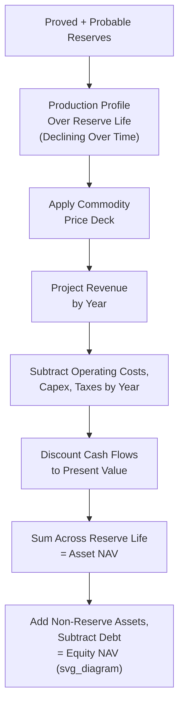

## Valuing Natural Resource and Commodity Companies

### Overview

Valuing natural resource and commodity companies — encompassing oil and gas, mining, and related extractive industries — requires specialized frameworks that address two defining characteristics not present in most other sectors: the depleting, finite nature of the underlying reserve base, and the extreme cyclicality and volatility of commodity prices that drive revenue independent of company-specific operational execution. Standard perpetuity-based DCF terminal value assumptions and steady-state multiple benchmarking must be substantially modified to reflect that a mine or oil field is a wasting asset with a finite economic life, and that a company's reported earnings at any point in the commodity price cycle may bear little relationship to its normalized, mid-cycle earning power.

### Why Standard Valuation Approaches Require Adaptation

**1. Reserves Are a Depleting, Finite Asset Base**

Unlike a manufacturing business that can theoretically operate indefinitely with reinvestment, an extractive resource company's production is fundamentally constrained by its proven and probable reserve base — once reserves are extracted, they must be replaced through further exploration and development, or the company's production (and eventually its value) will decline toward zero. A standard DCF terminal value calculation assuming perpetual cash flow growth is generally inappropriate without explicit reserve life and replacement assumptions.

**2. Commodity Price Cyclicality Dominates Reported Earnings**

Revenue and profitability for natural resource companies are driven substantially by the prevailing market price of the underlying commodity (oil, natural gas, copper, gold, iron ore, etc.), which is set in global markets largely independent of any individual company's operations. Reported earnings at a cyclical peak can appear extremely strong, while the same company at a cyclical trough may show minimal or negative earnings, despite little change in the company's underlying operational quality or asset base — a valuation based on current-period or even near-term forward earnings can produce highly misleading conclusions if the current point in the commodity cycle is not explicitly considered.

**3. Reserve-Based Metrics Provide an Asset-Specific Valuation Anchor Not Available in Other Industries**

The existence of formally classified reserve categories (proved, probable, possible) provides a structured, engineering-based framework for asset valuation that has no direct analog in most other industries, enabling specialized reserve-based valuation approaches (Net Asset Value analysis) alongside standard cash-flow and multiple-based methods.

### Reserve Classification Framework

**Oil and Gas Reserve Categories**

| Category | Definition | Certainty Level |
| --- | --- | --- |
| Proved Reserves (1P) | Reasonably certain to be economically recoverable under existing economic and operating conditions | Highest certainty; typically requires ~90% probability of recovery |
| Proved + Probable (2P) | Proved reserves plus probable reserves (reasonably likely but less certain than proved) | Moderate certainty; commonly requires ~50% probability of recovery for the combined 2P estimate |
| Proved + Probable + Possible (3P) | 2P reserves plus possible reserves (less likely than probable but still with a meaningful chance of recovery) | Lowest certainty threshold among the three standard categories, commonly associated with a materially lower probability of recovery |

**Mining Reserve and Resource Categories**

Mining uses an analogous but distinctly labeled framework (commonly aligned with international reporting codes such as the JORC Code in Australia, NI 43-101 in Canada, or the SEC's S-K 1300 rules in the U.S., among others):

- **Mineral Resources**: Inferred, Indicated, and Measured (increasing order of geological confidence).
- **Mineral Reserves**: Probable and Proved (derived from Indicated and Measured resources respectively, after applying modifying factors such as mining, processing, economic, and legal considerations to confirm economic extractability).

[Unverified: specific reserve/resource classification standards, terminology, and reporting requirements differ across jurisdictions and regulatory regimes and are periodically updated; the applicable standard for a given company should be confirmed based on its specific listing jurisdiction and regulatory reporting framework rather than assumed to follow a single universal standard.]

### Net Asset Value (NAV) Approach for Resource Companies

**Conceptual Foundation**

Analogous in spirit to REIT NAV analysis, resource company NAV values the company based on the estimated economic value of its reserve base, typically using a DCF applied specifically to the production profile implied by the reserves, rather than relying on a perpetuity-based terminal value.

**Standard Construction**

$$NAV = \sum_{t=1}^{n} \frac{(\text{Production}_t \times \text{Price}_t - \text{Operating Costs}_t - \text{Capital Expenditures}_t - \text{Taxes}_t)}{(1 + r)^t} + \text{Non-Reserve Assets} - \text{Total Debt}$$

Where the projection period $n$ spans the full economic life of the reserves as they are produced and depleted (rather than an indefinite perpetuity), production volumes decline over time according to the specific field or mine's depletion profile, and the analysis is typically run separately for each major asset or property before being aggregated (a sum-of-the-parts approach at the asset level).

**Commodity Price Deck Selection**

A central and highly consequential input is the assumed commodity price forecast (the "price deck") used to project revenue over the reserve life:

- **Strip/forward curve pricing**: Using currently observable futures market prices for near-term years, transitioning to a long-term assumed price for years beyond the liquid futures curve.
- **Analyst or third-party consensus price decks**: Using published long-term commodity price forecasts from industry analysts, government agencies, or specialized commodity research providers.
- **Company management guidance**: Using price assumptions disclosed by the company itself in its own reserve reports, cross-checked against independent sources given the potential for optimism bias in company-provided assumptions.

Because NAV is highly sensitive to the price deck assumption, sensitivity analysis across a range of plausible long-term prices is standard practice, often presented as a NAV sensitivity table analogous to a DCF's WACC/terminal growth sensitivity table.

### Price-to-NAV Multiple

$$P/NAV = \frac{\text{Market Capitalization}}{\text{Equity NAV}}$$

Resource companies, particularly in mining, are commonly benchmarked on P/NAV, with companies trading above 1.0x reflecting market expectations of exploration upside beyond currently booked reserves, superior management/operational execution, or more favorable market sentiment toward the specific commodity or jurisdiction, while trading below 1.0x may reflect market skepticism about reserve estimates, jurisdictional or political risk, execution risk, or broader sector sentiment.

### Commodity Price Normalization for Earnings-Based Multiples

**Mid-Cycle / Normalized Earnings Approach**

Rather than relying on current-period spot-price-driven earnings, analysts frequently normalize earnings using a mid-cycle or long-term average commodity price assumption to derive a more stable, comparable earnings base for multiple-based valuation (e.g., a normalized EV/EBITDA), reducing the risk of dramatically overvaluing a company at a cyclical peak or undervaluing it at a cyclical trough.

$$\text{Normalized EBITDA} = \text{Production Volume} \times (\text{Mid-Cycle Price} - \text{Cash Operating Cost per Unit})$$

**Through-the-Cycle Multiple Application**

Applying an appropriately selected multiple (often itself derived from historical trading ranges observed across a full commodity cycle, rather than a single point-in-time snapshot) to this normalized earnings base is intended to produce a more cycle-resilient valuation conclusion than applying a current, possibly cyclically extreme, multiple to current, possibly cyclically extreme, earnings.

### Key Resource-Sector-Specific Financial Metrics

| Metric | Definition | Significance |
| --- | --- | --- |
| Cash Operating Cost (per unit, e.g., per barrel or per ounce) | Direct cash costs to produce each unit, excluding capital and non-cash items | Core measure of operational cost competitiveness and breakeven economics |
| All-In Sustaining Cost (AISC) (Mining) | Cash operating costs plus sustaining capital expenditures, general/administrative costs, and other costs necessary to maintain current production | Broader, more comprehensive cost measure widely used in mining sector comparisons |
| Reserve Replacement Ratio | New reserves added (through exploration, acquisition, or revision) / Reserves produced during the period | Measures whether a company is replenishing its depleting asset base at a sustainable rate |
| Reserve Life Index (R/P Ratio) | Total Proved Reserves / Current Annual Production Rate | Approximates the number of years current reserves would last at current production rates, absent further additions |
| Finding and Development (F&D) Cost | Capital spent on exploration and development / Reserves added | Measures capital efficiency in growing the reserve base, a key driver of long-term value creation |
| Netback | Realized Price per Unit - Royalties - Operating Costs - Transportation Costs | Measures actual cash margin captured per unit after key deductions, particularly relevant in oil and gas analysis |

### Country and Jurisdictional Risk Considerations

Natural resource assets are frequently located in jurisdictions with varying degrees of political, regulatory, and expropriation risk, requiring explicit consideration in valuation beyond standard company-specific risk factors:

- **Political and expropriation risk premiums**: Discount rates or specific risk adjustments reflecting the jurisdiction's history of resource nationalism, contract sanctity, and political stability.
- **Royalty and taxation regime specifics**: Resource-specific royalty rates, windfall profit taxes, and production-sharing agreement terms vary substantially by jurisdiction and can materially affect the government's versus the company's share of commodity price upside.
- **Currency and repatriation risk**: Ability to convert local currency revenues and repatriate profits, particularly relevant in emerging or frontier market resource jurisdictions.

### Illustrative Simplified NAV Example

A mid-cap gold mining company has a single producing asset with 2 million ounces of proved and probable reserves, projected to be extracted over a 10-year mine life at declining annual production rates, an assumed long-term gold price of $2,000/oz, and an all-in sustaining cost of $1,100/oz.

$$\text{Approximate Life-of-Mine Margin} = (\$2,000 - \$1,100) \times 2,000,000 \text{ oz} = \$1.8 \text{ billion (undiscounted)}$$

Discounting the actual year-by-year production and cost profile (accounting for the declining annual production schedule and the time value of money) at an appropriate discount rate reflecting mining and jurisdictional risk (commonly higher than a typical industrial company's WACC to reflect commodity price risk, reserve estimation uncertainty, and any jurisdictional risk factors) would produce the discounted NAV, which would then be adjusted for non-reserve assets and debt to arrive at equity NAV — the specific discounted figure depending on the detailed year-by-year production profile rather than the simplified undiscounted approximation shown here.

### Application Contexts

- **Oil and gas exploration and production (E&P) company valuation**: NAV/reserve-based DCF is the industry-standard core methodology, supplemented by normalized EV/EBITDA and EV/production or EV/reserves multiples.
- **Mining company valuation**: P/NAV is the dominant benchmark multiple across the sector, particularly for precious metals and base metals producers and developers.
- **Resource M&A and asset transactions**: NAV and reserve-based DCF underpin acquisition valuation for both corporate M&A and individual asset/property transactions within the sector.
- **Royalty and streaming company valuation**: A related but distinct sub-sector (companies that finance mining/oil and gas projects in exchange for a royalty or a right to purchase output at a fixed price) requiring adapted versions of the same reserve-based NAV framework, applied to the royalty/streaming interest's specific cash flow entitlement rather than direct operating cash flow.
- **Exploration-stage company valuation**: Companies without established reserves require different approaches (e.g., cost-based or comparable transaction-based valuation of exploration properties, or option-pricing approaches reflecting the exploration outcome's inherent uncertainty), since reserve-based NAV cannot be meaningfully applied absent a defined, quantified reserve base.

### Common Pitfalls

- **Applying a standard perpetuity-based DCF terminal value to a depleting resource asset**: Fundamentally misrepresents the finite nature of the reserve base; NAV-style analysis with an explicit reserve life and depletion profile is the more appropriate framework.
- **Using current spot commodity prices without normalization for multiple-based valuation**: Applying a current-period multiple to current-period, cyclically extreme earnings can produce a valuation that is highly sensitive to where the commodity cycle happens to be at the valuation date, rather than reflecting sustainable, normalized economics.
- **Ignoring reserve replacement and finding costs when assessing long-term sustainability**: A company producing from a depleting reserve base without adequate reserve replacement will see its production, and eventually its NAV, decline over time even if current operations appear healthy.
- **Applying a single, unadjusted discount rate across assets with materially different jurisdictional risk profiles**: A company with assets spanning both stable, low-risk jurisdictions and higher political-risk jurisdictions should generally apply differentiated discount rates or explicit risk adjustments by asset rather than a single blended company-wide rate.
- **Treating third-party reserve estimates as certain rather than probabilistic**: Reserve classifications (proved, probable, possible; or measured, indicated, inferred) explicitly reflect varying degrees of geological and economic certainty; treating all reserve categories with equal confidence in a valuation overstates the reliability of the less-certain categories.
- **Overlooking royalty, tax, and production-sharing terms specific to the jurisdiction**: Failing to accurately model the government's contractual or statutory share of commodity price upside can significantly overstate the company's actual retained economic interest in a given jurisdiction.

**Related Topics**

- Sum-of-the-Parts Valuation for Diversified Businesses
- Weighting Valuation Methods by Context
- Scenario and Probability-Weighted DCF Analysis
- Valuing Real Estate and REITs Using NAV, FFO, and AFFO
- Country and Political Risk Premiums in Discount Rate Construction
- Precedent Transaction Analysis and Control Premiums
- Documenting Key Assumptions and Judgment Calls