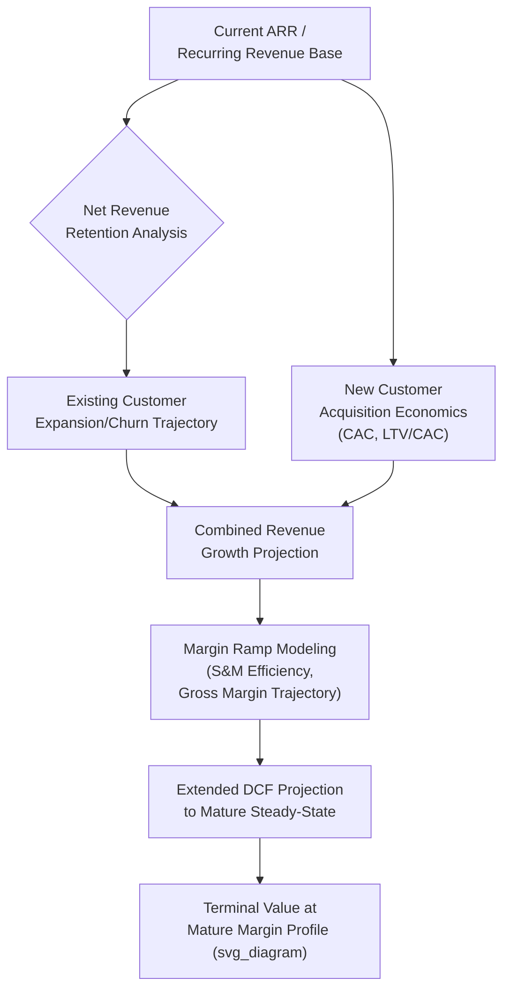

## Valuing Technology and Subscription-Based Businesses

### Overview

Valuing technology and subscription-based businesses — particularly Software-as-a-Service (SaaS) and other recurring-revenue models — requires a specialized analytical framework centered on unit economics, revenue quality, and growth efficiency metrics that standard corporate valuation multiples and DCF frameworks do not directly capture. Because many high-growth technology companies operate at low or negative current profitability while investing heavily in customer acquisition to build a recurring revenue base with high long-term retention, traditional earnings-based multiples (P/E, EV/EBITDA) are frequently uninformative or even inapplicable, requiring revenue-based multiples and specialized SaaS metrics to assess underlying business quality and sustainable value.

### Why Standard Valuation Approaches Require Adaptation

**1. Front-Loaded Customer Acquisition Costs Distort Near-Term Profitability**

SaaS and subscription businesses typically incur the full cost of acquiring a customer (sales and marketing expense) upfront, while the revenue from that customer is recognized ratably over the life of the subscription relationship — this creates an accounting mismatch where a rapidly growing company can show minimal or negative near-term profitability despite building substantial long-term value, since each new cohort of customers depresses current-period reported earnings while building a recurring revenue stream that will generate profit in future periods.

**2. Revenue Quality and Predictability Differ Fundamentally From Transactional Businesses**

Recurring subscription revenue, backed by contractual commitments and historically demonstrated retention patterns, carries meaningfully different risk and predictability characteristics than one-time transactional revenue, warranting different capitalization treatment and multiple levels even at similar current revenue scale.

**3. Growth Rate and Efficiency of Growth Are Often More Value-Determinative Than Current Profitability**

For high-growth technology companies, the market frequently places substantial value on the trajectory and efficiency of growth (how much revenue growth is achieved per dollar of investment) rather than current-period earnings, requiring valuation frameworks that explicitly incorporate growth-adjusted metrics rather than relying solely on trailing or near-term forward profitability.

### Core SaaS and Subscription Business Metrics

**1. Annual Recurring Revenue (ARR) / Monthly Recurring Revenue (MRR)**

$$ARR = MRR \times 12$$

ARR (or MRR) represents the annualized value of active subscription contracts at a point in time, providing a cleaner, more forward-looking measure of the recurring revenue base than trailing GAAP revenue, which may include one-time items or reflect revenue recognition timing that lags actual current contract value.

**2. Net Revenue Retention (NRR) / Net Dollar Retention (NDR)**

$$NRR = \frac{\text{Starting ARR from Existing Customers} + \text{Expansion} - \text{Contraction} - \text{Churn}}{\text{Starting ARR from Existing Customers}}$$

NRR measures the revenue trajectory of an existing customer cohort over time, incorporating both losses (churn, downgrades) and gains (upsells, cross-sells, seat expansion) within that same cohort, excluding new customer acquisition. An NRR above 100% indicates that the existing customer base is expanding in value even before accounting for any new customer additions — a strong indicator of product stickiness and expansion potential frequently associated with premium valuation multiples in practitioner and investor commentary. An NRR below 100% indicates the existing base is shrinking in value net of expansion, a signal requiring careful investigation into churn drivers and competitive positioning.

**3. Gross Revenue Retention (GRR)**

$$GRR = \frac{\text{Starting ARR from Existing Customers} - \text{Contraction} - \text{Churn}}{\text{Starting ARR from Existing Customers}}$$

GRR excludes expansion revenue (capped at 100%), isolating the pure retention/churn dynamic without the potentially offsetting effect of upsell revenue — useful for assessing the underlying stickiness of the base independent of the company's ability to expand revenue within existing accounts.

**4. Customer Acquisition Cost (CAC)**

$$CAC = \frac{\text{Total Sales and Marketing Expense (Period)}}{\text{Number of New Customers Acquired (Period)}}$$

**5. Customer Lifetime Value (LTV) and LTV/CAC Ratio**

$$LTV = \frac{\text{Average Revenue per Customer} \times \text{Gross Margin \%}}{\text{Churn Rate}}$$

$$\text{LTV/CAC Ratio} = \frac{LTV}{CAC}$$

An LTV/CAC ratio is commonly used as a unit economics health indicator, with practitioner commentary frequently citing a ratio of approximately 3:1 or higher as a general benchmark for healthy unit economics [Unverified: this specific 3:1 benchmark is a widely circulated practitioner heuristic rather than a rigorously derived universal standard, and appropriate benchmarks can vary by business model, growth stage, and industry vertical], while also considering the CAC payback period (time required for gross margin from a customer to recover the initial acquisition cost) as a complementary liquidity/capital efficiency measure.

$$\text{CAC Payback Period (months)} = \frac{CAC}{\text{Average Monthly Revenue per Customer} \times \text{Gross Margin \%}}$$

**6. Rule of 40**

$$\text{Rule of 40 Score} = \text{Revenue Growth Rate (\%)} + \text{Profit Margin (\%, e.g., EBITDA or FCF Margin)}$$

A widely referenced heuristic in SaaS investor and practitioner commentary suggesting that a healthy software company should achieve a combined growth rate plus profitability margin of approximately 40% or higher, reflecting an appropriate trade-off between growth investment and profitability at a given stage. [Unverified: like the LTV/CAC benchmark, the specific "40" threshold and the appropriate margin metric to combine with growth rate (EBITDA margin, FCF margin, or another profitability measure) vary across practitioner sources and have evolved over different market cycles and investor sentiment regimes; this should be treated as a widely used rule-of-thumb rather than a precise, universally validated standard.]

### Primary Valuation Approaches

**1. Revenue Multiples (EV/Revenue, EV/ARR)**

Given frequently minimal or negative current earnings, revenue-based multiples are the most commonly used relative valuation approach for high-growth technology and SaaS companies:

$$EV/Revenue = \frac{\text{Enterprise Value}}{\text{Trailing or Forward Revenue}}$$

Revenue multiples should be explicitly adjusted for the growth rate and quality of that revenue (NRR, gross margin profile, growth efficiency) rather than compared on a raw basis alone, since two companies with identical current revenue but materially different growth rates, retention, and margin structures warrant substantially different multiples.

**2. Growth-Adjusted Revenue Multiples**

$$\text{EV/Revenue-to-Growth Ratio} = \frac{EV/Revenue \text{ Multiple}}{\text{Revenue Growth Rate (\%)}}$$

Analogous in spirit to the PEG ratio (P/E to growth) used for traditional equities, this normalizes the revenue multiple for the growth rate being achieved, providing a more comparable basis across companies growing at different rates.

**3. DCF Adapted for High-Growth, Long-Duration Cash Flow Profiles**

DCF remains applicable to technology companies but requires particular care in modeling:

- **Extended explicit forecast periods**: High-growth companies often warrant longer explicit projection periods (e.g., 7-10+ years rather than the standard 5) to capture the trajectory from current high-growth, low/negative-margin operations toward a more mature, steady-state margin profile before applying a terminal value, since a terminal value calculated too early (while margins are still well below mature steady-state levels) can significantly understate intrinsic value.
- **Explicit margin ramp modeling**: Modeling the trajectory of gross margin, sales and marketing efficiency (as a percentage of revenue, typically declining as a company scales and relies more on renewal/expansion revenue from existing customers rather than pure new customer acquisition), and overall operating margin as the company matures, rather than assuming an immediate jump to steady-state margins.
- **Stock-based compensation treatment**: Technology companies commonly use substantial stock-based compensation (SBC) as an employee retention and incentive tool; careful, explicit treatment of SBC (as either a genuine cash-equivalent expense reducing free cash flow available to existing shareholders through dilution, or through explicit dilution modeling in the share count) is necessary to avoid overstating cash flow available to current shareholders.

### Cohort Analysis as a Valuation Diligence Tool

A specialized analytical technique particularly important for subscription businesses involves tracking revenue and retention by customer acquisition cohort (customers grouped by the period in which they were acquired) over time, rather than relying solely on aggregate company-wide metrics:

- **Cohort revenue curves**: Charting how a given cohort's aggregate revenue evolves over subsequent periods reveals the underlying expansion/contraction dynamics more granularly than aggregate NRR, which can mask offsetting trends across different-vintage cohorts.
- **Cohort maturation patterns**: Comparing how successive cohorts (e.g., customers acquired in Year 1 versus Year 2 versus Year 3) perform at the same point in their respective lifecycles helps assess whether unit economics are improving, stable, or deteriorating over time as the company scales and potentially moves into different customer segments or geographies.

### Valuing Different Technology Business Model Archetypes

| Archetype | Key Distinguishing Valuation Considerations |
| --- | --- |
| Enterprise SaaS (high ACV, long sales cycles) | Emphasis on NRR, logo retention, and sales efficiency (magic number, CAC payback); typically higher gross margins |
| SMB/Self-Serve SaaS (lower ACV, high volume) | Higher churn tolerance typically expected; emphasis on scalable, low-touch acquisition channels and payback period discipline |
| Marketplace/Platform businesses | Additional focus on take rate, gross merchandise value (GMV) versus net revenue, and network effect dynamics distinct from pure subscription metrics |
| Consumer subscription (media, fitness, etc.) | Emphasis on subscriber acquisition cost relative to consumer lifetime value, often with higher churn and lower per-unit economics than enterprise SaaS |
| Infrastructure/Platform-as-a-Service | Often has more variable, usage-based revenue components requiring adapted retention metrics (e.g., net revenue retention based on usage/consumption rather than fixed seat-based contracts) |

### Illustrative Example — Growth-Adjusted Multiple Comparison

| Company | EV/Revenue (Forward) | Revenue Growth Rate | Revenue-to-Growth Ratio | NRR |
| --- | --- | --- | --- | --- |
| Company A | 12.0x | 40% | 0.30 | 128% |
| Company B | 8.0x | 20% | 0.40 | 105% |
| Company C | 15.0x | 25% | 0.60 | 95% |

Despite Company C carrying the highest absolute EV/Revenue multiple, its growth-adjusted ratio and below-100% NRR suggest the market may be assigning a premium not well-supported by its underlying growth efficiency and retention quality relative to Company A, which combines strong growth with the most favorable growth-adjusted multiple and materially higher NRR — illustrating why raw revenue multiples alone are insufficient without incorporating growth and retention quality context.

### Application Contexts

- **Public technology and SaaS equity research**: Revenue multiples, growth-adjusted ratios, Rule of 40, and NRR trend analysis form the standard core toolkit for analysts covering high-growth technology companies.
- **Venture capital and growth equity investment valuation**: SaaS metrics (NRR, LTV/CAC, CAC payback) are central to underwriting growth-stage technology investments, often used alongside the Venture Capital Method or First Chicago scenario-weighted approaches for earlier-stage companies.
- **Technology M&A and strategic acquisition valuation**: Acquirers evaluate targets substantially on ARR quality (retention, expansion, customer concentration) alongside traditional financial diligence, given the premium the market places on recurring, expandable revenue relative to one-time or highly transactional revenue streams.
- **Private equity buyout valuation of mature software businesses**: As software companies mature and approach or achieve steady-state profitability, valuation approaches gradually shift emphasis from pure growth-oriented revenue multiples toward more traditional EBITDA-multiple and LBO-return-based frameworks, reflecting the business's transition along its lifecycle.

### Common Pitfalls

- **Applying standard P/E or EV/EBITDA multiples to pre-profitability, high-growth technology companies without context**: Produces meaningless or infinite/negative multiples that provide no useful comparative information; revenue-based and growth-adjusted metrics are generally more appropriate at this stage.
- **Comparing raw revenue multiples across companies without adjusting for growth rate and retention quality**: As illustrated in the example above, ignoring growth efficiency and NRR when comparing EV/Revenue multiples can lead to inverted or misleading relative value conclusions.
- **Failing to model margin expansion trajectory explicitly in DCF**: Assuming either an unrealistically rapid jump to mature margins or, conversely, extending current heavy investment-phase margins indefinitely without any maturation, both distort the DCF's terminal value and overall conclusion.
- **Ignoring stock-based compensation's dilutive economic effect**: Treating SBC purely as a non-cash addback without properly accounting for its dilutive impact on per-share value overstates value available to current shareholders.
- **Relying on aggregate retention metrics without cohort-level analysis**: Aggregate NRR can mask deteriorating trends in specific cohorts (e.g., more recent cohorts retaining worse than historical cohorts, perhaps due to expansion into less ideal customer segments) that would be visible only through cohort-level analysis.
- **Treating widely cited heuristic benchmarks (Rule of 40, 3:1 LTV/CAC) as precise, universal thresholds**: These are practitioner rules of thumb that vary by business model, stage, and market conditions rather than rigorously validated universal standards, and should be applied with appropriate context and skepticism rather than as strict pass/fail tests.

**Related Topics**

- Venture Capital Method for Startups
- First Chicago Scenario-Weighted Method
- Sum-of-the-Parts Valuation for Diversified Businesses
- Weighting Valuation Methods by Context
- Adjustments for Private Company Valuation
- Cap Table Modeling and Liquidation Preference Waterfalls
- LBO Analysis for Mature, Cash-Flow-Stable Businesses