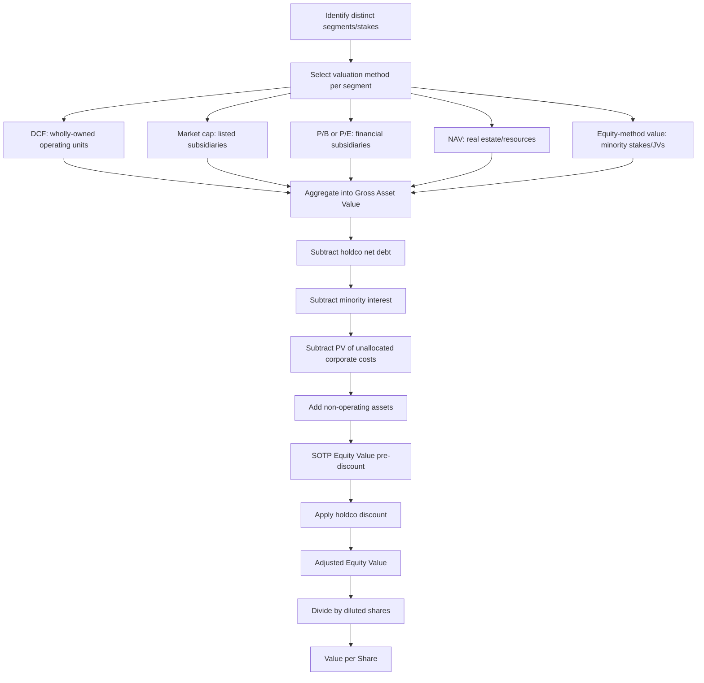

## Valuing Holding Companies via Sum-of-the-Parts

### Overview

Sum-of-the-parts (SOTP) valuation is a methodology that values a multi-segment or multi-subsidiary company by independently valuing each distinct business unit, asset, or investment stake, then aggregating these individual values and adjusting for corporate-level items to arrive at total equity value. This approach is the standard framework for valuing holding companies (holdcos) — entities whose primary asset is a portfolio of equity stakes in operating subsidiaries rather than a single integrated operating business.

The core premise is that applying a single blended multiple or discount rate to a conglomerate misrepresents value when its segments have materially different growth profiles, margin structures, capital intensities, and risk characteristics. A holding company with a stake in a high-growth technology subsidiary and a stake in a mature utility subsidiary cannot be meaningfully valued using one EV/EBITDA multiple for the consolidated entity.

### When SOTP Is the Appropriate Method

**Key Points**

- Diversified conglomerates operating in unrelated industries (e.g., Berkshire Hathaway, Jardine Matheson, Reliance Industries)
- Pure holding companies whose balance sheet consists primarily of equity stakes (e.g., investment holding companies, family conglomerates)
- Companies with a mix of public and private subsidiary stakes
- Firms undergoing or being evaluated for a spin-off, carve-out, or divestiture
- Companies where segment reporting reveals divergent growth/margin/risk profiles that a blended multiple would obscure

SOTP is generally *not* preferred when a company's segments are highly synergistic, share centralized cost structures inseparably, or when segment-level financial disclosure is too thin to support independent valuation — in these cases a consolidated DCF or comparable company analysis may be more defensible.

### Core Methodology

The SOTP process follows a structured sequence:

1. **Segment identification** — decompose the holding company into its distinct economic units
2. **Standalone valuation** of each segment using the most appropriate method per segment
3. **Aggregation** of segment values into gross asset value
4. **Corporate-level adjustments** — net debt, minority interests, unallocated corporate costs, taxes
5. **Holding company discount** application
6. **Derivation of implied equity value and per-share value**

$$\text{Equity Value} = \sum_{i=1}^{n} V_i - \text{Net Debt} - \text{Minority Interest} - \text{Unallocated Corporate Costs (PV)} + \text{Non-Operating Assets} - \text{Holdco Discount}$$

where $V_i$ is the standalone value of segment or stake $i$.

### Step 1: Segment Identification and Disaggregation

The analyst must first determine the appropriate unit of analysis. This is rarely as simple as "use the reported segments," because:

- Reported operating segments under IFRS 8 / ASC 280 are defined by how management internally reviews the business, which may bundle dissimilar assets together or split similar ones apart for organizational reasons unrelated to economic substance
- Publicly listed subsidiaries (where the holdco owns a controlling or minority stake) should typically be valued using their own market data rather than folded into a blended segment
- Passive financial investments (minority stakes, associates, joint ventures) need to be separated from operating segments entirely, since they are valued differently (often at market value or equity-method carrying value with adjustments)
- Non-operating assets — excess cash, real estate not used in operations, unconsolidated investments — must be pulled out and valued separately rather than left embedded in an operating segment

**Example**

A conglomerate holdco has four reportable segments: Telecom, Infrastructure, Financial Services, and Real Estate. Financial Services is actually a 40%-owned associate accounted for under the equity method, and the holdco separately owns a 60% stake in a listed telecom operator. The correct SOTP disaggregation is:

- Telecom (60%-owned, publicly listed subsidiary) → value using market cap, applying the 60% ownership stake
- Infrastructure (wholly-owned, unlisted) → value via DCF or precedent transactions
- Financial Services (40% equity-method associate) → value using the associate's own equity value × 40%, or apply a sector-specific bank/insurer multiple (P/B, P/E) to its financials
- Real Estate → value via NAV (net asset value) using appraised property values, not EBITDA multiples

### Step 2: Valuing Each Segment — Method Selection

Each segment should be valued using whichever technique best fits its characteristics. Common pairings:

| Segment Type | Preferred Method(s) |
| --- | --- |
| Wholly-owned operating business | DCF, or EV/EBITDA using pure-play trading comparables |
| Publicly listed subsidiary | Market capitalization (× ownership %), adjusted for control premium if applicable |
| Minority equity-method associate/JV | Proportional equity value, or implied value from last transaction/funding round |
| Financial subsidiary (bank, insurer, asset manager) | P/B, P/TBV, P/E, or embedded value (for insurers) — never EV/EBITDA |
| Real estate/property portfolio | Net Asset Value (NAV), cap-rate-derived direct capitalization |
| Natural resource / extractive segment | NAV based on reserve reports (P/NAV), or EV/EBITDA at mid-cycle commodity prices |
| Early-stage/venture segment | Last-round valuation, VC method, or option-based valuation |
| Non-operating cash and investments | Book/market value, no multiple applied |

Using EBITDA multiples uniformly across segments with fundamentally different capital structures (e.g., applying an industrial multiple to a bank) is a common and material error, since financial institutions' balance sheets are leveraged by design and EBITDA is not meaningful for them.

**Worked Example — DCF for an Operating Segment**

Infrastructure segment projected unlevered free cash flows (in $mm):

| Year | 1 | 2 | 3 | 4 | 5 |
| --- | --- | --- | --- | --- | --- |
| UFCF | 120 | 132 | 145 | 158 | 172 |

Assume WACC = 9.5%, terminal growth $g$ = 3%.

Terminal Value:

$$TV_5 = \frac{UFCF_5 \times (1+g)}{WACC - g} = \frac{172 \times 1.03}{0.095 - 0.03} = \frac{177.16}{0.065} \approx \$2{,}725\text{mm}$$

Discounting each cash flow and the terminal value at 9.5%:

$$EV = \sum_{t=1}^{5} \frac{UFCF_t}{(1+WACC)^t} + \frac{TV_5}{(1+WACC)^5}$$

$$EV \approx 109.6 + 110.1 + 110.4 + 109.9 + 109.5 + 1{,}738.5 \approx \$2{,}287\text{mm}$$

This $2,287mm enterprise value represents the standalone value of the Infrastructure segment before any holdco-level adjustments.

### Step 3: Aggregation into Gross Asset Value

Once each segment/stake is independently valued, sum the enterprise (or equity, depending on method) values to arrive at **Gross Asset Value (GAV)**:

$$GAV = EV_{\text{Telecom (60\%)}} + EV_{\text{Infrastructure}} + Equity_{\text{Financial Services (40\%)}} + NAV_{\text{Real Estate}} + \text{Cash \& Investments}$$

Care must be taken to keep the basis consistent: enterprise values are pre-debt, so segment-level debt embedded within a subsidiary must either be netted at the segment level (converting to equity value contribution) or carried through and netted once at the consolidated level — but never both, to avoid double-counting.

### Step 4: Corporate-Level Adjustments

After GAV is established, several holdco-specific adjustments are required:

**Net Debt**

Consolidated holdco-level debt (parent-only debt not already netted within a subsidiary's value) is subtracted. Where subsidiaries are non-wholly-owned, only the proportional debt burden relevant to the holdco's economic interest should flow through, unless the debt is already reflected in the equity value used for that stake.

**Minority Interest**

If a segment is consolidated at 100% of enterprise value but the holdco owns less than 100%, the minority (non-controlling) interest portion must be deducted:

$$\text{Adjustment} = EV_{\text{segment}} \times (1 - \% \text{Owned})$$

Alternatively, and more cleanly, only the proportional ownership share of segment value is included in GAV from the outset, avoiding a separate minority interest subtraction.

**Unallocated Corporate Overhead**

Holding companies typically carry standalone corporate costs (executive compensation, board, listing fees, treasury function) not allocated to any operating segment. Since segment DCFs do not capture this drag, it must be separately valued — typically as a perpetuity of after-tax corporate overhead, capitalized at an appropriate discount rate, and subtracted:

$$PV_{\text{Overhead}} = \frac{\text{Annual After-Tax Corporate Cost}}{WACC_{\text{holdco}} - g}$$

**Taxes on Unrealized Gains (Contingent Tax Liability)**

If a segment or stake would trigger a capital gains tax upon a hypothetical sale (relevant in liquidation-based or NAV-based SOTP), a contingent tax liability adjustment is sometimes applied, particularly for real estate or securities portfolios with large embedded unrealized gains relative to book/tax basis. Whether this is appropriate is debated in practice and depends on whether the appraisal frames the value as a going-concern holding or an as-if-liquidated basis. [Inference: the degree of contingent tax haircut applied varies significantly by jurisdiction, deal context, and analyst convention, and is not governed by a single universally accepted standard.]

**Non-Operating Assets**

Excess cash beyond operating requirements, marketable securities, and other non-core assets are added back at market value if not already captured in segment values.

### Step 5: The Holding Company Discount

**Key Points**

A near-universal empirical observation is that holding companies trade at a discount to their SOTP-derived NAV — commonly referred to as the "holdco discount" or "conglomerate discount." This is applied as a final haircut:

$$\text{Adjusted Equity Value} = \text{SOTP Equity Value} \times (1 - \text{Holdco Discount \%})$$

**Rationale for the discount:**

- **Lack of direct control/liquidity for minority shareholders** — public shareholders in the holdco cannot directly access or redeploy the underlying assets
- **Tax inefficiency** — dividends or gains flowing from subsidiary to holdco to shareholder can face double taxation layers, and monetizing a stake triggers capital gains tax that a direct holder of the subsidiary would not face in the same way
- **Corporate governance and agency costs** — capital allocation decisions rest with holdco management/family control, which minority shareholders cannot influence; risk of value-destructive cross-subsidization between segments
- **Complexity and opacity discount** — the market applies a discount for the analytical difficulty and reduced transparency of multi-segment structures, sometimes called a "complexity discount"
- **Structural/pyramid ownership concerns** — where a controlling family or group uses the holdco to control assets with a smaller economic stake than voting stake, minority shareholders may price in expropriation risk

**Typical discount magnitude**: Empirically, holdco discounts commonly range from roughly 15% to 40% of SOTP NAV, though this varies substantially by market, ownership structure, and asset transparency. [Unverified: precise magnitudes fluctuate materially over time and across jurisdictions, and any single quoted range should be corroborated against current comparable holdco trading discounts before use in a live valuation.] Investment holding companies in markets with concentrated family control and limited dividend pass-through frequently trade toward the higher end of observed discount ranges; diversified holdcos with strong capital allocation track records (e.g., Berkshire Hathaway) have historically traded closer to or even at a premium to SOTP in some periods, reflecting market confidence in management's capital allocation.

**Methods to estimate the discount:**

1. **Historical trading discount** — regress the holdco's own historical market cap against its own calculated SOTP NAV over time to derive an average discount
2. **Peer holdco discount benchmarking** — survey comparable holding companies' current discount-to-NAV levels
3. **Component approach** — separately quantify the tax leakage discount, illiquidity discount, and governance discount, then combine

### Step 6: Deriving Per-Share Value

$$\text{Value per Share} = \frac{\text{Adjusted Equity Value}}{\text{Diluted Shares Outstanding}}$$

Diluted share count should reflect the treasury stock method for options/warrants and as-converted treatment of convertible securities, consistent with standard equity value bridge practice.

### Illustrative Full SOTP Build

| Component | Basis | Value ($mm) |
| --- | --- | --- |
| Telecom (60% × EV, less proportional net debt) | Market cap-derived | 1,850 |
| Infrastructure (100%, DCF-derived EV) | DCF | 2,287 |
| Financial Services (40% equity-method stake) | P/B × equity | 640 |
| Real Estate portfolio | NAV | 410 |
| Excess cash & investments | Book/market value | 95 |
| **Gross Asset Value** |  | **5,282** |
| Less: Holdco-level net debt |  | (380) |
| Less: PV of unallocated corporate overhead |  | (145) |
| Less: Minority interest in Infrastructure (15%) |  | (343) |
| **SOTP Equity Value (pre-discount)** |  | **4,414** |
| Less: Holdco discount (25%) |  | (1,104) |
| **Adjusted Equity Value** |  | **3,310** |
| ÷ Diluted shares (mm) |  | 500 |
| **Value per Share** |  | **$6.62** |

### Common Pitfalls

- **Double-counting debt**: netting subsidiary debt both within segment EV-to-equity bridges and again at the consolidated level
- **Applying a single WACC across segments**: each segment carries its own risk profile and capital structure and should be discounted at a segment-appropriate WACC, not the blended holdco WACC
- **Ignoring the minority interest adjustment** when a segment is less than wholly owned but its 100% EV is included in GAV
- **Omitting the corporate overhead drag**, which overstates value since segment cash flows rarely absorb parent-level costs
- **Applying an arbitrary or unsupported holdco discount** without benchmarking to historical or peer trading discounts
- **Using EBITDA multiples for financial subsidiaries**, which are not economically meaningful for leveraged financial institutions
- **Failing to reconcile SOTP output against current trading price** — a large unexplained gap should prompt re-examination of assumptions rather than automatic assumption that the market is wrong

### SOTP Process Flow (svg_diagram)

**Related Topics**

- Conglomerate Discount: Empirical Evidence and Drivers
- Valuing Minority Equity Stakes and Associates
- Net Asset Value (NAV) Methodology for Real Estate and Resource Companies
- Valuing Financial Institutions: P/B, P/TBV, and Embedded Value Approaches
- Spin-Off and Carve-Out Valuation Analysis
- Pyramid Ownership Structures and Control Premiums
- Cross-Holding and Circular Ownership Adjustments in Valuation