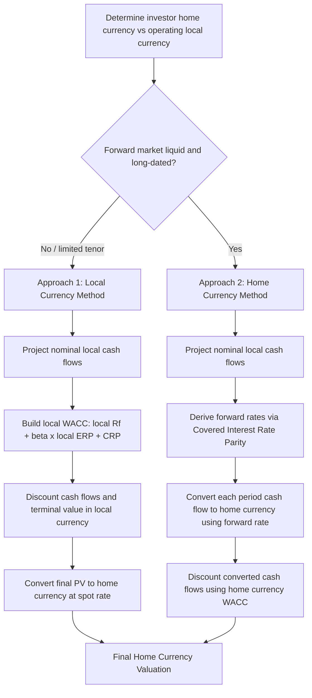

## Currency Selection and Consistency in DCF

### Overview

Currency selection and consistency in DCF valuation concerns the methodologically correct treatment of cash flows, discount rates, and terminal values when a business generates revenue, incurs costs, or is being valued from the perspective of an investor whose functional or reporting currency differs from the currency in which the underlying operations are denominated. Errors in this domain are among the most common sources of material mispricing in cross-border valuation work, because currency and discount rate must be matched consistently or the valuation will embed an internal contradiction between the numerator (cash flows) and denominator (discount factor).

The foundational principle is captured by **the principle of currency consistency**: cash flows denominated (or projected) in a given currency must be discounted at a rate that reflects the risk-free rate, inflation expectations, and risk premia appropriate to that same currency. Mixing a nominal cash flow stream in one currency with a discount rate derived in another currency produces a valuation that implicitly and incorrectly assumes away exchange rate risk or double-counts/omits inflation differentials.

### Two Fundamental Approaches to Cross-Border DCF

There are two theoretically equivalent, and in practice commonly used, methods for valuing a foreign-currency-denominated business:

**Approach 1: Local Currency Method**

Project and discount cash flows entirely in the currency of the operating entity (local currency), using a local-currency WACC, and then convert the resulting present value (or the terminal enterprise/equity value) into the investor's home currency using the **spot exchange rate** at the valuation date.

$$EV_{\text{home}} = EV_{\text{local}} \times S_{0}$$

where $S_0$ is the spot exchange rate expressed as home currency per unit of local currency.

**Approach 2: Home Currency (Converted Cash Flow) Method**

Convert each period's projected local-currency cash flow into the home currency using **forward exchange rates** for each respective period, then discount using a home-currency WACC.

$$PV_{\text{home}} = \sum_{t=1}^{n} \frac{CF_{t,\text{local}} \times F_t}{(1+WACC_{\text{home}})^t}$$

where $F_t$ is the forward rate for period $t$.

**Key Points**

Under the assumption that Interest Rate Parity (IRP) and Purchasing Power Parity (PPP) hold in expectation, these two approaches are theoretically equivalent and should produce the same valuation. In practice, they can diverge if forward rates are not derived consistently with the discount rate differentials used, or if the analyst uses spot rates in Approach 2 by mistake (a common and material error, since applying today's spot rate to future cash flows ignores the interest rate differential embedded in forward curves).

### Deriving Forward Exchange Rates via Interest Rate Parity

The **Covered Interest Rate Parity (CIRP)** relationship provides the standard basis for projecting forward exchange rates when explicit forward market quotes are unavailable beyond short tenors (which is common — liquid forward markets typically only extend 1–5 years, while DCF horizons often extend further):

$$F_t = S_0 \times \left( \frac{1 + i_{\text{home}}}{1 + i_{\text{local}}} \right)^t$$

where $i_{\text{home}}$ and $i_{\text{local}}$ are the risk-free (or government bond) interest rates in the home and local currencies, respectively.

**Worked Example**

A US-based investor is valuing a Philippine operating subsidiary. Spot rate $S_0 = ₱56.00$ per USD (i.e., 1 USD = ₱56.00). Assume:

- USD risk-free rate ($i_{\text{home}}$) = 4.25%
- PHP risk-free rate ($i_{\text{local}}$) = 6.00%

Forward rate for Year 3:

$$F_3 = 56.00 \times \left(\frac{1.0425}{1.0600}\right)^3 = 56.00 \times (0.98349)^3 = 56.00 \times 0.9513 \approx ₱53.27 \text{ per USD}$$

Because PHP interest rates exceed USD interest rates, the peso is expected to depreciate against the dollar over time under IRP (i.e., it takes fewer pesos to buy a dollar's worth of value is wrong phrasing — more precisely, the USD/PHP forward shows the peso weakening, consistent with the higher local inflation/interest environment being priced into the currency's expected depreciation). This is a direct application of the **relative purchasing power parity** logic that underlies forward curve construction for currencies with persistent interest rate differentials.

### Building a Currency-Consistent Discount Rate

If local currency cash flows are discounted with a local currency WACC (Approach 1), the local WACC must reflect:

$$WACC_{\text{local}} = \frac{E}{V} \times k_{e,\text{local}} + \frac{D}{V} \times k_{d,\text{local}} \times (1 - t)$$

where the cost of equity $k_{e,\text{local}}$ is built using a **local risk-free rate**, not the home-market risk-free rate:

$$k_{e,\text{local}} = R_{f,\text{local}} + \beta \times ERP_{\text{local}} + \text{Country Risk Premium (if applicable)}$$

A frequent and serious error is to compute a cost of equity using a home-currency risk-free rate (e.g., the US 10-year Treasury) and equity risk premium, but then apply that discount rate to local-currency cash flows. This mismatches the inflation and risk-free components embedded in the discount rate against a cash flow stream denominated in a currency with a different inflation regime, systematically distorting value (typically overstating value for cash flows in historically higher-inflation currencies discounted at a lower-inflation rate, or vice versa).

**Deriving a local risk-free rate when local government bonds are illiquid or have limited maturities:**

$$R_{f,\text{local}} \approx (1 + R_{f,\text{home}}) \times \frac{1 + \pi_{\text{local}}}{1 + \pi_{\text{home}}} - 1$$

This applies **relative PPP** to back into an implied local risk-free rate using home risk-free rate and relative inflation expectations ($\pi$), when direct local sovereign yield data is unreliable or unavailable at the necessary tenor.

### Real vs. Nominal Currency Consistency

A second, related consistency requirement operates orthogonally to currency choice: **nominal cash flows must be discounted with nominal discount rates, and real cash flows with real discount rates** — and this must hold independently for whichever currency is chosen.

$$1 + r_{\text{nominal}} = (1 + r_{\text{real}}) \times (1 + \pi)$$

Combining a currency mismatch with a real/nominal mismatch compounds the error. The safest and most standard practice is to build the entire model in **nominal terms, in a single consistently chosen currency**, converting only at the final step (Approach 1) or converting each period's nominal local cash flow via nominal forward rates (Approach 2).

### Terminal Value Currency Treatment

The terminal value calculation requires particular care because the long-dated nature of the perpetuity period embeds compounding currency and growth-rate assumptions over an indefinite horizon.

$$TV_{\text{local}} = \frac{CF_{n,\text{local}} \times (1+g_{\text{local}})}{WACC_{\text{local}} - g_{\text{local}}}$$

The long-run terminal growth rate $g_{\text{local}}$ should be consistent with the long-run **local nominal GDP growth or inflation expectations**, not the home country's long-run growth rate. A common error is anchoring the terminal growth rate to home-market conventions (e.g., defaulting to 2–3% because that is standard practice in USD-denominated valuations) even when the local currency's long-run inflation and growth expectations are structurally different (e.g., materially higher for many emerging-market currencies).

If converting via Approach 1 (convert PV of terminal value at spot), the analyst should confirm that using the current spot rate on a terminal value computed far in the future does not implicitly build in an incorrect assumption about long-run exchange rate stability; theoretically this is acceptable specifically *because* Approach 1 discounts at the local WACC first (collapsing the far-future terminal value into a present local-currency value before any currency conversion occurs), avoiding the need to forecast an exchange rate decades out.

### Selecting Which Currency to Value In: Decision Framework

**Key Points**

| Factor | Favors Local Currency (Approach 1) | Favors Home Currency (Approach 2) |
| --- | --- | --- |
| Availability of reliable local risk-free rate/ERP data | Favors local | — |
| Liquid, long-dated forward market for the currency pair | — | Favors home |
| Investor's actual cash flow/repatriation currency | — | Favors home if investor cares about USD/home-currency returns specifically |
| High local inflation/currency volatility | Favors local (avoids forecasting FX decades out) | — |
| Need to compare across a portfolio of assets in different currencies | — | Favors home (for apples-to-apples comparison) |
| Regulatory/reporting currency requirements | Depends on entity | Depends on entity |

In practice, most cross-border M&A and private equity valuation work defaults to **Approach 1** (value fully in local currency, convert the final output at spot) because reliable long-dated forward curves rarely exist for many currencies, and because it avoids compounding forecast error from projecting exchange rates many years into the future. Approach 2 is more commonly used for shorter-horizon valuations or where liquid, long-dated forward/NDF (non-deliverable forward) markets exist for the currency pair in question.

### Country Risk Premium Integration

When valuing operations in emerging or frontier markets, an additional **Country Risk Premium (CRP)** is frequently layered into the cost of equity to capture sovereign default risk, political risk, and expropriation risk not captured by beta alone:

$$k_{e,\text{local}} = R_{f,\text{local}} + \beta \times ERP_{\text{mature market}} + CRP$$

A widely used approach for estimating CRP is the **sovereign bond default spread method**:

$$CRP = \text{Yield on local sovereign USD-denominated bond} - \text{Yield on comparable-maturity US Treasury}$$

Some practitioners adjust this default spread by the relative volatility of the local equity market to the local bond market:

$$CRP_{\text{equity-adjusted}} = \text{Default Spread} \times \frac{\sigma_{\text{equity,local}}}{\sigma_{\text{bond,local}}}$$

**Key Points on placement of CRP:**

- CRP can be added as a flat premium to the discount rate (affecting all cash flows equally regardless of timing)
- Alternatively, some practitioners prefer to embed country risk directly into cash flow projections (e.g., through explicit scenario-weighted cash flows for expropriation or currency crisis risk) rather than the discount rate, to avoid conflating a risk that may resolve over time with a constant perpetual discount rate adjustment
- Double-counting is a frequent error: including CRP in the discount rate *and* separately haircutting cash flows for the same political/sovereign risk overstates the risk adjustment

### Common Pitfalls

- **Mismatched inflation regimes**: using a mature-market (e.g., USD) risk-free rate and ERP to discount cash flows explicitly modeled in a high-inflation local currency, without adjustment
- **Applying spot rates to future cash flows** in the Home Currency Method instead of proper forward rates, silently assuming zero expected currency movement
- **Inconsistent terminal growth assumptions**: anchoring $g$ to home-market conventions rather than the local currency's long-run macro environment
- **Double-counting country risk** in both the discount rate and cash flow haircuts
- **Ignoring convertibility and repatriation constraints**: in some jurisdictions, capital controls or currency convertibility restrictions mean the theoretical home-currency value is not actually realizable, which is a risk factor separate from, and in addition to, currency translation mechanics
- **Real/nominal mismatch layered on top of currency mismatch**, compounding valuation error
- **Using a single "blended" global WACC** across a multinational's segments in different currencies without adjusting for currency-specific risk-free rates

### Cross-Border DCF Currency Consistency Flow (svg_diagram)

**Related Topics**

- Country Risk Premium Estimation Methods (Damodaran Sovereign Spread, Erb-Harvey-Viskanta Models)
- Purchasing Power Parity and Interest Rate Parity in Valuation Forecasting
- Valuing Emerging Market Multinationals with Repatriation Restrictions
- Hedged vs. Unhedged Cash Flow Valuation Approaches
- Building Local Currency WACC When Local Capital Markets Are Illiquid
- Non-Deliverable Forward (NDF) Curves for Restricted Currencies
- Translation Risk vs. Transaction Risk vs. Economic Exposure in Corporate Finance