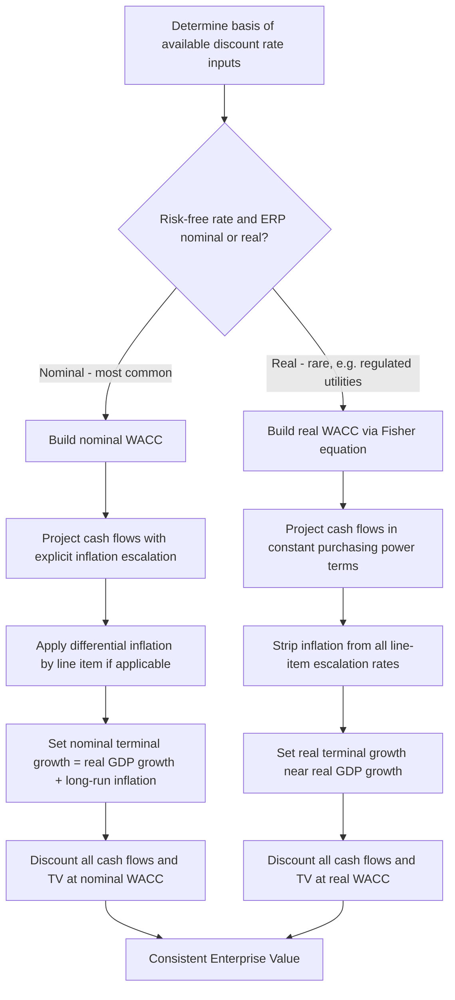

## Real versus Nominal Cash Flow Modeling

### Overview

Real versus nominal cash flow modeling addresses a foundational internal-consistency requirement in DCF valuation: cash flows and discount rates must be matched on an inflation basis, meaning **nominal cash flows must be discounted at nominal discount rates, and real cash flows must be discounted at real discount rates**. Violating this matching principle — a mismatch sometimes called the "real/nominal trap" — produces a systematic and often material valuation error, distinct from (though frequently compounding with) currency-consistency errors in cross-border contexts.

The distinction matters because inflation affects revenue, cost, and capital expenditure line items asymmetrically over a projection horizon, and because discount rates (built from risk-free rates and risk premia observed in nominal capital markets) are, by default, nominal rates. An analyst who inadvertently mixes bases — for instance, holding prices flat in real terms while discounting at a nominal WACC — will systematically understate value; the reverse mismatch overstates it.

### Defining Real and Nominal Cash Flows

**Nominal cash flows** are cash flows expressed in the actual currency units expected to be received or paid in each future period, inclusive of the effects of expected inflation. A nominal revenue projection assumes prices rise with inflation over the forecast horizon.

**Real cash flows** are cash flows expressed in constant purchasing-power terms, typically anchored to the purchasing power of the valuation date (or another fixed base period), with the effects of general price inflation stripped out. A real revenue projection assumes prices remain constant in inflation-adjusted terms, so any growth reflects only real volume or real price/mix improvements — not inflation.

The relationship between a nominal cash flow and its real equivalent in period $t$ is:

$$CF_{t,\text{real}} = \frac{CF_{t,\text{nominal}}}{(1+\pi)^t}$$

where $\pi$ is the expected inflation rate (assumed constant here for simplicity; a variable inflation path uses period-specific $\pi_t$ compounded appropriately).

### The Fisher Equation and Discount Rate Conversion

The relationship between nominal and real discount rates follows the **Fisher equation**:

$$1 + r_{\text{nominal}} = (1 + r_{\text{real}}) \times (1 + \pi)$$

Rearranged to solve for the real rate given a nominal rate and expected inflation:

$$r_{\text{real}} = \frac{1 + r_{\text{nominal}}}{1 + \pi} - 1$$

A common simplified approximation (reasonably accurate at low inflation and rate levels, but increasingly inaccurate as either rises) is the additive form:

$$r_{\text{real}} \approx r_{\text{nominal}} - \pi$$

**Key Points**

The additive approximation should be used with caution in high-inflation environments (common in many emerging markets), where the multiplicative Fisher relationship and the additive approximation can diverge meaningfully. For example, at $r_{\text{nominal}} = 15\%$ and $\pi = 10\%$:

- Exact Fisher: $r_{\text{real}} = \frac{1.15}{1.10} - 1 = 4.55\%$
- Additive approximation: $r_{\text{real}} \approx 15\% - 10\% = 5.00\%$

The ~45 basis point gap between these two figures, compounded over a multi-year explicit forecast period and especially within a terminal value calculation, can produce a non-trivial valuation difference. For high-inflation contexts, the exact Fisher formula should be used rather than the additive shortcut.

### Worked Example: Nominal vs. Real DCF Producing Equivalent Value

To demonstrate internal consistency, consider a simplified single-year cash flow of $100 (in today's purchasing power terms), with expected inflation $\pi = 5\%$ and a real discount rate $r_{\text{real}} = 8\%$.

**Real approach:**

$$PV = \frac{100}{1.08} = \$92.59$$

**Nominal approach:**

Nominal discount rate via Fisher equation:

$$r_{\text{nominal}} = (1.08)(1.05) - 1 = 13.4\%$$

Nominal cash flow (inflating the real $100 by expected inflation):

$$CF_{\text{nominal}} = 100 \times 1.05 = \$105$$

$$PV = \frac{105}{1.134} = \$92.59$$

Both approaches converge to identical present value, confirming internal consistency when the matching principle is correctly applied. This equivalence is the diagnostic check an analyst should perform whenever building parallel real and nominal versions of a model, or when auditing a model for correctness.

### Why Most Practitioner DCF Models Use Nominal Terms

**Key Points**

Nominal modeling is the dominant convention in practice, for several reasons:

- **Market data is nominal by default.** Government bond yields, equity risk premia, credit spreads, and observed capital structure costs are all quoted and observed in nominal terms; deriving a real WACC requires an extra conversion step and an explicit inflation assumption, introducing additional estimation risk
- **Line-item modeling is more intuitive in nominal terms.** Revenue growth, wage inflation, input cost escalation, and capex cost inflation are naturally forecast as nominal figures tied to observable price indices and management guidance, which are inherently nominal
- **Tax shields and depreciation are nominal in most tax regimes.** Depreciation is typically calculated on historical (nominal) asset cost, not inflation-adjusted replacement cost, in most jurisdictions' tax codes. Since depreciation tax shields are a real cash flow item derived from a nominal, non-inflation-indexed base, real-terms modeling of after-tax cash flows becomes awkward and can introduce additional error if not handled carefully
- **Working capital dynamics are more naturally modeled nominally**, since receivables, payables, and inventory levels scale with nominal revenue and cost levels observed in the business

Real-terms modeling is more commonly used in specific contexts: regulated utility and infrastructure valuation (where regulatory allowed-return frameworks are sometimes set in real terms), long-duration natural resource projects modeled in a single "base year" real price deck, and public policy or infrastructure cost-benefit analysis where stripping out inflation aids comparability across long multi-decade horizons.

### Handling Differential (Segment-Specific) Inflation

**Key Points**

A refinement beyond simple real/nominal consistency is recognizing that different cost and revenue line items may not inflate at the same general rate as the broad economy-wide inflation index (e.g., CPI) used to construct the discount rate's inflation component. This is sometimes called **differential inflation** or **relative price change** modeling.

Examples:

- Labor costs may inflate faster than general CPI in a tight labor market
- Commodity input costs may be volatile and only loosely correlated with CPI
- A company's selling prices may be constrained by competitive dynamics and rise slower than general inflation (real price erosion)

The correct approach layers **specific escalation rates onto a real base, then adds general inflation** for the nominal projection, rather than assuming every line item escalates uniformly at the economy-wide inflation rate:

$$CF_{t,\text{nominal, line item } i} = CF_{0,i} \times (1 + g_{\text{real}, i})^t \times (1+\pi)^t$$

where $g_{\text{real},i}$ is the item-specific real growth/escalation rate (which can be negative, representing real price erosion) and $\pi$ is general inflation.

This distinction is analytically important because it means margin structure can shift over the projection period even absent any change in unit economics or competitive position — purely as an artifact of differential inflation between revenue-linked and cost-linked line items. Failing to model this can materially misstate projected margin trajectory in industries where input cost inflation and output price inflation are known to diverge (e.g., agriculture, commodity processing, or import-dependent manufacturers).

### Terminal Value Considerations

The terminal value formula is particularly sensitive to real/nominal consistency because of the perpetuity structure:

$$TV_n = \frac{CF_{n} \times (1+g)}{r - g}$$

**In nominal terms**: $g$ should reflect nominal long-run growth (approximately real GDP growth plus expected long-run inflation), and $r$ is the nominal WACC.

**In real terms**: $g$ should reflect only real long-run growth (typically bounded near real long-run GDP growth, since no company can grow faster than the real economy in real terms indefinitely without approaching complete market dominance), and $r$ is the real WACC.

A frequent modeling error is using a nominal terminal growth rate (e.g., 2.5%, which may already embed an inflation assumption) together with a real discount rate, or vice versa — this mismatch is magnified enormously in the terminal value because the perpetuity formula's denominator ($r - g$) is highly sensitive to small changes in either input, and the terminal value typically represents a substantial majority of total enterprise value in most DCF models.

### Practical Cross-Check: Auditing a Model for Real/Nominal Consistency

A structured audit checklist for verifying internal consistency:

1. Confirm whether the discount rate (WACC) was built using nominal inputs (nominal risk-free rate, nominal ERP) — this is true in the overwhelming majority of standard WACC builds
2. Confirm whether revenue and cost projections embed an explicit inflation escalation assumption, or are held flat/grown only in real/volume terms
3. If (1) is nominal and (2) is real (flat pricing with no inflation escalation), the model contains a real/nominal mismatch that will understate value
4. Check the terminal growth rate assumption against the terminal-year cash flow basis — if cash flows are nominal, $g$ should approximate long-run nominal GDP growth (real GDP growth + long-run inflation expectation), not be set arbitrarily low as if real
5. Verify that depreciation and capex escalation assumptions are consistent with the nominal/real basis chosen elsewhere in the model, since these items interact with tax shields and cash conversion

### Common Pitfalls

- **Flat (real) pricing assumptions discounted with a nominal WACC** — the single most common real/nominal error, systematically understating value by ignoring the inflationary uplift the nominal discount rate already assumes exists
- **Using the additive Fisher approximation in high-inflation environments**, introducing meaningful error versus the exact multiplicative relationship
- **Setting terminal growth rate without clarifying whether it is real or nominal**, especially problematic when terminal value represents the majority of total valuation
- **Applying uniform inflation escalation across all line items** when input costs and output prices are known to diverge in real terms
- **Inconsistent treatment across explicit forecast period versus terminal value** — e.g., building nominal explicit-period cash flows but a real terminal value calculation, or vice versa
- **Ignoring the interaction between nominal depreciation (historical cost basis) and real modeling assumptions**, which can distort projected free cash flow and tax shield calculations if not carefully reconciled
- **Conflating real/nominal consistency with currency consistency** in cross-border models — these are two separate, orthogonal consistency requirements that must both be satisfied simultaneously (see companion topic: Currency Selection and Consistency in DCF)

### Real vs. Nominal Modeling Decision Flow (svg_diagram)

**Related Topics**

- Currency Selection and Consistency in DCF
- Terminal Value Growth Rate Estimation and Sensitivity
- Modeling Differential Inflation Across Revenue and Cost Line Items
- Regulated Asset Base (RAB) Valuation Using Real Discount Rates
- Inflation-Linked Bonds and Break-Even Inflation as a Forecasting Input
- Depreciation Tax Shield Treatment Under Historical Cost vs. Replacement Cost Accounting
- Building WACC from Nominal vs. Real Market Inputs