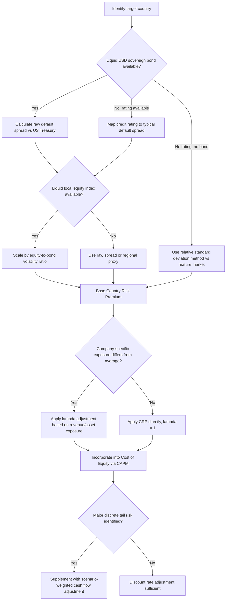

## Country and Sovereign Risk Premiums

### Overview

Country and sovereign risk premiums address the systematic risks associated with operating in, or generating cash flows from, a specific national jurisdiction — risks that extend beyond the diversifiable business risk captured by a standard beta and beyond the general market risk captured by a mature-market equity risk premium (ERP). These risks include sovereign default risk, currency inconvertibility, expropriation, political instability, abrupt regulatory or tax regime changes, and capital control imposition. Country risk premium (CRP) methodology provides a structured way to quantify and incorporate this additional risk into a discount rate or, alternatively, into projected cash flows.

The core analytical question CRP methodology addresses is: **how much additional return should an investor demand for bearing the risk of operating in a specific country, above and beyond what a mature, developed-market investment of similar operating risk would require?**

### Why Country Risk Requires Explicit Treatment

**Key Points**

Standard CAPM, built on developed-market data (US or global mature-market risk-free rate, beta, and ERP), implicitly assumes a level of institutional stability, property rights enforcement, currency convertibility, and political continuity that does not hold uniformly across all jurisdictions. Applying an unadjusted mature-market CAPM discount rate to cash flows generated in a market with materially different sovereign risk characteristics will systematically misprice the asset — typically overstating value for emerging and frontier market assets if no adjustment is made.

Three broad approaches exist for incorporating country risk into a valuation:

1. **Discount rate adjustment** — add an explicit CRP term to the cost of equity (or cost of capital)
2. **Cash flow adjustment** — explicitly haircut or scenario-weight projected cash flows for probability-weighted adverse sovereign events (expropriation, currency crisis, capital controls)
3. **Hybrid approach** — a partial discount rate adjustment combined with explicit cash flow scenario modeling for the most severe tail risks

**A critical methodological principle**: whichever approach is chosen, the adjustment should be made in **only one place**, not both. Simultaneously adding a full CRP to the discount rate *and* separately haircutting cash flows for the same underlying sovereign risk is a double-counting error that will materially understate value.

### Sovereign Default Spread Method

The most widely used approach to estimating a baseline CRP is the **sovereign bond default spread method**, which uses observable credit market pricing as a proxy for how global capital markets are pricing a country's sovereign risk:

$$CRP_{\text{raw}} = Y_{\text{sovereign, USD-denominated}} - Y_{\text{US Treasury, comparable maturity}}$$

This spread is directly observable for countries with actively traded USD-denominated (or other hard-currency-denominated) sovereign bonds, and can also be approximated using the country's sovereign credit rating mapped to a typical default spread for that rating category (a common approach when a country lacks liquid USD bond issuance, using rating-agency-to-spread mapping tables published by valuation practitioners).

**Worked Example**

A 10-year USD-denominated sovereign bond issued by a hypothetical emerging market country yields 7.20%. The comparable 10-year US Treasury yields 4.25%.

$$CRP_{\text{raw}} = 7.20\% - 4.25\% = 2.95\%$$

This 2.95% represents the market's pricing of default risk (and associated sovereign credit risk) for this country's government debt in hard-currency terms.

### Equity Market Volatility Adjustment

**Key Points**

A refinement to the raw sovereign default spread recognizes that equity markets are inherently more volatile than bond markets, and a country's equity risk premium should reflect this differential rather than directly importing the bond-market-derived default spread unadjusted. The most widely referenced adjustment (associated with Aswath Damodaran's country risk methodology) scales the raw default spread by the ratio of equity market volatility to bond market volatility:

$$CRP_{\text{equity-adjusted}} = CRP_{\text{raw}} \times \frac{\sigma_{\text{equity, local}}}{\sigma_{\text{bond, local}}}$$

where $\sigma_{\text{equity,local}}$ is the annualized standard deviation of the local equity index, and $\sigma_{\text{bond,local}}$ is the annualized standard deviation of the local USD-denominated sovereign bond.

**Worked Example (continued)**

Assume the local equity index has an annualized volatility of 28%, and the local USD sovereign bond has an annualized volatility of 12%.

$$CRP_{\text{equity-adjusted}} = 2.95\% \times \frac{28\%}{12\%} = 2.95\% \times 2.33 \approx 6.89\%$$

This equity-volatility-scaled figure (≈6.89%) is materially higher than the raw bond default spread (2.95%), reflecting the view that equity holders bear a larger share of country risk than bondholders, proportional to relative market volatility. [Inference: the specific volatility ratio used is sensitive to the measurement window and index selection; results can vary meaningfully depending on whether trailing 1-year, 3-year, or longer volatility windows are used, and analysts should disclose the window chosen given this sensitivity.]

### Incorporating CRP into the Cost of Equity

Once CRP is estimated, it is typically added to the standard CAPM cost of equity formula:

$$k_e = R_{f,\text{mature}} + \beta \times ERP_{\text{mature}} + CRP$$

Alternatively, some practitioners incorporate country risk **multiplicatively into beta** (a "lambda" adjustment) rather than additively, on the theory that a company's exposure to country risk is not uniform across all companies operating in that country — a large exporter with mostly foreign revenue is less exposed to local country risk than a purely domestic-facing retailer, even though both are domiciled in the same country:

$$k_e = R_{f,\text{mature}} + \beta \times ERP_{\text{mature}} + \lambda \times CRP$$

where $\lambda$ (lambda) is a company-specific exposure factor, sometimes proxied by the proportion of revenue generated domestically versus internationally, or estimated via regression of the company's stock returns against country risk spread movements.

**Key Points on lambda:**

- $\lambda = 1$: implies full, undifferentiated exposure to country risk, appropriate for a purely domestic-facing company (default assumption in the absence of company-specific data)
- $\lambda < 1$: implies partial insulation from country risk, appropriate for a multinational or major exporter with substantial hard-currency, foreign-market revenue
- $\lambda > 1$: implies amplified exposure, potentially appropriate for a company with liabilities or costs disproportionately exposed to local sovereign risk (e.g., a company holding significant local-currency government debt as an asset, or heavily reliant on local government contracts/subsidies)

### Alternative Framework: Country Risk in Cash Flows Rather Than Discount Rate

**Key Points**

An alternative and, in some respects, more rigorous approach argues that discount-rate-based CRP adjustments implicitly assume country risk is a constant, perpetual, diversifiable-in-the-denominator risk — when in fact many country risk events (a currency crisis, an expropriation event, a sovereign default) are **discrete, potentially resolving events** rather than a smooth continuous risk that compounds identically every year of the projection.

Under this view, explicit scenario-based cash flow adjustment is preferred for major discrete risks:

$$E[CF_t] = p_{\text{normal}} \times CF_{t,\text{normal}} + p_{\text{adverse}} \times CF_{t,\text{adverse scenario}}$$

where probabilities are assigned to distinct sovereign risk scenarios (e.g., continuation of current policy regime vs. currency crisis/capital controls vs. expropriation), and cash flows are separately modeled under each scenario, then probability-weighted.

This approach is particularly relevant in:

- Frontier markets with meaningful probability of abrupt regime change or capital control imposition
- Natural resource concessions where expropriation or contract renegotiation risk is a discrete, identifiable event rather than a continuous background risk
- Situations where the discount rate approach would need an implausibly large CRP to capture genuinely tail-risk scenarios, distorting the valuation of the "normal case" cash flows in the process

The trade-off is that scenario-based cash flow adjustment requires explicit, often highly subjective probability estimates for adverse sovereign events, which introduces its own significant estimation uncertainty and is harder to benchmark against observable market pricing than the sovereign spread method.

### Relative Standard Deviation Method (Alternative to Bond/Equity Ratio)

Where liquid USD-denominated sovereign bonds are unavailable for a given country (common for smaller or frontier markets), an alternative estimation approach uses the **relative standard deviation of the local equity market to a mature market benchmark**:

$$CRP \approx ERP_{\text{mature}} \times \left( \frac{\sigma_{\text{local equity}}}{\sigma_{\text{mature market equity}}} - 1 \right)$$

This method estimates the incremental premium implied purely by the local equity market's relative volatility versus a mature market benchmark (e.g., the S&P 500), without relying on sovereign bond data at all. It is generally considered a less precise proxy than the default spread method where bond data is available, since equity volatility reflects many factors beyond country risk specifically (sector composition, market liquidity, index concentration).

### Practical Application Table

| Data Availability Scenario | Recommended CRP Method |
| --- | --- |
| Liquid USD sovereign bond + liquid local equity index | Equity-volatility-adjusted default spread (Damodaran method) |
| Liquid USD sovereign bond only, thin local equity market | Raw default spread, potentially adjusted by regional/sector average equity-to-bond volatility ratio |
| No USD sovereign bond, but sovereign credit rating available | Rating-to-spread mapping table, then equity-volatility adjustment |
| No sovereign bond and no credit rating (frontier market) | Relative standard deviation method, or regional proxy country CRP |
| Major discrete tail risk identified (expropriation, capital controls) | Scenario-weighted cash flow adjustment, in addition to or instead of discount rate CRP |

### Common Pitfalls

- **Double-counting country risk** by including a full CRP in the discount rate *and* separately discounting or haircutting cash flows for the same sovereign risk factors
- **Applying an undifferentiated (lambda = 1) CRP to every company** in a country regardless of that company's actual revenue/asset exposure to domestic sovereign risk, ignoring the case for company-specific lambda adjustment
- **Using stale sovereign spread data** — sovereign spreads can move sharply and quickly around political events, elections, or credit rating actions, and a CRP calculated even a few months prior to the valuation date can be materially outdated
- **Conflating currency risk with country/sovereign risk** — these are related but analytically distinct; a currency risk premium addresses expected currency depreciation, while CRP addresses default, expropriation, and institutional risk. Some overlap exists but they should not simply be treated as interchangeable or additive without checking for double-counting
- **Ignoring embedded CRP already priced into local risk-free rates** — if the local risk-free rate used elsewhere in the WACC build already reflects local sovereign yield levels (which inherently embed default risk), separately adding a full CRP on top can double-count the same underlying risk
- **Using a single national CRP figure uniformly** across companies and sectors with materially different actual exposure to sovereign risk events (e.g., an export-oriented mining company with offshore revenue collection versus a purely domestic retail bank)

### Country Risk Premium Estimation Flow (svg_diagram)

**Related Topics**

- Currency Selection and Consistency in DCF
- Real versus Nominal Cash Flow Modeling
- Building Local Currency WACC When Local Capital Markets Are Illiquid
- Emerging Market Beta Estimation and Relevering Techniques
- Political Risk Insurance and Its Interaction with Discount Rate Adjustments
- Sovereign Credit Rating Migration and Its Effect on Discount Rate Stability
- Frontier Market Valuation: Scenario Analysis versus Discount Rate Approaches