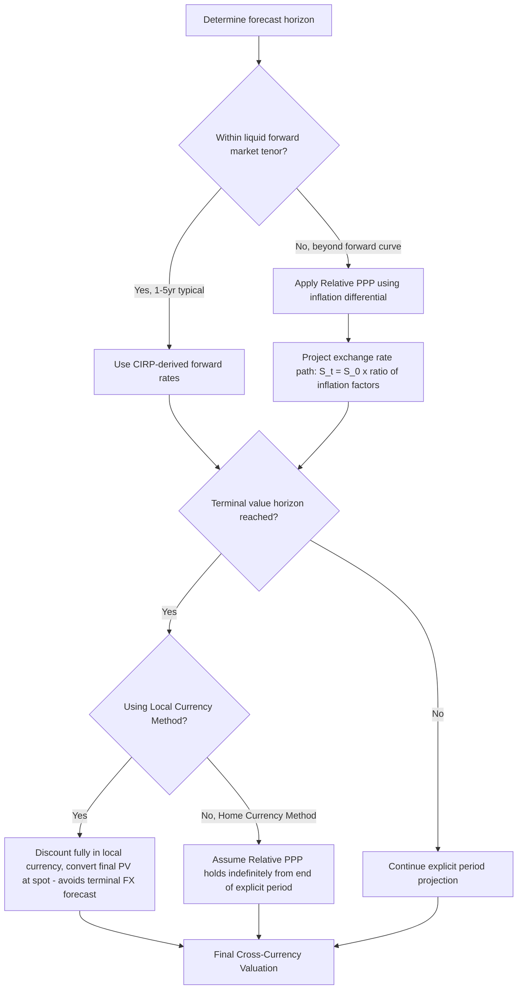

## Purchasing Power Parity and Exchange Rate Forecasting

### Overview

Purchasing Power Parity (PPP) is a macroeconomic theory and forecasting framework asserting that, in the long run, exchange rates adjust to equalize the purchasing power of currencies across countries, such that an identical basket of goods costs the same amount when expressed in a common currency. In cross-border DCF valuation, PPP provides one of the principal theoretical bases for projecting long-run exchange rate paths — particularly relevant for terminal value calculations and for deriving implied local risk-free rates when direct market data is unavailable (as referenced in the companion topic, Currency Selection and Consistency in DCF).

PPP exists in two primary forms — **Absolute PPP** and **Relative PPP** — with Relative PPP being by far the more operationally useful version for valuation forecasting purposes, since it does not require the often-unrealistic assumption that prices are already at parity in the base period.

### Absolute Purchasing Power Parity

Absolute PPP asserts that the exchange rate between two currencies should equal the ratio of price levels for an identical basket of goods in each country:

$$S = \frac{P_{\text{local}}}{P_{\text{home}}}$$

where $S$ is the exchange rate (home currency per unit of local currency, or vice versa depending on convention), and $P_{\text{local}}$, $P_{\text{home}}$ are the price levels of an equivalent basket of goods in each respective currency.

**Key Points**

Absolute PPP is widely understood to fail as an empirical description of actual exchange rates in the short-to-medium run, and is rarely used directly for valuation forecasting. This failure stems from the **Balassa-Samuelson effect**, transportation costs, tariffs, non-tradable goods and services (haircuts, real estate, local labor), differing consumption baskets across countries, and market frictions that prevent the law of one price from holding precisely even for tradable goods. The well-known "Big Mac Index" popularized by *The Economist* is an informal illustration of persistent, sometimes very large, absolute PPP deviations across countries.

### Relative Purchasing Power Parity

Relative PPP is the version with direct practical application in valuation forecasting. Rather than asserting exchange rates equal an absolute price ratio, it asserts that the **rate of change** in the exchange rate over time should approximately equal the **inflation differential** between the two countries:

$$\frac{S_t}{S_0} = \left(\frac{1+\pi_{\text{local}}}{1+\pi_{\text{home}}}\right)^t$$

Equivalently, expressed as expected currency depreciation/appreciation:

$$\% \Delta S \approx \pi_{\text{local}} - \pi_{\text{home}}$$

The intuition: a currency in a country with persistently higher inflation than its trading partner is expected to depreciate against that partner's currency over time, by approximately the magnitude of the inflation differential, so that relative purchasing power is preserved even though absolute price levels are not equalized.

**Worked Example**

Home currency: USD, with long-run expected inflation $\pi_{\text{home}} = 2.5\%$.

Local currency: PHP, with long-run expected inflation $\pi_{\text{local}} = 4.0\%$.

Current spot rate $S_0 = ₱56.00$ per USD.

Expected exchange rate in Year 5 under Relative PPP:

$$S_5 = 56.00 \times \left(\frac{1.040}{1.025}\right)^5 = 56.00 \times (1.01463)^5 = 56.00 \times 1.0755 \approx ₱60.23 \text{ per USD}$$

This implies the peso is expected to depreciate roughly 7.5% cumulatively against the dollar over five years, consistent with its higher relative inflation rate, under the assumption that Relative PPP holds over this horizon. [Inference: Relative PPP has stronger empirical support as a long-run equilibrating tendency than as a short-run predictor; deviations of several years' duration are common in practice, meaning this projection should be understood as a long-run anchor rather than a precise short-term forecast.]

### PPP versus Interest Rate Parity: Reconciling the Two Frameworks

**Key Points**

Relative PPP and Covered Interest Rate Parity (CIRP) — the framework used to derive forward exchange rates, discussed in the companion topic on currency consistency — are theoretically linked through the **Fisher effect** and the **International Fisher Effect (IFE)**, which together imply that nominal interest rate differentials and expected inflation differentials should move together:

$$i_{\text{local}} - i_{\text{home}} \approx \pi_{\text{local}} - \pi_{\text{home}}$$

This relationship, if it holds exactly, implies that forward exchange rates (derived via CIRP, using interest rate differentials) and expected future spot rates (derived via Relative PPP, using inflation differentials) should converge to approximately the same projected path. In practice, this exact equivalence frequently does not hold over short-to-medium horizons because of risk premia, capital controls, differing liquidity conditions, and market segmentation between currency and bond markets — meaning CIRP-derived forward rates and PPP-derived expected spot rates can diverge meaningfully, particularly for currencies with capital controls or thin forward markets.

**Practical implication for valuation**: when both a liquid forward curve and reliable long-run inflation forecasts are available, the CIRP-derived forward rate is generally preferred for near-to-medium-term cash flow conversion (Approach 2 in the currency consistency framework), since it reflects actual tradeable market pricing. PPP-based projection becomes the more relevant and often the only available tool for:

- Horizons beyond the liquid forward curve (which for most currency pairs extends only 1–5 years)
- Currencies subject to capital controls or convertibility restrictions where forward markets are thin, non-existent, or non-representative (requiring reliance on non-deliverable forward markets or synthetic proxies)
- Deriving an implied local risk-free rate when direct government bond yield data at the needed maturity is unavailable or unreliable

### Deriving an Implied Local Risk-Free Rate via PPP

As referenced in the currency consistency framework, when a reliable local government bond yield is unavailable at the required maturity, Relative PPP combined with the home risk-free rate can be used to back into an implied local risk-free rate:

$$R_{f,\text{local}} \approx (1 + R_{f,\text{home}}) \times \frac{1+\pi_{\text{local}}}{1+\pi_{\text{home}}} - 1$$

**Worked Example**

$R_{f,\text{home}}$ (USD 10-year Treasury) = 4.25%, $\pi_{\text{home}}$ = 2.5%, $\pi_{\text{local}}$ = 4.0%:

$$R_{f,\text{local}} \approx (1.0425) \times \frac{1.040}{1.025} - 1 = 1.0425 \times 1.01463 - 1 = 5.78\%$$

This implied 5.78% local risk-free rate can then be used to build a local-currency cost of equity where no directly observable long-maturity local sovereign bond yield exists, or where existing local yields are viewed as distorted by illiquidity or non-market factors (e.g., financial repression, captive domestic buyer bases).

### Terminal Value Exchange Rate Treatment Using PPP

**Key Points**

For DCF models using the Home Currency (converted cash flow) approach, projecting an exchange rate path far enough into the future to cover a terminal value calculation is one of the more theoretically fraught aspects of cross-border valuation, since no liquid forward market extends to a "terminal" (effectively infinite) horizon.

The standard practical treatment is to assume the exchange rate converges to and then moves in line with **Relative PPP from the end of the explicit forecast period onward** — i.e., after the point where reliable forward or transaction-based FX data ends, the model assumes the currency depreciates/appreciates at the steady-state long-run inflation differential indefinitely. This is a standard simplifying convention rather than a claim that PPP holds precisely at every point in time; it is generally considered more defensible than either (a) holding the exchange rate constant indefinitely (implicitly assuming zero long-run inflation differential, which is inconsistent with the local and home nominal growth/inflation assumptions used elsewhere in the same model) or (b) extrapolating a short-term forward trend indefinitely (which can produce an implausible cumulative currency move over an infinite horizon).

As noted in the companion currency consistency topic, the **Local Currency Method (Approach 1)** — discounting fully in local currency and converting only the final present value at the spot rate — sidesteps this terminal-horizon exchange rate forecasting problem entirely, which is a significant practical reason for its widespread preference in long-horizon cross-border valuations.

### Empirical Limitations and Deviations from PPP

**Key Points**

Several well-documented empirical phenomena cause actual exchange rates to deviate from PPP-implied paths, sometimes for extended periods:

- **The Balassa-Samuelson effect**: productivity growth differentials between tradable and non-tradable sectors cause systematic real exchange rate appreciation in faster-growing economies, independent of relative inflation rates alone
- **Capital flow and interest rate differential dominance in the short run**: in the short-to-medium term, exchange rates are frequently driven more by capital flows, carry trade dynamics, and interest rate differentials than by relative goods-price inflation, meaning short-run currency movements can substantially deviate from and even move opposite to what Relative PPP would predict
- **Commodity price and terms-of-trade shocks**: for commodity-exporting economies, currency movements are often driven by commodity price cycles rather than relative inflation
- **Capital controls and administered exchange rate regimes**: in countries with managed or pegged exchange rate regimes, actual currency movements can diverge from PPP-implied paths for extended periods until a policy adjustment (devaluation, regime change) occurs, at which point the currency can move discontinuously rather than gradually
- **Risk premia and safe-haven flows**: currencies perceived as safe havens (historically USD, JPY, CHF) can experience sustained appreciation pressure during periods of global risk aversion, unrelated to relative inflation differentials

[Unverified: the empirical half-life of PPP deviations — i.e., how long it takes for a currency that has deviated from its PPP-implied level to revert — is a subject of extensive academic debate, with estimates in the literature varying considerably (commonly cited ranges span roughly three to five years for major currency pairs, though this varies by study, sample period, and currency pair, and should not be treated as a precise, universally applicable figure).]

### Practical Framework: When to Use PPP-Based Forecasting

| Situation | Approach |
| --- | --- |
| Short-to-medium horizon (within liquid forward curve, e.g., 1–5 years) | Use market-observed forward rates (CIRP-derived), not PPP projection |
| Long horizon beyond forward curve, explicit forecast period | Extend using Relative PPP based on long-run inflation differential |
| Terminal value / perpetuity period | Standard convention: assume Relative PPP holds from end of explicit period onward, OR use Local Currency Method to avoid the issue entirely |
| Deriving implied local risk-free rate (no reliable local bond data) | Use PPP-based derivation combining home risk-free rate and inflation differential |
| Currency subject to capital controls / managed peg | Exercise caution — PPP assumes market-clearing exchange rates; administered regimes can deviate from PPP for extended periods, and a discontinuous realignment risk should be separately considered |

### Common Pitfalls

- **Using Absolute PPP for forecasting** rather than Relative PPP — absolute price level equalization is not a realistic assumption and is not the theoretically supported version of PPP for exchange rate change forecasting
- **Assuming PPP holds precisely over short horizons**, when its empirical support is considerably stronger as a long-run equilibrating tendency than as a short-term predictive tool
- **Ignoring the Balassa-Samuelson effect** when valuing assets in rapidly developing economies with strong productivity growth differentials, which can cause systematic real appreciation not captured by a simple inflation-differential PPP projection
- **Applying PPP-derived exchange rate paths to a managed or pegged currency regime** without considering discontinuous devaluation/realignment risk
- **Double-using both CIRP-derived forward rates and PPP-derived rates inconsistently** within the same model's different time horizons without a clear, disclosed transition methodology
- **Conflating PPP-based currency forecasting with Country Risk Premium estimation** — these address related but distinct phenomena (expected currency depreciation from inflation differentials versus additional required return for sovereign/political risk), and care should be taken not to double-count overlapping risk factors between the two frameworks

### PPP-Based Exchange Rate Forecasting Flow (svg_diagram)

**Related Topics**

- Currency Selection and Consistency in DCF
- Real versus Nominal Cash Flow Modeling
- Country and Sovereign Risk Premiums
- Covered Interest Rate Parity and Forward Curve Construction
- The Balassa-Samuelson Effect in Emerging Market Currency Valuation
- Managed Exchange Rate Regimes and Devaluation Risk Modeling
- Non-Deliverable Forward (NDF) Markets for Restricted Currencies