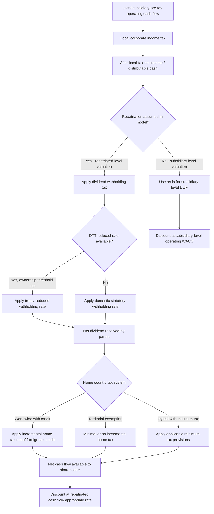

## Repatriation and Cross-Border Tax Considerations

### Overview

Repatriation and cross-border tax considerations address how the tax treatment of cash flows moving from a foreign subsidiary or operating entity back to the parent company or ultimate shareholder affects DCF valuation. This is a distinct layer of analysis from currency conversion mechanics (covered in the companion topic, Currency Selection and Consistency in DCF): even after correctly converting cash flows between currencies, the *after-tax, after-repatriation-friction* cash flow actually available to the investor can differ materially from the pre-repatriation local-currency free cash flow generated by the operating entity.

The central valuation question this topic addresses is: **does the DCF value the cash flows as generated at the operating subsidiary level, or as actually received by the ultimate parent/shareholder after all layers of taxation, withholding, and repatriation friction?** These can produce materially different valuations, and the choice must be made consistently and disclosed explicitly, since mixing bases (e.g., discounting pre-repatriation-tax cash flows at a discount rate that assumes full repatriation) produces an internally inconsistent model.

### Layers of Cross-Border Taxation

**Key Points**

Cash flow generated by a foreign subsidiary can be subject to multiple layers of tax before it is available to the ultimate parent company shareholder:

1. **Local corporate income tax** — tax paid by the subsidiary in its own jurisdiction on its own taxable income, already reflected in a standard unlevered free cash flow build
2. **Withholding tax on dividend repatriation** — many jurisdictions impose a withholding tax specifically on dividends, interest, or royalties paid to a foreign parent, often reduced under an applicable double taxation treaty (DTT)
3. **Home country tax on foreign-sourced income** — depending on the home country's tax system (worldwide vs. territorial), the parent company or its shareholders may owe additional tax when foreign earnings are repatriated or, under some regimes, even on an accrual basis regardless of actual repatriation
4. **Foreign tax credit mechanisms** — many worldwide tax systems allow a credit for foreign taxes already paid (local corporate tax and withholding tax) against the home-country tax liability, which can partially or fully offset layer 3, depending on relative tax rates and credit limitation rules

### Worldwide versus Territorial Tax Systems

**Key Points**

The structure of the parent company's home-country tax system fundamentally shapes how repatriation taxation should be modeled:

**Worldwide tax systems** tax resident companies on their global income regardless of where earned, with foreign tax credits typically available to mitigate double taxation. Historically, many worldwide systems taxed foreign earnings only upon actual repatriation (deferral), creating an incentive to retain earnings offshore indefinitely — a dynamic that was economically significant prior to various 2017-era U.S. tax reforms that introduced elements shifting the U.S. system toward a hybrid model with minimum taxes on certain categories of foreign income regardless of repatriation timing.

**Territorial tax systems** generally exempt foreign-sourced active business income from home-country taxation once local tax has been paid (subject to anti-avoidance rules), meaning the primary remaining tax friction on repatriation is the withholding tax layer rather than an additional home-country tax layer.

[Unverified: specific current-year tax system classifications, minimum tax rates, participation exemption thresholds, and anti-avoidance provisions vary by jurisdiction and change with tax legislation; given how frequently these rules are amended, the analyst should verify the applicable regime's current-year specific provisions for both the local and home jurisdiction rather than relying on general historical characterizations, since a materially outdated assumption here can meaningfully distort the after-tax cash flow available for repatriation.]

### Withholding Tax and Double Taxation Treaties

Withholding tax rates on dividends, interest, and royalties paid to a foreign parent are typically set by the local jurisdiction's domestic tax code as a default rate, but are frequently reduced under a bilateral **Double Taxation Treaty (DTT)** between the local and home jurisdictions.

**Worked Example**

A local jurisdiction's domestic withholding tax rate on dividends to non-resident parent companies is 25%. However, a DTT between the local jurisdiction and the parent's home country reduces this rate to 10% for qualifying parent shareholdings above a specified ownership threshold (a common treaty structure).

Local subsidiary generates $100mm of after-local-tax net income, fully distributed as a dividend:

- Without treaty benefit: dividend net of withholding = $100 \times (1 - 0.25) = \$75\text{mm}$
- With treaty benefit: dividend net of withholding = $100 \times (1 - 0.10) = \$90\text{mm}$

This $15mm difference (in this example, on a single year's distribution alone) illustrates why confirming applicable treaty eligibility and rates — including any minimum shareholding period or ownership percentage conditions attached to the reduced rate — is a material step in cross-border DCF modeling, not a minor technical footnote.

### Modeling Approaches: Subsidiary-Level vs. Repatriated Cash Flow Basis

**Key Points**

Two broad modeling conventions exist, each internally consistent if applied correctly, but producing different values and requiring different discount rate treatment:

**Approach A: Value at the Subsidiary/Operating Level (Pre-Repatriation)**

Value the foreign operation's unlevered free cash flow before any dividend withholding tax or incremental home-country tax, using a discount rate that reflects the operating business risk only. This approach is standard and appropriate when:

- The valuation objective is enterprise value of the operating business itself (e.g., for an M&A sale process, where the buyer's own tax profile and repatriation structure — not the seller's — will determine actual after-tax proceeds)
- Cash is assumed to be reinvested locally rather than repatriated over the projection horizon
- The analysis serves as a building block within a broader SOTP or portfolio valuation where repatriation assumptions are applied at a later, consolidated step

**Approach B: Value at the Repatriated (Shareholder-Received) Level**

Explicitly model the withholding tax, any incremental home-country tax net of foreign tax credits, and any repatriation timing assumptions, discounting the *net cash actually received by the parent/shareholder* at a discount rate appropriate to that net cash flow stream. This approach is necessary when:

- The valuation objective specifically concerns the value accruing to a particular parent company or investor with a known tax profile and repatriation intent
- Structural repatriation frictions (withholding tax, capital controls, minimum retention requirements) are material and specific to the investor being modeled
- The investment thesis explicitly depends on eventual cash extraction (e.g., a private equity holding period model with a defined exit and interim dividend assumptions)

**A critical consistency point**: whichever approach is used, the terminal value calculation must be built on the same basis as the explicit forecast period. Building explicit-period cash flows on a repatriated, after-withholding-tax basis while calculating the terminal value using a subsidiary-level (pre-withholding) perpetuity formula is an internal inconsistency that will overstate value, since the terminal value would then implicitly assume repatriation friction disappears in perpetuity.

### Repatriation Timing and Deferral Value

**Key Points**

Even within a worldwide or hybrid tax system with deferral features, the *timing* of repatriation carries its own value implications, since deferring the recognition of home-country tax liability (where deferral is legally available) has a time-value-of-money benefit — effectively an interest-free loan of the deferred tax amount for the deferral period.

A simplified framework for capturing deferral value:

$$PV_{\text{tax cost}} = \frac{T_{\text{home,incremental}}}{(1 + r)^{t_{\text{repatriation}}}}$$

where $T_{\text{home,incremental}}$ is the incremental home-country tax due upon repatriation (net of foreign tax credit), and $t_{\text{repatriation}}$ is the number of years until actual repatriation is assumed to occur. Longer assumed deferral periods reduce the present value cost of the incremental home-country tax layer, all else equal — though this benefit is jurisdiction- and regime-specific, and under regimes with current-year minimum taxation on certain categories of foreign income regardless of actual distribution, this deferral benefit may be substantially reduced or eliminated for the affected income categories.

### Capital Controls and Repatriation Restrictions

Beyond tax friction, some jurisdictions impose **non-tax barriers to repatriation** — capital controls, central bank approval requirements for dividend remittance, minimum local reinvestment requirements, or foreign exchange rationing during periods of currency stress. These introduce a qualitatively different kind of risk than tax friction:

- **Tax friction** is generally quantifiable, predictable, and treaty-governed
- **Capital control risk** is often less predictable, can be imposed or tightened with limited notice during macroeconomic stress (frequently precisely when an investor would most want to repatriate capital), and interacts with the country/sovereign risk considerations discussed in the companion Country and Sovereign Risk Premiums topic

Where capital control risk is material, some practitioners incorporate an explicit **illiquidity or trapped-cash discount** on projected foreign cash balances, separate from and in addition to standard country risk premium treatment in the discount rate, to avoid understating the risk that cash generated is not the same as cash the investor can actually access when desired.

### Structuring Considerations Affecting Repatriation Efficiency

**Key Points**

The legal and financing structure through which a cross-border investment is held can materially affect after-tax repatriation efficiency, and is frequently a live consideration in real transaction structuring (though the specific optimal structure is highly fact-, jurisdiction-, and treaty-specific and requires qualified local tax advice rather than general valuation methodology):

- **Intermediate holding company jurisdictions**: routing an investment through a jurisdiction with a favorable treaty network between the ultimate parent's home country and the operating subsidiary's local jurisdiction can reduce aggregate withholding tax leakage, though anti-treaty-shopping provisions (such as principal purpose tests increasingly embedded in modern treaties and multilateral instruments) have narrowed the scope for purely tax-motivated intermediate structures in many cases
- **Debt versus equity funding of the local subsidiary**: interest payments on intercompany debt may be deductible against local taxable income (reducing local corporate tax) but are also typically subject to their own withholding tax and thin-capitalization/interest-limitation rules in many jurisdictions, requiring a distinct analysis from straightforward dividend repatriation
- **Royalty and management fee structures**: some structures repatriate value via royalty or service fee payments rather than dividends, which carry their own withholding tax treatment and transfer pricing scrutiny requirements under most jurisdictions' transfer pricing regimes

[Inference: because these structuring approaches are subject to extensive, frequently evolving anti-avoidance legislation (including OECD BEPS-related measures adopted with varying scope and timing across jurisdictions), any specific structuring assumption embedded in a valuation model should be flagged as requiring current, jurisdiction-specific tax advice rather than treated as a stable, generally applicable valuation input.]

### Practical Modeling Checklist

1. Determine the valuation objective: subsidiary-level enterprise value, or value to a specific parent/investor net of repatriation friction
2. If modeling repatriated cash flows, confirm applicable domestic withholding tax rate and check for DTT-reduced rates and any qualifying ownership thresholds
3. Determine home country tax system treatment (worldwide with credit, territorial exemption, or hybrid with minimum tax features) and its interaction with foreign tax credits
4. Confirm consistency between explicit-period cash flow basis and terminal value basis (both subsidiary-level or both repatriated-level, not mixed)
5. Assess whether capital control or repatriation restriction risk is material, and whether this is better captured via discount rate adjustment, explicit cash flow haircut, or a separate trapped-cash illiquidity discount
6. Confirm the discount rate basis matches the cash flow basis — a repatriated, after-all-tax-layers cash flow stream carries different risk characteristics than a subsidiary-level pre-repatriation cash flow stream, and in principle may warrant a different discount rate reflecting the residual repatriation-related risk

### Common Pitfalls

- **Mixing subsidiary-level and repatriated-level cash flow bases** between the explicit forecast period and the terminal value calculation
- **Ignoring DTT-reduced withholding rates**, defaulting to domestic statutory withholding rates when a materially lower treaty rate applies and ownership conditions are met
- **Failing to model foreign tax credit limitations**, which can mean that home-country tax due on repatriation is not fully offset by foreign taxes already paid, particularly where local tax rates are lower than home-country rates
- **Treating capital control/repatriation restriction risk as pure tax friction**, when it is a qualitatively different and often less predictable risk category better addressed through explicit scenario treatment or a trapped-cash discount
- **Assuming a specific tax-efficient structure without confirming current-year applicability**, given how frequently anti-avoidance and treaty provisions are amended
- **Double-counting country risk and repatriation friction** — some of what appears as "repatriation risk" (currency inconvertibility, capital controls) overlaps conceptually with sovereign risk already captured in a country risk premium, requiring care to avoid counting the same underlying risk twice across different parts of the model

### Repatriation Tax Layer Flow (svg_diagram)

**Related Topics**

- Currency Selection and Consistency in DCF
- Country and Sovereign Risk Premiums
- Purchasing Power Parity and Exchange Rate Forecasting
- Transfer Pricing and Intercompany Royalty/Fee Structuring
- Thin Capitalization and Interest Deductibility Limitation Rules
- Trapped Cash Discounts in Multinational Valuation
- OECD BEPS Framework and Its Effect on Cross-Border Holding Structures