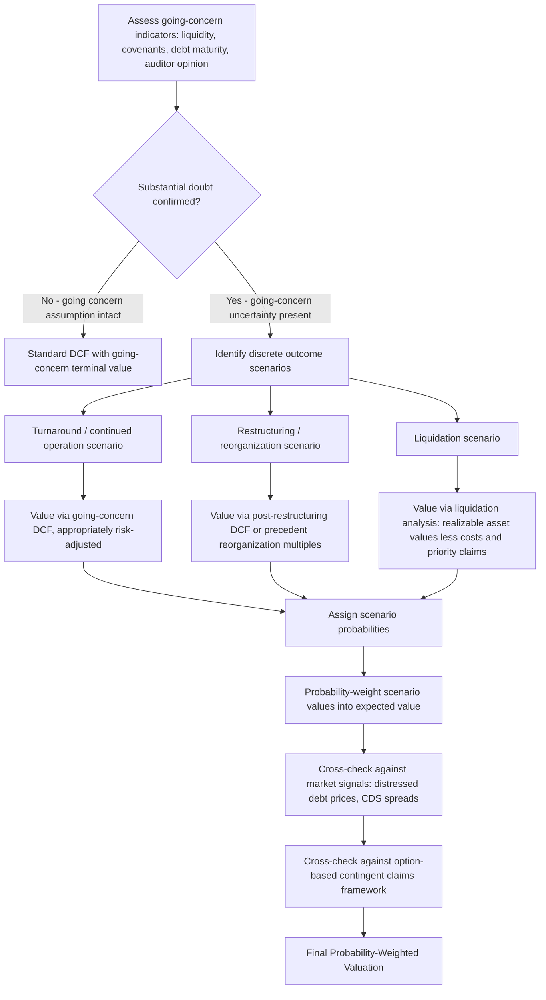

## Valuing Companies with Going-Concern Uncertainty

### Overview

Valuing companies with going-concern uncertainty addresses the methodological adaptations required when standard DCF and market-multiple valuation frameworks — which implicitly assume a company will continue operating indefinitely — must be modified or supplemented because there is substantial doubt about the entity's ability to continue as a going concern. This scenario arises in situations involving severe liquidity constraints, covenant breaches, impending debt maturities without clear refinancing capacity, sustained negative operating cash flow, auditor-issued going-concern qualifications, or active insolvency proceedings.

The core challenge is that standard valuation techniques rest on a **continuity assumption**: that the business will operate, generate cash flows, and be able to reinvest and refinance itself over an indefinite horizon. When this assumption is genuinely in doubt, a valuation that proceeds as if it holds — using a standard perpetuity-growth terminal value, for instance — will systematically overstate value by ignoring a material probability that the company will not survive to realize the assumed cash flow trajectory at all.

### Recognizing Going-Concern Uncertainty

**Key Points**

Auditing standards (e.g., under ASC 205-40 in the US, or ISA 570 internationally) require auditors to evaluate whether substantial doubt exists about an entity's ability to continue as a going concern for a period following the financial statement date (commonly a 12-month look-forward window, though frameworks vary). Indicators commonly considered include:

- Negative trends: recurring operating losses, working capital deficiencies, negative key financial ratios
- Loan defaults, covenant breaches, or debt classified as callable/due within twelve months without evident refinancing capacity
- Denial of usual trade credit from suppliers
- Loss of a principal customer, supplier, franchise, license, or key personnel
- Uninsured or underinsured catastrophes, labor difficulties, or legal proceedings that could jeopardize the entity's ability to operate

A formal auditor going-concern qualification (sometimes called a "going concern opinion" or "GC opinion") is a significant signal but is neither necessary nor sufficient on its own for a valuation analyst's assessment — companies without a formal audit qualification can still face genuine going-concern risk (particularly private companies without annual audits, or companies between audit cycles), and conversely, a qualification does not necessarily mean liquidation is imminent or even the most likely outcome.

### Why Standard DCF Breaks Down Under Going-Concern Uncertainty

**Key Points**

A standard DCF's terminal value, built on a perpetuity growth formula, embeds an assumption of indefinite continued operation:

$$TV_n = \frac{CF_n \times (1+g)}{WACC - g}$$

This formula is fundamentally a **going-concern valuation technique** — it has no mechanism to reflect a material probability of liquidation, restructuring-driven capital structure change, or business discontinuation partway through or shortly after the explicit forecast period. Applying it unmodified to a company facing genuine going-concern doubt produces a valuation that implicitly assumes the probability of survival is 100%, which overstates expected value whenever survival is genuinely uncertain.

Additionally, several standard DCF inputs become unreliable or require fundamental rethinking under going-concern stress:

- **WACC becomes difficult to estimate conventionally**: cost of debt calculated from a company's stated coupon rates becomes meaningless when the company's actual credit risk implies default is a real possibility; market-observed bond yields (if the debt trades) will reflect a probability-weighted blend of continued-operation and default/recovery scenarios, not a "pure" cost of debt
- **Beta and market-based cost of equity become distorted**: equity beta for a financially distressed company reflects extreme financial leverage and asymmetric payoff structure (equity as a call option on residual enterprise value above debt claims — see the Merton/option-based framework below), making standard CAPM beta estimates poor proxies for the true risk-return relationship
- **The capital structure itself is often unstable and subject to change**: distressed companies frequently undergo debt restructuring, debt-for-equity conversion, or asset sales that fundamentally alter the capital structure assumed in a standard WACC build, meaning the "current" capital structure weights may not be representative of the structure that will actually prevail

### Framework 1: Probability-Weighted Scenario Valuation

**Key Points**

The most widely used practical framework for going-concern uncertainty is **explicit scenario-weighted valuation**, which replaces the single-path DCF with a probability-weighted blend of distinct outcome scenarios:

$$V = \sum_{i=1}^{n} p_i \times V_i$$

where $p_i$ is the estimated probability of scenario $i$ occurring, and $V_i$ is the value under that scenario, with $\sum p_i = 1$.

A typical scenario structure for a company facing going-concern uncertainty:

| Scenario | Description | Valuation Approach |
| --- | --- | --- |
| Successful turnaround / going concern | Company resolves liquidity issues, refinances or restructures debt outside formal proceedings, continues operating | Standard DCF with going-concern terminal value, but potentially elevated discount rate |
| Restructuring / reorganization (e.g., Chapter 11-type process) | Company reorganizes under court supervision or out-of-court restructuring, continues operating post-restructuring with a de-levered capital structure | DCF on post-restructuring capital structure and business plan, or precedent reorganization value multiples |
| Liquidation | Company ceases operations, assets are sold/liquidated to satisfy creditor claims | Liquidation value (asset-by-asset realizable value, less liquidation costs and priority claims) |

**Worked Example**

A distressed company is assessed with the following scenario probabilities and equity values:

- Turnaround scenario (35% probability): equity value = $180mm
- Restructuring scenario (45% probability): equity value = $40mm (post-restructuring, reflecting significant equity dilution from debt-to-equity conversion)
- Liquidation scenario (20% probability): equity value = $0mm (asset liquidation proceeds fully absorbed by senior secured claims, common in liquidation given priority of claims)

$$V = (0.35 \times 180) + (0.45 \times 40) + (0.20 \times 0) = 63 + 18 + 0 = \$81\text{mm}$$

This probability-weighted equity value of $81mm is materially below the $180mm value that a standard going-concern-only DCF would produce, illustrating the magnitude of overstatement that ignoring going-concern uncertainty can introduce.

### Framework 2: Liquidation Value as a Floor

**Key Points**

Liquidation value provides a lower-bound reference point in most capital structures, since equity holders and even junior creditors would rationally prefer whatever alternative (reorganization, sale) yields the highest recovery, but liquidation value establishes the floor recovery available in the absence of any better alternative — this is a foundational principle in bankruptcy and restructuring valuation, often invoked under a "best interests of creditors" standard in formal reorganization proceedings, which typically requires that reorganization plan recoveries be no worse than what claimants would receive in a hypothetical liquidation.

**Liquidation value components:**

$$\text{Net Liquidation Proceeds} = \sum(\text{Asset realizable values}) - \text{Liquidation costs} - \text{Wind-down costs}$$

Asset realizable values in liquidation are typically discounted substantially versus going-concern book or fair value, since:

- Forced-sale conditions compress achievable prices (a "fire sale discount")
- Receivables collection rates decline as customers become aware of the counterparty's distress
- Inventory, particularly work-in-process or specialized inventory, may have minimal resale value outside the context of the operating business
- Intangible assets (goodwill, customer relationships, assembled workforce) generally have negligible standalone liquidation value, since they derive value specifically from the ongoing operation
- Specialized fixed assets and equipment often realize well below replacement cost or even depreciated book value in a distressed/forced sale context

**Typical recovery rate ranges by asset category** (illustrative, highly fact-specific in any actual case):

| Asset Category | Typical Liquidation Recovery Range (% of book value) |
| --- | --- |
| Cash and cash equivalents | ~100% |
| Accounts receivable | 60-90% (varies significantly by aging and customer concentration) |
| Inventory (finished goods) | 30-70% |
| Inventory (work-in-process/raw materials) | 10-50% |
| Machinery and equipment | 10-50% (highly asset-specific; specialized equipment often lower) |
| Real estate/property | Varies widely by location and marketability, often closer to fair market value if not distressed-specific |
| Goodwill and intangibles | Typically 0% (or minimal, if separable IP has independent value) |

[Unverified: these ranges are illustrative approximations drawn from general restructuring practice observation rather than a single authoritative source, and actual recovery rates in any specific liquidation are highly dependent on industry, asset specificity, market conditions at the time of sale, and the professionalism/speed of the liquidation process; they should not be applied mechanically without industry- and situation-specific diligence.]

### Framework 3: Option-Based (Contingent Claims) Valuation of Distressed Equity

**Key Points**

A theoretically rigorous alternative framework, grounded in the Merton (1974) structural credit model, treats equity in a leveraged, potentially insolvent company as analogous to a **call option on the firm's enterprise value**, with the face value of debt acting as the strike price:

$$E = \max(V_{\text{firm}} - D, 0)$$

where $E$ is equity value, $V_{\text{firm}}$ is total enterprise/firm value, and $D$ is the face value of debt obligations. Under this framework, equity retains positive (option) value even when the company's fundamental enterprise value is currently below the face value of its debt, provided there is sufficient time and volatility in firm value for enterprise value to potentially recover above the debt claim before maturity — this is the well-documented empirical phenomenon of distressed equity retaining non-zero, sometimes surprisingly persistent, market value even for companies with a genuinely uncertain going-concern outlook.

The Black-Scholes-Merton option pricing framework can be applied, treating:

- $V_{\text{firm}}$ (current enterprise value) as the underlying asset price
- $D$ (face value of debt) as the strike price
- Time to debt maturity as the option's time to expiration
- Asset volatility (volatility of enterprise value, not equity volatility, which must be de-levered) as the volatility input
- The risk-free rate as the risk-free rate input

$$E = V_{\text{firm}} \times N(d_1) - D \times e^{-rT} \times N(d_2)$$

$$d_1 = \frac{\ln(V_{\text{firm}}/D) + (r + \sigma_V^2/2)T}{\sigma_V \sqrt{T}}, \quad d_2 = d_1 - \sigma_V \sqrt{T}$$

**Key Points on practical application:**

- This framework is most useful for understanding *why* distressed equity retains value and for cross-checking scenario-based valuations against an independent theoretical framework, rather than as a sole, standalone practical valuation methodology for most transaction contexts
- Estimating asset volatility $\sigma_V$ (as opposed to the more readily observable equity volatility) requires an iterative de-levering process, since observed equity volatility reflects leveraged asset volatility, not asset volatility directly
- The framework assumes a single debt maturity date and a relatively simple capital structure; real-world distressed companies often have multiple tranches of debt with different seniority, maturity, and covenant packages, requiring either simplification or a more complex multi-class contingent claims model

### Discount Rate Considerations Under Going-Concern Uncertainty

**Key Points**

If a going-concern-basis DCF scenario is used as one component of a probability-weighted valuation (per Framework 1 above), the discount rate applied within that scenario should reflect the risk of that scenario's cash flows *conditional on the scenario occurring* — it should generally not itself be inflated to reflect the possibility of the other scenarios (bankruptcy, liquidation) not materializing, since that risk is already captured by the scenario probability weighting itself, not the discount rate.

A common and significant error is to apply an very elevated, ad hoc "distress premium" discount rate to a going-concern scenario's cash flows as a way of informally capturing bankruptcy risk, while *also* separately probability-weighting against a liquidation scenario — this double-counts the same underlying risk in two different places in the valuation (discount rate and scenario probability), and should generally be avoided in favor of choosing one mechanism (discount rate premium *or* explicit scenario weighting) as the primary means of capturing going-concern risk, then using the other only for risks genuinely distinct from what the first mechanism captures.

### Practical Valuation Process

1. **Establish the going-concern assessment basis**: review auditor opinions if available, liquidity runway (cash burn rate versus available cash and undrawn facilities), covenant compliance status, and upcoming debt maturity schedule
2. **Identify plausible discrete outcome scenarios**: typically spanning a spectrum from full turnaround through formal restructuring to liquidation, tailored to the specific situation (industry, jurisdiction's insolvency regime, capital structure complexity)
3. **Assign probabilities to each scenario**, drawing on comparable situations, management/advisor guidance, market-implied signals (distressed debt trading levels, CDS spreads if available), and qualitative judgment — explicitly acknowledging the substantial estimation uncertainty inherent in these probability assignments
4. **Value each scenario independently** using the method most appropriate to that scenario (going-concern DCF for turnaround, restructuring-adjusted DCF or precedent reorganization multiples for restructuring, liquidation analysis for liquidation)
5. **Probability-weight the scenario values** to arrive at expected value
6. **Cross-check against market-observed signals** where available: distressed debt trading prices, credit default swap spreads, and public equity trading price (if listed) can each provide an independent market-implied read on the probability-weighted outcome, useful as a sanity check against the bottom-up scenario analysis
7. **Cross-check against the option-based framework** as a theoretical consistency check on why and how much equity value should persist given the firm's current leverage and volatility profile

### Common Pitfalls

- **Applying a standard going-concern DCF terminal value unmodified** to a company with genuine going-concern doubt, ignoring the probability of non-survival entirely
- **Double-counting distress risk** in both an elevated discount rate and separate liquidation-scenario probability weighting
- **Using book value or unadjusted fair value for liquidation scenario assets**, ignoring the substantial fire-sale discounts typically realized in forced liquidation
- **Ignoring the capital structure priority waterfall** when allocating scenario outcome values across debt tranches and equity — equity often receives zero or minimal recovery in both restructuring and liquidation scenarios specifically because of subordination to secured and unsecured creditor claims, a point sometimes overlooked when analysts default to a residual equity value without checking the full waterfall
- **Relying solely on a formal auditor going-concern opinion (or its absence) as a binary signal**, rather than independently assessing the underlying liquidity, covenant, and refinancing indicators
- **Failing to cross-check bottom-up scenario probabilities against market-observed distress signals** (distressed bond prices, CDS spreads) where such data exists, missing a valuable independent read on market-implied outcome probabilities
- **Treating equity beta and observed cost of debt from a distressed company's securities as directly usable CAPM/WACC inputs** without recognizing that both are distorted by extreme leverage and the option-like, asymmetric payoff structure of distressed claims

### Going-Concern Valuation Decision Flow (svg_diagram)

**Related Topics**

- Distressed Debt Valuation and Recovery Analysis
- Liquidation Value Analysis and Fire-Sale Discount Estimation
- Chapter 11 Reorganization Value and Plan of Reorganization Valuation
- Merton Structural Credit Model and Option-Based Equity Valuation
- Distressed Company WACC and Cost of Capital Estimation Challenges
- Absolute Priority Rule and Creditor Waterfall Analysis
- Distressed Debt and Credit Default Swap Market-Implied Probability Extraction