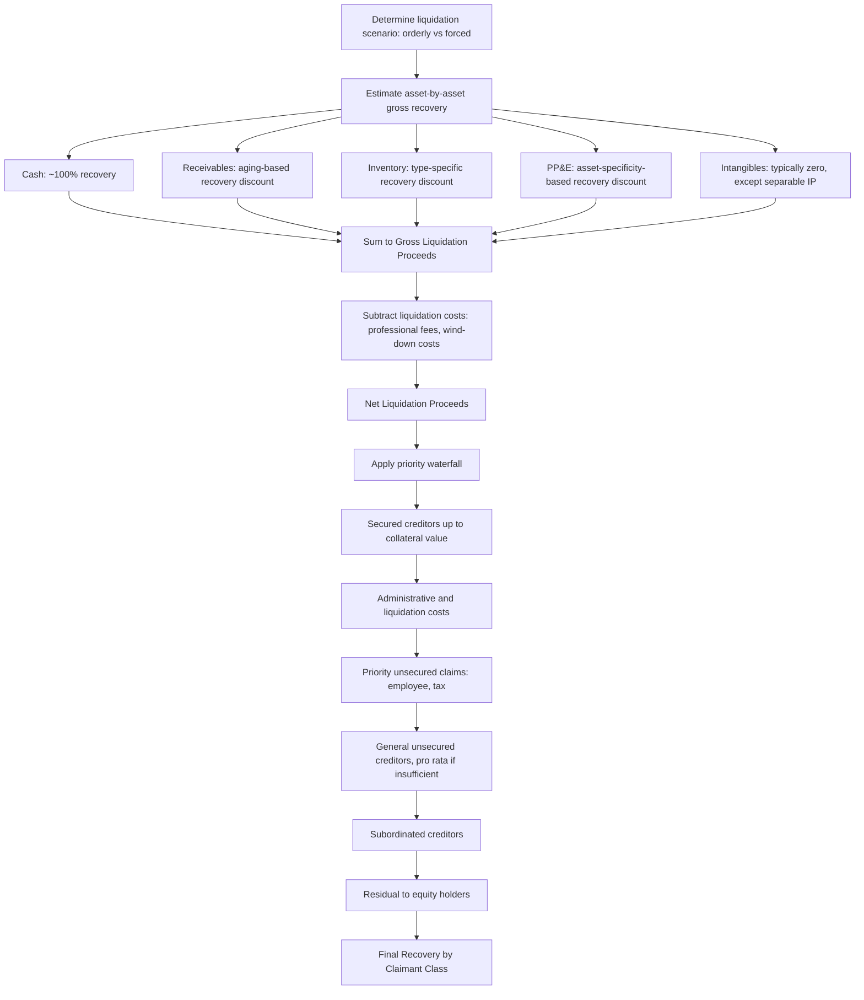

## Liquidation Value Analysis

### Overview

Liquidation value analysis determines the net proceeds available to an entity's stakeholders if its assets were sold off individually — or in discrete blocks — and operations ceased, rather than the entity continuing as an operating business. It stands in direct methodological contrast to going-concern valuation approaches (DCF, trading comparables), which value a business based on its capacity to generate future cash flows through continued operation. Liquidation value serves several distinct analytical purposes: as a floor/reference value in distressed and bankruptcy contexts (per the "best interests of creditors" principle discussed in the companion Going-Concern Uncertainty topic), as the primary valuation basis when liquidation is the base-case or highly probable outcome, and as a component of asset-based valuation approaches more broadly.

The central analytical task is realistic estimation of what each category of asset would actually fetch in a forced or orderly sale process, net of the substantial costs, time delays, and value destruction inherent in liquidation — followed by correct allocation of net proceeds across the capital structure according to legal priority.

### Orderly Liquidation Value versus Forced Liquidation Value

**Key Points**

A foundational distinction in liquidation analysis is between two liquidation scenarios that produce materially different realizable values:

**Orderly Liquidation Value (OLV)**: assumes assets are sold over a reasonable period of time (often modeled as 3-12 months depending on asset type), allowing for adequate marketing, an organized sale process, and buyer due diligence — essentially replicating a professionally managed disposition process without the time pressure of a fire sale, but still reflecting that a liquidation (rather than going-concern sale) is occurring.

**Forced Liquidation Value (FLV)**, also called **Fire-Sale Value**: assumes assets must be sold within a compressed timeframe (often days to a few weeks), typically at auction or through rapid disposition, sacrificing price for speed and certainty of sale. FLV is materially lower than OLV for virtually every asset category, since compressed timelines eliminate the ability to identify and negotiate with the highest-value buyer.

The choice between OLV and FLV bases should be explicitly driven by the actual liquidation context being modeled — a company with adequate time and a court-supervised, professionally managed asset disposition process (common in formal Chapter 11 or similar restructuring proceedings) more closely resembles OLV assumptions, while a company facing immediate cash exhaustion with no ability to fund an extended sale process more closely resembles FLV.

### Asset-by-Asset Liquidation Value Estimation

**Key Points**

Liquidation analysis proceeds through systematic estimation of realizable value for each major asset category on the balance sheet, applying category-specific recovery assumptions:

**Cash and Cash Equivalents**

Recovered at approximately 100% of book value, since cash requires no conversion or sale process. Restricted cash (subject to specific liens, escrow arrangements, or regulatory holds) requires separate analysis of whether and how it becomes available to general creditors.

**Accounts Receivable**

Recovery rates depend heavily on aging, customer concentration, and customer awareness of the debtor's distress (which can itself trigger collection difficulties as customers dispute balances, seek to net obligations, or simply become harder to collect from once aware of counterparty distress). A typical approach applies declining recovery rates by aging bucket:

| Aging Bucket | Typical Recovery Range |
| --- | --- |
| Current (0-30 days) | 85-95% |
| 31-60 days | 70-85% |
| 61-90 days | 50-70% |
| 90+ days | 10-40% |

[Unverified: these ranges are illustrative of general restructuring practice rather than derived from a single authoritative benchmark; actual recovery in any specific liquidation depends heavily on customer relationships, industry payment norms, and whether receivables are factored, insured, or subject to netting arrangements with the debtor.]

**Inventory**

Recovery varies substantially by inventory type and specificity:

- Finished goods with active secondary markets (commodity-like or widely distributed products): moderate recovery, often 40-70% of cost/book value
- Work-in-process: typically low recovery (10-40%), since WIP has limited standalone value outside completion of the production process
- Raw materials with commodity characteristics: can recover reasonably well if actively traded
- Specialized, custom, or obsolete inventory: often minimal recovery, sometimes requiring the seller to pay disposal costs rather than realizing positive value

**Property, Plant, and Equipment**

- Real estate: generally realizes closer to fair market value in an orderly process (real estate markets typically have more standardized valuation and transaction mechanisms than specialized industrial equipment), though a liquidation-driven sale still typically incurs some discount versus a non-distressed arm's-length sale, plus brokerage and closing costs
- Machinery and equipment: highly asset-specific; general-purpose equipment (standard machine tools, vehicles, generic IT equipment) tends to recover better than highly specialized, custom-built, or industry-specific equipment with a thin secondary market
- Leasehold improvements: typically minimal to no separate liquidation value, since these are generally not separable from the leased premises

**Intangible Assets**

- Goodwill: essentially always valued at zero in liquidation, since goodwill by definition represents value attributable to the assembled, operating business as a whole, which liquidation specifically dismantles
- Separable intellectual property (patents, trademarks, proprietary technology, customer lists with independent market value): may retain meaningful standalone value if there is an identifiable buyer market, and should be assessed on a case-by-case basis rather than defaulted to zero
- Customer relationships/contracts: value depends on whether contracts are assignable and whether counterparties would consent to assignment to a successor entity

### Liquidation Costs and Priority Claims

**Key Points**

Gross asset liquidation proceeds must be reduced by liquidation-specific costs before arriving at net proceeds available for distribution to creditors:

$$\text{Net Liquidation Proceeds} = \text{Gross Asset Recovery} - \text{Liquidation Costs} - \text{Wind-Down Costs}$$

**Typical liquidation cost components:**

- Professional fees: liquidation trustee/administrator fees, legal fees, financial advisor fees, auctioneer/broker commissions on asset sales
- Wind-down operating costs: costs to maintain minimal operations during the liquidation process (security, insurance, utilities, skeleton staff) until assets are fully disposed of
- Employee-related claims: severance obligations, accrued wages, and in many jurisdictions, statutorily prioritized employee claims that rank ahead of general unsecured creditors
- Transaction costs: costs specifically associated with the sale process for major assets (real estate closing costs, equipment removal/decommissioning costs)

### Priority Waterfall and Distribution of Net Proceeds

**Key Points**

Once net liquidation proceeds are determined, distribution to claimants follows a legally defined priority order (the specific sequence and terminology varies by jurisdiction's insolvency regime, but the general structural logic is broadly similar across most developed legal systems):

A typical simplified priority waterfall:

1. **Secured creditors** (against their specific collateral) — recover up to the value of their specific collateral first; any shortfall becomes an unsecured claim for the remainder
2. **Administrative/liquidation costs and professional fees** — often given "administrative priority" status to ensure the liquidation process itself can be funded
3. **Priority unsecured claims** — commonly includes certain employee wage/benefit claims up to statutory caps, and in many jurisdictions certain tax authority claims
4. **General unsecured creditors** — trade creditors, unsecured bondholders, and other ordinary unsecured claims, typically paid pro rata if funds are insufficient to pay them in full
5. **Subordinated creditors** — creditors who have contractually or structurally subordinated their claims to other unsecured creditors
6. **Equity holders** — residual claimants, receiving any remaining value only after all creditor classes (secured through subordinated) have been paid in full

This is the **absolute priority rule** in its idealized form: no junior class receives any recovery until all senior classes are paid in full. [Inference: in practice, particularly in negotiated out-of-court restructurings or certain plan-of-reorganization contexts, deviations from strict absolute priority sometimes occur through negotiated settlements (e.g., a junior class receiving a small recovery in exchange for supporting a consensual plan, avoiding the cost and delay of a contested process) — but a base-case liquidation analysis conducted for valuation purposes typically applies strict priority absent a specific reason to model a negotiated deviation.]

**Worked Example — Full Liquidation Waterfall**

| Line Item | Amount ($mm) |
| --- | --- |
| Cash | 15 |
| Accounts receivable (net of recovery discount) | 42 |
| Inventory (net of recovery discount) | 28 |
| PP&E (net of recovery discount) | 65 |
| Intangibles | 0 |
| **Gross Liquidation Proceeds** | **150** |
| Less: Liquidation costs (professional fees, wind-down) | (18) |
| **Net Liquidation Proceeds** | **132** |
| Less: Secured debt claim | (85) |
| Remaining after secured claims | 47 |
| Less: Priority unsecured claims (employee, tax) | (12) |
| Remaining after priority claims | 35 |
| Less: General unsecured claims ($60mm claim, pro rata recovery) | (35) |
| **Recovery rate for general unsecured creditors** | **58.3%** |
| **Remaining for equity** | **$0** |

This example illustrates the common outcome in leveraged distressed liquidations: general unsecured creditors recover only a fraction of their claims (58.3% in this case), and equity holders — as residual claimants — receive nothing, since asset value was insufficient to satisfy even the full unsecured creditor class before reaching equity's position in the waterfall.

### Liquidation Value as a Component of Broader Valuation Frameworks

**Key Points**

Liquidation value analysis connects to several other valuation contexts beyond standalone distressed situations:

- **Floor value in probability-weighted going-concern uncertainty analysis** (as detailed in the companion topic): liquidation value provides one of several scenario outcomes to be probability-weighted
- **Net Asset Value (NAV) approaches**: NAV-based valuation for asset-heavy businesses (real estate, natural resources, investment holding companies per the companion SOTP topic) uses a related but distinct concept — typically orderly, non-distressed fair market value of assets rather than liquidation-specific discounted recovery values — though the analytical toolkit (asset-by-asset valuation) is structurally similar
- **"Best interests of creditors" test in formal reorganization proceedings**: as referenced in the Going-Concern Uncertainty topic, many jurisdictions' insolvency frameworks require that a reorganization plan provide each dissenting claimant with recovery no less than they would receive in a hypothetical liquidation, making a rigorous liquidation analysis a required component of contested reorganization plan confirmation processes
- **Secured lender loan-to-value analysis**: lenders extending secured credit frequently estimate liquidation value of collateral as a component of assessing loan recovery risk, independent of any active distress at the borrower

### Common Pitfalls

- **Using book value or non-distressed fair market value for liquidation assets** rather than applying appropriate liquidation-specific recovery discounts, which materially overstates liquidation value
- **Failing to distinguish orderly versus forced liquidation assumptions**, and applying an internally inconsistent mix (e.g., forced-sale timelines but orderly-sale recovery percentages)
- **Assigning positive value to goodwill or non-separable intangibles** in a liquidation context, when these categories are almost always valued at zero given that liquidation specifically dismantles the assembled, operating business that generates such value
- **Omitting or understating liquidation costs**, particularly professional fees and wind-down operating costs, which can be substantial in complex liquidations and directly reduce net proceeds available for distribution
- **Misapplying the priority waterfall**, particularly failing to correctly bifurcate secured creditor claims into the secured portion (up to collateral value) and unsecured deficiency claim (for any shortfall)
- **Ignoring statutorily prioritized claims** (certain employee and tax claims in many jurisdictions) that rank ahead of general unsecured creditors, which affects the true residual available to ordinary trade and bond creditors
- **Applying uniform recovery percentages across all assets** without accounting for genuine asset-specific and industry-specific variation in liquidation recovery rates

### Liquidation Value Analysis Flow (svg_diagram)

**Related Topics**

- Valuing Companies with Going-Concern Uncertainty
- Absolute Priority Rule and Creditor Waterfall Analysis
- Net Asset Value (NAV) Methodology for Asset-Heavy Businesses
- Secured Lender Collateral and Loan-to-Value Analysis
- Chapter 11 Reorganization Value versus Liquidation Value Comparison
- Distressed Debt Recovery Rate Analysis
- Fire-Sale Discount Estimation Across Asset Classes