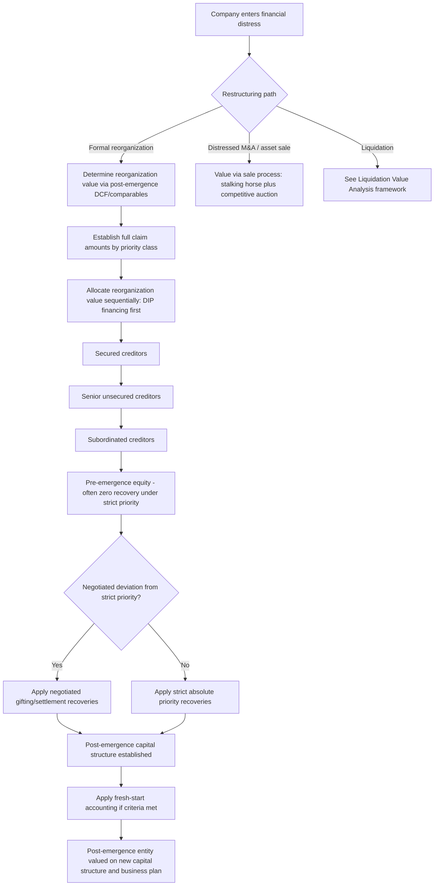

## Valuation Implications of Financial Distress and Restructuring

### Overview

Valuation implications of financial distress and restructuring examines how the standard valuation toolkit must be adapted when a company is navigating — or has recently emerged from — a formal or informal debt restructuring process, and how the valuation analyst should think about value creation, destruction, and transfer across the capital structure as a company moves through distress. This topic sits adjacent to, but is distinct from, the companion topics on Going-Concern Uncertainty (which addresses probability-weighting survival versus non-survival outcomes) and Liquidation Value Analysis (which addresses the specific mechanics of winding down assets): this topic focuses on the valuation dynamics *during and after* an active restructuring process, including reorganization value determination, fresh-start accounting, capital structure arbitrage, and the specific claims-level valuation problems that arise once a formal restructuring proceeding is underway.

### Distinguishing Distress-Related Valuation Contexts

**Key Points**

Financial distress valuation work generally falls into one of several distinct analytical contexts, each with different objectives and conventions:

| Context | Objective |
| --- | --- |
| Pre-distress early warning / credit analysis | Assess probability and timing of distress before it becomes acute |
| Going-concern uncertainty valuation | Probability-weight survival versus non-survival outcomes (see companion topic) |
| Formal reorganization / Chapter 11-type proceeding | Determine reorganization (enterprise) value to allocate recoveries across the priority waterfall |
| Distressed debt/claims trading | Value specific debt tranches or claims for secondary market trading purposes |
| Post-emergence "fresh start" valuation | Re-value the entity's assets and liabilities upon emergence from restructuring under fresh-start accounting principles |
| Distressed M&A (363 sale or similar) | Value the business or its assets for sale within or alongside a restructuring proceeding |

### Reorganization Value Determination

**Key Points**

In a formal court-supervised restructuring (e.g., a Chapter 11-type reorganization), a central valuation task is establishing **reorganization value** — the going-concern enterprise value of the reorganized entity upon emergence, which serves as the basis for determining how recoveries are allocated across creditor and equity claims under the plan of reorganization.

Reorganization value is typically estimated using standard enterprise valuation techniques (DCF based on the post-emergence business plan, comparable company trading multiples, precedent transactions) but applied to a **post-restructuring capital structure and business plan** rather than the pre-restructuring entity. Key considerations specific to this context:

- **The post-emergence business plan often reflects significant operational changes**: restructuring frequently accompanies cost-cutting initiatives, footprint rationalization, contract renegotiation (including potential rejection of unfavorable executory contracts and leases under applicable insolvency law provisions), and other operational resets that materially change the projected cash flow profile versus the pre-distress business
- **The post-emergence capital structure is typically substantially de-levered**: debt-for-equity conversion, debt writedowns, and reduced leverage are common features of a successful restructuring, meaning the post-emergence WACC should reflect this new, generally lower-risk capital structure rather than the pre-restructuring, highly-levered structure
- **Reorganization value is often contested and subject to significant negotiation** between different creditor classes, since the specific value determines exactly how much value is available to distribute and to which classes — parties often retain their own valuation experts, and disputes over reorganization value are a common feature of contested plan confirmation proceedings

### The Absolute Priority Rule and Its Practical Application

**Key Points**

As introduced in the companion Liquidation Value Analysis topic, the **absolute priority rule** holds that no junior class of claims or interests should receive any distribution under a reorganization plan until all senior classes are paid in full (or consent to a lesser treatment). In practice, applying this rule to allocate a determined reorganization value requires:

1. Establishing the total reorganization value
2. Establishing the full claim amount for each class in the priority order (secured debt, unsecured debt, subordinated debt, preferred equity, common equity)
3. Allocating reorganization value sequentially down the priority stack until value is exhausted

$$\text{Recovery}_{\text{class } i} = \min\left(\text{Claim}_i, \max\left(0, \text{Reorg. Value} - \sum_{j<i} \text{Claim}_j\right)\right)$$

**Worked Example**

A company emerges from restructuring with a determined reorganization enterprise value of $400mm. Pre-restructuring claims (in priority order):

| Claim Class | Face Claim ($mm) | Recovery Calculation | Recovery ($mm) | Recovery Rate |
| --- | --- | --- | --- | --- |
| Secured debt | 150 | Fully covered (senior-most) | 150 | 100% |
| Senior unsecured notes | 200 | Remaining value (400-150)=250, fully covers 200 | 200 | 100% |
| Subordinated notes | 120 | Remaining value (250-200)=50, partial | 50 | 41.7% |
| Common equity | N/A | Remaining value = 0 | 0 | 0% |

This illustrates the mechanical, sequential nature of absolute priority: subordinated noteholders receive only partial recovery, and pre-restructuring common equity is entirely wiped out, receiving nothing — a very common outcome in restructurings where enterprise value has declined materially from the level implied by the original capital structure, and one of the primary reasons equity valuation and even continued equity market listing frequently does not survive a restructuring.

**Deviations from strict absolute priority**: as noted in the companion Liquidation topic, negotiated plans sometimes provide junior classes (including existing equity) a modest recovery in excess of strict absolute priority — sometimes informally termed a "gifting" or "equity retention" arrangement — typically in exchange for that class's support of the plan, avoiding the cost, delay, and uncertainty of a contested confirmation process. [Inference: whether and to what extent such deviations are permissible varies by jurisdiction's specific insolvency law framework and case law; a valuation analyst modeling potential outcomes should treat strict absolute priority as the legal baseline/floor scenario and treat any deviation as a negotiated possibility requiring case-specific legal input, not a valuation-methodology assumption to apply by default.]

### Fresh-Start Accounting

**Key Points**

Under applicable accounting standards (e.g., ASC 852 in the US, "Reorganizations"), an entity emerging from a restructuring proceeding may be required or permitted to apply **fresh-start accounting** if specific conditions are met (typically involving the reorganization value being less than the total of post-emergence liabilities and allowed claims, and pre-emergence holders receiving less than 50% of the voting shares of the emerged entity — specific quantitative thresholds and conditions should be confirmed against the currently applicable standard, as these are technical accounting determinations).

Under fresh-start accounting, the reorganized entity essentially resets its balance sheet as if it were a new entity:

- Assets and liabilities are remeasured to fair value as of the fresh-start reporting date (conceptually similar to purchase price allocation in an acquisition)
- Reorganization value is allocated across identifiable assets, with any residual recorded as goodwill
- Accumulated deficit and other pre-emergence equity accounts are eliminated, and a new equity structure is established reflecting the post-emergence ownership

**Valuation implication**: fresh-start reporting creates a discontinuity in historical financial statement comparability — pre- and post-emergence financial statements are generally not directly comparable on a like-for-like basis, since the asset base, capital structure, and even the equity itself represent a fundamentally reset entity. Analysts building projections or performing trading comparable analysis for a recently-emerged company should be attentive to this discontinuity and generally should anchor primarily to the post-emergence business plan and post-emergence peer set, using pre-emergence historical data cautiously if at all for trend analysis purposes.

### Capital Structure Arbitrage in Distressed Situations

**Key Points**

Distressed and restructuring situations frequently create opportunities (and corresponding valuation analysis needs) around **capital structure arbitrage** — identifying relative value discrepancies between different securities issued by the same distressed entity (different debt tranches, debt versus equity, or debt versus credit derivatives referencing the same entity).

This analysis typically involves:

- Comparing implied recovery assumptions embedded in current market prices of different debt tranches against a bottom-up reorganization/liquidation value analysis, to identify tranches that appear mispriced relative to their position in the priority waterfall
- Using the option-based (Merton-style) framework referenced in the companion Going-Concern Uncertainty topic to assess whether the relative pricing of debt and equity claims is internally consistent with a coherent view of firm value and volatility
- Analyzing credit default swap (CDS) pricing where available as an additional market-implied signal on default probability and expected recovery, cross-checked against bond and loan pricing (basis trades between CDS and cash bond markets are a recognized area of this analysis)

### Debtor-in-Possession (DIP) Financing Considerations

**Key Points**

Companies in formal restructuring proceedings frequently require **debtor-in-possession (DIP) financing** — new financing provided during the restructuring process, typically granted senior or "priming" priority status ahead of even pre-existing secured claims (subject to court approval and adequate protection requirements for primed lenders under most jurisdictions' frameworks) in exchange for providing new capital that keeps the business operating through the restructuring process.

**Valuation implications of DIP financing:**

- DIP claims typically rank at or near the top of the priority waterfall, meaning their existence and size directly affects the "remaining value" available to satisfy pre-petition secured and unsecured claims in any reorganization value allocation analysis
- DIP financing terms (interest rate, fees, covenants, conversion features if any) should be reflected in the post-emergence or interim capital structure used for any going-concern valuation performed during the pendency of the restructuring
- The willingness of new capital providers to extend DIP financing, and on what terms, is itself a market signal about perceived enterprise value and recovery prospects, useful as a cross-check against bottom-up reorganization value estimates

### Valuation Considerations Specific to Distressed M&A / Section 363-Type Sales

**Key Points**

In some restructuring contexts, rather than reorganizing as a standalone entity, some or all of a distressed company's assets or business are sold to a third party through a court-supervised sale process (in the US, commonly under Bankruptcy Code Section 363; broadly analogous mechanisms exist in other jurisdictions' insolvency frameworks). Valuation considerations specific to this context:

- **"Free and clear" sale mechanics**: such sales are frequently structured to convey assets free of most liens, claims, and encumbrances (with those claims attaching instead to the sale proceeds), which can make the assets more attractive to a buyer than acquiring them outside a court-supervised process, potentially supporting a higher achievable sale price than in a conventional distressed asset sale
- **Stalking horse bid dynamics**: an initial "stalking horse" bidder often sets a floor price and terms, subject to a subsequent competitive auction process, which can itself provide valuable price discovery information relevant to broader reorganization value assessment even for assets not being sold
- **Going-concern sale versus piecemeal asset sale**: a sale of the business as a going concern to a single buyer will generally realize materially more value than a piecemeal liquidation of individual assets to multiple buyers, reflecting the same going-concern-versus-liquidation value gap discussed in the companion Liquidation Value topic, and is often actively pursued as a value-maximizing alternative specifically to avoid a lower-recovery straight liquidation

### Common Pitfalls

- **Using the pre-restructuring capital structure or WACC** when valuing a post-emergence or reorganization scenario, rather than reflecting the typically de-levered, lower-risk post-emergence structure
- **Applying pre-emergence historical financials for trend analysis** without recognizing the fresh-start accounting discontinuity that can make pre- and post-emergence financials non-comparable
- **Miscalculating the priority waterfall**, particularly failing to correctly account for DIP financing priority, which sits ahead of pre-petition claims and directly reduces value available to those classes
- **Assuming strict absolute priority is always followed in practice**, without recognizing that negotiated deviations (gifting arrangements) are a recognized, if legally and case-specifically contingent, feature of many actual restructuring outcomes
- **Ignoring market-implied signals from DIP financing terms, distressed debt trading levels, and CDS pricing** as independent cross-checks against bottom-up reorganization value estimates
- **Treating a contested reorganization value determination as a single, objectively "correct" figure** rather than recognizing it as often a genuinely contested, negotiated outcome where different stakeholders have legitimate incentives to advocate for different valuation assumptions
- **Applying going-concern DCF terminal value logic to entities where a piecemeal asset sale or liquidation is the more probable outcome**, rather than appropriately reflecting that probability per the scenario-weighting framework in the companion Going-Concern Uncertainty topic

### Restructuring Valuation and Priority Waterfall Flow (svg_diagram)

**Related Topics**

- Valuing Companies with Going-Concern Uncertainty
- Liquidation Value Analysis
- Absolute Priority Rule and Creditor Waterfall Analysis
- Distressed Debt and Credit Default Swap Market-Implied Probability Extraction
- Fresh-Start Accounting Mechanics and Purchase Price Allocation Parallels
- Debtor-in-Possession Financing Structures and Priming Lien Analysis
- Section 363 Sales and Stalking Horse Bid Dynamics