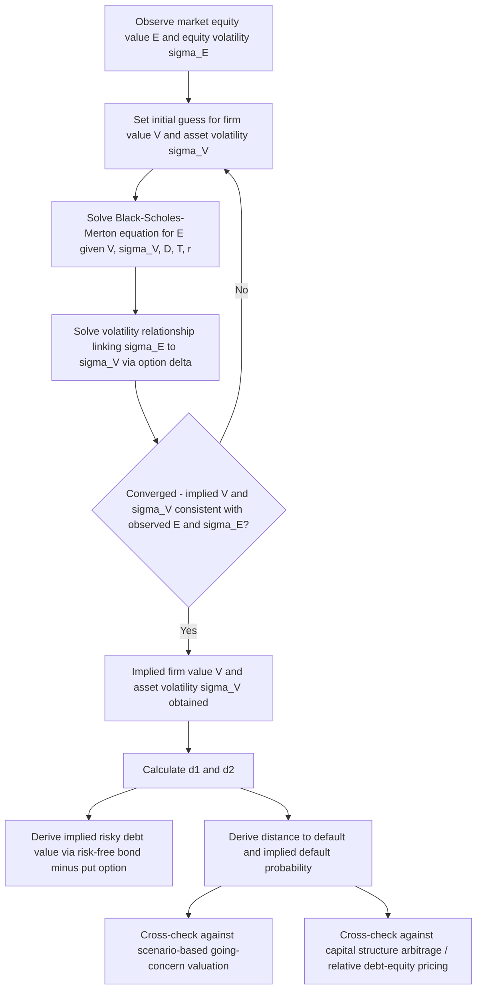

## Option-Based Models for Highly Levered Firms

### Overview

Option-based models for highly levered firms apply contingent claims analysis — the theoretical framework underlying option pricing — to value the debt and equity claims of companies with substantial leverage, particularly where standard discounted cash flow and comparable company approaches produce unreliable results because of the extreme, non-linear payoff structures that high leverage creates. This framework, rooted in the seminal work of Black-Scholes (1973) and Merton (1974), treats corporate securities not as static claims valued by simple proportional allocation, but as options whose value depends on the underlying enterprise value, its volatility, and the specific payoff structure created by the capital structure.

This topic builds directly on the option-based framework introduced in the companion Going-Concern Uncertainty topic, extending it into a more complete treatment of the Merton model's mechanics, its extensions, and its practical application and limitations for valuing debt and equity in highly levered capital structures — not limited only to companies facing imminent distress, but any firm with sufficient leverage that the option-like character of its securities becomes analytically significant.

### The Merton Model: Core Framework

**Key Points**

The Merton (1974) structural credit risk model treats a levered firm's equity as a **European call option on the firm's total enterprise value**, with the face value of debt (assumed to mature at a single date $T$) serving as the strike price. The core insight is that limited liability gives equity holders an asymmetric payoff: if enterprise value at debt maturity exceeds the debt's face value, equity holders receive the residual (enterprise value minus debt); if enterprise value falls below the face value of debt, equity holders receive nothing (they are not obligated to make up the shortfall), and the firm is treated as defaulting, with bondholders receiving the firm's assets.

$$E_T = \max(V_T - D, 0)$$

where $E_T$ is equity value at maturity $T$, $V_T$ is firm (enterprise) value at time $T$, and $D$ is the face value of debt.

Correspondingly, debt can be decomposed as a **risk-free bond minus a put option** written by bondholders (in effect, bondholders have implicitly sold equity holders a put option on the firm's assets, since limited liability allows equity holders to "put" the firm's assets to bondholders in exchange for walking away from the debt obligation when asset value falls below the debt claim):

$$\text{Risky Debt} = D \cdot e^{-rT} - P(V, D, T, \sigma_V, r)$$

where $P$ is the value of a put option on firm value $V$ with strike $D$.

### Black-Scholes-Merton Application to Corporate Securities

Applying the Black-Scholes option pricing formula, equity value is:

$$E = V \cdot N(d_1) - D \cdot e^{-rT} \cdot N(d_2)$$

$$d_1 = \frac{\ln(V/D) + (r + \sigma_V^2/2)T}{\sigma_V\sqrt{T}}, \quad d_2 = d_1 - \sigma_V\sqrt{T}$$

where:

- $V$ = current firm (enterprise) value
- $D$ = face value of debt (strike price)
- $T$ = time to debt maturity
- $\sigma_V$ = volatility of firm (asset) value
- $r$ = risk-free rate
- $N(\cdot)$ = cumulative standard normal distribution function

**Key Points**

Critically, $\sigma_V$ (asset volatility) is **not directly observable** — what is observable is $\sigma_E$ (equity volatility, from historical stock returns or implied volatility from traded equity options). Because equity is a levered claim on firm value, equity volatility is systematically higher than asset volatility, and the two are related through the option's delta:

$$\sigma_E = \frac and{V}{E} \times N(d_1) \times \sigma_V$$

(more precisely expressed as $\sigma_E \times E = N(d_1) \times \sigma_V \times V$)

This creates a **simultaneous equation system**: $V$ and $\sigma_V$ are both unknown, but $E$ (observable market equity value) and $\sigma_E$ (observable/estimable equity volatility) are known. Solving requires iterative numerical methods (commonly implemented as an iterative solver in practice, sometimes called the "KMV approach" after the commercial implementation originally developed by KMV Corporation, later acquired by Moody's):

1. Start with an initial guess for $V$ and $\sigma_V$ (e.g., $V_0 = E + D$ as a starting approximation, $\sigma_{V,0} = \sigma_E \times E/(E+D)$)
2. Solve the Black-Scholes equation for $E$ given the current guess of $V$ and $\sigma_V$, and separately solve for the volatility relationship
3. Iterate until convergence (the implied $V$ and $\sigma_V$ are consistent with both the observed equity value and observed/estimated equity volatility simultaneously)

**Worked Example (Simplified, Illustrative)**

A company has:

- Market equity value $E = \$300$mm
- Equity volatility $\sigma_E = 45\%$ (annualized, from historical or implied option volatility)
- Face value of debt $D = \$500$mm, maturing in $T = 3$ years
- Risk-free rate $r = 4\%$

After iterative solution (illustrative converged output, not hand-calculable in closed form due to the simultaneous system):

- Implied firm value $V \approx \$720$mm
- Implied asset volatility $\sigma_V \approx 22\%$

Using these implied values in the Black-Scholes-Merton framework:

$$d_1 = \frac{\ln(720/500) + (0.04 + 0.22^2/2)(3)}{0.22\sqrt{3}} = \frac{0.3646 + 0.1926}{0.3811} \approx 1.462$$

$$d_2 = 1.462 - 0.3811 \approx 1.081$$

Using standard normal CDF values ($N(1.462) \approx 0.928$, $N(1.081) \approx 0.860$):

$$E = 720 \times 0.928 - 500 \times e^{-0.04 \times 3} \times 0.860 = 668.2 - 500 \times 0.8869 \times 0.860 \approx 668.2 - 381.4 = \$286.8\text{mm}$$

This converges closely (within rounding/illustrative precision) to the observed $300mm equity value, consistent with the iterative solution having converged. The implied **distance to default** and **default probability** can then be derived from $d_2$ (specifically, $N(-d_2)$ is the risk-neutral probability of default under the model's assumptions):

$$P(\text{default}) = N(-d_2) = N(-1.081) \approx 14.0\%$$

### Distance to Default and Its Interpretation

**Key Points**

**Distance to default (DD)**, closely related to $d_2$ in the model, measures how many standard deviations of asset value movement separate the current firm value from the default point (debt face value):

$$DD = \frac{\ln(V/D) + (\mu - \sigma_V^2/2)T}{\sigma_V\sqrt{T}}$$

(note: the *real-world* distance-to-default calculation, as used in practical credit risk applications such as the KMV framework, typically uses the firm's actual expected asset return $\mu$ rather than the risk-free rate $r$ used in the risk-neutral option pricing formula for $d_1$/$d_2$ above — this is an important distinction between the risk-neutral valuation formula and the real-world default probability estimation framework, which are related but not identical)

A lower DD indicates a firm closer to default (fewer standard deviations of adverse asset value movement needed to breach the debt claim), while a higher DD indicates a more comfortable equity cushion. Commercial credit risk models (such as Moody's KMV Expected Default Frequency, EDF) map empirically observed historical default rates to ranges of calculated distance-to-default, rather than relying purely on the theoretical normal-distribution-implied default probability, since actual historical default rates have been found to deviate from the pure theoretical model's predictions in practice — extreme tail defaults occur more frequently than a normal-distribution-based model alone would predict. [Unverified: the specific empirical mapping tables and calibration methodologies used by commercial vendors are proprietary and have been refined and updated over time; general practitioners without access to a specific commercial model should treat the raw Merton-model theoretical default probability as a useful relative/directional indicator rather than a precisely calibrated absolute default probability.]

### Key Model Limitations and Assumptions

**Key Points**

The basic Merton model rests on several simplifying assumptions that limit its direct applicability to many real-world capital structures, giving rise to numerous model extensions:

- **Single debt maturity, zero-coupon assumption**: the basic model assumes a single tranche of debt maturing at one date $T$, with default only possible at that maturity date — real firms typically have multiple debt tranches with staggered maturities, coupon payments prior to maturity (creating the possibility of default at any coupon date, not just final maturity), and revolving credit facilities with different terms
- **No ongoing cash flow leakage assumption in the basic model**: dividends, coupon payments, and other value leakage from the firm prior to $T$ are not accounted for in the simplest version of the model, though extensions exist to incorporate continuous or discrete payouts (analogous to dividend-adjusted option pricing models)
- **Constant asset volatility assumption**: the model assumes $\sigma_V$ is constant over the option's life, when in reality asset volatility can change, particularly as a firm approaches distress (volatility often increases as distress risk rises, a phenomenon sometimes called the "leverage effect" in volatility modeling)
- **Assumes firm value follows a continuous geometric Brownian motion process**, ruling out sudden jumps in firm value — a limitation addressed by jump-diffusion extensions of the model, which can better capture sudden credit events (fraud discovery, regulatory action, sudden loss of a major contract) that cause abrupt firm value declines not well-captured by a continuous diffusion process
- **No explicit treatment of strategic default or renegotiation**: the basic model assumes default occurs mechanically whenever $V_T < D$, but in practice, firms and creditors frequently renegotiate obligations prior to a formal payment default, particularly where an out-of-court restructuring or covenant waiver is mutually preferable to a formal default event — this strategic dimension is addressed by more complex extensions (e.g., models incorporating negotiation/bargaining frameworks between debt and equity holders)

### Notable Model Extensions

**Key Points**

Several extensions to the basic Merton framework address its key limitations:

**Black-Cox (1976) First-Passage Model**: allows for default to occur at *any* time before maturity if firm value falls below a specified barrier (not only at the final maturity date), better reflecting the reality that covenant breaches and liquidity events can trigger default prior to a bond's stated maturity.

**Longstaff-Schwartz (1995) and Related Stochastic Interest Rate Extensions**: incorporate stochastic (rather than constant) interest rates into the framework, recognizing that both firm value and the risk-free rate are uncertain and potentially correlated.

**Leland (1994) and Leland-Toft (1996) Models**: incorporate endogenous default decisions (where the firm/equity holders choose the optimal default boundary rather than having it mechanically imposed by a fixed debt covenant) and optimal capital structure implications, connecting the option-pricing framework to broader capital structure theory (trade-off theory of optimal leverage, balancing tax shield benefits against distress costs).

**Jump-Diffusion Extensions**: incorporate the possibility of discontinuous jumps in firm value (in addition to continuous Brownian motion), better capturing sudden credit events and producing credit spread term structures that more closely match empirically observed patterns (the basic Merton model has been widely noted in the academic literature to under-predict short-term credit spreads relative to what is empirically observed in corporate bond markets, a limitation that jump-diffusion and other extensions partially address).

### Practical Applications Beyond Direct Security Valuation

**Key Points**

Option-based structural models have several practical valuation and risk applications beyond direct security pricing:

- **Cross-checking bottom-up scenario-based distressed valuations** (as referenced in the companion Going-Concern Uncertainty topic): the option-based framework provides an independent, theoretically grounded check on whether a scenario-weighted valuation's implied equity value is broadly consistent with what the firm's leverage and volatility profile would suggest
- **Capital structure arbitrage** (as referenced in the companion Restructuring topic): identifying relative mispricing between debt and equity claims of the same issuer by checking whether their relative pricing is consistent with a single coherent implied firm value and volatility
- **Credit risk assessment and default probability estimation**: forms the theoretical basis for commercial structural credit risk models used by lenders and credit analysts
- **Understanding value transfer dynamics between debt and equity holders**: the option framework clarifies why equity holders in a highly levered firm may have incentives to pursue higher-risk (higher asset volatility) strategies than a firm's creditors would prefer — since equity, as a call option, benefits from increased volatility (higher option value from increased volatility), while debt, having sold the equivalent of a put option, is harmed by increased volatility, all else equal. This is a specific instance of the broader "asset substitution" or "risk-shifting" agency conflict recognized in corporate finance theory.

### Practical Limitations for Direct Valuation Use

**Key Points**

Despite its theoretical elegance, several practical considerations limit the basic Merton framework's use as a sole, standalone valuation methodology in most transaction or fairness opinion contexts:

- Real capital structures with multiple debt tranches, staggered maturities, and covenant packages require either significant model simplification (collapsing to a single "effective" maturity and face value) or considerably more complex multi-class extensions, both of which introduce their own estimation challenges
- The iterative solution for implied firm value and asset volatility is sensitive to the quality of the equity volatility input, which itself is subject to estimation choices (historical lookback window, implied option volatility if traded options exist, GARCH or other volatility model specification)
- The model's output (an implied equity or debt value, or default probability) is best used as a **cross-check and analytical framework for understanding value dynamics**, rather than as a replacement for a bottom-up, business-plan-driven DCF or scenario analysis in most practical distressed valuation engagements

### Option-Based Structural Model Flow (svg_diagram)

**Related Topics**

- Valuing Companies with Going-Concern Uncertainty
- Valuation Implications of Financial Distress and Restructuring
- KMV Expected Default Frequency and Commercial Structural Credit Models
- Asset Substitution and Risk-Shifting Agency Conflicts Between Debt and Equity Holders
- Credit Spread Term Structure Modeling and Jump-Diffusion Extensions
- Leland Model and Endogenous Optimal Capital Structure Theory
- Capital Structure Arbitrage Trading Strategies