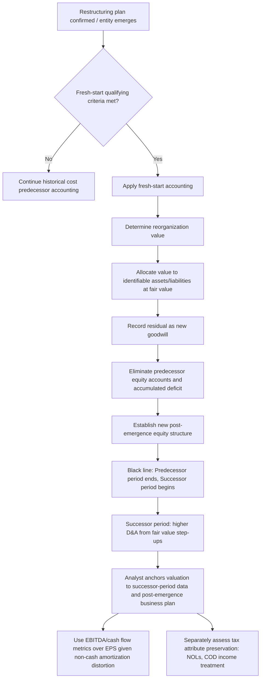

## Fresh-Start Accounting and Post-Restructuring Valuation

### Overview

Fresh-start accounting and post-restructuring valuation examines the specific accounting framework applied when an entity emerges from a formal restructuring proceeding, and the valuation methodology implications that flow from it. This topic extends the fresh-start accounting concept introduced in the companion Valuation Implications of Financial Distress and Restructuring topic into a fuller technical treatment: the qualifying criteria, the mechanical process of applying fresh-start reporting, its parallels to acquisition accounting, and the specific challenges it creates for analysts valuing or projecting a recently-emerged entity.

The foundational purpose of fresh-start accounting is to allow a reorganized entity's financial statements to reflect its post-emergence economic reality — a generally de-levered capital structure, a business plan that may differ materially from the pre-emergence entity, and asset values remeasured to reflect the reorganization value determined through the restructuring process — rather than continuing to carry forward historical cost-basis accounting that may bear little relationship to the entity's actual post-emergence financial position.

### Qualifying Criteria for Fresh-Start Accounting

**Key Points**

Under applicable accounting frameworks (in the US, governed by ASC 852-10, "Reorganizations," which codified guidance originally issued under AICPA Statement of Position 90-7), an entity emerging from a court-supervised reorganization proceeding generally qualifies for and is required to apply fresh-start reporting when both of the following conditions are met:

1. **The reorganization value of the emerging entity's assets immediately before the date of confirmation is less than the total of all post-petition liabilities and allowed claims** — in other words, the going-concern value of the reorganized business is insufficient to cover what is owed, meaning creditors are not being paid in full and a genuine restructuring of claims (rather than a simple full repayment) has occurred
2. **Holders of existing voting shares immediately before confirmation receive less than 50% of the voting shares of the emerging entity** — reflecting that a substantial change of control/ownership has occurred as part of the restructuring, typically because creditors have converted debt claims into a majority equity stake in the reorganized entity

[Unverified: the precise codified thresholds, qualifying conditions, and their interaction with specific plan structures are technical accounting determinations governed by the applicable standard in force at the relevant reporting date and jurisdiction; given that accounting standards are subject to amendment and interpretation guidance evolves, the specific current-year criteria should be confirmed against the applicable standard rather than treated as a fixed, permanently stable technical rule, and the ultimate qualification determination is properly an accounting/audit judgment rather than a valuation methodology question per se.]

When these criteria are not met (e.g., a restructuring where existing equity retains majority ownership, or where reorganization value is sufficient to cover allowed claims in full), the entity generally continues historical cost-basis "predecessor" accounting rather than applying fresh-start reporting.

### Mechanics of Fresh-Start Reporting

**Key Points**

Fresh-start accounting mechanically resembles acquisition (purchase price allocation) accounting, conceptually treating the reorganization as if a new reporting entity acquired the assets and assumed the liabilities of the predecessor entity at fair value:

1. **Determine reorganization value**: as established through the restructuring process (per the companion Restructuring topic), typically via DCF, comparable company, and precedent transaction methodologies applied to the post-emergence business plan
2. **Allocate reorganization value to identifiable assets and liabilities at fair value**: tangible assets (PP&E, inventory), identifiable intangible assets (customer relationships, trademarks, technology, favorable contracts), and assumed liabilities are remeasured to fair value as of the fresh-start reporting date, analogous to a purchase price allocation (PPA) in M&A accounting
3. **Record any residual as goodwill**: to the extent reorganization value exceeds the fair value of identifiable net assets, the excess is recorded as goodwill, subject to subsequent impairment testing under normal accounting rules (goodwill impairment testing under the applicable framework, e.g., ASC 350 in the US)
4. **Eliminate predecessor equity accounts**: accumulated deficit, additional paid-in capital, and other pre-emergence equity components of the predecessor entity are eliminated
5. **Establish new equity structure**: new equity interests are recorded reflecting the post-emergence ownership structure and capital raised/converted through the plan of reorganization
6. **Record new debt at fair value**: any new or modified debt instruments issued or surviving under the plan are recorded at fair value (which may differ from face/stated value, particularly if the instrument carries a below-market or above-market stated interest rate relative to the market rate for similar risk at issuance)

**Illustrative Fresh-Start Balance Sheet Reset**

| Line Item | Predecessor (Pre-Fresh-Start) | Fresh-Start Adjustments | Successor (Post-Fresh-Start) |
| --- | --- | --- | --- |
| PP&E (net) | $180mm (historical cost basis) | +$40mm (fair value step-up) | $220mm |
| Identifiable intangibles | $0 (internally developed, not capitalized) | +$65mm (newly recognized at fair value) | $65mm |
| Goodwill | $95mm (legacy, pre-existing) | -$95mm (eliminated) then +$50mm (new residual) | $50mm |
| Total debt | $500mm (face value, pre-restructuring) | -$300mm (debt discharge/conversion to equity) | $200mm (new/surviving debt at fair value) |
| Accumulated deficit | ($220mm) | +$220mm (eliminated) | $0 |
| Common equity | $15mm | Reset per new ownership structure | $180mm (new equity, reflecting creditor equitization) |

This illustrates the fundamental "reset" character of fresh-start reporting: the successor entity's balance sheet reflects fair value as of the fresh-start date and a new capital structure, with no continuation of the predecessor's historical accumulated deficit or (generally) its pre-existing goodwill balance.

### Predecessor versus Successor Reporting Periods

**Key Points**

Financial statements spanning the emergence date are typically presented with a **"black line"** dividing predecessor and successor periods — distinct reporting periods before and after the fresh-start reporting date, presented separately rather than as a single continuous period, precisely because the fresh-start remeasurement creates a fundamental discontinuity in the basis of accounting.

**Valuation and analytical implications of the predecessor/successor split:**

- **Historical trend analysis across the black line is generally not meaningful on a like-for-like basis**: revenue, margin, and balance sheet trends spanning the emergence date reflect a fundamentally different asset basis, capital structure, and (frequently) an operationally different business (given restructuring-related divestitures, contract renegotiations, and cost restructuring commonly implemented as part of the reorganization)
- **Depreciation and amortization expense post-emergence reflects the new, remeasured (typically higher, given fair value step-ups) asset basis**, which can materially change reported margins versus the predecessor period even absent any change in underlying cash generation — an analyst comparing successor-period reported earnings/margins against predecessor-period figures without adjusting for this basis change risks drawing incorrect conclusions about operational improvement or deterioration
- **Comparable company selection for the successor entity should generally be based on the post-emergence business profile**, which may differ meaningfully from the pre-emergence entity's profile if the restructuring included material divestitures, footprint changes, or strategic repositioning

### Valuation Implications for Analysts Covering Post-Emergence Companies

**Key Points**

Several specific practices are relevant when performing valuation work on a company that has recently undergone fresh-start reporting:

**Anchor primarily to post-emergence (successor) financial data and business plan.** Given the discontinuity described above, projections, trading comparable analysis, and historical margin/growth trend assessment should generally be built from the successor period onward, treating pre-emergence (predecessor) data as background context rather than a directly comparable base period for trend extrapolation.

**Understand that reported book value post-fresh-start reflects the reorganization value determination, not necessarily current market value.** Since fresh-start asset values are set based on the reorganization value determined at the time of emergence, and markets, business performance, and multiples can move meaningfully after emergence, successor-period book value should not be assumed to remain equal to current market/fair value merely because it was fair-value-based at the fresh-start date — it becomes a historical cost basis again from that point forward, subject to normal depreciation/amortization and only re-tested for fair value upon subsequent impairment triggers, not continuously remarked to market.

**Watch for elevated non-cash amortization expense from newly recognized intangibles**, which is a direct, mechanical consequence of fresh-start's fair-value-based intangible asset recognition (many of which — customer relationships, favorable contracts, certain technology — would not have been separately recognized/capitalized under the predecessor's historical cost accounting, since internally developed intangibles are frequently expensed as incurred under general accounting principles rather than capitalized, unlike intangibles recognized through fair-value remeasurement events like fresh-start or acquisition accounting). This can depress reported successor-period net income and EPS in ways that do not reflect any change in underlying cash flow generation, making EBITDA or cash-flow-based metrics generally more useful than net-income-based metrics for near-term post-emergence performance assessment.

**Recognize that the "goodwill" on a successor balance sheet is a plug, not an independently verified fair value**, in the specific sense that it represents whatever residual reorganization value was not allocated to identifiable assets — the reorganization value itself is the primary valuation judgment, and goodwill mechanically absorbs the residual, meaning scrutiny should focus on the reasonableness of the underlying reorganization value determination and the identifiable asset fair values, not treat the resulting goodwill figure as an independently meaningful data point.

### Interaction with Tax Attributes

**Key Points**

Restructuring transactions frequently have significant implications for a company's tax attributes (net operating loss carryforwards, tax basis in assets), which are governed by specific tax law provisions distinct from the financial reporting fresh-start framework described above:

- Cancellation of indebtedness (COD) income arising from debt discharge in a restructuring is, in many tax jurisdictions, subject to specific exclusion or deferral provisions for entities in bankruptcy or insolvency (e.g., in the US, Internal Revenue Code Section 108 provisions addressing COD income exclusion for debtors in bankruptcy, generally coupled with a corresponding reduction of certain tax attributes such as NOL carryforwards)
- Ownership change rules can limit the post-emergence usability of pre-existing net operating loss carryforwards (in the US, Internal Revenue Code Section 382 limitations on NOL utilization following a greater-than-specified-threshold ownership change, with certain bankruptcy-specific exceptions or modified rules potentially available)
- These tax attribute considerations are financially significant to post-emergence valuation (since preserved NOLs can provide meaningful future tax shield value) but are governed by tax law provisions entirely separate from the financial-accounting fresh-start framework, and require qualified tax advice specific to the transaction structure and applicable jurisdiction rather than general valuation methodology guidance

[Inference: because both the accounting fresh-start qualification criteria and the tax attribute preservation/limitation rules are technical, frequently-amended areas of specialized professional practice, any valuation model that assumes a specific NOL carryforward value or fresh-start accounting outcome should flag this as an assumption requiring confirmation from qualified accounting and tax advisors on the specific transaction, rather than a general valuation-methodology input to be estimated independently.]

### Common Pitfalls

- **Using historical (predecessor) financial trends to project the successor entity** without recognizing the fundamental basis discontinuity created by fresh-start remeasurement and frequently-accompanying operational changes
- **Comparing predecessor-period and successor-period margins directly** without adjusting for the mechanical impact of higher post-fresh-start depreciation and amortization from asset fair-value step-ups
- **Treating successor-period goodwill as an independently meaningful or verified fair value figure**, rather than recognizing it as the residual plug from the reorganization value allocation
- **Assuming post-fresh-start book value continues to equal fair/market value** indefinitely after the emergence date, rather than recognizing it reverts to historical cost basis (subject to normal depreciation and impairment testing) from that point forward
- **Overlooking the interaction between fresh-start accounting and separate tax attribute rules**, which govern NOL preservation/limitation and COD income treatment under entirely distinct legal provisions from the financial accounting framework
- **Applying standard EPS-based valuation multiples to a recently-emerged successor entity without adjusting for the elevated, largely non-cash amortization burden** from newly recognized intangible assets, which can materially distort reported earnings relative to underlying cash generation
- **Failing to confirm current fresh-start qualification criteria and thresholds against the applicable accounting standard**, given that these are technical, potentially-amended accounting rules rather than fixed, universally stable figures

### Fresh-Start Accounting and Valuation Flow (svg_diagram)

**Related Topics**

- Valuation Implications of Financial Distress and Restructuring
- Option-Based Models for Highly Levered Firms
- Purchase Price Allocation Mechanics in M&A Accounting
- Net Operating Loss Carryforward Valuation and Ownership Change Limitations
- Goodwill Impairment Testing Methodology
- Reorganization Value Determination and Contested Valuation Disputes
- Cancellation of Indebtedness Income and Tax Attribute Reduction Rules