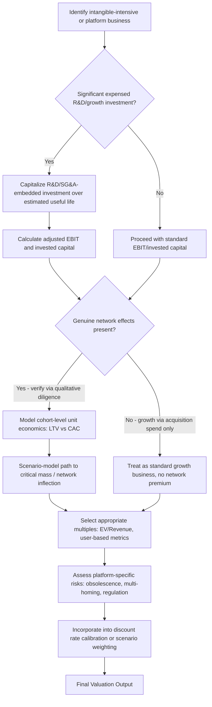

## Valuing Intangible-Asset-Intensive and Platform Businesses

### Overview

Valuing intangible-asset-intensive and platform businesses addresses the methodological adaptations required when standard DCF and comparable company frameworks — originally developed with capital-intensive, tangible-asset-heavy industrial businesses in mind — are applied to businesses whose value derives primarily from intangible assets (brands, intellectual property, software, data, algorithms) and/or from network-effect-driven platform dynamics (multi-sided marketplaces, social networks, operating systems). These business models exhibit fundamentally different unit economics, capital expenditure patterns, accounting treatment mismatches, and growth/risk profiles than traditional asset-heavy businesses, requiring specific adjustments across nearly every stage of the valuation process.

### Why Standard Frameworks Require Adaptation

**Key Points**

Several structural characteristics of intangible-intensive and platform businesses create specific tension with standard valuation conventions:

- **Accounting treatment mismatch for intangible investment**: under most accounting frameworks, expenditures on internally developed intangibles (R&D, software development in many cases, brand-building marketing, content creation) are expensed as incurred rather than capitalized and amortized like tangible capital expenditure — even though economically, these expenditures often function as investments in future revenue-generating capacity, analogous to capex. This creates a systematic distortion in reported profitability and asset base for intangible-intensive businesses relative to what a purely capex-based comparable would show
- **Network effects create non-linear, threshold-dependent value creation**: platform businesses with genuine network effects (where the marginal user's value increases with the total number of users, or with users on the "other side" of a multi-sided platform) exhibit value creation dynamics that are difficult to capture in a smooth, continuous revenue growth projection — value can be minimal below a critical mass threshold and can then scale disproportionately once that threshold is achieved (or conversely, can collapse if network effects reverse, sometimes referred to as "the tipping point" phenomenon in platform economics)
- **Winner-take-most/take-all market structures**: many platform markets, once network effects mature, tend toward concentrated market structures where a small number of players (often one) capture the substantial majority of value in the category, meaning market share trajectory projections carry outsized valuation significance relative to more fragmented traditional industries
- **Negative near-term cash flow with large deferred monetization potential**: many platform businesses deliberately prioritize user/usage growth over near-term profitability in earlier stages, funding this via external capital, on the thesis that monetization intensity can be increased later once network effects and switching costs are established — this creates a business profile where near-term financials are a poor proxy for the underlying asset being built

### Capitalization and Adjustment of R&D and SG&A-Embedded Investment

**Key Points**

A widely used adjustment (associated in particular with Aswath Damodaran's work on valuing R&D-intensive and intangible-heavy businesses) involves reclassifying a portion of expensed R&D and, in some cases, brand-building marketing/SG&A as capitalized investment, to better reflect the underlying economics and produce a more comparable operating margin and invested capital base:

1. **Estimate the useful life of the intangible asset being created** (e.g., 3-7 years for software R&D, potentially longer for pharmaceutical R&D or brand-building, shorter for rapidly-obsoleting technology R&D) — this is a judgment-intensive estimate specific to the industry and asset type
2. **Capitalize historical R&D (or relevant SG&A) expenditure** over the estimated useful life using straight-line or another appropriate amortization convention, creating an "R&D asset" (or equivalent) on an adjusted balance sheet
3. **Add back current-period R&D expense to EBIT**, then subtract the calculated amortization of the capitalized R&D asset, to arrive at an adjusted EBIT that better reflects ongoing operating profitability net of the "true" ongoing investment run-rate rather than being suppressed by 100% expensing of growth-oriented investment

$$\text{Adjusted EBIT} = \text{Reported EBIT} + \text{Current R\&D Expense} - \text{Amortization of Capitalized R\&D Asset}$$

**Worked Example**

A software company reports:

- Reported EBIT: $50mm
- Current year R&D expense: $120mm
- Estimated useful life of R&D-created assets: 5 years
- Historical R&D expenditure (assumed straight-line amortization for illustration): Year -4: $70mm, Year -3: $85mm, Year -2: $95mm, Year -1: $105mm, Current Year: $120mm

Annual amortization of the capitalized R&D asset (each year's R&D spend amortized over 5 years, summed across all vintages still being amortized):

$$\text{Amortization} = \frac{70}{5} + \frac{85}{5} + \frac{95}{5} + \frac{105}{5} + \frac{120}{5} = 14 + 17 + 19 + 21 + 24 = \$95\text{mm}$$

$$\text{Adjusted EBIT} = 50 + 120 - 95 = \$75\text{mm}$$

This adjusted EBIT of $75mm — materially higher than the $50mm reported figure — better reflects the view that a substantial portion of current R&D expense represents investment in future-period revenue capacity rather than current-period operating cost, and correspondingly, the capitalized R&D asset balance should be added to invested capital for return-on-invested-capital (ROIC) calculations, producing a more economically meaningful (typically lower, since the denominator increases) ROIC figure than one calculated using unadjusted reported figures with 100% R&D expensing.

**Key Points on this adjustment's use and limitations:**

- This is an analytical adjustment for valuation purposes, not a change to the company's actual reported (GAAP/IFRS) financial statements, and should be clearly disclosed as such
- The useful life assumption is a significant judgment call with material impact on the adjustment's magnitude, and reasonable analysts can differ substantially depending on the specific technology/industry context
- This adjustment is most informative and most commonly applied for comparing profitability and returns across companies with different R&D intensity or different accounting-driven capitalization policies (some jurisdictions/standards permit or require capitalization of certain software development costs once technological feasibility is established, creating inconsistency even within GAAP/IFRS across companies), rather than as a required or universally standard input to every DCF

### Valuing Network Effects and Platform Dynamics

**Key Points**

Several specific analytical considerations apply when valuing genuine network-effect-driven platform businesses:

**Assess whether network effects are genuine and durable, not merely a growth narrative.** Not every fast-growing digital business has true network effects in the economic sense (where marginal user value increases with network size) — many are simply growing through customer acquisition spend without genuine defensibility from network dynamics. Distinguishing genuine network effects (direct: more users directly increase value for other users, as in a social network or telephone system; indirect/cross-side: more users on one side of a marketplace increase value for the other side, as in a ride-sharing or e-commerce marketplace platform) from simple scale economies or brand recognition is an important qualitative diligence step before applying platform-specific valuation premiums.

**Model cohort-level unit economics rather than relying solely on aggregate metrics.** Given that platform businesses often show weak or negative aggregate profitability during a growth-investment phase, cohort analysis — tracking the revenue, retention, and contribution margin trajectory of specific user/customer cohorts over their lifetime relationship with the platform — provides more insight into whether the underlying unit economics are attractive (even if currently masked by aggregate growth investment) than aggregate current-period financials alone.

$$\text{LTV} = \sum_{t=1}^{n} \frac{\text{ARPU}_t \times \text{Retention Rate}_t \times \text{Contribution Margin}_t}{(1+r)^t}$$

Comparing Customer Lifetime Value (LTV) against Customer Acquisition Cost (CAC) — with a commonly cited (though context-dependent and not universally applicable) rule-of-thumb threshold of LTV:CAC ratio above approximately 3:1 as indicative of a healthy unit economics profile — provides a framework for assessing whether current growth investment is value-accretive, even when it depresses near-term reported profitability. [Unverified: the specific 3:1 threshold is a commonly cited industry heuristic rather than a rigorously derived universal standard, and appropriate thresholds vary meaningfully by industry, growth stage, capital cost environment, and payback period expectations.]

**Explicitly model the path to critical mass and potential for value inflection**, where network effects are expected to be a significant value driver — rather than assuming smooth, continuous revenue growth throughout the projection period, scenario analysis around achieving (or failing to achieve) critical mass/market leadership can better capture the genuinely threshold-dependent, non-linear value creation dynamics that characterize true network-effect businesses. This connects methodologically to the scenario-weighting approaches discussed in the companion Going-Concern Uncertainty topic, though applied here to an upside-oriented rather than downside/distress-oriented context.

### Valuing Data and Algorithmic Assets

**Key Points**

For businesses where proprietary data assets or algorithmic/AI capabilities constitute a significant portion of competitive advantage and value, several specific considerations apply:

- **Data value is highly context- and use-case-specific**, and does not have a standardized, universally accepted valuation methodology analogous to DCF for cash-flow-generating assets — value depends on the data's uniqueness, its demonstrated or plausible connection to revenue-generating or cost-reducing applications, and the durability of any exclusivity or first-mover advantage in accumulating it
- **Algorithmic/AI model value is similarly difficult to value as a standalone asset** separate from the broader business and data infrastructure that trains, deploys, and continuously improves it — value is often better captured through the broader business's revenue and margin trajectory (which the algorithmic capability is presumed to drive) rather than attempting a standalone technology asset valuation
- **Regulatory and competitive risk specific to data assets** (data privacy regulation limiting collection/usage/monetization, potential future restrictions on specific data practices, competitive replication of data advantages as competitors accumulate their own datasets over time) should be explicitly considered in risk assessment and discount rate or scenario analysis, given the relatively fast-evolving regulatory and competitive landscape around data-driven business models

### Multiples and Comparable Company Considerations

**Key Points**

Standard trading multiples require specific adaptation for intangible-intensive and platform businesses:

- **EV/Revenue multiples are frequently used in place of, or alongside, EV/EBITDA** for early-stage or growth-stage platform businesses with limited or negative current profitability, since EV/EBITDA is not meaningful (or comparably distorted across peers with different growth-investment intensity) when current profitability is deliberately suppressed by growth investment
- **User-based or engagement-based metrics** (EV per monthly active user, EV per daily active user, revenue per user) are sometimes used as supplementary valuation cross-checks, particularly in earlier-stage platform businesses before revenue monetization is fully established, though these carry the limitation of not directly capturing eventual monetization intensity, which can vary enormously across otherwise similar user bases
- **Comparable company selection should account for differing accounting capitalization policies** (per the R&D capitalization adjustment discussion above) to ensure margin and multiple comparisons are made on a consistent basis across the comparable set, rather than penalizing companies that expense more of their growth investment relative to peers with different accounting treatment or business models that permit more capitalization

### Discount Rate and Risk Considerations

**Key Points**

Several risk factors specific to intangible-intensive and platform businesses warrant explicit consideration in discount rate calibration or scenario weighting:

- **Technological obsolescence risk**: intangible assets, particularly technology-based ones, can lose competitive relevance considerably faster than traditional physical assets depreciate, warranting consideration of whether standard long-run terminal growth and perpetuity assumptions adequately capture this elevated obsolescence/disruption risk
- **Platform migration and multi-homing risk**: users' and complementors' ability to use multiple competing platforms simultaneously ("multi-homing") rather than being genuinely locked into a single platform can undermine assumed network-effect defensibility, and the degree of switching cost/lock-in should be assessed critically rather than assumed
- **Regulatory risk specific to large platforms**: antitrust and platform-specific regulation (data portability requirements, interoperability mandates, restrictions on self-preferencing) represent an evolving and jurisdiction-specific risk factor for the largest platform businesses, which has been an active area of legislative and enforcement activity in multiple major jurisdictions and should be monitored for currency given how quickly this landscape can shift
- **Key person and talent concentration risk**: intangible-intensive businesses, particularly in technology and R&D-driven sectors, can carry elevated dependency on specific technical talent or founder-level expertise, which is a qualitatively different risk category than the diversified physical/financial capital base of traditional industrial businesses

### Common Pitfalls

- **Applying unadjusted GAAP/IFRS operating margins for cross-company comparison** without considering differing R&D/intangible investment capitalization policies, penalizing companies that expense more of their economically-investment-like spending
- **Treating rapid user or revenue growth as evidence of genuine network effects** without qualitative diligence into whether true network dynamics (versus simple paid customer acquisition) are actually driving the growth
- **Extrapolating smooth continuous growth curves through a genuinely threshold-dependent network effect dynamic**, missing the non-linear, inflection-point character that often characterizes true platform value creation
- **Relying solely on aggregate current-period financials** for businesses with materially different unit economics across customer cohorts or product lines, obscuring the underlying economic trajectory
- **Assigning standalone valuation to data or algorithmic assets without connecting the valuation to demonstrated or plausible revenue/margin impact**, risking speculative rather than grounded value attribution
- **Ignoring multi-homing and switching cost realities** when assuming durable network-effect-driven competitive moats, particularly relevant in markets where users can and do use multiple competing platforms with limited friction
- **Failing to monitor and incorporate evolving platform-specific regulatory risk**, given the actively evolving legislative and enforcement landscape affecting large platform businesses in multiple jurisdictions

### Intangible and Platform Valuation Adjustment Flow (svg_diagram)

**Related Topics**

- Valuing Companies with Going-Concern Uncertainty
- R&D Capitalization Adjustments and Return on Invested Capital Normalization
- Network Effects Taxonomy: Direct, Indirect, and Data Network Effects
- Customer Lifetime Value and Cohort-Based Valuation Modeling
- Multi-Sided Platform Pricing Strategy and Its Valuation Implications
- Antitrust and Platform Regulation Risk in Technology Valuation
- Valuing Early-Stage and Pre-Profitability Growth Companies