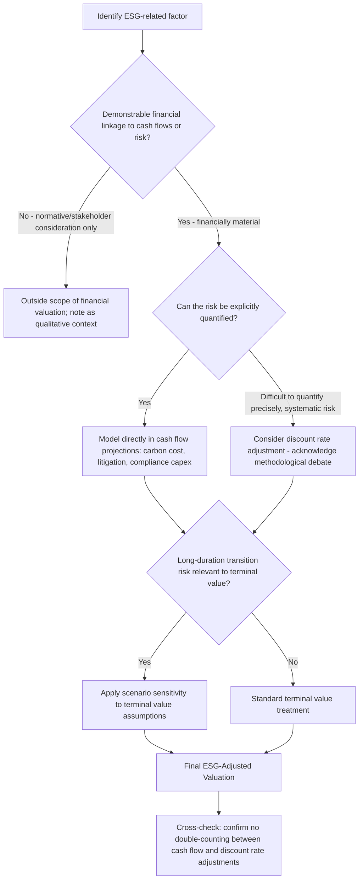

## ESG Factors and Sustainability-Linked Valuation Adjustments

### Overview

ESG factors and sustainability-linked valuation adjustments address how environmental, social, and governance considerations can be systematically incorporated into DCF and comparable company valuation frameworks, distinguishing between ESG factors that represent genuine, quantifiable financial risk or opportunity (and therefore warrant direct incorporation into cash flows, discount rates, or terminal value assumptions) and ESG considerations that are more properly understood as normative or stakeholder-value judgments outside the scope of financial valuation proper. This is an area of active methodological development and some professional disagreement, and this topic aims to lay out the analytical frameworks in current use while being explicit about where genuine consensus exists versus where practice remains unsettled.

### Distinguishing Financially Material ESG Factors from Broader Stakeholder Considerations

**Key Points**

A foundational analytical distinction, increasingly emphasized in professional valuation and investment practice, separates:

**Financially material ESG factors**: environmental, social, or governance characteristics that have a demonstrable or plausible causal connection to a company's future cash flows, cost of capital, or risk profile — for example, carbon-intensive operations facing plausible future carbon pricing or regulatory cost, governance weaknesses correlating with elevated fraud/mismanagement risk, or labor practices creating litigation or regulatory exposure. These factors are, in principle, no different analytically from any other risk factor a valuation analyst would incorporate — they simply happen to be categorized under the "ESG" label.

**Broader stakeholder or normative ESG considerations**: factors that may be important from a societal, ethical, or stakeholder-value perspective but do not have a clearly demonstrable connection to the specific company's financial cash flows or risk profile in a way that would be incorporated into a standard financial valuation exercise. Incorporating these into a company-specific financial valuation, absent a demonstrable financial linkage, moves the exercise from financial valuation into a different kind of assessment (values-based screening, impact assessment, or similar), which serves legitimate but distinct purposes from enterprise/equity valuation.

**Key Points**

This distinction matters methodologically because conflating the two can lead to either of two errors: (a) ignoring genuinely material ESG-related financial risks because they are unfamiliar or difficult to quantify, understating risk and overstating value, or (b) applying valuation adjustments for factors without a clear financial linkage, effectively substituting normative judgment for financial analysis in a way that reduces the rigor and comparability of the valuation output. [Inference: given that ESG-related regulatory, disclosure, and market practice frameworks have evolved rapidly and are subject to ongoing political and regulatory contestation in multiple major markets, an analyst should treat any specific framework, rating methodology, or regulatory requirement referenced in ESG-related valuation work as subject to verification against current sources rather than assumed stable.]

### Incorporating Material ESG Risk into Cash Flow Projections

**Key Points**

Where a specific ESG-related factor has a demonstrable or plausible causal connection to future cash flows, the standard, most defensible approach is direct incorporation into the cash flow projection itself, rather than a generic discount rate adjustment. Examples of direct cash flow incorporation:

- **Carbon pricing exposure**: for companies in carbon-intensive sectors operating in or exposed to jurisdictions with existing or plausible future carbon pricing mechanisms (cap-and-trade systems, carbon taxes), explicit modeling of projected carbon cost as an operating expense line item, potentially under multiple carbon price scenarios reflecting policy uncertainty
- **Stranded asset risk**: for fossil fuel reserve-based or carbon-intensive infrastructure assets, explicit scenario modeling of asset value under different energy transition pathways (e.g., scenarios consistent with different global temperature trajectory pathways as referenced in climate scenario frameworks such as those associated with the Network for Greening the Financial System, NGFS, or the International Energy Agency's various scenario pathways), assessing the probability-weighted risk that certain reserves or assets become uneconomic to develop or operate before the end of their previously assumed useful life
- **Regulatory compliance cost trajectories**: explicit modeling of anticipated capital expenditure or operating cost increases associated with plausible future environmental or social regulation (emissions control equipment, workplace safety requirements, data privacy compliance infrastructure)
- **Litigation and liability exposure**: for companies with identifiable exposure to ESG-related litigation risk (environmental contamination liability, product safety, labor practice litigation), explicit probability-weighted liability scenarios analogous to the contingent liability and scenario-weighting frameworks discussed in the companion Going-Concern Uncertainty topic

**Worked Example — Carbon Cost Scenario Modeling**

A carbon-intensive industrial company projects 500,000 tonnes CO2-equivalent annual emissions. Three carbon price scenarios are modeled reflecting policy uncertainty:

| Scenario | Probability | Carbon Price (Year 5, illustrative $/tonne) | Annual Carbon Cost Impact (Year 5) |
| --- | --- | --- | --- |
| Limited policy action | 30% | $15 | $7.5mm |
| Moderate policy tightening | 45% | $45 | $22.5mm |
| Aggressive decarbonization policy | 25% | $90 | $45.0mm |

Probability-weighted expected carbon cost impact in Year 5:

$$E[\text{Carbon Cost}] = (0.30 \times 7.5) + (0.45 \times 22.5) + (0.25 \times 45.0) = 2.25 + 10.125 + 11.25 = \$23.6\text{mm}$$

This probability-weighted expected cost can be incorporated directly into the projected operating cost base, providing a more analytically grounded treatment than either ignoring carbon pricing risk entirely or applying an undifferentiated discount rate premium that does not tie to a specific, quantifiable cost driver.

### Governance Factors and Their Financial Linkage

**Key Points**

Governance-related factors have, in general, the most established and empirically supported linkage to financial outcomes among the three ESG pillars, since governance weaknesses (board independence deficiencies, related-party transaction risk, weak internal controls, concentrated or unchecked management/controlling-shareholder power, executive compensation misalignment) have a more direct and better-documented connection to financial statement reliability, fraud risk, and capital allocation quality than many environmental or social factors have to near-term cash flows.

Practical incorporation approaches:

- **Adjusting cost of equity for governance risk premium**, sometimes done informally through analyst judgment or, in some institutional contexts, through governance scoring frameworks that feed into a company-specific risk premium adjustment — though the specific magnitude of any such adjustment is inherently judgment-based and should be applied with appropriate caution and transparency about its subjective character
- **Applying discounts for controlling shareholder/dual-class structures** where minority shareholder rights are limited, connecting to the broader holding company and minority discount concepts discussed in the companion Sum-of-the-Parts topic
- **Scrutinizing related-party transactions and capital allocation track record** as a qualitative input into confidence intervals around management's projected business plan, since governance weaknesses can manifest as value leakage to controlling parties or poor capital allocation decisions not necessarily visible in a mechanical projection of historical trends

### Discount Rate Adjustments for ESG Risk: Methodological Debate

**Key Points**

There is active and unresolved methodological debate regarding whether and how ESG factors should be incorporated into the discount rate (as opposed to cash flow projections), reflecting genuine disagreement among practitioners and academics rather than settled consensus:

**Arguments for discount rate incorporation:**

- Where a specific ESG risk is genuinely systematic (non-diversifiable) and difficult to quantify precisely enough for explicit cash flow modeling, a discount rate premium can serve as a reasonable practical proxy, analogous to how a general country risk premium captures a bundle of related but individually hard-to-quantify sovereign risks (per the companion Country and Sovereign Risk Premiums topic)
- Some empirical research has examined whether ESG characteristics are associated with differences in observed cost of equity or cost of debt in capital markets (e.g., studies examining whether higher-ESG-rated companies exhibit lower borrowing costs or equity risk premia) — however, this empirical literature shows mixed and evolving findings across different studies, time periods, and ESG measurement methodologies, and does not currently represent a single, settled, quantitatively precise adjustment factor that can be mechanically applied

**Arguments against generic discount rate incorporation:**

- A generic "ESG discount rate adjustment" not tied to a specific, identifiable, and quantifiable risk factor risks becoming an unexplained plug that reduces valuation transparency and rigor, rather than genuinely capturing analytically identifiable risk
- Where the underlying risk (carbon pricing, regulatory cost, litigation exposure) can be explicitly modeled in cash flows, doing so is generally more transparent, more scenario-testable, and less prone to double-counting than folding the same risk into an opaque discount rate premium — a principle directly analogous to the general preference, discussed in the companion Going-Concern Uncertainty topic, for explicit scenario/cash-flow treatment of identifiable discrete risks over generic discount rate premiums where quantification is feasible
- ESG ratings and scores from different commercial ESG rating providers have been documented in academic research to show notably low correlation with one another across providers, reflecting differing methodologies, weightings, and underlying data — this divergence undermines the reliability of using any single third-party ESG rating as a precise, mechanically-applied input into a discount rate adjustment without independent scrutiny of what that specific rating is actually measuring and how

[Unverified: given the genuinely unsettled and actively evolving state of both the academic literature and market/regulatory practice in this area — including meaningful jurisdictional divergence in ESG disclosure regulation and, in some markets, active political contestation over the appropriate role of ESG considerations in fiduciary investment and valuation practice — any specific adjustment methodology, quantitative correlation finding, or regulatory requirement referenced here should be independently verified against current sources before being relied upon in an actual valuation engagement, rather than treated as settled methodology.]

### Sustainability-Linked Financing and Its Valuation Interaction

**Key Points**

A distinct and more mechanically straightforward area involves companies that have issued **sustainability-linked bonds or loans**, where the cost of debt is contractually tied to the achievement (or failure) of specific, pre-defined sustainability performance targets (e.g., a margin step-up if the company fails to meet a specified emissions reduction target by a specified date). Unlike the broader, more contested discount-rate ESG-adjustment debate above, this creates a **contractually explicit, quantifiable cash flow impact** that should be incorporated into cost of debt and cash flow projections in a manner directly analogous to any other contingent contractual obligation — the analytical approach here is more straightforward precisely because the financial linkage is explicit and contractual rather than requiring the analyst to establish or estimate the linkage themselves.

### Terminal Value Considerations for Long-Duration Environmental Transition Risk

**Key Points**

Given that terminal value typically represents the majority of DCF enterprise value, and that certain environmental transition risks (climate policy tightening, physical climate risk manifestation, technology-driven obsolescence of carbon-intensive assets or processes) may plausibly intensify over long horizons rather than remaining constant, some practitioners argue for explicit sensitivity or scenario analysis around terminal value assumptions for companies in sectors with material long-duration transition exposure, rather than relying on a single terminal growth rate assumption that implicitly extrapolates current-period risk characteristics indefinitely into the terminal period. This connects to the broader terminal value scenario-sensitivity principles applicable whenever a business faces a plausible structural, non-continuous risk to its long-run cash flow trajectory, similar in spirit (though not intensity) to the scenario-based terminal value thinking discussed in the companion Going-Concern Uncertainty topic.

### Practical Framework Summary

| ESG Consideration Type | Recommended Valuation Treatment |
| --- | --- |
| Carbon pricing / emissions cost exposure | Explicit cash flow scenario modeling |
| Stranded asset / energy transition risk | Explicit scenario-weighted asset value/terminal value analysis |
| Governance weaknesses with demonstrable financial linkage | Cost of equity adjustment (judgment-based) or capital allocation/projection confidence discount |
| Sustainability-linked debt terms | Direct, contractual cash flow/cost of debt incorporation |
| Litigation/regulatory liability exposure | Probability-weighted contingent liability scenario modeling |
| Generic third-party ESG scores/ratings without demonstrated company-specific financial linkage | Generally not recommended as a mechanical valuation input given cross-provider inconsistency and lack of demonstrated causal linkage; use, if at all, as a qualitative screening or diligence trigger rather than a quantitative adjustment |

### Common Pitfalls

- **Applying a generic, unexplained "ESG discount rate premium or discount"** without tying it to a specific, identifiable, and ideally quantifiable underlying risk or opportunity factor
- **Double-counting ESG-related risk** by incorporating it into both an explicit cash flow adjustment and a separate discount rate premium for the same underlying risk factor
- **Relying on a single third-party ESG rating as a precise valuation input** without recognizing the well-documented low cross-provider correlation and differing methodologies among commercial ESG rating providers
- **Conflating financially material ESG risk factors with broader normative stakeholder considerations** that lack a demonstrable connection to the specific company's cash flows, blurring the distinction between financial valuation and values-based assessment
- **Assuming current ESG-related regulatory and disclosure requirements represent a stable, settled framework**, when this is an area of active and, in some jurisdictions, contested regulatory development requiring ongoing verification against current sources
- **Ignoring genuinely material and quantifiable ESG-related financial risks** (carbon pricing exposure in carbon-intensive sectors, demonstrable governance-driven capital allocation concerns) out of unfamiliarity or definitional discomfort with the "ESG" label, thereby understating risk
- **Treating sustainability-linked financing terms as a soft or qualitative consideration** rather than the explicit, contractually quantifiable cash flow impact that it actually represents

### ESG Valuation Integration Flow (svg_diagram)

**Related Topics**

- Valuing Companies with Going-Concern Uncertainty
- Country and Sovereign Risk Premiums
- Valuing Intangible-Asset-Intensive and Platform Businesses
- Climate Scenario Analysis Frameworks (NGFS, IEA Pathways) in Corporate Valuation
- Governance Discounts for Controlling Shareholder and Dual-Class Structures
- Sustainability-Linked Bond and Loan Structuring and Pricing Mechanics
- Cross-Provider ESG Rating Divergence and Methodology Comparison