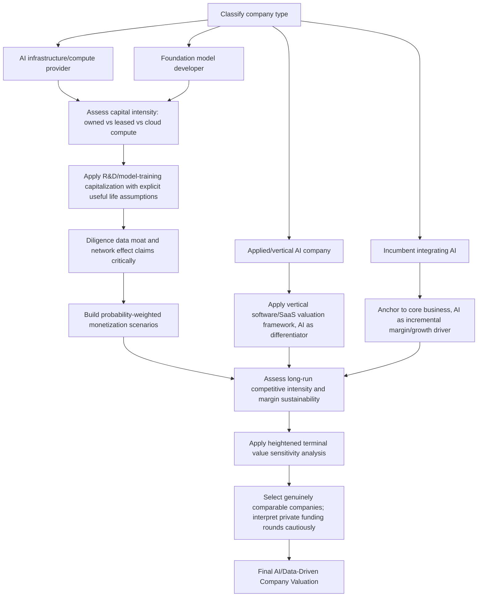

## Valuing Artificial Intelligence and Data-Driven Companies

### Overview

Valuing artificial intelligence and data-driven companies addresses the specific methodological considerations that arise when core value drivers include proprietary AI/ML models, large-scale compute infrastructure investment, training data assets, and rapidly evolving competitive dynamics driven by a fast-moving underlying technology frontier. This topic builds directly on the companion Valuing Intangible-Asset-Intensive and Platform Businesses topic — many of the same intangible-capitalization, network-effect, and cohort-economics frameworks apply — while introducing considerations specific to AI: extreme capital intensity in compute/infrastructure, unusually rapid technology depreciation risk, data-related competitive dynamics, and a still-maturing set of market conventions for translating AI-specific metrics into valuation inputs.

Given how rapidly both the technology and market practice in this space have evolved and continue to evolve, this topic emphasizes durable analytical frameworks over specific figures, multiples, or company examples that would be expected to age quickly; where current market data would materially inform an actual valuation exercise, that data should be independently sourced and verified at the time of the engagement rather than assumed stable from any general reference material.

### Distinguishing AI-Native Business Models from AI-Enabled Incumbents

**Key Points**

A useful initial framing distinguishes several categories of companies within the broad "AI/data-driven" label, since their valuation drivers and risk profiles differ meaningfully:

- **AI infrastructure and compute providers**: companies providing the underlying compute, chips, cloud infrastructure, or foundational model access that other AI applications are built upon — valuation here often resembles capital-intensive infrastructure valuation (with elevated capex intensity, long asset lives for underlying hardware, but potentially compressed *useful* lives given technology obsolescence risk) combined with platform/network dynamics where scale and ecosystem lock-in matter
- **Foundation model developers**: companies developing large-scale, general-purpose AI models — characterized by extremely high upfront R&D/training capital intensity, uncertain and evolving monetization models, and competitive dynamics that are, as of this writing, still in a formative and rapidly-evolving stage regarding which business models (API access, subscription, enterprise licensing, embedded product integration) prove durable
- **Applied AI / vertical AI companies**: companies applying AI/ML techniques to solve specific industry or functional problems (e.g., AI-driven diagnostics, AI-driven fraud detection, AI-driven logistics optimization) — valuation here often more closely resembles traditional vertical software/SaaS valuation, with AI serving as an enabling technology and competitive differentiator rather than being the entire business model itself
- **Incumbent businesses integrating AI capabilities**: established companies incorporating AI/ML into existing products and operations — valuation here is typically anchored primarily to the core existing business, with AI integration assessed as a potential margin-improvement, competitive-defense, or incremental-growth driver rather than a wholesale re-basing of the valuation framework

[Inference: given the pace of change in this sector, any specific characterization of "typical" business models, monetization approaches, or competitive dynamics within these categories should be treated as a snapshot subject to rapid evolution, and current market structure, key players, and prevailing business model conventions should be independently verified rather than assumed static.]

### Capital Intensity and Compute Infrastructure Considerations

**Key Points**

AI model training and inference, particularly for large-scale models, involves substantial capital expenditure on specialized computing infrastructure (GPUs/AI accelerators, data center capacity, networking infrastructure, power infrastructure), creating several specific valuation considerations:

- **Elevated and often front-loaded capex intensity**: unlike traditional software businesses with relatively modest capital expenditure requirements, AI-native businesses (particularly foundation model developers and AI infrastructure providers) often require substantial upfront capital investment in compute infrastructure well ahead of proportionate revenue realization, creating a capital-intensive growth profile that shares some analytical characteristics with traditional infrastructure/utility capex modeling, layered on top of software-like operating characteristics
- **Useful life and technology obsolescence risk for specialized hardware**: the useful economic life of specialized AI compute hardware is a live and consequential assumption, given the pace of hardware generational improvement in this space — assuming too long a useful life for depreciation and capacity-planning purposes risks overstating the ongoing economic value of existing infrastructure investment, while assuming too short a life can understate returns on infrastructure that in practice continues to be economically useful (e.g., for less cutting-edge-dependent inference workloads even after newer hardware generations become available for the most demanding training workloads)
- **Build versus buy/rent infrastructure decisions**: companies vary in whether they own compute infrastructure directly, lease it, or access it via cloud provider arrangements, which materially affects the capex-versus-opex profile, balance sheet asset intensity, and appropriate ROIC/return-on-capital analysis — comparability across companies with different infrastructure sourcing strategies requires care analogous to the differing-capitalization-policy issue discussed in the companion Platform Businesses topic
- **Power and energy considerations**: given the substantial energy intensity of large-scale AI compute, energy cost trends, energy availability/grid capacity constraints in specific geographies, and potential future energy-related regulatory or environmental considerations (connecting to the companion ESG Factors topic) represent an increasingly relevant risk and cost factor for capital-intensive AI infrastructure investment

### Adapting the R&D Capitalization Framework for AI-Specific Investment

**Key Points**

The R&D capitalization adjustment methodology introduced in the companion Platform Businesses topic applies with particular relevance to AI companies, given the typically very high ratio of R&D/model-training expense to current-period revenue, but requires some AI-specific consideration:

- **Model training cost as a capitalizable "asset"**: the substantial compute and data cost incurred to train a large model can be analytically treated as creating an intangible asset (the trained model itself) with an economically meaningful useful life, analogous to the R&D capitalization framework, though the appropriate useful life assumption is a particularly live and uncertain judgment given the pace of model iteration and potential for newer models to obsolete older ones faster than in many other R&D-intensive industries
- **Distinguishing foundational/platform model investment from incremental fine-tuning/application-layer investment**: a company's total AI-related spend often spans a spectrum from foundational capability development (higher risk, longer potential useful life if successful, but also higher risk of complete obsolescence if a superior approach emerges) to incremental application-specific fine-tuning or integration work (lower risk, shorter useful life, more directly tied to specific near-term revenue), and a single blended capitalization treatment across this full spectrum may obscure meaningful differences in the underlying economics

### Data Assets and Competitive Moat Assessment

**Key Points**

As discussed more generally in the companion Platform Businesses topic, data asset valuation lacks a standardized methodology, but several AI-specific considerations are relevant to assessing whether a company's data assets constitute a genuine, durable competitive advantage rather than a commoditizing input:

- **Proprietary versus commoditized training data**: assessing whether a company's data advantage stems from genuinely proprietary, difficult-to-replicate data (e.g., data generated through a company's own unique operations, transactions, or user interactions that competitors cannot easily access or replicate) versus reliance on broadly available or increasingly commoditized data sources (including large-scale web-scraped or publicly available datasets that are, in principle, accessible to many competing model developers)
- **Data flywheel dynamics**: some AI-driven businesses exhibit a "data flywheel" or "data network effect" where usage generates data that improves the underlying model, which improves the product, which drives further usage and further data generation — genuine data flywheel dynamics, where verified, can represent a durable and increasingly valuable competitive moat over time, analogous in structure (though distinct in mechanism) to the network effects discussed in the companion Platform Businesses topic; however, as with general network effect claims, the presence and strength of a genuine data flywheel should be diligenced critically rather than assumed from a general growth narrative
- **Data-related legal and regulatory risk**: intellectual property disputes regarding training data provenance and usage rights, evolving data privacy regulation, and potential future regulatory constraints on data collection, usage, or model training practices represent an actively evolving risk category that should be assessed for currency at the time of any specific valuation engagement rather than assumed stable

### Monetization Model Uncertainty and Scenario Analysis

**Key Points**

Given that monetization approaches and competitive/market structure for various categories of AI companies are, as of this writing, still evolving and subject to meaningful uncertainty, explicit scenario analysis is particularly relevant for many AI-native business valuations — more so than for many more mature technology categories with well-established, stable monetization conventions:

- **Modeling multiple plausible monetization pathways** (e.g., API/usage-based pricing, subscription/seat-based pricing, enterprise licensing, embedded-in-product monetization, advertising-supported models) with associated probability weights, rather than assuming a single monetization approach will prevail with certainty, connects methodologically to the probability-weighted scenario framework discussed in the companion Going-Concern Uncertainty topic, applied here to upside/business-model uncertainty rather than downside/distress risk
- **Assessing competitive intensity and margin sustainability**: given the potential for rapid competitive entry, commoditization of certain AI capabilities over time (particularly for capabilities that become more broadly accessible as underlying technology costs decline or as open-source/widely-available alternatives mature), and uncertain long-run pricing power, explicit scenario analysis around long-run margin sustainability — rather than simple extrapolation of current-period margins, which may reflect an early, less-competitive market stage — is generally warranted
- **Terminal value sensitivity given elevated uncertainty**: given that terminal value typically dominates total DCF value, and that the long-run competitive and technological landscape for many AI-native business models carries meaningfully more uncertainty than for more mature, stable industry categories, explicit sensitivity analysis around terminal growth, terminal margin, and terminal market structure assumptions is particularly important — potentially more so than for the median company being valued using standard DCF techniques — to transparently convey the genuine range of plausible outcomes rather than presenting a single point estimate with unwarranted precision

### Comparable Company and Multiple Selection Considerations

**Key Points**

- **Comparable company sets for AI-native businesses are often thin, heterogeneous, and evolving**, given the relative novelty of many AI-native business models — analysts should exercise particular caution in comparable selection, favoring companies with genuinely similar business model, monetization approach, and capital intensity characteristics over companies merely sharing an "AI" label or sector classification, which can obscure meaningfully different underlying economics
- **Revenue-multiple-based valuation is common for early-stage or pre-full-profitability AI companies**, analogous to the platform business discussion in the companion topic, but should be applied with particular attention to underlying growth durability and margin trajectory assumptions given the elevated monetization and competitive uncertainty discussed above
- **Private market valuation reference points (recent funding rounds) for AI companies should be interpreted cautiously** as direct comparable inputs, given that private funding round valuations in fast-moving, high-investor-interest sectors can reflect a range of factors beyond pure discounted cash flow fundamentals (strategic investor considerations, competitive fundraising dynamics, liquidation preference and other structural terms that affect the economics of a given headline valuation figure in ways not always transparent from the headline number alone)

### Practical Valuation Process Summary

1. **Classify the company** within the AI-native versus AI-enabled spectrum, and within the infrastructure/foundation model/applied AI/incumbent-integration categories, to identify the most relevant comparable frameworks and risk factors
2. **Assess capital intensity and infrastructure sourcing strategy** (owned versus leased versus cloud-accessed compute), adjusting comparability analysis accordingly
3. **Apply R&D/model-training capitalization adjustments** where appropriate, with explicit, disclosed useful life assumptions and sensitivity to alternative assumptions given elevated technology obsolescence uncertainty
4. **Diligence genuine data moat and network effect claims** critically rather than accepting a general growth or "AI-powered" narrative at face value
5. **Build explicit, probability-weighted scenarios for monetization approach and long-run competitive/margin sustainability**, rather than relying on a single-path projection given elevated business model uncertainty
6. **Apply heightened terminal value sensitivity analysis**, transparently conveying the range of plausible long-run outcomes given the elevated uncertainty characteristic of this stage of the sector's development
7. **Select comparable companies and reference transactions with genuine business-model and capital-intensity similarity**, and interpret private market reference valuations cautiously given potential structural and strategic distortions in headline figures

### Common Pitfalls

- **Treating all "AI companies" as a single homogeneous valuation category**, when infrastructure providers, foundation model developers, applied AI vertical software companies, and AI-enabled incumbents have meaningfully different value drivers and risk profiles
- **Assuming current-period margins and monetization approaches will persist unchanged**, without considering plausible competitive commoditization and monetization-model evolution over the projection horizon
- **Applying standard software/SaaS useful life and capitalization assumptions to AI-specific model-training investment** without considering the potentially faster and less predictable obsolescence dynamics specific to rapidly-evolving AI model generations
- **Assigning speculative value to data or algorithmic assets without demonstrated or clearly plausible revenue/margin connection**, echoing the broader caution raised in the companion Platform Businesses topic but with particular relevance given the intensity of current market narrative around AI/data assets
- **Relying on recent private funding round valuations as direct, unadjusted comparable inputs** without considering structural terms (liquidation preferences, strategic investor dynamics) that can distort the direct comparability of headline valuation figures
- **Understating terminal value uncertainty** by presenting a single-point terminal value estimate without adequate sensitivity analysis, given the genuinely elevated long-run uncertainty characteristic of this evolving sector
- **Failing to independently verify current market structure, competitive dynamics, and technology capabilities at the time of any specific valuation engagement**, given how rapidly this sector continues to evolve relative to the pace at which general reference material can remain current

### AI/Data-Driven Company Valuation Framework (svg_diagram)

**Related Topics**

- Valuing Intangible-Asset-Intensive and Platform Businesses
- ESG Factors and Sustainability-Linked Valuation Adjustments
- Valuing Companies with Going-Concern Uncertainty
- R&D Capitalization Adjustments and Return on Invested Capital Normalization
- Valuing Early-Stage and Pre-Profitability Growth Companies
- Private Market Valuation and Funding Round Structural Term Analysis
- Technology Obsolescence Risk and Useful Life Estimation for Specialized Capital Assets