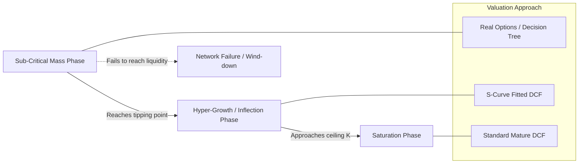

## Network Effects and Winner-Take-Most Dynamics in Valuation


### Overview

Network effects occur when the value of a product or platform to each user increases as additional users join. This creates valuation dynamics fundamentally different from traditional industrial or consumer businesses: value creation is non-linear in user count, competitive outcomes tend toward extreme concentration ("winner-take-most" or "winner-take-all"), and standard DCF assumptions of steady, bounded market share and fading growth rates can significantly understate or overstate value depending on where a company sits in the network adoption curve. Valuing these businesses requires explicit modeling of network topology, user growth mechanics, competitive dynamics under increasing returns, and the eventual maturation phase when network effects saturate.

### Taxonomy of Network Effects

**Key Points**

- **Direct (same-side) network effects**: Value to a user increases directly with the number of other same-type users. Example: a messaging app, a social network, a telephone network. Metcalfe's Law is the classical approximation: total network value scales proportionally to $n^2$, where $n$ is the number of connected users.
- **Indirect (cross-side) network effects**: Value to one user group increases with the number of users in a *different* group. Example: a marketplace where buyer value increases with seller count and vice versa (two-sided or multi-sided platforms).
- **Data network effects**: Product quality improves as usage data accumulates, indirectly making the product more valuable to new and existing users (e.g., recommendation engines, search). This is a slower-compounding but often more durable effect than direct network effects because it is harder for competitors to replicate quickly.
- **Local vs. global network effects**: Some networks derive value primarily from geographically or socially local density (e.g., ride-sharing liquidity in a specific city) rather than total global user count, which has direct implications for how granular the market-sizing and penetration modeling must be.

`[Inference]` Distinguishing which type of network effect (or combination) is present in a given business is a prerequisite for valuation modeling, since direct network effects with Metcalfe-like scaling justify more aggressive terminal market share assumptions than data network effects, which tend to have diminishing marginal returns to scale beyond a certain data volume threshold.

### Metcalfe's Law and Value Scaling Formalization

$$V_{network} \propto n^2$$

Where $n$ is the number of active connected participants. This is a stylized approximation, not a literal valuation formula, and its assumptions are frequently violated in practice:

- It assumes all connections are equally valuable, which is rarely true (a user's first 10 connections are typically far more valuable than their 1,000th).
- Odlyzko and Tilly's critique proposes that realistic network value scales closer to $n \log n$ rather than $n^2$, since the marginal value of additional connections diminishes due to attention and relationship-maintenance constraints.

$$V_{network} \propto n \log n \quad \text{(Odlyzko-Tilly refinement)}$$

**Practical Valuation Implication**

For DCF purposes, the functional form of value-to-user-count scaling should inform how revenue per user (or engagement, which drives monetization) is projected as the user base grows — not by assuming a fixed ARPU (average revenue per user) throughout the forecast, but by modeling ARPU as a function of network density, since higher-density networks typically command higher engagement and thus higher monetizable value per user.

### The S-Curve Adoption Model and Its Valuation Implications

Network effect businesses characteristically follow an S-curve (logistic) adoption pattern rather than linear or steadily-decelerating growth.

$$N(t) = \frac{K}{1 + e^{-r(t-t_0)}}$$

Where $K$ is the addressable ceiling (saturation point), $r$ is the growth rate parameter, and $t_0$ is the inflection point in time.

**Three Phases and Their Valuation Treatment**

1. **Sub-critical mass phase**: User growth is slow and the network has not reached the "tipping point" where organic viral growth outpaces the need for paid acquisition. `[Speculation]` Businesses in this phase carry substantial execution risk that a standard DCF understates, because the probability distribution of outcomes is bimodal (either the network reaches critical mass and scales explosively, or it fails to achieve liquidity and the business fails) rather than the continuous, moderate-variance outcome distribution that a single-point DCF implicitly assumes. Real options or scenario-weighted (decision-tree) valuation is often more appropriate than a single DCF at this stage.
2. **Hyper-growth / inflection phase**: Growth rate $r$ in the S-curve is near its maximum; user acquisition may be sub-linear in cost due to viral/referral effects reducing customer acquisition cost (CAC) as the network self-reinforces. This is the phase where naively extrapolating the steepest historical growth rate into a DCF forecast produces severely overstated terminal values, since S-curve growth mathematically must decelerate as $N(t)$ approaches $K$.
3. **Saturation phase**: Growth decelerates as the network approaches ceiling $K$; monetization intensity (ARPU growth, take-rate increases, new product attach) becomes the primary value driver rather than user growth. This phase most resembles a traditional mature-company DCF and is where standard terminal value mechanics become appropriate again.

**Example**

A social platform reports 40% year-over-year user growth in the most recent quarter, decelerating from 65% two years prior. A naive linear extrapolation might fade growth from 40% toward a 3% terminal rate over five years. An S-curve-informed approach instead first estimates the addressable ceiling $K$ (e.g., total addressable smartphone-owning population in target demographics and geographies), fits the deceleration trajectory to a logistic curve using the observed deceleration from 65% to 40%, and derives an implied inflection-consistent growth path — which may show either faster or slower near-term deceleration than a naive linear fade, depending on how close current $N(t)$ is estimated to be to $K$.

===MERMAID_DIAGRAM===





```
### Winner-Take-Most Dynamics and Terminal Market Share

Network effects create positive feedback loops that tend to concentrate market share far more than in businesses without such effects, since each incremental user makes the leading network more attractive relative to smaller competitors, accelerating the leader's advantage.

**Key Drivers of Concentration**

- **Switching costs**: Multi-homing (using multiple competing networks simultaneously) reduces winner-take-most intensity; high switching costs and low multi-homing propensity increase it. A valuation model should explicitly assess the multi-homing rate observed in the specific vertical (e.g., ride-sharing apps are frequently multi-homed by riders, reducing concentration relative to, say, an operating system, which is rarely multi-homed).
- **Supply-side economies of scale layered on network effects**: When a platform also benefits from cost advantages at scale (e.g., data-center efficiency, algorithmic improvement from more training data), the concentration dynamic compounds beyond pure network effects alone.
- **Regulatory and antitrust constraints**: `[Unverified]` The degree to which antitrust intervention caps ultimate market share concentration is jurisdiction- and time-period-dependent and represents a material source of terminal value uncertainty for dominant platforms, since forced interoperability, data portability mandates, or structural remedies would directly reduce the network effect moat being valued.

**Terminal Market Share Modeling**

Rather than assuming a single terminal market share point estimate, winner-take-most valuation should incorporate:

$$EV = \sum_{scenarios} P(s) \times EV(s)$$

Where scenarios span a distribution of terminal market share outcomes (e.g., dominant winner at 60-70% share, co-leader at 30-40% share, marginalized niche player at under 10% share), each with an associated probability informed by competitive analysis of switching costs, capital intensity of competing, and historical base rates from comparable network-effect industries.

### Multi-Sided Platform Valuation Complexity

For platforms with indirect network effects (marketplaces, app stores, ad-supported media), valuation must separately model each side of the platform and their interaction, since growth or pricing on one side directly affects the other side's value proposition.

**Key Points**
- **Chicken-and-egg bootstrapping cost**: Early-stage multi-sided platforms often subsidize one side (e.g., below-market pricing for drivers in ride-sharing, free listings for early sellers in a marketplace) to reach the liquidity needed to attract the other side. This subsidy should be modeled as an explicit customer acquisition or platform-investment cost in the near-term cash flow forecast, not obscured within blended unit economics.
- **Take-rate evolution**: As a marketplace matures and network liquidity increases, the platform typically gains pricing power to increase its take rate (the percentage of gross merchandise value it retains as revenue), since switching away becomes costlier for participants once the network has reached critical mass on both sides. Modeling take-rate expansion as a function of estimated network maturity (rather than holding it flat) is standard practice for later-stage marketplace DCFs.
- **Cross-side elasticity**: A price increase on one side (e.g., higher commission to sellers) may reduce that side's participation, which in turn reduces value to the other side (fewer sellers reduces buyer selection), creating a compounding effect that a single-side unit economics model would miss entirely.

### Valuation Metrics Specific to Network-Effect Businesses

Because near-term GAAP profitability is frequently negative or minimal during the growth phase, network-effect businesses are commonly valued using operational proxy metrics that are then bridged to a cash flow forecast.

**Common Proxy Metrics**
- **Gross Merchandise Value (GMV) / Take Rate**: For marketplaces, revenue is modeled as GMV × take rate, with GMV growth driven by the S-curve adoption model and take rate modeled as a separate, typically increasing, function of network maturity.
- **Daily/Monthly Active Users (DAU/MAU) and DAU/MAU ratio ("stickiness")**: Used as a leading indicator of engagement depth; a rising DAU/MAU ratio is frequently interpreted as evidence of strengthening network effects, since it implies growing daily utility rather than merely occasional use.
- **Net Revenue Retention (NRR)**: Particularly relevant for B2B network/platform businesses (e.g., collaboration software with network effects across an organization's seats); NRR above 100% implies expansion revenue from existing cohorts exceeds churn, a strong indicator of embedded network-driven value.
- **Customer Acquisition Cost (CAC) payback and CAC trend**: A declining CAC over time, especially alongside rising user counts, is one of the more direct empirical signals that organic/viral network effects are reducing the cost of growth — a key assumption to validate rather than simply extrapolate when building the near-term forecast.

**Bridging Proxy Metrics to DCF**

$$Revenue_t = DAU_t \times ARPU_t$$
$$FCF_t = Revenue_t \times (1 - OpEx\%_t) \times (1 - t) - \Delta WC_t - CapEx_t$$

Where $DAU_t$ follows the fitted S-curve trajectory, $ARPU_t$ is modeled as increasing with network density and monetization maturity (not held flat), and $OpEx\%_t$ (operating expense as a percentage of revenue) is modeled as declining over time reflecting operating leverage as fixed platform/infrastructure costs are spread over a growing user base.

### Risks That Offset Network Effect Value Premiums

**Key Points**
- **Negative network effects / congestion**: Some networks experience value degradation past a certain density (e.g., content platforms suffering signal-to-noise degradation, or marketplaces suffering from oversupply diluting seller economics), which caps the naive assumption that value scales indefinitely with $n$.
- **Platform risk / disintermediation**: Participants on one side of a multi-sided platform may learn to transact directly with counterparties found through the platform, bypassing it in future transactions — a material risk in professional services and B2B marketplaces specifically, which should be reflected in a lower assumed sustainable take rate or higher assumed churn.
- **Regulatory intervention**: As noted above, antitrust or data-portability regulation targeting dominant network-effect businesses can directly impair the durability of the competitive moat being capitalized into terminal value.
- **Technological disruption of the network layer itself**: New protocols, interoperability standards, or platform shifts (e.g., mobile disrupting desktop-era network incumbents) can reset network effects entirely, meaning historical network dominance is not necessarily indicative of durable future dominance — this argues for somewhat more conservative terminal value multiples than a naive extrapolation of current dominance would suggest, though the appropriate discount is inherently judgment-dependent. `[Speculation]`

### Practical DCF Adjustments Checklist for Network-Effect Businesses

1. Identify the specific network effect type(s) present (direct, indirect, data, local) and their expected scaling behavior.
2. Estimate the addressable ceiling $K$ and fit an S-curve to historical growth deceleration rather than linear-fading recent growth rates.
3. Model ARPU/take-rate as a function of network maturity rather than holding it constant.
4. Build explicit near-term subsidy/investment costs for multi-sided platforms still bootstrapping liquidity on one side.
5. Replace single-point terminal market share with a probability-weighted scenario range reflecting competitive concentration dynamics.
6. Separately assess multi-homing rates and switching costs in the specific vertical to calibrate how "winner-take-most" (versus more fragmented) the terminal state is likely to be.
7. Apply a qualitative or scenario-based discount for regulatory and disintermediation risk specific to dominant platforms.

**Next Steps**
- Real Options Valuation for Early-Stage, Pre-Critical-Mass Platforms
- Cohort-Based Revenue Modeling for Subscription and Marketplace Businesses
- Valuing Data as a Durable Competitive Asset
- Multi-Sided Platform Pricing Strategy and Take-Rate Modeling
- Antitrust and Regulatory Risk Discounting in Platform Valuation
- Comparable Company Analysis for Pre-Profitability Growth Companies


```