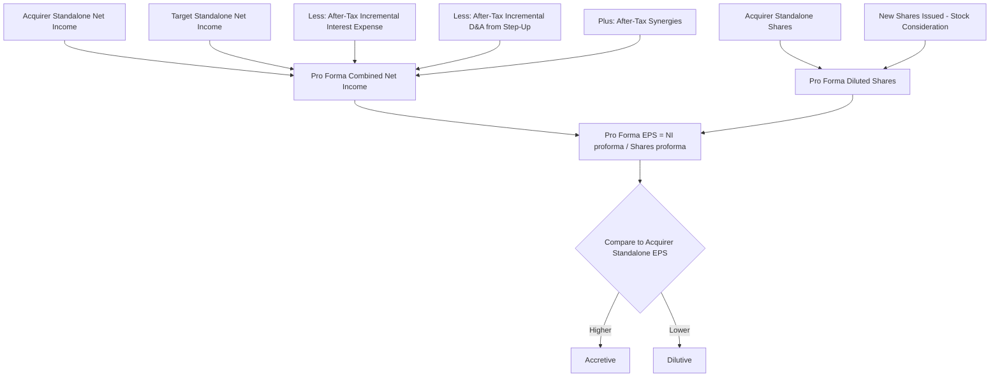

## Accretion and Dilution Analysis

### Overview

Accretion/dilution analysis measures the impact of a proposed acquisition on the acquirer's pro forma earnings per share (EPS), determining whether the transaction increases (accretive) or decreases (dilutive) the acquirer's standalone EPS in the periods following close. It is distinct from intrinsic valuation methods like DCF: accretion/dilution does not assess whether a deal creates or destroys economic value, only whether it mechanically improves or reduces reported per-share earnings, given the specific financing structure and accounting treatment used. It is one of the most widely used quick-diligence screens in M&A because it is easy to communicate to boards and public markets, even though it can produce a misleading signal of deal quality if relied upon in isolation.

### Core Mechanics and the Governing Formula

**Key Points**

- Pro forma combined net income is divided by pro forma combined diluted shares outstanding to derive pro forma EPS.
- Pro forma EPS is compared to the acquirer's standalone (pre-deal) EPS to determine accretion or dilution.
- The percentage accretion/dilution is calculated as:

$$\%\ Accretion/Dilution = \frac{EPS_{proforma} - EPS_{acquirer,standalone}}{EPS_{acquirer,standalone}}$$

A positive result indicates accretion; a negative result indicates dilution.

**Pro Forma Net Income Build**

$$NI_{proforma} = NI_{acquirer} + NI_{target} - \Delta Interest\ Expense_{after-tax} + Synergies_{after-tax} - Incremental\ D\&A_{after-tax}$$

Where:

- $\Delta Interest\ Expense_{after-tax}$ reflects new interest expense from acquisition debt, net of any interest income foregone on cash used, adjusted for tax shield
- $Incremental\ D\&A_{after-tax}$ reflects additional depreciation and amortization arising from the step-up in asset values under purchase accounting (discussed below), net of tax benefit
- $Synergies_{after-tax}$ are typically phased in over a multi-year ramp rather than assumed at full run-rate in year one, and conservative models often exclude revenue synergies entirely, including only cost synergies given their materially higher realization certainty

**Pro Forma Diluted Shares Outstanding**

$$Shares_{proforma} = Shares_{acquirer} + New\ Shares\ Issued\ (if\ stock\ consideration)$$

Cash-funded and debt-funded deals do not add shares (assuming no new equity issuance to fund the cash portion), while stock-funded deals directly dilute the share count by the number of new shares issued to target shareholders.

### The Three Financing Structures and Their EPS Impact

**All-Cash Deal (funded from balance sheet cash)**

No new shares issued; no new debt. The only EPS impact is the loss of interest income (or investment yield) on the cash used, net of tax, since that cash would otherwise have been earning a return.

$$\Delta NI = NI_{target} - (Cash\ Used \times Foregone\ Yield \times (1-t))$$

This structure is accretive almost by construction whenever the target's earnings yield exceeds the after-tax yield the acquirer was otherwise earning on its cash — which is nearly always true given that cash typically earns money-market-level yields far below a target's earnings yield.

**All-Debt Deal (new acquisition financing)**

No new shares issued; new interest expense is incurred.

$$\Delta NI = NI_{target} - (New\ Debt \times Interest\ Rate \times (1-t))$$

Accretion depends on the relationship between the target's earnings yield (inverse of the multiple paid) and the after-tax cost of the new debt. This relationship is most cleanly expressed through the comparison of the target's earnings yield to the after-tax cost of debt:

$$\text{Target Earnings Yield} = \frac{1}{P/E_{target}}$$

If the target's earnings yield exceeds the after-tax cost of new debt, the deal is accretive; if the after-tax cost of debt exceeds the target's earnings yield, the deal is dilutive, before considering synergies or D&A step-up effects.

**All-Stock Deal (new shares issued to target shareholders)**

No new debt; new shares are issued, increasing the denominator.

$$Shares\ Issued = \frac{Offer\ Value}{Acquirer\ Share\ Price}$$

The classic heuristic: an all-stock deal is accretive when the acquirer's P/E multiple exceeds the target's P/E multiple (i.e., the acquirer is "buying earnings" at a cheaper relative multiple than its own), and dilutive when the acquirer's P/E multiple is lower than the target's, before synergies. This is often referred to informally as the **"P/E multiple arbitrage" heuristic**, though the actual mechanical driver is the relationship between the target's earnings yield and the acquirer's earnings yield being applied to the new shares, not the multiples in isolation, and synergies plus any purchase price premium change the precise threshold.

`[Inference]` This heuristic is a useful first-order approximation for quick screening but breaks down when the target and acquirer have meaningfully different growth rates, margin profiles, or capital structures, since it implicitly ignores everything except the static current-year earnings ratio.

### Purchase Price Allocation and Its EPS Effects

Under purchase accounting (ASC 805 in US GAAP, or IFRS 3 internationally), the acquirer must allocate the purchase price to the fair value of identifiable tangible and intangible assets acquired and liabilities assumed, with any excess recorded as goodwill.

**Key Components Affecting Pro Forma EPS**

- **Asset step-up**: Tangible assets (e.g., PP&E) and identifiable intangible assets (customer relationships, technology, trademarks) are written up to fair value, which is frequently higher than the target's historical book value. This creates incremental depreciation and amortization expense over the assets' useful lives, which reduces pro forma net income (though it is a non-cash charge and thus does not affect free cash flow to the same degree — its impact is on GAAP EPS specifically, which is the metric accretion/dilution analysis targets).
- **Goodwill**: The residual excess of purchase price over the fair value of identifiable net assets is recorded as goodwill, which is not amortized under current US GAAP (tested annually for impairment instead), meaning goodwill itself does not directly reduce pro forma EPS through amortization, unlike the identifiable intangible step-up.
- **Deferred revenue write-down**: Acquired deferred revenue is often written down to fair value (representing the cost to fulfill the remaining obligation rather than the full historical deferred revenue balance), which can temporarily depress reported revenue and earnings for the target's business in the periods immediately following close — a frequently underappreciated modeling nuance in SaaS and subscription-business acquisitions.
- **Existing debt fair value adjustment**: Target's assumed debt may need to be marked to fair value if market rates have moved since issuance, creating a premium or discount that amortizes through interest expense over the debt's remaining life.

**Example: Incremental Intangible Amortization**

If a target's identifiable intangible assets (e.g., customer relationships) are valued at $200 million with an estimated 10-year useful life under straight-line amortization, this creates $20 million of incremental annual pre-tax amortization expense beyond what the target previously reported, directly reducing pro forma pre-tax income by that amount before the tax shield is applied.

### Full Worked Example

**Assumptions**

- Acquirer: Net income $500M, diluted shares outstanding 200M, share price $50 (implied P/E of 20x), tax rate 25%
- Target: Net income $100M, diluted shares outstanding 50M, offer price $30/share (implied acquisition P/E of 15x on target's standalone EPS of $2.00)
- Deal structure: 50% cash (funded by new debt at 6% pre-tax cost), 50% stock
- Total offer value: $1,500M (50M shares × $30)
- Cash portion: $750M funded by new debt; Stock portion: $750M funded by new acquirer shares

**Step 1 — New Shares Issued**

$$Shares\ Issued = \frac{\$750M}{\$50} = 15M\ shares$$

**Step 2 — New Debt and After-Tax Interest Expense**

$$Interest\ Expense_{pretax} = \$750M \times 6\% = \$45M$$


$$Interest\ Expense_{after-tax} = \$45M \times (1-0.25) = \$33.75M$$

**Step 3 — Incremental D&A (assume $150M intangibles, 10-year life)**

$$D\&A_{pretax} = \$15M/year$$


$$D\&A_{after-tax} = \$15M \times (1-0.25) = \$11.25M$$

**Step 4 — Pro Forma Net Income (assuming no synergies, conservative base case)**

$$NI_{proforma} = \$500M + \$100M - \$33.75M - \$11.25M = \$555M$$

**Step 5 — Pro Forma Diluted Shares**

$$Shares_{proforma} = 200M + 15M = 215M$$

**Step 6 — Pro Forma EPS and Comparison**

$$EPS_{proforma} = \frac{\$555M}{215M} = \$2.58$$


$$EPS_{acquirer,standalone} = \frac{\$500M}{200M} = \$2.50$$


$$\%\ Accretion = \frac{\$2.58 - \$2.50}{\$2.50} = +3.2\%\ (accretive)$$

**Output**

The transaction is accretive by approximately 3.2% before synergies, driven primarily by the acquirer's higher P/E multiple (20x) relative to the effective blended cost of the target's earnings via the mixed cash/stock structure, partially offset by incremental intangible amortization from purchase accounting.

===MERMAID_DIAGRAM===





```
### Sensitivity Analysis and the Accretion/Dilution Football Field

Because the result depends heavily on assumptions with genuine ranges (synergy realization, exact financing mix, purchase price allocation estimates before the deal closes), practitioners typically construct a sensitivity table or "football field" of outcomes across:

- **Percentage of cash vs. stock consideration** (varying the financing mix)
- **Synergy realization percentage** (e.g., 0%, 50%, 100% of estimated run-rate synergies)
- **Purchase price / premium paid** (varying the offer price and thus the multiple paid)
- **Interest rate on acquisition debt** (particularly relevant in a rising-rate environment, as covered under interest rate regime valuation)

This produces a range of accretion/dilution outcomes rather than a single point estimate, which better communicates the sensitivity of the "accretive/dilutive" conclusion to assumptions that are genuinely uncertain at the time of deal announcement, particularly synergy realization.

### Break-Even Synergy Analysis

A useful complementary output is calculating the break-even synergy level required to make a marginally dilutive deal neutral (0% accretion/dilution) or to hit a specific target accretion threshold:

$$Break\text{-}Even\ Synergies_{after-tax} = -(NI_{proforma,\ pre-synergy} - EPS_{acquirer} \times Shares_{proforma})$$

Solving for the after-tax synergy figure that brings pro forma EPS exactly in line with acquirer standalone EPS. This reframes the diligence question from "is this deal accretive" to "how much synergy realization is required to justify the price paid," which is often a more decision-useful framing for a board evaluating deal risk.

### Critical Limitations of Accretion/Dilution as a Standalone Metric

**Key Points**
- **EPS accretion does not equal value creation**: A deal can be EPS-accretive purely due to financing mechanics (e.g., cheap debt or a high acquirer P/E) while destroying economic value if the price paid exceeds the intrinsic (DCF-derived) value of the target, or vice versa — a strategically sound, value-creating deal can appear dilutive in year one due to upfront integration costs or slow synergy ramp, even though it creates long-term value.
- **First-year focus can be misleading**: Many deals are modeled as dilutive in year one and accretive by year two or three as synergies ramp and financing costs are absorbed into a larger earnings base; boards and analysts should examine the multi-year accretion/dilution trajectory rather than only the first full year post-close.
- **Non-cash charges distort the comparison to cash flow reality**: Incremental D&A from purchase accounting reduces GAAP EPS but does not reduce cash flow, meaning an accretion/dilution analysis based on GAAP EPS can show dilution in a deal that is, on a cash-flow basis, value-accretive from day one. Some practitioners therefore also calculate **cash EPS accretion/dilution**, adding back incremental non-cash D&A to isolate the cash-flow-relevant signal separately from the GAAP-reported signal.
- **Static analysis, dynamic reality**: The standard build is typically a single forward year or a short multi-year projection; it does not capture the full multi-year value creation (or destruction) trajectory that a proper post-merger integrated DCF would, making accretion/dilution best used as a communication and screening tool alongside, not instead of, intrinsic valuation methods such as the acquirer's pro forma DCF or NPV of the transaction inclusive of synergies and integration costs.

**Next Steps**
- Synergy Valuation and Realization Risk Modeling in M&A
- Purchase Price Allocation (PPA) Mechanics Under ASC 805 / IFRS 3
- Contribution Analysis and Relative Ownership in Merger-of-Equals Transactions
- Leveraged Buyout (LBO) Modeling and Sponsor Returns Analysis
- Deal Structuring: Cash, Stock, and Earnout Consideration Trade-offs
- Goodwill Impairment Testing Post-Acquisition


```