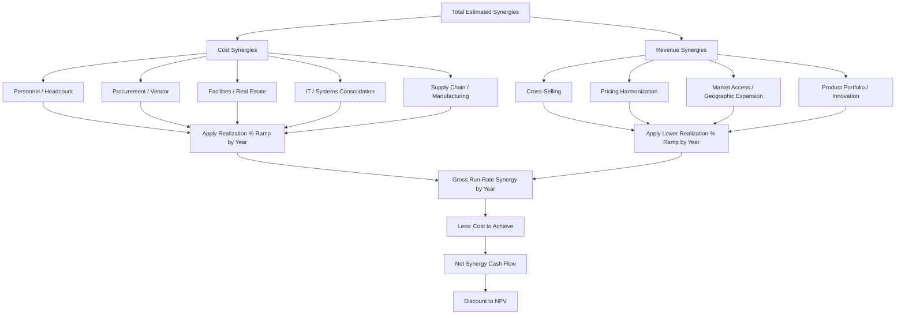

## Revenue and Cost Synergy Quantification

### Overview

Synergy quantification is the process of estimating the incremental value created by combining two businesses beyond what each would achieve standalone. Synergies are the primary economic justification for paying an acquisition premium above the target's standalone intrinsic value, yet they are simultaneously the least reliable and most frequently overestimated component of any M&A valuation model. Rigorous synergy quantification requires separating synergies by type (cost vs. revenue), by realization probability, by timing, and by the one-time investment required to achieve them — treating each category with a distinct methodology and a distinct level of confidence rather than bundling them into a single optimistic run-rate figure.

### Cost Synergies vs. Revenue Synergies: Fundamental Asymmetry

**Key Points**

- **Cost synergies** are generally more certain, more quantifiable, and faster to realize because they are largely within management's direct control (headcount reductions, facility consolidation, procurement leverage, system consolidation).
- **Revenue synergies** are generally less certain, harder to quantify precisely, and slower to realize because they depend on customer and market behavior, which is outside management's direct control (cross-selling success, customer retention through the transition, competitive response).
- `[Inference]` This asymmetry is well-established practitioner wisdom and is reflected in typical modeling conventions: many rigorous accretion/dilution and DCF models include cost synergies at a high realization percentage (e.g., 75-100% of estimated run-rate) while including revenue synergies at a materially discounted realization percentage (e.g., 25-50%) or excluding them from the base case entirely, reserving them for an upside scenario.

This asymmetry exists because cost reduction actions (terminating a lease, consolidating an ERP system, eliminating duplicate corporate functions) are largely mechanical execution tasks with predictable timelines and outcomes, whereas revenue synergies require winning new or larger orders from customers who have their own independent decision processes, competitive alternatives, and switching costs — none of which the acquirer directly controls.

### Cost Synergy Categories and Quantification Methodology

**Personnel / Headcount Synergies**

The largest and most common cost synergy category, typically arising from elimination of duplicate corporate functions (finance, HR, legal, IT, executive management) and elimination of redundant roles in combined operating units.

$$Personnel\ Synergy = \sum_{roles} (Eliminated\ Headcount \times Fully\ Loaded\ Cost\ per\ Role)$$

Fully loaded cost includes base salary, benefits, payroll taxes, and typically a standard overhead loading factor (often 25-40% above base salary, though this varies significantly by industry, geography, and benefits structure). Quantification methodology involves a **bottom-up organizational design exercise**: mapping the combined org chart function by function, identifying specific overlapping roles, and confirming headcount reduction targets against actual named positions rather than an abstract percentage-of-combined-cost-base estimate, which tends to be more defensible in board and investor communications.

**Procurement / Vendor Synergies**

Arising from combined purchasing volume enabling better vendor pricing terms, and from eliminating duplicate vendor relationships and consolidating spend with fewer, larger-volume suppliers.

$$Procurement\ Synergy = \sum_{categories} (Combined\ Spend_{category} \times \Delta Unit\ Price\%)$$

Quantification typically requires a category-by-category spend analysis (direct materials, indirect/MRO spend, professional services, technology licensing) benchmarked against realistic vendor renegotiation outcomes for the new combined volume tier, often informed by third-party procurement benchmarking data or direct vendor discussions during confirmatory diligence.

**Facilities and Real Estate Synergies**

Arising from consolidating overlapping office, warehouse, retail, or manufacturing footprints.

$$Facility\ Synergy = Eliminated\ Facility\ Operating\ Cost - Consolidation\ Capex\ (amortized) - Lease\ Termination\ Cost\ (one\text{-}time)$$

This category frequently has a meaningful one-time cost to achieve (lease break fees, relocation costs, capacity expansion capex at retained facilities) that must be modeled separately from the ongoing run-rate savings, since the net present value of the synergy depends on both the ongoing benefit and the upfront cost.

**IT and Systems Consolidation Synergies**

Arising from eliminating duplicate software licenses, consolidating onto a single ERP/CRM platform, and reducing duplicate IT infrastructure and support headcount.

`[Speculation]` IT consolidation synergies are frequently among the most delayed and most underestimated-in-cost categories in practice, since system migrations routinely take longer and cost more than initially scoped due to data migration complexity, integration testing requirements, and change management resistance — this is a commonly cited pattern in post-merger integration literature though the magnitude varies significantly by the specific systems and organizational complexity involved.

**Supply Chain and Manufacturing/Operating Synergies**

Arising from combined manufacturing network optimization (closing underutilized plants and shifting volume to more efficient facilities), improved capacity utilization, and logistics network consolidation (combined distribution centers, freight volume leverage).

### Revenue Synergy Categories and Quantification Methodology

**Cross-Selling Synergies**

Arising from selling the acquirer's products to the target's customer base and vice versa.

$$Cross\text{-}Sell\ Synergy = (Target\ Customer\ Count \times Attach\ Rate\% \times Acquirer\ Product\ ARPU) + (Acquirer\ Customer\ Count \times Attach\ Rate\% \times Target\ Product\ ARPU)$$

Quantification requires realistic, bottom-up attach rate assumptions, ideally benchmarked against the acquirer's or target's historical attach rates for genuinely comparable product bundling exercises (e.g., prior successful cross-sell initiatives, comparable transactions in the sector), rather than a top-down percentage-of-combined-revenue assumption, which tends to be far less defensible and more prone to optimism bias.

**Pricing Synergies**

Arising from harmonizing pricing across the combined customer base (e.g., eliminating discounting inconsistencies, applying the more disciplined pricing party's practices across the combined book) or from increased pricing power due to reduced competitive intensity in overlapping markets.

**Market Access / Geographic Expansion Synergies**

Arising from using the target's existing distribution channels, sales force, or geographic presence to accelerate the acquirer's entry into new markets (or vice versa) faster than either could achieve independently through organic expansion.

**Product Portfolio / Innovation Synergies**

Arising from combining complementary technology, IP, or R&D capabilities to accelerate product development timelines or create new combined product offerings not previously feasible for either standalone entity — this category is typically the hardest to quantify with precision and is most often treated qualitatively or reserved for strategic rationale narrative rather than included in the quantitative base-case model.

### Realization Timing: The Synergy Ramp Curve

Synergies are virtually never realized instantaneously at deal close; they follow a ramp curve reflecting execution timelines for integration activities.

**Typical Ramp Pattern**

| Period | Cost Synergy Realization | Revenue Synergy Realization |
| --- | --- | --- |
| Year 1 | 40-60% of run-rate | 10-20% of run-rate |
| Year 2 | 80-90% of run-rate | 40-60% of run-rate |
| Year 3+ | 100% of run-rate | 80-100% of run-rate |

`[Inference]` These ranges reflect commonly cited practitioner benchmarks rather than a universal rule; the actual ramp for any specific transaction depends heavily on integration complexity, regulatory approval timelines, systems migration scope, and the specific synergy category (personnel actions can often be executed within the first 100 days post-close, while systems consolidation and cross-sell revenue synergies typically take substantially longer to materialize).

The ramp curve should be modeled explicitly rather than assumed as a step-function to full run-rate in year one, since both the DCF and the accretion/dilution analysis are materially affected by the pace of synergy realization, particularly in the near-term periods that carry the highest weight in an accretion/dilution analysis.

### Costs to Achieve (One-Time Integration Costs)

Every synergy category typically requires an upfront investment to realize, and a rigorous synergy model nets this against the ongoing benefit.

**Common Cost-to-Achieve Categories**

- Severance and retention bonus costs for eliminated or retained personnel
- System migration and integration technology costs (software licensing, implementation consulting, data migration)
- Facility consolidation costs (lease termination penalties, relocation, capacity expansion capex)
- Change management, communications, and integration management office (IMO) costs
- Professional fees (legal, accounting, consulting) directly tied to integration execution (as distinct from deal transaction costs, which are a separate line item)

**Net Synergy NPV**

$$NPV_{synergy} = \sum_{t=1}^{n} \frac{Synergy_t \times (1-t_{tax})}{(1+r)^t} - Cost\ to\ Achieve_{upfront} - \sum_{t} \frac{Cost\ to\ Achieve_t}{(1+r)^t}$$

A synergy figure quoted without its corresponding cost-to-achieve is materially incomplete; boards and analysts should always require the gross run-rate synergy estimate, the cost-to-achieve estimate, and the resulting net present value together, since a synergy with a very high cost-to-achieve-to-benefit ratio may not justify the acquisition premium even if the gross run-rate figure looks impressive in isolation.

===MERMAID_DIAGRAM===





```
### Worked Example: Blended Synergy NPV

**Assumptions**
- Combined entity identifies \$80M in annual run-rate cost synergies and \$40M in annual run-rate revenue synergies (at full maturity, Year 3+)
- Revenue synergies carry an assumed 35% incremental margin (reflecting that cross-sold revenue does not require proportional new fixed cost investment)
- Cost-to-achieve: \$60M one-time, incurred in Year 1
- Tax rate: 25%; discount rate: 10%; realization ramp per the table above

**Step 1 — Effective After-Tax Cost Synergy by Year**

- Year 1: \$80M × 50% × (1-0.25) = \$30.0M
- Year 2: \$80M × 85% × (1-0.25) = \$51.0M
- Year 3+: \$80M × 100% × (1-0.25) = \$60.0M

**Step 2 — Effective After-Tax Revenue Synergy Contribution by Year** (revenue synergy × 35% margin, then tax-effected)

- Year 1: \$40M × 15% × 35% × (1-0.25) = \$1.58M
- Year 2: \$40M × 50% × 35% × (1-0.25) = \$5.25M
- Year 3+: \$40M × 90% × 35% × (1-0.25) = \$9.45M

**Step 3 — Net Synergy Cash Flow and Cost to Achieve**

- Year 1: \$30.0M + \$1.58M - \$60.0M = **-\$28.42M**
- Year 2: \$51.0M + \$5.25M = **\$56.25M**
- Year 3 onward (terminal, growing modestly with combined business growth): **\$69.45M**

**Output**

This illustrates a common and important pattern: the combined entity experiences a **net negative synergy cash flow in Year 1** once the upfront cost-to-achieve is netted against the still-ramping benefit, turning meaningfully positive only from Year 2 onward. A synergy analysis that ignores this Year 1 negative and only presents the eventual run-rate figure materially overstates near-term deal economics and can produce a misleading accretion/dilution conclusion for the first year post-close.

### Common Errors and Red Flags in Synergy Estimation

**Key Points**
- **Top-down, percentage-of-revenue synergy estimates** without bottom-up validation against specific, named initiatives (specific roles eliminated, specific vendor contracts renegotiated, specific cross-sell products identified) are a significant red flag, since they are essentially unfalsifiable and prone to optimism bias to justify a desired purchase price.
- **Double-counting synergies against the standalone plan**: If the target's own standalone management projections already assume certain efficiency improvements or growth initiatives, counting the acquirer's identical initiatives as "synergy" on top of that baseline double-counts value that would have occurred regardless of the transaction.
- **Ignoring dis-synergies**: Combinations often create negative effects that partially offset positive synergies — customer attrition due to service disruption during integration, key employee departures (particularly in professional-services or relationship-driven businesses), cultural conflicts reducing productivity, and lost revenue from product line rationalization. A rigorous model nets these dis-synergies against the gross synergy estimate rather than ignoring them.
- **Synergy timeline overconfidence**: Assuming full run-rate synergy achievement by year one or two when comparable historical integrations in the sector have taken three or more years is a common source of post-deal earnings disappointment relative to the market's initial expectations set at announcement.
- **Failure to distinguish gross vs. net (of cost-to-achieve) synergy figures** when communicating to the board or the market, which can create a misleading impression of deal economics if the cost-to-achieve is later disclosed as substantially higher than initially implied.

**Next Steps**
- Accretion and Dilution Analysis (financing structure and EPS mechanics)
- Post-Merger Integration Planning and the First-100-Days Framework
- Purchase Price Allocation (PPA) Mechanics Under ASC 805 / IFRS 3
- Scenario-Weighted DCF Incorporating Probability-Adjusted Synergy Realization
- Dis-Synergy and Customer Attrition Risk Modeling in Overlapping-Market Mergers
- Deal Premium Justification and the Synergy-Adjusted Value Bridge


```