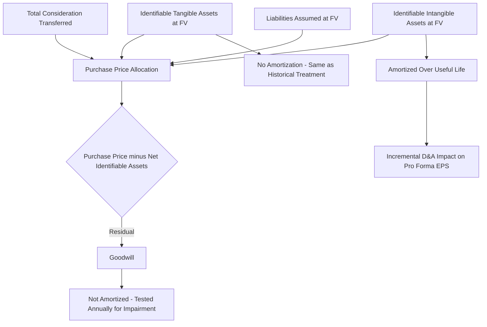

## Purchase Price Allocation Fundamentals

### Overview

Purchase Price Allocation (PPA) is the accounting process required under acquisition accounting — ASC 805 in US GAAP and IFRS 3 internationally — by which an acquirer allocates the total consideration paid for a business combination across the fair values of identifiable assets acquired and liabilities assumed, with any residual recorded as goodwill. PPA is not a valuation exercise in the DCF sense of estimating intrinsic worth; it is a fair-value-based accounting allocation exercise performed *after* the deal price has already been agreed, whose output directly determines the acquirer's post-close balance sheet, future depreciation and amortization expense, deferred tax positions, and ultimately reported EPS — making it a direct mechanical input into accretion/dilution analysis and pro forma financial statements.

### The Governing Accounting Framework

**Key Points**

- **ASC 805 (Business Combinations)** under US GAAP requires the acquisition method for all business combinations, replacing the older pooling-of-interests method entirely.
- **IFRS 3 (Business Combinations)** is the substantially converged international equivalent, though certain measurement and disclosure details differ from ASC 805.
- Both frameworks require identification of the accounting acquirer, determination of the acquisition date, measurement of consideration transferred, and recognition and measurement of identifiable assets acquired and liabilities assumed at fair value as of the acquisition date.
- The allocation must be completed within a **measurement period**, not to exceed one year from the acquisition date, during which provisional amounts recorded at close can be retrospectively adjusted as new information about facts and circumstances existing at the acquisition date comes to light.

### The Core Allocation Equation

$$Purchase\ Price = \sum(Fair\ Value\ of\ Identifiable\ Assets) - \sum(Fair\ Value\ of\ Liabilities\ Assumed) + Goodwill$$

Rearranged to solve for goodwill, which is typically the balancing (residual) figure:

$$Goodwill = Purchase\ Price - Fair\ Value\ of\ Net\ Identifiable\ Assets\ Acquired$$

Where:

$$Fair\ Value\ of\ Net\ Identifiable\ Assets = \sum(Identifiable\ Tangible\ Assets) + \sum(Identifiable\ Intangible\ Assets) - \sum(Liabilities\ Assumed)$$

Purchase price for this purpose is the total consideration transferred, which includes cash paid, fair value of equity issued, fair value of any contingent consideration (earnouts), and the fair value of any previously held equity interest in the target (in a step acquisition), less the fair value of any non-controlling interest retained if applicable.

### Step-by-Step PPA Process

**Step 1 — Identify the Accounting Acquirer**

In most transactions this is straightforward (the legal acquirer is also the accounting acquirer), but in mergers of relative equals, reverse mergers, or SPAC transactions, determining which entity is the accounting acquirer requires judgment based on factors including relative voting rights, composition of the governing body, composition of senior management, and relative size — this determination matters significantly because it determines which entity's assets get revalued to fair value (the target's, under acquisition accounting) versus which entity's historical carrying values carry forward unchanged (the accounting acquirer's).

**Step 2 — Determine the Acquisition Date**

Generally the closing date on which the acquirer obtains control, which is the date used for all fair value measurements in the allocation.

**Step 3 — Measure Total Consideration Transferred**

$$Consideration = Cash\ Paid + FV(Equity\ Issued) + FV(Contingent\ Consideration) + FV(Previously\ Held\ Equity\ Interest) - Transaction\ Costs\ Excluded$$

Direct transaction costs (advisory fees, legal fees, due diligence costs) are expensed as incurred under both ASC 805 and IFRS 3 and are explicitly **not** included in the consideration transferred or capitalized into the purchase price allocation — a common point of confusion, since these costs were treated differently (capitalized) under pre-2009 US GAAP purchase accounting rules.

**Step 4 — Identify and Value Identifiable Tangible Assets**

Includes cash, receivables, inventory, PP&E, and other tangible assets, each remeasured to fair value as of the acquisition date (which may differ materially from the target's historical book value, particularly for PP&E and inventory).

**Step 5 — Identify and Value Identifiable Intangible Assets**

This is typically the most judgment-intensive and valuation-heavy step in the entire PPA process, discussed in detail below.

**Step 6 — Identify and Value Liabilities Assumed**

Includes accounts payable, accrued liabilities, assumed debt (remeasured to fair value if market rates have moved since issuance), deferred revenue (remeasured to fair value, not carried at historical book value — see below), and contingent liabilities meeting recognition criteria.

**Step 7 — Calculate Residual Goodwill**

Goodwill is the plug/residual after all identifiable assets and liabilities have been fair-valued; it is not separately valued using a standalone methodology, but rather represents the excess of purchase price over the fair value of net identifiable assets, capturing elements such as assembled workforce, expected synergies, and other unidentifiable value that does not meet the accounting criteria for separate intangible asset recognition.

===MERMAID_DIAGRAM===





```
### Identifiable Intangible Asset Categories

Under ASC 805 and IFRS 3, an intangible asset must be recognized separately from goodwill if it meets either the **separability criterion** (capable of being sold, transferred, licensed, or exchanged, whether or not the acquirer intends to do so) or the **contractual-legal criterion** (arises from contractual or other legal rights, regardless of separability). This recognition threshold is broader than the criteria typically applied to internally-developed intangibles, meaning acquisitions frequently result in recognition of intangible assets that the target never carried on its own standalone balance sheet.

**Common Intangible Asset Categories**

- **Customer relationships / customer contracts**: Often the largest intangible category in acquisitions of businesses with recurring or repeat customer relationships; commonly valued using the **multi-period excess earnings method (MPEEM)**, discussed below.
- **Developed technology / patents**: Valued typically using either a **relief-from-royalty method** (estimating the royalty rate the acquirer would otherwise pay to license equivalent technology from a third party) or a cost-based approach for less commercially mature technology.
- **Trade names / trademarks**: Typically valued using the **relief-from-royalty method**, applying an estimated royalty rate to projected revenue attributable to the brand.
- **Non-compete agreements**: Valued using a **with-and-without method**, comparing projected cash flows with the non-compete in place versus a scenario where the counterparty is free to compete immediately.
- **In-process research and development (IPR&D)**: Recognized as an indefinite-lived intangible asset (not amortized until the related project is completed or abandoned) under US GAAP, valued typically using a risk-adjusted DCF or a scenario/decision-tree approach reflecting probability of technical and regulatory success at each development stage.
- **Assembled workforce**: Notably, assembled workforce does **not** meet the separate recognition criteria under ASC 805 or IFRS 3 (it fails both the separability and contractual-legal tests in virtually all circumstances) and is instead subsumed into goodwill — a specific rule that surprises some practitioners given how commonly assembled workforce is cited as a source of acquisition value in deal rationale narratives.

### Valuation Methodologies for Intangible Assets

**Multi-Period Excess Earnings Method (MPEEM)**

Used predominantly for customer relationship intangibles. The method isolates the cash flows attributable specifically to the existing customer relationships (excluding value from future new customers, which is not part of the acquired asset), then deducts **contributory asset charges (CACs)** — a fair return on all other assets (working capital, fixed assets, assembled workforce, trade names, technology) that contribute to generating those customer cash flows — since the customer relationship asset alone did not generate the revenue; it required the support of these other assets.

$$Excess\ Earnings_t = Revenue_t \times Attrition\text{-}Adjusted\ Retention_t \times Margin_t - Contributory\ Asset\ Charges_t$$

$$Customer\ Relationship\ Value = \sum_{t=1}^{n} \frac{Excess\ Earnings_t}{(1+r)^t}$$

The projection period is bounded by an estimated **customer attrition rate**, since the asset being valued is the *existing* customer base only, decaying over time per the observed or estimated historical retention/churn rate, not a perpetual or growing customer relationship in the way a going-concern DCF would model total company revenue.

**Relief-from-Royalty Method**

Used predominantly for trade names, trademarks, and licensed technology. Estimates the hypothetical royalty the acquirer would have had to pay a third party to license the equivalent intangible asset, then capitalizes the present value of that royalty saved over the asset's projected useful economic life.

$$Value = \sum_{t=1}^{n} \frac{Revenue_t \times Royalty\ Rate\% \times (1-t_{tax})}{(1+r)^t}$$

The royalty rate is typically benchmarked against comparable third-party licensing agreements in the same or an adjacent industry, often sourced from royalty rate databases or comparable licensing transaction research.

**With-and-Without Method**

Used predominantly for non-compete agreements. Compares the present value of projected enterprise cash flows in two scenarios: one in which the non-compete is in force (restricting the counterparty from competing), and one in which it is not, with the incremental value being the difference between the two.

### Fair Value Adjustments to Existing Balance Sheet Items

**Inventory Step-Up**

Acquired inventory is typically written up to fair value (often approximated as selling price less remaining costs to complete and sell, plus a normal profit margin for work-in-process and finished goods). This step-up flows through cost of goods sold as the acquired inventory is subsequently sold post-close (typically within the first one to two quarters), creating a temporary, one-time margin compression in the combined entity's reported gross margin immediately following the transaction — a frequently cited item in post-merger quarter "adjusted EBITDA" reconciliations, since analysts typically add this one-time, non-recurring COGS impact back when assessing underlying combined-entity profitability.

**Deferred Revenue Fair Value Adjustment**

A particularly consequential adjustment for subscription and SaaS business acquisitions: acquired deferred revenue is not carried forward at its historical book value, but is instead remeasured to fair value, generally approximated as the acquirer's cost to fulfill the remaining performance obligation plus a normal profit margin, rather than the full amount the target originally collected from customers. This fair value is frequently **lower** than the historical deferred revenue balance, meaning the combined entity recognizes less revenue from that pre-existing deferred revenue balance than the target would have recognized on a standalone basis, depressing reported revenue and earnings in the periods immediately following close — a nuance that materially affects near-term pro forma financial statements and is frequently a point of investor education following technology sector acquisitions.

**Debt Fair Value Adjustment**

Assumed debt is remeasured to fair value as of the acquisition date if market interest rates have moved since the debt was originally issued. If rates have risen since issuance (making the target's legacy debt cheaper than current market rates), the debt is recorded at a discount to face value, which then amortizes as a *reduction* to interest expense over the debt's remaining life (accretion of the discount); the reverse (recorded at a premium, increasing interest expense) applies if rates have fallen.

### Deferred Tax Implications

PPA in a taxable transaction (asset purchase, or stock purchase with a Section 338(h)(10) or 336(e) election in the US) generally allows the acquirer to achieve a tax-basis step-up matching the book fair value step-up, which creates tax-deductible amortization going forward. In a non-taxable stock acquisition without such an election, the book fair value step-up is recognized for GAAP purposes without a corresponding tax basis step-up, creating a **book-tax basis difference** that generates a deferred tax liability at close (since the book carrying value of the stepped-up assets now exceeds their tax basis, implying future taxable temporary differences as book depreciation/amortization exceeds tax depreciation/amortization).

$$Deferred\ Tax\ Liability = (Book\ Fair\ Value\ Step\text{-}Up) \times Tax\ Rate$$

This deferred tax liability itself increases the amount allocated to net identifiable assets in a specific sense (it is a liability that reduces net identifiable assets), which correspondingly increases residual goodwill relative to a taxable transaction with an equivalent gross fair value step-up — a key structural reason taxable asset deals (or elections achieving asset-deal tax treatment) are often preferred by buyers when negotiable, since they reduce goodwill and create tax-deductible amortization that a stock deal without such an election does not.

### Goodwill Impairment Testing (Post-PPA)

Once finalized, goodwill is not amortized under current US GAAP (ASC 350) but is tested for impairment at least annually (or more frequently if a triggering event occurs), at the reporting unit level. `[Unverified]` Private companies electing the accounting alternative under ASU 2014-02 may instead amortize goodwill on a straight-line basis over a period not exceeding ten years, an option not available to public business entities, though the specific eligibility criteria and any subsequent standard updates should be verified against current FASB guidance given the frequency of updates in this area.

### Common PPA Practitioner Issues and Judgment Areas

**Key Points**
- **Useful life estimation for intangibles** is a significant judgment area with direct EPS consequences: a shorter estimated useful life produces higher annual amortization (more dilutive to near-term EPS) but a smaller total goodwill balance (since it does not affect the total step-up, only its allocation between amortizing intangibles and non-amortizing goodwill in terms of ongoing P&L impact timing).
- **Contingent consideration (earnouts)** must be recognized at fair value at the acquisition date and subsequently remeasured through earnings each period (for liability-classified earnouts) until settled, creating potential ongoing earnings volatility unrelated to the underlying business's operating performance — a frequently underappreciated source of post-close reported earnings noise.
- **Contributory asset charge rates** in the MPEEM method require selecting appropriate required rates of return for each contributory asset category (working capital, fixed assets, assembled workforce, other intangibles), each calibrated to its relative risk profile — lower for working capital and fixed assets, higher for assembled workforce and other intangibles — and inconsistent or aggressive CAC assumptions are a common area of valuation firm and auditor scrutiny.
- **Measurement period adjustments**: Provisional PPA figures recorded at close are common (particularly for complex intangible valuations that cannot be finalized by the reporting deadline immediately following close) and are adjusted retrospectively within the one-year measurement period as new information about acquisition-date facts and circumstances emerges, with adjustments to goodwill during this window, versus adjustments through current-period earnings after the measurement period closes.

**Next Steps**
- Accretion and Dilution Analysis (PPA's direct link to pro forma EPS)
- Goodwill Impairment Testing Methodology and Reporting Unit Determination
- Contingent Consideration (Earnout) Structuring and Fair Value Remeasurement
- Multi-Period Excess Earnings Method (MPEEM) Deep-Dive and Contributory Asset Charges
- Taxable vs. Non-Taxable Deal Structuring and Section 338(h)(10) Elections
- Revenue and Cost Synergy Quantification


```