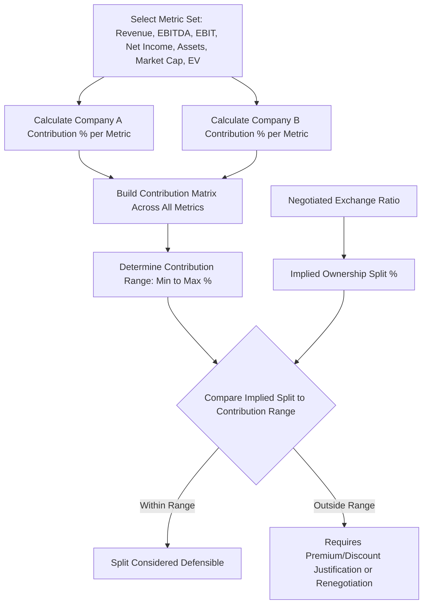

## Contribution Analysis

### Overview

Contribution analysis evaluates the relative ownership split in a merger or business combination by comparing what each party "contributes" to the combined entity across various financial and operating metrics, against what each party would actually receive in ownership of the combined entity under a proposed exchange ratio. It is used predominantly in stock-for-stock mergers of relative equals, where there is no single clear "acquirer paying a premium to a target," but rather a negotiation over the appropriate relative ownership split between two (or more) constituent companies' shareholders. Unlike accretion/dilution analysis, which asks whether a deal improves the acquirer's EPS, contribution analysis asks a more foundational fairness question: does the proposed ownership split reasonably reflect each party's relative contribution to the value of the combined entity?

### When Contribution Analysis Is the Primary Framework

**Key Points**

- Most applicable to **mergers of equals (MOE)** structures, where two companies of broadly comparable size combine, typically through a stock-for-stock exchange, and neither party pays a cash premium in the traditional acquisition sense.
- Also relevant in situations where determining the "accounting acquirer" is not obvious (relevant for PPA purposes as covered separately), since contribution analysis provides one data point informing that determination, alongside relative voting rights and governance composition.
- Less relevant in traditional acquisitions with a clear acquirer and target and a cash or premium-priced stock consideration, where accretion/dilution and premium-to-target analyses are the primary lenses instead.
- Boards and financial advisors use contribution analysis as a **fairness-opinion input**, testing whether a negotiated exchange ratio is defensible relative to objective, multi-metric contribution percentages, rather than relying on a single metric that either party could selectively emphasize to argue for a more favorable split.

### Core Methodology

**Step 1 — Select Relevant Financial and Operating Metrics**

Contribution analysis is calculated across multiple metrics simultaneously, since any single metric can be manipulated or coincidentally favor one party, while a broad set of metrics provides a more robust, triangulated picture.

**Common Metrics Used**

- Revenue (most recent fiscal year, and often a forward projected year)
- EBITDA
- EBIT
- Net income
- Total assets / net assets
- Market capitalization (standalone, pre-announcement)
- Enterprise value (standalone, pre-announcement, derived from a standalone DCF or trading comparables)

**Step 2 — Calculate Each Party's Contribution Percentage per Metric**

$$Contribution\%_{Company\ A} = \frac{Metric_{Company\ A}}{Metric_{Company\ A} + Metric_{Company\ B}}$$

This is calculated independently for every selected metric, producing a matrix of contribution percentages rather than a single figure.

**Step 3 — Compare Contribution Percentages to Proposed (or Implied) Ownership Split**

$$Implied\ Ownership\%_{Company\ A} = \frac{Shares_{Company\ A}\ post\text{-}exchange}{Shares_{Company\ A}\ post\text{-}exchange + Shares_{Company\ B}\ post\text{-}exchange}$$

The proposed or negotiated ownership split (derived from the exchange ratio) is then benchmarked against the range of contribution percentages calculated across the metric set, to assess whether the negotiated split falls within, above, or below what the underlying financial contribution data would suggest is a reasonable range.

===MERMAID_DIAGRAM===





```
### Worked Example

**Assumptions**

Two companies, Company A and Company B, are negotiating a merger of equals via stock-for-stock exchange.

| Metric | Company A | Company B | A Contribution % | B Contribution % |
|---|---|---|---|---|
| Revenue (LTM) | \$800M | \$600M | 57.1% | 42.9% |
| EBITDA (LTM) | \$180M | \$100M | 64.3% | 35.7% |
| Net Income (LTM) | \$95M | \$60M | 61.3% | 38.7% |
| Total Assets | \$1,200M | \$1,000M | 54.5% | 45.5% |
| Standalone Market Cap | \$2,400M | \$1,600M | 60.0% | 40.0% |

**Step 1 — Calculate Contribution Range**

Across the five metrics, Company A's contribution ranges from a low of 54.5% (Total Assets) to a high of 64.3% (EBITDA), with the market-cap-based contribution (which reflects the market's own pre-announcement view of relative value, inclusive of growth and risk differences that pure operating metrics do not capture) at 60.0%.

**Step 2 — Compare to Proposed Exchange Ratio**

Suppose the parties have negotiated an exchange ratio implying Company A shareholders will own 58% of the combined entity and Company B shareholders 42%.

**Output**

The negotiated 58%/42% split falls within the observed contribution range of 54.5%–64.3% across the metric set, and is reasonably close to the market-cap-implied contribution of 60.0%, suggesting the negotiated split is broadly defensible from a contribution-analysis perspective. If the negotiated split had instead been, for example, 50%/50% despite Company A contributing 60%+ across most metrics, that would represent Company A shareholders receiving a smaller ownership stake than their standalone contribution would suggest — which might be justified by other negotiated terms (governance concessions to Company A, such as board seats or executive leadership roles, or a control premium consideration flowing the other direction) but would need explicit rationale beyond the raw contribution percentages alone.

### Weighting and Interpretation Considerations

**Key Points**
- **No single metric is definitive**: Revenue-based contribution ignores profitability and margin differences; EBITDA and net income-based contribution can be distorted by differing capital structures, tax positions, or one-time items; asset-based contribution can be distorted by differing accounting policies (e.g., historical cost carrying values that do not reflect current fair value) or capital intensity differences between the businesses. A robust contribution analysis presents the full range and pattern across metrics rather than anchoring on one.
- **Market capitalization contribution is often weighted most heavily** in practice, since it reflects the market's forward-looking, risk-adjusted view of each company's value — capturing growth prospects, competitive positioning, and risk that trailing financial metrics alone do not — though standalone pre-announcement market cap can itself be distorted by short-term trading noise, analyst coverage differences, or float/liquidity differences between the two stocks.
- **Forward-looking (projected) metrics** are often included alongside trailing metrics, since a company with faster projected growth may reasonably argue for a larger ownership share than trailing metrics alone would suggest, reflecting the combined entity's future earnings power rather than only its historical performance.
- **Synergy allocation is a separate negotiation layer**: Contribution analysis addresses the relative value of the two standalone businesses; it does not by itself resolve how the value of *combination synergies* should be split between the two shareholder bases, which is frequently a distinct and separately negotiated element of the overall deal (sometimes addressed through mechanisms like collars on the exchange ratio, or governance/board composition concessions rather than pure economic ownership adjustments).

### Control Premium Considerations

Contribution analysis based purely on standalone financial or market metrics implicitly assumes no control premium is being paid by either side, appropriate for a genuine merger-of-equals structure where neither party's shareholders are receiving a premium for ceding control. This differs fundamentally from a traditional acquisition premium analysis, where the acquirer pays a premium to the target's standalone trading price specifically to compensate target shareholders for relinquishing control. `[Inference]` In practice, many transactions structured nominally as "mergers of equals" do still involve implicit premium or discount elements once the full package of consideration, governance rights, and named leadership roles is considered holistically, meaning contribution analysis is best used as one component of a broader fairness assessment rather than as a standalone, definitive answer to what the "correct" ownership split should be.

### Relationship to Accounting Acquirer Determination

Under ASC 805 and IFRS 3, contribution analysis metrics (particularly relative fair value contributed) are among the factors considered in determining the accounting acquirer in a business combination where the answer is not obvious from voting rights or governance structure alone — relevant because the accounting acquirer determination affects which entity's assets are stepped up to fair value under purchase accounting (as covered in Purchase Price Allocation Fundamentals) and which entity's historical financial statements become the historical financial statements of the combined public entity going forward.

### Common Pitfalls in Contribution Analysis

**Key Points**
- **Comparing metrics measured on inconsistent bases**: Mixing trailing-twelve-month figures for one company with forward-projected figures for the other, or comparing metrics calculated under different accounting policies (e.g., different revenue recognition treatments) without normalization, produces a misleading contribution picture.
- **Ignoring one-time and non-recurring items**: Failing to normalize EBITDA or net income for one-time charges (restructuring costs, litigation settlements, impairments) at either company can materially skew the contribution percentages away from a "normalized" or run-rate economic reality.
- **Overweighting a single favorable metric**: Either party's advisors may be incentivized to emphasize whichever metric most favors their client's desired ownership split; a rigorous, board-level contribution analysis should present the complete metric set transparently rather than a curated subset.
- **Failing to reflect capital structure differences**: A company with significantly more net debt should logically contribute less to combined *equity* value than to combined *enterprise* value for the same operating metrics, meaning equity-value-based contribution splits (appropriate for a stock-for-stock exchange, which allocates equity ownership) should generally be based on equity-relevant metrics (market cap, net income) or enterprise-value metrics adjusted for net debt differences, rather than pure enterprise-level operating metrics like EBITDA applied without a net debt adjustment.

**Next Steps**
- Accretion and Dilution Analysis
- Purchase Price Allocation Fundamentals
- Exchange Ratio Mechanics and Collar Structures in Stock-for-Stock Mergers
- Fairness Opinions and the Role of Financial Advisors in M&A
- Determining the Accounting Acquirer Under ASC 805
- Control Premium Analysis in Traditional Acquisitions


```