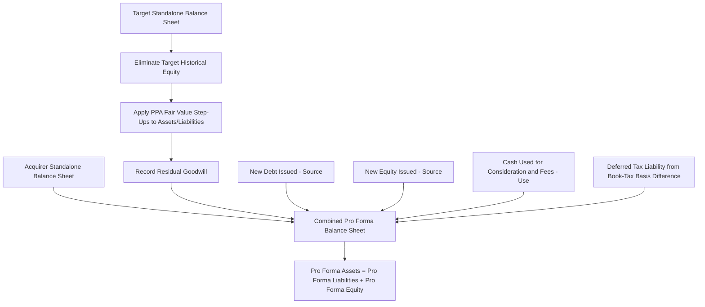

## Merger Consequences and Pro Forma Analysis


### Overview

Merger consequences and pro forma analysis is the comprehensive financial modeling exercise that projects the combined entity's financial statements — income statement, balance sheet, and cash flow statement — following an acquisition, incorporating every mechanical accounting and financing effect the transaction produces. It is the integrating framework that consolidates accretion/dilution analysis, purchase price allocation, synergy quantification, and financing structure into a single coherent set of pro forma financial statements, from which credit metrics, capital structure ratios, and covenant compliance can be assessed. Where accretion/dilution analysis isolates the EPS question specifically, merger consequences analysis is the fuller picture: it answers how the combined entity's entire financial profile — leverage, liquidity, credit quality, and balance sheet composition — changes as a direct result of the transaction and its financing.

### Building the Pro Forma Balance Sheet

**Key Points**

- The pro forma balance sheet combines the acquirer's and target's balance sheets, eliminates intercompany balances (if any pre-existing relationship existed), applies purchase price allocation fair value adjustments to the target's assets and liabilities, and reflects the sources and uses of funds for the transaction.
- This is fundamentally a **sources and uses of funds** exercise layered onto a **combination and adjustment** exercise, and both must reconcile: total sources must equal total uses, and the adjusted combined balance sheet must balance (assets = liabilities + equity) after all adjustments.

**Sources and Uses of Funds**

| Sources | Uses |
| --- | --- |
| New debt issued | Cash consideration paid to target shareholders |
| New equity issued | Repayment of target's existing debt (if refinanced) |
| Acquirer's existing cash used | Transaction fees and expenses (advisory, legal, financing fees) |
| Target's existing cash (if applied to fund the deal) | Integration/restructuring reserve (if pre-funded) |

$$\sum Sources = \sum Uses$$

**Balance Sheet Combination and Adjustment Sequence**

1. Start with acquirer's standalone balance sheet and target's standalone balance sheet, side by side.
2. Eliminate the target's pre-existing equity accounts entirely (common stock, additional paid-in capital, retained earnings, accumulated other comprehensive income) — since under acquisition accounting, the target's historical equity does not carry forward; it is replaced by the acquirer's consideration paid.
3. Apply purchase price allocation fair value step-ups to the target's identifiable tangible and intangible assets and liabilities, as covered under purchase price allocation methodology.
4. Record goodwill as the residual balancing figure.
5. Reflect new debt issued (increasing liabilities) and new equity issued (increasing acquirer's equity accounts) per the financing structure.
6. Reflect cash used to fund the cash portion of consideration and transaction fees (reducing cash).
7. Reflect deferred tax assets/liabilities arising from book-tax basis differences created by the fair value step-ups (as covered under Purchase Price Allocation Fundamentals).

===MERMAID_DIAGRAM===





```
### Pro Forma Income Statement Construction

The pro forma income statement combines the acquirer's and target's standalone income statements on a **trailing twelve-month or projected forward-year basis**, then layers in the mechanical adjustments arising from the transaction.

**Key Adjustment Layers**
- **Incremental interest expense** from new acquisition debt, net of any interest income foregone on cash used (as detailed in accretion/dilution analysis)
- **Incremental depreciation and amortization** from the fair value step-up of tangible and intangible assets under purchase accounting
- **Elimination of one-time deal-related costs** that are non-recurring in nature (advisory fees, legal fees) from the *pro forma* presentation, since these are one-time and not reflective of go-forward combined entity economics — though they do hit actual reported GAAP earnings in the period incurred
- **Synergy phase-in**, per the realization ramp schedule covered under synergy quantification
- **Elimination of intercompany transactions**, if the acquirer and target had a pre-existing commercial relationship (e.g., the acquirer was a customer or supplier of the target), to avoid double-counting revenue/expense that becomes intercompany and eliminates in consolidation

### Credit Statistics and Leverage Analysis

For any transaction involving new debt financing, assessing the pro forma credit profile is essential — both for internal capital structure decision-making and because rating agencies and existing bondholders/lenders will scrutinize these same metrics, often triggering change-of-control or covenant provisions in the target's or acquirer's existing debt agreements.

**Core Leverage Metrics**

$$Total\ Debt\ /\ EBITDA = \frac{Pro\ Forma\ Total\ Debt}{Pro\ Forma\ Combined\ EBITDA\ (including\ run\text{-}rate\ synergies,\ if\ credit\ agencies\ permit)}$$

$$Net\ Debt\ /\ EBITDA = \frac{Pro\ Forma\ Total\ Debt - Pro\ Forma\ Cash}{Pro\ Forma\ Combined\ EBITDA}$$

$$Interest\ Coverage\ Ratio = \frac{Pro\ Forma\ EBITDA}{Pro\ Forma\ Interest\ Expense}$$

$$Fixed\ Charge\ Coverage\ Ratio = \frac{EBITDA - Capex}{Interest\ Expense + Mandatory\ Debt\ Amortization}$$

`[Inference]` Whether run-rate (not-yet-fully-realized) synergies can be included in the EBITDA figure used for credit metric calculation depends on the specific credit agreement's definitions and the rating agency's own methodology; more conservative and typically more defensible analyses use only currently-realized EBITDA (excluding unrealized synergies) for credit metric purposes, since including projected-but-unrealized synergies in a leverage ratio can overstate the entity's actual current debt-servicing capacity.

**Example: Leverage Analysis**

An acquirer with standalone EBITDA of \$300M and existing debt of \$600M (2.0x leverage) acquires a target with EBITDA of \$150M, funding the \$1,200M purchase price with \$700M in new debt and \$500M in new equity.

- Pro forma combined EBITDA (pre-synergy): \$300M + \$150M = \$450M
- Pro forma total debt: \$600M (existing) + \$700M (new) = \$1,300M
- Pro forma Debt/EBITDA: \$1,300M / \$450M = **2.9x**

This represents a leverage increase from the acquirer's standalone 2.0x to a pro forma 2.9x, which would need to be assessed against the acquirer's stated leverage policy, existing debt covenant maximums, and credit rating agency thresholds for the acquirer's target rating category.

### Rating Agency and Covenant Considerations

**Key Points**
- **Change-of-control provisions**: Existing debt of either the acquirer or the target may contain change-of-control put provisions, requiring the issuer to offer to repurchase the debt (often at 101% of par) if a change of control occurs, which can create an unexpected near-term cash outflow requirement that must be factored into the sources and uses of funds.
- **Financial maintenance covenants**: Existing credit agreements often contain maximum leverage ratio or minimum interest coverage ratio covenants; pro forma leverage analysis must confirm the transaction (as financed) does not breach these thresholds, or that appropriate waivers or amendments have been obtained as a condition to closing.
- **Rating agency response**: Rating agencies (Moody's, S&P, Fitch) typically issue a rating action or outlook change upon deal announcement, reflecting their preliminary assessment of pro forma credit metrics, financing mix, and strategic rationale; the final rating is typically confirmed closer to or at closing once definitive financing terms are known. `[Unverified]` The specific quantitative thresholds separating rating categories (e.g., what leverage level is consistent with a BBB versus BB rating) vary by industry, business risk profile, and the specific rating agency's current methodology, and should be verified against current published rating agency criteria for the relevant sector rather than assumed from generic leverage benchmarks.
- **Springing covenants and incurrence tests**: New acquisition debt is frequently structured with incurrence-based covenants (tested only when a specific triggering event occurs, such as issuing additional debt) rather than maintenance covenants (tested continuously), a structural distinction that affects how much operating flexibility the combined entity retains post-close.

### Pro Forma Cash Flow Statement and Liquidity Analysis

**Key Points**
- Pro forma free cash flow must reflect the full combined entity's cash generation capacity, net of the incremental cash interest expense from new acquisition debt and net of any incremental capex required for integration (systems consolidation, facility retrofits) or to support committed synergy realization.
- **Debt paydown schedule and deleveraging trajectory**: For highly levered transactions (particularly private equity-sponsored or debt-heavy strategic deals), the pro forma model typically projects the multi-year deleveraging path, showing how pro forma Debt/EBITDA is expected to decline over time through a combination of EBITDA growth (organic plus synergy realization) and mandatory/voluntary debt paydown from free cash flow.
- **Minimum cash / liquidity covenant compliance**: Beyond leverage covenants, many credit agreements also require maintaining minimum cash balances or undrawn revolver capacity; pro forma liquidity analysis should confirm sufficient headroom exists immediately post-close, when cash balances are typically at their most constrained point in the entire projection period due to the cash consideration paid and transaction fees incurred.

### Combined Entity Ratio and Capital Structure Impact Summary

| Metric Category | Pre-Deal (Acquirer Standalone) | Post-Deal (Pro Forma) | Typical Direction of Change |
|---|---|---|---|
| Leverage (Debt/EBITDA) | Baseline | Adjusted for new debt and combined EBITDA | Increases if debt-funded; may decrease if primarily equity-funded and target has lower relative leverage |
| Interest Coverage | Baseline | Adjusted for new interest expense | Decreases if debt-funded |
| EPS (Basic/Diluted) | Baseline | Adjusted per accretion/dilution mechanics | Accretive or dilutive depending on financing mix and relative multiples |
| Return on Invested Capital (ROIC) | Baseline | Combined NOPAT / Combined Invested Capital (inclusive of goodwill) | Frequently decreases initially due to goodwill inflating the invested capital base, before improving as synergies are realized |
| Working Capital / Liquidity | Baseline | Adjusted for cash used and any working capital fair value adjustments | Typically decreases at close due to cash consideration paid |

`[Speculation]` The initial ROIC dilution effect from goodwill is a commonly observed pattern in acquisitive companies' post-deal metrics and is one reason some analysts and management teams prefer to track "cash ROIC" or returns excluding acquisition-related intangibles and goodwill when assessing underlying operational performance trends, separate from the accounting effects of the specific transactions completed, though the appropriate adjusted metric methodology varies by company and analyst convention.

### Integrated Merger Consequences Model — Component Checklist

1. **Sources and uses of funds table**, reconciling total financing sources to total transaction uses
2. **Pro forma balance sheet**, incorporating PPA fair value adjustments, goodwill, new financing, and elimination of target's historical equity
3. **Pro forma income statement**, incorporating incremental interest expense, incremental D&A, synergy phase-in, and elimination of non-recurring deal costs
4. **Accretion/dilution summary**, derived directly from the pro forma income statement and share count
5. **Credit statistics summary**, covering leverage, coverage, and liquidity ratios against covenant thresholds and rating agency benchmarks
6. **Multi-year deleveraging / cash flow projection**, showing the path of credit metric normalization over the projection horizon
7. **Sensitivity analysis**, flexing key assumptions (synergy realization, financing mix, interest rates, purchase price) across the full set of outputs above, not only the accretion/dilution figure in isolation

**Next Steps**
- Accretion and Dilution Analysis
- Purchase Price Allocation Fundamentals
- Revenue and Cost Synergy Quantification
- Leveraged Buyout (LBO) Modeling and Sponsor Returns Analysis
- Debt Covenant Structuring and Credit Agreement Analysis
- Contribution Analysis


```