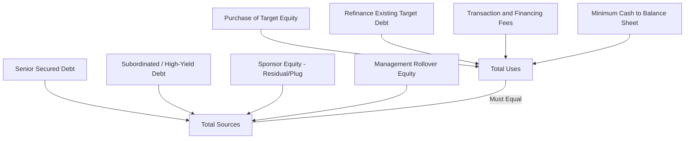

## LBO Model Structure and Sources and Uses


### Overview

A leveraged buyout (LBO) model projects the financial outcome of acquiring a company using a significant proportion of debt financing relative to equity, with the objective of assessing the equity returns a financial sponsor (private equity firm) can achieve over a defined holding period, typically three to seven years. Unlike a standard M&A merger consequences model, which examines an ongoing strategic combination of two operating businesses, an LBO model centers on a single target company acquired predominantly for its cash flow generation capacity relative to the debt burden placed upon it, with sponsor equity returns driven by a combination of EBITDA growth, debt paydown (deleveraging), and multiple expansion at exit. The sources and uses schedule is the foundational building block of any LBO model, establishing exactly how the transaction is financed and what that financing is used to pay for, before any operating projections or returns analysis can be constructed.

### The Sources and Uses Schedule

**Key Points**

- The sources and uses schedule must balance by construction: total sources of capital must exactly equal total uses of capital, since every dollar required to close the transaction must come from an identified source of financing.
- This schedule is typically the very first table built in any LBO model, since it determines the initial debt balances (which drive interest expense projections), the initial sponsor equity check (which is the denominator for all subsequent equity return calculations), and the resulting pro forma capital structure and leverage ratios.

**Typical Uses of Funds**

| Use | Description |
| --- | --- |
| Purchase of Target Equity | Equity purchase price paid to existing target shareholders, based on the agreed enterprise value less existing net debt, or directly on an agreed equity value |
| Refinancing of Existing Target Debt | Repayment of the target's pre-existing debt, which is typically retired at close (via change-of-control provisions or simply as a condition of the new capital structure) |
| Transaction Fees and Expenses | Investment banking advisory fees, legal fees, accounting/diligence fees, and other transaction-related professional costs |
| Financing Fees | Fees paid to arrange the new debt financing (arrangement fees, original issue discount on debt, commitment fees), typically capitalized and amortized over the life of the debt rather than expensed immediately |
| Minimum Cash / Cash-to-Balance-Sheet | An amount of cash left on the pro forma balance sheet for ongoing operating liquidity needs, distinct from cash used to fund the transaction itself |

**Typical Sources of Funds**

| Source | Description |
| --- | --- |
| Senior Secured Debt (Term Loan A/B, Revolving Credit Facility) | Lowest-cost, highest-priority debt tranche, typically secured by a first lien on substantially all assets |
| Second Lien / Subordinated Debt | Higher-cost debt tranche, subordinated to senior secured debt in a liquidation/default scenario, compensating lenders for increased risk with a higher coupon |
| High-Yield Bonds / Mezzanine Debt | Unsecured or deeply subordinated financing, often including features like payment-in-kind (PIK) interest or warrants/equity kickers, used to bridge the gap between senior debt capacity and the total financing need |
| Sponsor Equity | The private equity firm's cash equity contribution, representing the residual financing need after all debt sources are exhausted, and forming the basis (denominator) for the sponsor's equity return calculation |
| Management Rollover Equity | Existing management's reinvestment of a portion of their proceeds from the sale back into the new capital structure, aligning management incentives with the sponsor's post-close performance |

$$\sum Sources = \sum Uses$$

**Sponsor Equity as the Balancing Figure**

$$Sponsor\ Equity = Total\ Uses - (Total\ Debt\ Raised + Management\ Rollover)$$

In practice, sponsor equity is frequently *not* a pure plug but is itself constrained by a target capital structure the sponsor is trying to achieve (e.g., a target leverage ratio the sponsor and lenders have agreed is appropriate for the target's cash flow profile and industry), meaning the debt quantum is often determined first (based on the target's debt capacity, discussed below), with sponsor equity as the residual required to complete the financing.

===MERMAID_DIAGRAM===





```
### Determining the Purchase Price and Enterplugin Value Bridge

**Enterprise Value to Equity Purchase Price Bridge**

$$Equity\ Purchase\ Price = Enterprise\ Value - Total\ Debt + Cash\ and\ Cash\ Equivalents$$

Where Enterprise Value is typically derived from an agreed EV/EBITDA multiple applied to the target's LTM (last twelve months) or projected forward EBITDA:

$$Enterprise\ Value = EBITDA_{LTM} \times Purchase\ Multiple$$

`[Inference]` The specific purchase multiple is a negotiated outcome informed by comparable transaction multiples, trading comparables for public peers, and the specific target's growth profile and quality, and is not itself derived mechanically within the LBO model — the LBO model takes the purchase multiple as an input assumption and solves for financing feasibility and returns given that price, rather than determining the "correct" price independently.

### Debt Capacity and Capital Structure Design

Debt capacity in an LBO is typically constrained by the target's cash flow generation ability, expressed through leverage multiples that lenders are willing to extend relative to EBITDA.

**Key Points**
- **Total leverage multiple** (Total Debt / EBITDA) is the primary sizing metric lenders and sponsors use to determine how much debt the target's cash flows can reasonably support while maintaining adequate coverage of interest and mandatory amortization.
- `[Unverified]` Typical total leverage multiples for LBO transactions have varied significantly across credit cycles and by industry (higher for stable, high-margin, low-capex businesses with predictable recurring revenue; lower for cyclical, capital-intensive, or lower-margin businesses), and any specific numerical benchmark should be checked against current market conditions and comparable recent transaction data rather than assumed from a generic historical range, given how materially leveraged finance market conditions shift across credit cycles.
- **Tranching by seniority and cost**: The capital structure is typically layered from lowest-cost/most-senior (revolving credit facility, Term Loan A/B) to highest-cost/most-subordinated (second lien, mezzanine, or seller notes), with each tranche sized based on lender-specific risk appetite and the incremental leverage multiple it represents on a cumulative basis.

**Illustrative Capital Structure Tranching**

| Tranche | Leverage Multiple (Cumulative) | Illustrative Cost |
|---|---|---|
| Revolving Credit Facility (undrawn at close) | — | SOFR + spread |
| Term Loan B (Senior Secured) | 0x – 4.0x | SOFR + spread |
| Senior Subordinated / High-Yield Notes | 4.0x – 5.5x | Fixed coupon, higher than senior debt |
| Sponsor Equity | Residual | N/A (equity return, not a fixed cost) |

### Building the Post-Transaction Opening Balance Sheet

Following the sources and uses schedule, the LBO model constructs the pro forma opening balance sheet immediately following the transaction close, analogous to the merger consequences balance sheet construction but centered on a single target rather than a combination of two operating entities.

**Key Adjustments**
- **Elimination of target's pre-existing equity** and pre-existing debt (replaced by new sponsor equity and new acquisition debt)
- **Purchase price allocation**: fair value step-up of identifiable tangible and intangible assets, and recognition of goodwill as the residual, following the same ASC 805/IFRS 3 framework covered under Purchase Price Allocation Fundamentals
- **Capitalized financing fees**: recorded as a contra-liability (debt discount) or a separate asset, amortized over the life of the associated debt instrument as a non-cash addition to interest expense over the projection period
- **Capitalized transaction fees**: typically expensed immediately (for advisory/legal/diligence fees) rather than capitalized, consistent with the treatment under acquisition accounting more broadly

### Structuring the Debt Schedule

The debt schedule is the mechanical engine that links the sources and uses schedule to the projected income statement (through interest expense) and cash flow statement (through mandatory and optional debt paydown), and is one of the most detail-intensive components of any LBO model.

**Key Components**
- **Mandatory amortization**: Term loans typically require scheduled mandatory principal repayment (e.g., 1% of original principal per year for a Term Loan B, though specific terms vary by facility and credit agreement), independent of excess cash flow generation.
- **Cash flow sweep (mandatory prepayment from excess cash flow)**: Many credit agreements require a percentage (often ranging based on leverage-based step-downs) of excess free cash flow, after mandatory items, to be applied to prepay outstanding term debt, accelerating deleveraging beyond the scheduled mandatory amortization alone.
- **Revolver draw/paydown mechanics**: The revolving credit facility functions as a working capital buffer, drawn upon in periods of negative free cash flow (or seasonal working capital needs) and paid down first when excess cash is available, typically before any voluntary prepayment of term debt.
- **Interest expense circularity**: Since interest expense depends on the debt balance, which depends on cash flow available for paydown, which itself depends on net income (which is reduced by interest expense), the debt schedule is inherently circular and typically requires either an iterative calculation setting (enabling iterative calculation in the spreadsheet application) or a circularity-breaking mechanism (such as a toggle switch using average beginning/ending balances with a copy-paste-values approach, or an average-balance method with a manually lagged reference) to resolve without generating a circular reference error.

$$Interest\ Expense_t = Beginning\ Debt\ Balance_t \times Interest\ Rate + Amortized\ Financing\ Fees_t$$

$$Ending\ Debt\ Balance_t = Beginning\ Debt\ Balance_t - Mandatory\ Amortization_t - Cash\ Flow\ Sweep_t$$

### Illustrative Worked Sources and Uses Example

**Assumptions**
- Target LTM EBITDA: \$100M
- Agreed purchase multiple: 9.0x EV/EBITDA
- Target's existing net debt at close: \$50M (to be refinanced)
- Transaction and financing fees: \$25M
- Minimum cash to remain on balance sheet: \$10M
- Agreed capital structure: 5.0x Total Debt / EBITDA, remainder funded by sponsor equity (no management rollover in this illustration)

**Step 1 — Enterprise Value and Equity Purchase Price**

$$EV = \$100M \times 9.0x = \$900M$$
$$Equity\ Purchase\ Price = \$900M - \$50M\ (net\ debt) = \$850M$$

**Step 2 — Total Uses**

- Equity Purchase Price: \$850M
- Refinance Existing Debt: \$50M
- Transaction and Financing Fees: \$25M
- Minimum Cash to Balance Sheet: \$10M
- **Total Uses: \$935M**

**Step 3 — Total Debt Raised**

$$Total\ Debt = 5.0x \times \$100M = \$500M$$

**Step 4 — Sponsor Equity (Balancing Figure)**

$$Sponsor\ Equity = \$935M - \$500M = \$435M$$

**Output**

The transaction requires \$935M in total uses, funded by \$500M in new acquisition debt (5.0x leverage) and \$435M in sponsor equity, implying the sponsor is funding approximately 46.5% of the total transaction value with equity — a capital structure that will directly determine the denominator against which the sponsor's eventual exit equity value is measured to calculate the internal rate of return (IRR) and multiple on invested capital (MOIC), covered in returns analysis.

### Common Model-Building Errors in Sources and Uses Construction

**Key Points**
- **Omitting financing fees or transaction fees from total uses**, understating the actual equity check required and thus overstating projected returns relative to the capital actually deployed.
- **Failing to reconcile enterprise value to equity purchase price correctly**, particularly mishandling target cash (which reduces the equity price paid, since the buyer effectively receives that cash) versus target debt (which increases the amount that must be refinanced or assumed).
- **Inconsistent minimum cash treatment**, either omitting a minimum operating cash requirement entirely (understating uses) or double-counting it by both including it in uses and separately leaving it on the balance sheet without eliminating it from the "cash used to fund the transaction" calculation.
- **Ignoring debt capacity constraints from actual lender market conditions**, assuming a leverage multiple that is aspirational rather than grounded in current leveraged finance market conditions and the specific target's credit profile, which produces a sources and uses schedule that is arithmetically correct but not realistically financeable.

**Next Steps**
- LBO Returns Analysis: IRR and Multiple on Invested Capital (MOIC)
- Debt Schedule Construction and Circularity Resolution Techniques
- Exit Multiple Assumptions and Multiple Expansion/Contraction Sensitivity
- Management Rollover and Incentive Equity (Management Option Pool) Structuring
- Dividend Recapitalization Mechanics in LBO Holding Periods
- Credit Agreement Covenant Structuring in Leveraged Finance


```