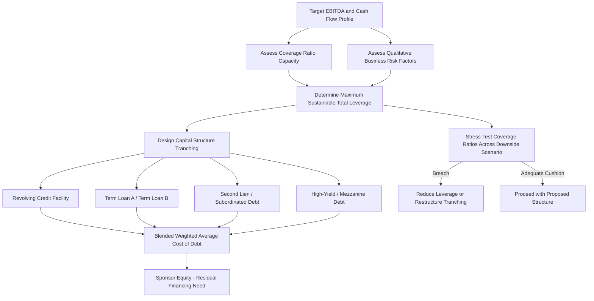

## Debt Capacity and Financing Structure Analysis

### Overview

Debt capacity analysis determines the maximum amount of debt a target company's cash flows can reasonably support while maintaining adequate coverage of interest, principal amortization, and operating needs across a range of business and economic scenarios. It is the critical constraint that shapes an LBO's feasibility before returns can even be projected: the sources and uses schedule (covered separately) assumes a debt quantum as an input, but that quantum must itself be grounded in a defensible assessment of what the target's cash flow profile, asset base, and industry characteristics can actually support without creating unacceptable default risk. Financing structure analysis extends this further into designing the specific tranching, seniority, pricing, and covenant package that allocates the debt capacity across a capital structure optimized for cost, flexibility, and lender appetite.

### Cash Flow-Based Debt Capacity

**Key Points**

- The primary constraint on debt capacity in most LBOs is the target's ability to service debt from free cash flow, rather than asset collateral value, distinguishing corporate/cash-flow LBO lending from asset-based lending.
- Lenders and sponsors assess debt capacity through forward-looking coverage ratio projections across the hold period, not merely a single closing-date leverage multiple, since a transaction that appears feasible at close can become distressed if cash flow does not develop as projected.

**Core Coverage Metrics**

$$Interest\ Coverage\ Ratio = \frac{EBITDA}{Cash\ Interest\ Expense}$$


$$Fixed\ Charge\ Coverage\ Ratio = \frac{EBITDA - Capex - Cash\ Taxes}{Interest\ Expense + Mandatory\ Debt\ Amortization}$$


$$Debt\ Service\ Coverage\ Ratio\ (DSCR) = \frac{Cash\ Flow\ Available\ for\ Debt\ Service}{Total\ Debt\ Service\ (Interest + Scheduled\ Principal)}$$

`[Inference]` Lenders typically require minimum coverage ratio thresholds throughout the projected hold period, not just in the base case but stress-tested under a downside scenario, since a capital structure that only clears covenant thresholds in the base case provides no margin of safety against normal business cyclicality — the specific minimum thresholds vary meaningfully by industry, lender type, and credit market conditions at the time of financing, and should be benchmarked against current comparable transaction data rather than a fixed rule of thumb.

### Qualitative Determinants of Debt Capacity

Beyond the quantitative coverage ratios, debt capacity is significantly influenced by qualitative business characteristics that determine cash flow predictability and resilience.

**Key Factors Supporting Higher Leverage**

- **Revenue visibility and recurring revenue mix**: Businesses with contracted, subscription-based, or otherwise highly recurring revenue (long-term customer contracts, high switching costs, regulated revenue) support higher leverage than businesses with lumpy, project-based, or highly cyclical revenue, since lenders can underwrite more confidently to a predictable cash flow stream.
- **High and stable margins**: Businesses with high EBITDA margins and low margin volatility provide greater cash flow cushion to absorb unexpected cost increases or revenue softness without breaching coverage thresholds.
- **Low capital intensity**: Businesses requiring minimal ongoing maintenance capex retain more free cash flow after EBITDA for debt service, supporting higher sustainable leverage relative to EBITDA than capital-intensive businesses where a large share of EBITDA is consumed by required reinvestment.
- **Asset base and collateral quality**: Tangible, readily valued, and liquid assets (real estate, receivables, inventory with an active resale market) support asset-based lending structures or provide downside collateral protection that can support incremental leverage beyond what cash flow coverage alone would justify.
- **Market position and competitive moat**: Businesses with durable competitive advantages (market leadership, high barriers to entry, strong brand) carry lower business risk, supporting higher sustainable leverage than businesses in fragmented, highly competitive, or disruption-prone industries.

**Key Factors Constraining Leverage**

- Cyclicality (exposure to GDP, commodity prices, or discretionary consumer spending)
- Customer concentration (a small number of customers representing a large share of revenue)
- Regulatory or technological disruption risk
- High working capital intensity or seasonality creating intra-year liquidity swings

### Capital Structure Tranching and the Cost-of-Capital Trade-off

Financing structure design involves layering debt tranches by seniority, with each tranche's cost reflecting its relative position in the capital structure and corresponding risk to that lender class.

**Typical Tranche Hierarchy (Senior to Junior)**

| Tranche | Security Position | Typical Pricing Basis | Typical Amortization |
| --- | --- | --- | --- |
| Revolving Credit Facility | First lien, senior secured | Floating reference rate + spread | Revolving, no scheduled amortization |
| Term Loan A | First lien, senior secured | Floating reference rate + spread | Meaningful scheduled amortization |
| Term Loan B | First lien, senior secured (or pari passu with TLA) | Floating reference rate + spread | Minimal scheduled amortization (often ~1%/year), bullet at maturity |
| Second Lien Term Loan | Second lien, subordinated | Higher floating spread | Typically bullet, minimal amortization |
| Senior Unsecured / High-Yield Notes | Unsecured | Fixed coupon | Bullet at maturity |
| Subordinated / Mezzanine Debt | Deeply subordinated, often with equity kicker | Fixed coupon, sometimes with PIK component | Bullet at maturity |
| Seller Notes | Subordinated, provided by selling shareholders | Fixed coupon, often below-market | Bullet or deferred |

**Key Points**

- **Term Loan A vs. Term Loan B distinction**: Term Loan A is typically held by traditional bank lenders, carries a shorter maturity, and requires more meaningful mandatory amortization; Term Loan B is typically syndicated to institutional investors (CLOs, credit funds), carries a longer maturity, and requires minimal amortization (often around 1% annually) with the bulk of principal due at maturity — a structural feature that significantly affects the projected cash flow available for optional debt paydown or sponsor distributions during the hold period.
- **PIK (payment-in-kind) interest** in subordinated tranches accrues to the principal balance rather than being paid in cash, preserving near-term cash flow for more senior obligations at the cost of a growing principal balance to be repaid or refinanced at maturity or exit.
- **Equity kickers (warrants)** attached to subordinated or mezzanine tranches compensate that lender class for bearing higher risk with below-senior-priority claims, by providing some participation in the equity upside alongside the fixed coupon return.

===MERMAID_DIAGRAM===





```
### Worked Example: Debt Capacity Sizing

**Assumptions**
- Target EBITDA: \$120M, projected to grow 5% annually
- Maintenance capex: \$15M annually (12.5% of EBITDA — moderate capital intensity)
- Cash tax rate: 25%
- Lenders require minimum 1.5x Fixed Charge Coverage Ratio in a downside case assuming a 15% EBITDA decline
- Proposed structure: Term Loan B priced at reference rate + 400bps, assume all-in cash cost of 8.5%; mandatory amortization 1%/year

**Step 1 — Downside Case EBITDA**

$$EBITDA_{downside} = \$120M \times (1 - 0.15) = \$102M$$

**Step 2 — Maximum Debt Service Supportable at 1.5x Minimum FCCR**

$$Debt\ Service_{max} = \frac{EBITDA_{downside} - Capex - Cash\ Taxes}{1.5}$$

Approximating cash taxes conservatively at the downside EBITDA level (simplified, pre-interest-shield for illustration): assume \$102M EBITDA less \$15M capex less approximately \$18M cash taxes (illustrative) = \$69M available cash flow before debt service.

$$Debt\ Service_{max} = \frac{\$69M}{1.5} = \$46M$$

**Step 3 — Back Into Supportable Debt Quantum**

At an 8.5% all-in cash interest cost plus 1% mandatory amortization (assume on a \$500M principal base for illustration, amortization = \$5M):

$$Total\ Debt\ Service\ per\ \$100M\ of\ Debt \approx \$8.5M\ (interest) + \$1M\ (amortization) = \$9.5M$$

$$Supportable\ Debt \approx \frac{\$46M}{\$9.5M} \times \$100M \approx \$484M$$

**Output**

Against base-case LTM EBITDA of \$120M, a supportable debt quantum of approximately \$484M implies a total leverage multiple of roughly **4.0x EBITDA** is the maximum consistent with maintaining the required 1.5x fixed charge coverage even in a 15% EBITDA downside scenario — providing the sponsor and lenders a data-driven ceiling for capital structure sizing, rather than sizing debt purely off a market-convention leverage multiple applied to the base case without downside stress-testing.

### Covenant Package Design

**Key Points**
- **Maintenance covenants** (tested continuously, typically quarterly, regardless of whether a triggering event occurs) are more common in traditional bank-held Term Loan A and revolving facility tranches, providing lenders ongoing visibility and early intervention rights if credit quality deteriorates.
- **Incurrence covenants** (tested only when a specific action is taken, such as incurring additional debt, making a restricted payment, or completing an acquisition) are more common in institutionally syndicated Term Loan B and high-yield bond structures, providing the borrower greater ongoing operating flexibility at the cost of reduced lender monitoring rights between triggering events.
- **Covenant-lite structures**, which eliminate financial maintenance covenants entirely from the term loan (retaining only incurrence-based tests), became a more prevalent feature of large-cap institutional term loan structures in certain credit market environments. `[Unverified]` The prevalence and terms of covenant-lite structures fluctuate significantly with credit market conditions (more borrower-friendly in loose credit environments, less prevalent in tighter conditions), so the current market convention should be verified against recent comparable transaction data rather than assumed static.
- **Excess cash flow sweep provisions**, typically structured with leverage-based step-downs (e.g., a higher percentage of excess cash flow required to be swept toward debt paydown at higher leverage levels, stepping down as the company delevers below specified thresholds), directly affect the pace of the deleveraging trajectory built into the LBO returns model.

### Sensitivity of Returns to Financing Structure Choices

**Key Points**
- **Leverage magnifies both upside and downside equity returns**: Holding EBITDA growth and exit multiple constant, higher leverage at entry mechanically increases the sponsor's IRR and MOIC in a successful scenario (since the fixed-cost debt claim does not participate in the upside), but equally magnifies downside risk if EBITDA underperforms, since fixed debt service and covenant thresholds do not flex downward with underperforming cash flow.
- **Cost of debt vs. leverage trade-off**: More aggressive (higher) leverage typically requires accessing more subordinated, higher-cost debt tranches, meaning the incremental leverage obtained comes at a rising marginal cost of capital — the financing structure decision is therefore a joint optimization between leverage quantum and blended cost of debt, not a decision to simply maximize leverage without regard to its pricing.
- **Refinancing risk**: Bullet maturity structures (common in Term Loan B and high-yield tranches) concentrate repayment risk at maturity or exit, meaning the sponsor's financing structure choice also embeds an implicit bet on future credit market accessibility and pricing at the point of refinancing or exit, which is inherently uncertain at the time the original structure is designed. `[Speculation]` This refinancing risk is one reason some sponsors favor more conservative leverage or longer-dated maturities in uncertain credit market environments, even at some cost to base-case projected returns, though the appropriate risk-return trade-off is a firm-specific and market-condition-specific judgment rather than a fixed rule.

**Next Steps**
- LBO Model Structure and Sources and Uses
- LBO Returns Analysis: IRR and Multiple on Invested Capital (MOIC)
- Debt Schedule Construction and Circularity Resolution Techniques
- Credit Agreement Covenant Structuring in Leveraged Finance
- Dividend Recapitalization Mechanics in LBO Holding Periods
- Exit Multiple Assumptions and Multiple Expansion/Contraction Sensitivity


```