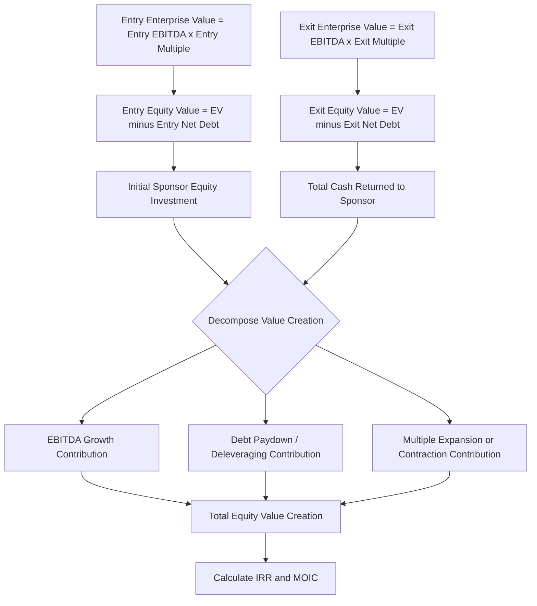

## Returns Analysis Using IRR and Multiple of Invested Capital

### Overview

Returns analysis is the culminating output of an LBO model, translating the projected operating performance, debt paydown trajectory, and exit assumptions established in the sources and uses schedule, debt capacity analysis, and operating model into the two primary metrics sponsors use to evaluate and communicate private equity investment performance: internal rate of return (IRR) and multiple of invested capital (MOIC). These two metrics answer related but distinct questions — IRR captures the time-value-adjusted annualized return, while MOIC captures the absolute multiple of capital returned — and a rigorous LBO analysis decomposes the sources of that return (EBITDA growth, deleveraging, and multiple expansion) to assess the quality and durability of the projected outcome rather than treating the headline return figures as a black box.

### Defining IRR and MOIC

**Internal Rate of Return (IRR)**

IRR is the discount rate at which the net present value of all cash flows in the investment (initial equity outlay as a negative cash flow, and all interim distributions plus final exit proceeds as positive cash flows) equals zero.

$$0 = -Equity\ Investment_0 + \sum_{t=1}^{n} \frac{Interim\ Distributions_t}{(1+IRR)^t} + \frac{Exit\ Equity\ Value_n}{(1+IRR)^n}$$

For the simplified case of a single equity investment at close with no interim distributions and a single exit proceeds event at year $n$:

$$IRR = \left(\frac{Exit\ Equity\ Value}{Initial\ Equity\ Investment}\right)^{\frac{1}{n}} - 1$$

**Multiple of Invested Capital (MOIC)**

$$MOIC = \frac{Total\ Cash\ Returned\ to\ Sponsor}{Total\ Equity\ Invested\ by\ Sponsor} = \frac{\sum Interim\ Distributions + Exit\ Equity\ Value}{Initial\ Equity\ Investment}$$

**Key Points**

- MOIC is time-agnostic: a 3.0x MOIC achieved over three years and a 3.0x MOIC achieved over seven years represent the same absolute capital multiple but very different annualized returns, which is why the two metrics are always presented together rather than in isolation.
- IRR is highly sensitive to the timing of cash flows, particularly early distributions (e.g., from a dividend recapitalization mid-hold), since IRR mathematically rewards capital returned earlier more than economically identical capital returned later — a dynamic that can create an incentive to prioritize early liquidity events even when they are not obviously value-maximizing on a pure MOIC basis.
- `[Inference]` Institutional limited partners (LPs) evaluating private equity fund performance typically weight both metrics, often alongside a public market equivalent (PME) benchmark that compares the fund's cash flow-weighted return to what the same capital would have earned invested in a public index over the same period, since IRR and MOIC alone do not indicate whether the leveraged return premium over public markets justified the illiquidity and risk taken.

### Decomposing Returns: The Three Value Creation Levers

A rigorous LBO returns analysis decomposes total equity value creation into three distinct sources, since the relative contribution of each lever provides insight into how much of the projected return depends on operational execution versus financial engineering versus market timing/multiple assumptions.

**Lever 1 — EBITDA Growth**

$$Value\ Creation_{EBITDA\ Growth} = (EBITDA_{exit} - EBITDA_{entry}) \times Exit\ Multiple$$

Reflects the value created purely from growing the underlying business's cash flow generation (through revenue growth, margin expansion, or both) while holding the valuation multiple constant.

**Lever 2 — Debt Paydown (Deleveraging)**

$$Value\ Creation_{Deleveraging} = Debt_{entry} - Debt_{exit}$$

Reflects the value that accrues to equity purely from paying down debt principal over the hold period using the target's free cash flow, transferring value from the debt claim to the equity claim without any change in enterprise value.

**Lever 3 — Multiple Expansion (or Contraction)**

$$Value\ Creation_{Multiple\ Change} = EBITDA_{exit} \times (Exit\ Multiple - Entry\ Multiple)$$

Reflects the value created (or destroyed) purely from the market's willingness to pay a higher (or lower) EBITDA multiple at exit than the sponsor paid at entry, which is generally the least controllable of the three levers, being a function of market conditions, sector sentiment, and buyer competition at the time of exit rather than sponsor-driven operational execution.

**Reconciliation to Total Equity Value Creation**

$$Total\ Equity\ Value\ Creation = Value\ Creation_{EBITDA\ Growth} + Value\ Creation_{Deleveraging} + Value\ Creation_{Multiple\ Change}$$


$$Exit\ Equity\ Value = Initial\ Equity\ Investment + Total\ Equity\ Value\ Creation$$

===MERMAID_DIAGRAM===





```
### Worked Example

**Assumptions**
- Entry: EBITDA of \$100M, entry multiple 9.0x, entry enterprise value \$900M, entry total debt \$500M (5.0x leverage), sponsor equity investment \$400M (residual after fees, simplified for illustration)
- Hold period: 5 years
- Exit: EBITDA grows to \$140M (5-year CAGR of approximately 7%), exit multiple 9.5x (modest multiple expansion), exit total debt paid down to \$250M through mandatory amortization and cash flow sweep
- No interim distributions during the hold period (all excess cash flow applied to debt paydown)

**Step 1 — Exit Enterprise Value and Equity Value**

$$EV_{exit} = \$140M \times 9.5x = \$1,330M$$
$$Equity\ Value_{exit} = \$1,330M - \$250M = \$1,080M$$

**Step 2 — MOIC**

$$MOIC = \frac{\$1,080M}{\$400M} = 2.70x$$

**Step 3 — IRR**

$$IRR = \left(\frac{\$1,080M}{\$400M}\right)^{\frac{1}{5}} - 1 = (2.70)^{0.2} - 1 \approx 22.0\%$$

**Step 4 — Value Creation Decomposition**

- EBITDA Growth: $(\$140M - \$100M) \times 9.0x = \$360M$
- Deleveraging: $\$500M - \$250M = \$250M$
- Multiple Expansion: $\$140M \times (9.5x - 9.0x) = \$70M$
- **Total: \$360M + \$250M + \$70M = \$680M**

**Reconciliation Check**

$$Entry\ Equity\ (\$400M) + Total\ Value\ Creation\ (\$680M) = \$1,080M = Exit\ Equity\ Value\ \checkmark$$

**Output**

The transaction generates a 2.70x MOIC and approximately 22.0% IRR over the five-year hold. Decomposing the \$680M of total equity value creation shows EBITDA growth contributing the largest share (\$360M, ~53%), debt paydown contributing a substantial secondary share (\$250M, ~37%), and multiple expansion contributing a comparatively modest share (\$70M, ~10%) — a value creation profile generally regarded as higher-quality than one weighted predominantly toward multiple expansion, since the EBITDA growth and deleveraging components are more directly attributable to sponsor-driven operational execution and disciplined capital structure management, whereas multiple expansion depends substantially on exit-market conditions outside the sponsor's control.

### Interim Cash Flows and Dividend Recapitalizations

When the LBO structure permits interim distributions to the sponsor during the hold period — most commonly through a dividend recapitalization, where the portfolio company raises incremental debt to fund a special dividend back to the sponsor prior to a full exit — both IRR and MOIC calculations must incorporate these interim cash flows at their actual timing, not simply net them against the final exit proceeds.

$$IRR:\quad 0 = -Equity\ Investment_0 + \frac{Dividend\ Recap\ Proceeds_k}{(1+IRR)^k} + \frac{Exit\ Equity\ Value_n}{(1+IRR)^n}$$

`[Inference]` Because IRR mathematically rewards cash returned earlier, a dividend recapitalization completed relatively early in the hold period can materially increase projected IRR even if it modestly reduces the ultimate exit equity value (since the recap increases debt and thus reduces the enterprise-to-equity bridge at exit) — meaning a sponsor evaluating a proposed recap should assess the trade-off's effect on both metrics together, since an IRR-maximizing decision is not automatically MOIC-maximizing, and vice versa.

### Sensitivity Analysis on Returns

Given the meaningful uncertainty embedded in exit multiple and EBITDA growth assumptions specifically, a standard component of LBO returns analysis is a two-way sensitivity table (commonly presented as an "IRR/MOIC grid" or "returns matrix") flexing the two most impactful and most uncertain variables simultaneously.

**Common Sensitivity Axes**
- **Entry multiple vs. exit multiple**: Isolating the pure multiple-arbitrage sensitivity, holding the operating case constant.
- **Exit year (holding period) vs. exit multiple**: Assessing how the optimal or acceptable holding period interacts with uncertain exit market conditions.
- **EBITDA CAGR vs. exit multiple**: The most commonly presented grid, since these are typically the two variables with the widest genuine range of outcomes and the largest impact on the resulting IRR/MOIC.
- **Leverage level vs. EBITDA growth**: Testing how sensitive returns are to the financing structure decision (covered under debt capacity analysis) interacting with operating performance uncertainty, particularly useful for assessing downside risk under an aggressive leverage structure.

### Minimum Return Thresholds (Hurdle Rates) and Fund-Level Considerations

**Key Points**
- Private equity funds typically target a minimum IRR threshold (a "hurdle rate," commonly cited around 8% in many fund limited partnership agreements, though this varies by fund vintage, strategy, and negotiated terms) below which the general partner does not receive carried interest (its share of profits above the hurdle), meaning individual deal-level returns are evaluated in part against this fund-level economic threshold, not solely against an absolute target IRR set independently for each transaction.
- `[Unverified]` Specific target IRR and MOIC benchmarks used by sponsors to screen and approve individual LBO transactions vary meaningfully by fund strategy (large-cap buyout versus middle-market versus growth equity), sector, and prevailing market conditions, and any generic numerical target should be verified against current market practice and the specific fund's own investment criteria rather than assumed as a universal standard.
- **Gross vs. net returns distinction**: Deal-level IRR and MOIC (as calculated in an LBO model) represent gross returns to the fund from that specific transaction; returns actually realized by the fund's limited partners are net of management fees and carried interest, and are further affected by the fund's overall portfolio composition (blending strong and weak performing deals) — a distinction relevant when comparing a single deal's projected returns to publicly reported fund-level performance figures.

### Common Errors in Returns Analysis

**Key Points**
- **Holding exit multiple equal to entry multiple without justification, or assuming unwarranted multiple expansion**: A common conservative modeling convention is to assume the exit multiple equals or is modestly below the entry multiple (reflecting the uncertainty of favorably timing an exit years in advance), rather than assuming multiple expansion as part of the base case, since assuming multiple expansion effectively assumes favorable, uncertain future market conditions as a given rather than as an upside sensitivity case.
- **Ignoring interim cash flow timing** by lumping any dividend recapitalization proceeds into the exit-year cash flow rather than modeling them at their actual timing, which materially misstates IRR (though not MOIC, which is timing-agnostic).
- **Failing to reconcile the value creation bridge**, presenting a headline IRR/MOIC without decomposing the drivers, which obscures whether the projected return is driven by defensible, controllable operational assumptions or by aggressive and less controllable multiple expansion or leverage assumptions.
- **Using EBITDA at entry and exit without normalizing for one-time items or accounting policy changes over the hold period**, which can overstate or understate the "true" EBITDA growth component of the value creation bridge.

**Next Steps**
- LBO Model Structure and Sources and Uses
- Debt Capacity and Financing Structure Analysis
- Dividend Recapitalization Mechanics in LBO Holding Periods
- Exit Multiple Assumptions and Multiple Expansion/Contraction Sensitivity
- Sponsor Fund Economics: Management Fees, Carried Interest, and Waterfall Structures
- Management Rollover and Incentive Equity (Management Option Pool) Structuring


```