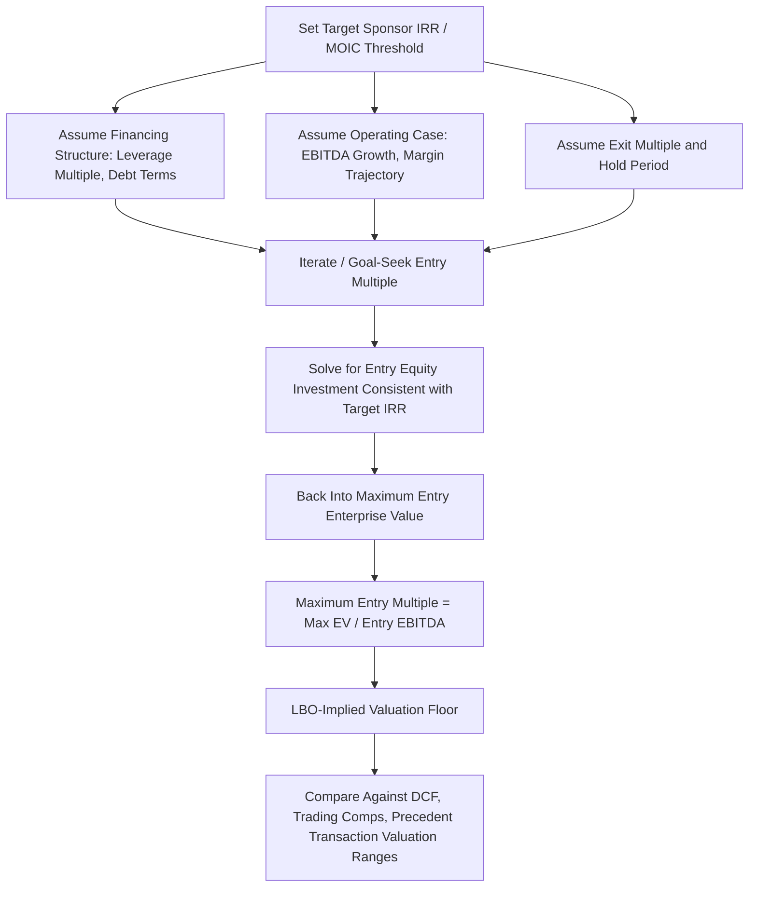

## Using LBO Analysis as a Valuation Floor

### Overview

The "LBO as a valuation floor" concept treats the maximum price a financial sponsor could reasonably pay for a target — while still achieving an acceptable minimum return threshold, given realistic financing assumptions — as an implied lower bound on the valuation range for that business. Unlike a strategic acquirer, which may justify a higher purchase price through synergies, strategic fit, or non-financial motivations, a financial sponsor's willingness to pay is constrained almost entirely by the mathematics of leveraged returns: the price must allow sufficient deleveraging and cash generation over a defined hold period to deliver the sponsor's target IRR and MOIC. This makes the LBO-implied valuation a distinct and useful reference point within a broader valuation football field, alongside DCF, trading comparables, and precedent transaction multiples, precisely because it derives from a different economic logic than intrinsic or relative valuation approaches.

### Why the LBO Approach Produces a "Floor" Rather Than a Point Estimate

**Key Points**

- A well-capitalized, disciplined financial sponsor represents a plausible bidder in most competitive sale processes for cash-flow-generative businesses, meaning the price such a sponsor could pay and still hit its return threshold represents a real, executable alternative to other valuation methods — not a theoretical construct.
- Because financial sponsors are generally price-disciplined (bound by their fund's return requirements and unable to justify overpaying through synergies the way a strategic acquirer might), the LBO-implied price tends to sit at or below prices strategic acquirers or growth-oriented public market investors might be willing to pay, hence its characterization as a "floor" rather than a central estimate.
- `[Inference]` This framing is most useful and most commonly applied in sell-side advisory contexts (establishing a credible minimum price expectation for negotiation) and in fairness opinion contexts (demonstrating that a proposed transaction price exceeds what a disciplined financial buyer could justify, supporting a fairness conclusion), rather than as a primary valuation methodology in isolation.

### Mechanics: Solving for Maximum Purchase Price Given a Target Return

The core mechanical exercise reverses the standard LBO model's logic: instead of taking an entry multiple as an input and solving for the resulting IRR/MOIC, the analysis takes a **target IRR (or MOIC)** as an input and solves for the maximum entry multiple (and corresponding purchase price) consistent with achieving that return, given assumed financing terms, operating projections, and exit multiple.

**Solving Approach**

Starting from the standard returns relationship for a single-distribution scenario:

$$Target\ IRR = \left(\frac{Exit\ Equity\ Value}{Entry\ Equity\ Investment}\right)^{\frac{1}{n}} - 1$$

Rearranged to solve for the maximum entry equity investment consistent with the target IRR, given a projected exit equity value:

$$Max\ Entry\ Equity\ Investment = \frac{Exit\ Equity\ Value}{(1 + Target\ IRR)^n}$$

Since exit equity value depends on exit EBITDA, assumed exit multiple, and projected exit debt balance (which itself depends on the entry debt quantum, which depends on the entry purchase price), this typically requires an **iterative or goal-seek solving process** within the model: entry purchase price and entry leverage determine entry equity investment and the debt paydown trajectory, which determines exit debt and thus exit equity value, which must be consistent with the target IRR given that same entry equity investment.

**Practical Implementation**

$$Max\ Entry\ EV = Max\ Entry\ Equity\ Investment + Entry\ Debt\ Quantum$$


$$Max\ Entry\ Multiple = \frac{Max\ Entry\ EV}{Entry\ EBITDA}$$

In practice, this is most commonly solved using a spreadsheet goal-seek or data-table function, iterating the entry multiple assumption until the resulting IRR calculated from the full model output matches the target IRR threshold exactly.

===MERMAID_DIAGRAM===





```
### Worked Example

**Assumptions**
- Entry EBITDA: \$100M
- Assumed leverage: 5.0x Total Debt/EBITDA at entry (\$500M debt)
- Hold period: 5 years
- Exit EBITDA: \$140M (same operating case as prior returns example)
- Exit multiple: 9.0x (held equal to an assumed entry multiple, conservatively assuming no multiple expansion)
- Exit debt paydown to \$250M (consistent with the operating cash flow and debt schedule from the given leverage level)
- Sponsor target IRR: 20% (illustrative fund hurdle-consistent target)

**Step 1 — Exit Equity Value**

$$EV_{exit} = \$140M \times 9.0x = \$1,260M$$
$$Equity\ Value_{exit} = \$1,260M - \$250M = \$1,010M$$

**Step 2 — Maximum Entry Equity Investment Consistent with 20% Target IRR**

$$Max\ Entry\ Equity = \frac{\$1,010M}{(1.20)^5} = \frac{\$1,010M}{2.488} \approx \$406M$$

**Step 3 — Maximum Entry Enterprise Value and Multiple**

$$Max\ Entry\ EV = \$406M + \$500M\ (debt) = \$906M$$
$$Max\ Entry\ Multiple = \frac{\$906M}{\$100M} = 9.06x$$

**Output**

Given the assumed financing structure, operating case, and exit assumptions, a sponsor targeting a 20% IRR could pay up to approximately **9.06x entry EBITDA** (an enterprise value of roughly \$906M) for this target. If a DCF analysis for the same business independently produces an intrinsic value range of, for example, \$950M–\$1,100M, the LBO-implied floor of \$906M sits below that range — consistent with the expected pattern where a financial sponsor's disciplined, leverage-constrained maximum price sits at or below the range a strategic or intrinsic-value-oriented buyer might justify, providing a useful sanity check on the lower bound of the overall valuation football field. `[Inference]` If instead the LBO-implied floor were to exceed the DCF-implied range, that would generally suggest either the DCF assumptions are unduly conservative or the LBO assumptions (leverage, exit multiple, or operating case) are aggressive relative to realistic financing market conditions, and either set of assumptions would warrant re-examination before relying on the resulting valuation conclusions.

### Sensitivity of the Implied Floor to Key Assumptions

**Key Points**
- **Leverage assumption**: A higher assumed entry leverage multiple increases the maximum supportable entry price (since more of the purchase price is funded by debt rather than equity, for the same equity return target), meaning the LBO floor is directly sensitive to the debt capacity assumptions covered separately — an overly aggressive leverage assumption produces an inflated, less credible floor.
- **Target IRR threshold**: A lower assumed target IRR threshold increases the maximum supportable entry price mechanically, meaning the choice of target IRR (whether reflecting a specific fund's stated return objective or a generic market benchmark) directly and materially affects the resulting floor value — this assumption should be clearly disclosed and justified whenever the analysis is presented, since it is one of the most influential and most discretionary inputs in the entire exercise.
- **Exit multiple assumption**: As with standard LBO returns analysis, the exit multiple assumption (commonly held equal to or below the entry multiple as a conservative convention) materially affects the derived floor; assuming exit multiple expansion as part of establishing a "floor" is generally considered inappropriate, since a floor calculation should rely on conservative, defensible assumptions rather than favorable market-timing bets.
- **Operating case aggressiveness**: Using an overly optimistic EBITDA growth projection in the underlying operating case inflates the exit equity value and thus inflates the implied floor; the operating case used for the floor calculation should generally be a base case or even a somewhat conservative case, not a management-provided upside case, to preserve the credibility of the floor as a genuine minimum reference point.

### Positioning Within the Broader Valuation Football Field

**Key Points**
- The LBO-implied floor is typically presented as one bar within a valuation football field chart, alongside DCF-implied value ranges, public trading comparable-implied ranges, and precedent M&A transaction-implied ranges, allowing a board or client to visually assess where a proposed or contemplated transaction price falls relative to the full spectrum of valuation perspectives.
- In sell-side processes, establishing a credible LBO floor is often used to set expectations with the seller about the minimum price a financial sponsor bidder is likely to offer, informing whether a broad auction process including financial sponsors is likely to produce a materially different outcome than a more targeted process focused on strategic acquirers.
- In fairness opinion contexts, if a proposed transaction price sits comfortably above the LBO-implied floor (as well as within or above the DCF and comparables ranges), this supports the overall fairness conclusion; if a proposed price sits below the LBO floor, this would be an unusual and closely scrutinized result, since it would imply the proposed price is below what even a return-constrained financial sponsor might be willing to pay.

### Limitations of the LBO Floor as a Valuation Anchor

**Key Points**
- **Financing market dependency**: The entire analysis is highly sensitive to prevailing credit market conditions (available leverage multiples, cost of debt) at the time of the hypothetical analysis, which can shift meaningfully and quickly across credit cycles — an LBO floor calculated using leveraged finance market assumptions from a loose-credit period would materially overstate the floor if applied during a subsequent tight-credit period, and vice versa.
- **Assumes a viable, willing financial sponsor universe exists**: For businesses with characteristics unattractive to financial sponsors specifically (e.g., very high growth, pre-profitability, or requiring ongoing heavy capital investment inconsistent with debt service), the LBO framework may not produce a meaningful or relevant floor at all, since no rational sponsor would pursue a highly leveraged structure for a business unable to reliably service that debt.
- **Does not capture strategic or synergy-driven value**: By construction, the LBO floor reflects only the standalone cash-generation capacity of the target under a leveraged capital structure; it explicitly excludes the additional value a strategic acquirer might justify through synergies, meaning it should never be treated as an estimate of the business's full potential value to all possible buyer types, only as a floor reference specifically calibrated to a financial sponsor's return-constrained perspective.
- `[Speculation]` Some practitioners additionally caution against over-reliance on a single-point LBO floor derived from one specific set of leverage and return assumptions, preferring instead to present a range reflecting a reasonable band of financing and target-return scenarios, since presenting a single hard number can create a false sense of precision around what is fundamentally an assumption-sensitive, scenario-dependent calculation.

**Next Steps**
- Returns Analysis Using IRR and Multiple of Invested Capital
- Debt Capacity and Financing Structure Analysis
- LBO Model Structure and Sources and Uses
- Valuation Football Field Construction and Cross-Method Triangulation
- Fairness Opinions and the Role of Financial Advisors in M&A
- Sponsor Fund Economics: Management Fees, Carried Interest, and Waterfall Structures


```