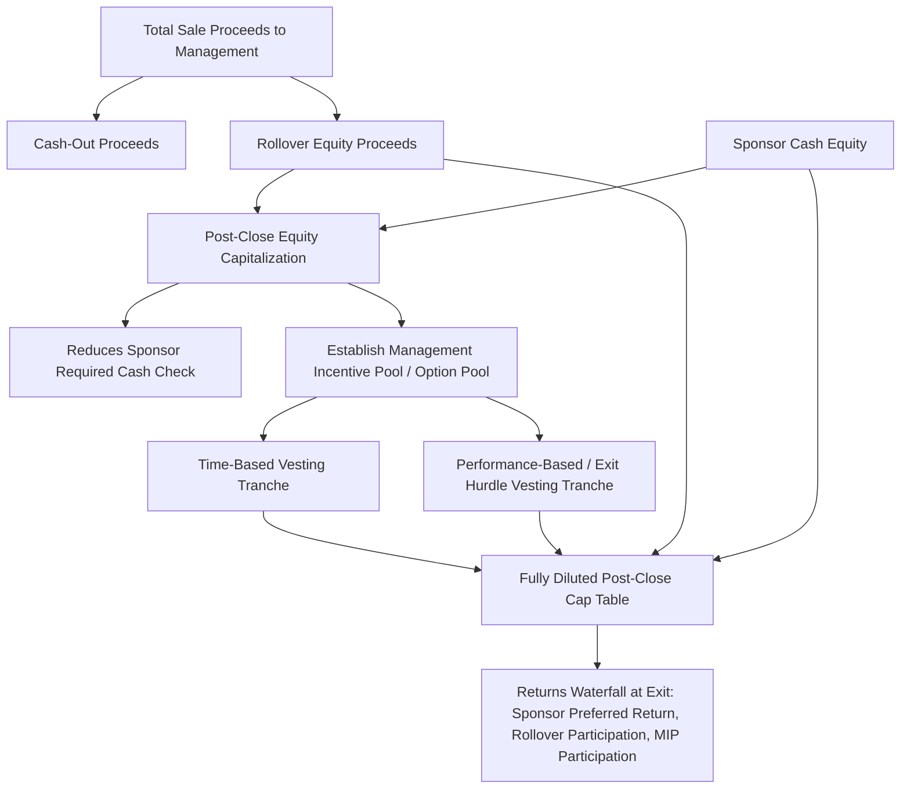

## Management Rollover and Equity Incentive Structures

### Overview

Management rollover and equity incentive structures address how the target company's existing management team participates financially in a leveraged buyout, both through reinvestment of a portion of their sale proceeds ("rollover equity") and through new forward-looking incentive equity granted as part of the post-close capital structure ("management incentive plan" or "option pool"). These structures serve the dual purpose of aligning management's financial incentives with the sponsor's investment thesis over the hold period and reducing the sponsor's required cash equity outlay, both of which directly affect the sources and uses schedule, the effective ownership and returns waterfall, and the overall governance dynamics of the post-close entity.

### Rollover Equity: Rationale and Mechanics

**Key Points**

- **Alignment rationale**: Requiring or inviting management to reinvest a portion of their sale proceeds back into the post-close equity signals confidence in the business's prospects under new ownership and directly ties management's realized wealth to the success of the sponsor's investment thesis, reducing moral hazard concerns that might otherwise arise if management simply cashed out entirely at close.
- **Sources and uses impact**: Rollover equity reduces the sponsor's required cash equity contribution dollar-for-dollar, since it is a source of financing for the transaction (as covered in the sources and uses schedule) — a management team rolling over $30M of proceeds directly reduces the sponsor's cash check by that same $30M, holding the total equity capitalization constant.

$$Sponsor\ Cash\ Equity = Total\ Equity\ Capitalization - Management\ Rollover - Any\ Co\text{-}Investor\ Equity$$

- **Typical rollover magnitude**: `[Unverified]` The proportion of management's total proceeds typically expected or negotiated to roll over varies significantly by deal size, sponsor, industry, and the specific negotiating dynamics of the transaction, and any generic percentage benchmark should be treated as illustrative rather than a market standard, given how much this varies in practice.
- **Rollover valuation and structuring**: Rollover equity is typically structured to convert management's proceeds into the *same class* of equity security the sponsor holds (or a related but distinct class, such as management common stock alongside sponsor preferred equity), at the same implied valuation per share used in the overall transaction, to avoid the appearance of preferential treatment that could create fairness or tax complications.

### Common Rollover Structures

**Straight Rollover (Same Security Class as Sponsor)**

Management rolls a portion of proceeds into the identical security class held by the sponsor (typically common equity or a blend of common and preferred), receiving pro rata treatment alongside the sponsor's economics, including the same waterfall priority and the same eventual multiple/return profile on that rolled capital.

**Rollover Into a Distinct Management Share Class**

In many structures, particularly where the sponsor holds preferred equity with a liquidation preference, management rollover is structured into a separate common equity class that sits behind the sponsor's preferred return in the distribution waterfall, meaning management's rolled capital only receives value after the sponsor's preferred return and return of capital have been satisfied — a structure that increases management's leverage to sponsor-level returns (higher risk, higher potential reward) relative to a pari passu rollover structure.

### Management Incentive Plans (MIPs) and Option Pools

Beyond rollover of existing proceeds, sponsors typically establish a forward-looking incentive equity pool to attract, retain, and motivate management and key employees over the hold period, structured separately from the rollover mechanism.

**Key Points**

- **Sizing the option pool**: The incentive pool is typically sized as a percentage of the fully diluted post-close equity capitalization, with the specific size negotiated based on the criticality of management's ongoing contribution, comparable transaction practice, and the sponsor's assessment of the incentive alignment needed to drive the value creation plan underlying the investment thesis.
- **Vesting structures**: Incentive equity is typically subject to vesting conditions, commonly combining:
  - **Time-based vesting**: Vesting ratably over a period (e.g., annually over several years), retaining key employees through the hold period.
  - **Performance-based vesting (sometimes called "exit hurdles" or "waterfall vesting")**: Vesting or value realization contingent on the sponsor achieving specified minimum return thresholds at exit (e.g., no value until the sponsor achieves a 1.0x return of capital, with tiered additional management participation percentages unlocking at successively higher sponsor MOIC or IRR thresholds).
- **Dilution mechanics**: The incentive pool dilutes all existing equity holders (sponsor and any rollover management) proportionally upon issuance or vesting, and this dilutive effect must be explicitly reflected in the cap table and returns waterfall model, since failing to model it accurately overstates the sponsor's effective ownership percentage and thus overstates projected sponsor returns.

===MERMAID_DIAGRAM===





```
### The Distribution Waterfall with Management Participation

When management rollover and MIP equity sit behind a sponsor preferred return, the exit proceeds waterfall must be modeled in explicit priority tiers to correctly allocate exit value across the different equity classes.

**Typical Waterfall Tier Structure**

1. **Return of Sponsor Invested Capital**: Sponsor receives back its initial cash equity investment (and any rollover treated pari passu, if structured that way) before any other class receives proceeds.
2. **Sponsor Preferred Return (if structured with preferred equity)**: Sponsor receives an accruing preferred return (commonly structured as a fixed annual rate compounding on unreturned capital) before common equity holders (including management common) receive any distribution.
3. **Catch-Up Provision (if applicable)**: A specified allocation may direct disproportionate early common distributions to management/incentive holders until a target relative split is achieved, "catching up" their participation to a negotiated target ratio.
4. **Pro Rata / Tiered Common Participation**: Remaining exit proceeds are distributed pro rata across all common equity holders (sponsor common, management rollover common, and vested MIP units), potentially with additional tiered percentage step-ups for management/MIP holders contingent on the sponsor achieving specified return thresholds (the "performance vesting" hurdles referenced above).

$$Management\ Exit\ Proceeds = \sum_{tiers} (Tier\ Allocation\% \times Tier\ Available\ Proceeds)$$

**Worked Example: Simplified Two-Tier Waterfall**

**Assumptions**
- Sponsor initial equity investment: \$400M; Management rollover: \$20M (into pari passu common, no separate preferred structure for simplicity)
- Total equity capitalization: \$420M (sponsor 95.2%, management 4.8%)
- MIP pool: additional 10% of fully diluted equity, fully vested at exit (illustrative, ignoring vesting conditions for simplicity)
- Exit equity value: \$1,080M (consistent with prior returns example)

**Step 1 — Fully Diluted Ownership Post-MIP Issuance**

Assuming the 10% MIP pool dilutes the existing \$420M capitalization proportionally: Sponsor and rollover investors together hold 90% of the fully diluted cap table, with the 10% MIP pool representing the incentive allocation.

$$Sponsor\ Share\ of\ 90\% = \frac{\$400M}{\$420M} \times 90\% = 85.7\%$$
$$Management\ Rollover\ Share\ of\ 90\% = \frac{\$20M}{\$420M} \times 90\% = 4.3\%$$

**Step 2 — Exit Proceeds Allocation**

- Sponsor: $\$1,080M \times 85.7\% \approx \$926M$
- Management Rollover: $\$1,080M \times 4.3\% \approx \$46M$
- MIP Pool: $\$1,080M \times 10\% = \$108M$

**Output**

Management's combined exit proceeds (rollover plus MIP participation) total approximately \$154M (\$46M + \$108M) on an initial rollover investment of \$20M — a substantial multiple driven predominantly by the MIP pool's participation, which was granted without a corresponding cash investment, illustrating why incentive pool sizing and vesting conditions are a heavily negotiated element of deal structuring from both the sponsor's dilution perspective and management's incentive-alignment perspective.

### Tax Considerations in Rollover and Incentive Structures

**Key Points**
- **Rollover tax deferral**: In certain jurisdictions and transaction structures, a portion of management's rollover proceeds may qualify for tax deferral treatment (rather than being taxed as a full cash sale at close), since the rollover can be structured as a continuation of equity ownership rather than a complete disposition — the specific qualifying conditions are jurisdiction- and structure-dependent and require dedicated tax counsel analysis rather than a generic assumption of deferral eligibility. `[Unverified]`
- **Profits interest structuring (US partnerships/LLCs)**: MIP equity granted to management in a partnership or LLC-taxed structure is frequently structured as a "profits interest" rather than a capital interest, allowing management to receive equity participation in future appreciation without immediate taxable income upon grant (since a properly structured profits interest has no value at grant, only participating in value created thereafter) — a structuring approach with specific technical requirements under applicable tax law and regulations that must be carefully followed to preserve the intended tax treatment.
- **Section 83(b) elections**: Where MIP equity is granted as restricted stock subject to vesting (in a corporate, non-partnership structure), management may need to consider a Section 83(b) election to be taxed on the value at grant (typically low or nominal) rather than at vesting (when value may have appreciated substantially), a decision with meaningful tax timing consequences that again requires individualized tax advice.

### Governance Implications of Management Equity Participation

**Key Points**
- **Board representation**: Rollover and incentive equity size is sometimes linked to negotiated management board representation or board observer rights, though sponsors typically retain board control commensurate with their majority equity and risk position.
- **Restrictive covenants and forfeiture provisions**: Unvested (and sometimes vested) management equity is commonly subject to forfeiture provisions upon termination for cause, or subject to non-compete and non-solicitation covenants, protecting the sponsor's investment from key-person departure risk during the hold period.
- **Drag-along and tag-along rights**: Management equity holders are typically subject to drag-along provisions (compelling them to sell alongside the sponsor in an exit transaction) and may receive tag-along rights (allowing participation in any partial sponsor sale on the same terms), standard minority-protection and exit-facilitation mechanics in private equity-backed capital structures.

### Common Structuring Errors and Considerations

**Key Points**
- **Undersizing or oversizing the incentive pool relative to the value creation plan's execution difficulty**: An undersized pool may fail to adequately motivate management to pursue an ambitious operational improvement plan, while an oversized pool unnecessarily dilutes sponsor returns without proportional incentive benefit beyond a certain threshold.
- **Misaligned vesting hurdles relative to the underlying business plan's realistic return trajectory**: Setting performance vesting hurdles too low provides management outsized participation even in a mediocre outcome; setting them unrealistically high (inconsistent with the underlying operating case) can undermine the intended motivational effect if management perceives the hurdles as effectively unreachable.
- **Failing to model MIP dilution accurately in the sponsor returns model**: As noted above, omitting or understating the incentive pool's dilutive effect in the cap table model produces an overstated projection of sponsor-level IRR and MOIC relative to the actual economics the sponsor will realize.

**Next Steps**
- Returns Analysis Using IRR and Multiple of Invested Capital
- LBO Model Structure and Sources and Uses
- Dividend Recapitalization Mechanics in LBO Holding Periods
- Exit Strategy Planning: Strategic Sale, Secondary Buyout, and IPO Exit
- Sponsor Fund Economics: Management Fees, Carried Interest, and Waterfall Structures
- Using LBO Analysis as a Valuation Floor


```