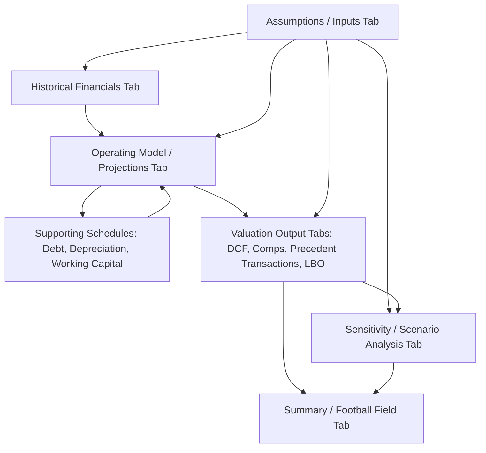

## Valuation Model Architecture and Best Practices

### Overview

Valuation model architecture concerns the structural design principles that make a financial model — whether a DCF, LBO, merger consequences, or trading comparables model — reliable, auditable, maintainable, and free from the mechanical errors that undermine confidence in its outputs. Unlike the substantive valuation methodologies covered elsewhere (discount rate construction, terminal value mechanics, synergy quantification), model architecture is a discipline concerned with *how* a model is built regardless of *what* it is valuing: separation of inputs from calculations, consistent formula construction, error-checking mechanisms, and a structure that allows a third party (or the original builder, months later) to understand, audit, and modify the model with confidence rather than fear of breaking hidden dependencies.

### The Separation Principle: Inputs, Calculations, and Outputs

**Key Points**

- **Inputs (assumptions)** should be hard-coded numerical values entered exactly once, in a clearly designated location, and never embedded directly within formulas elsewhere in the model — a foundational discipline often summarized as "hard-code once, reference everywhere."
- **Calculations** should consist entirely of formulas referencing input cells or other calculation cells, containing no hard-coded numbers within the formula itself (with the narrow exception of true mathematical constants, such as 12 for months-per-year in an annualization formula, which are self-evidently invariant rather than assumptions).
- **Outputs** are the calculated results intended for presentation or decision-making (valuation summary, sensitivity tables, charts), which should pull from the calculation layer without containing independent logic of their own.

**Why This Separation Matters**

A model that embeds an assumption (e.g., a discount rate of 9.5%) directly inside a formula in a distant cell, rather than referencing a single designated assumption cell, creates a **single point of failure for auditability**: changing that assumption requires finding and updating every instance where it was manually typed, and a reviewer cannot verify at a glance whether all instances are actually consistent with each other, since inconsistency is invisible without inspecting every formula individually.

**Standard Convention: Color-Coding by Cell Type**

`[Inference]` A widely followed (though not universal) convention in professional financial modeling uses distinct font colors to signal cell type at a glance: blue font for hard-coded inputs, black font for formulas/calculations, and green font for links to other worksheets or external files — this convention is not enforced by any technical standard but is common enough across investment banking, private equity, and corporate finance practice that deviating from it without clear alternative documentation can create friction when a model is shared across organizations with different internal conventions.

### Worksheet and Workbook Organization

**Recommended Tab Structure**

A well-architected valuation model typically separates functional components into distinct worksheets rather than combining everything onto a single dense tab, improving navigability and reducing the risk of formula errors from overly complex, multi-purpose sheets.

**Typical Tab Sequence**

1. **Cover / Table of Contents**: Model purpose, version, last-updated date, and hyperlinked navigation to key tabs.
2. **Assumptions / Inputs**: All hard-coded drivers consolidated in one location — growth rates, margin assumptions, discount rate components, tax rates, financing terms.
3. **Historical Financials**: Source financial statements (income statement, balance sheet, cash flow statement) as reported, providing the base from which projections are built.
4. **Operating Model / Projections**: The core forecast engine, building projected financial statements from the assumptions tab.
5. **Supporting Schedules**: Debt schedule, depreciation schedule, working capital schedule, and other detailed sub-calculations that feed the operating model but would clutter it if embedded directly.
6. **Valuation Output(s)**: DCF calculation, comparable company analysis, precedent transactions, LBO returns — each method's specific mechanics, typically one tab per methodology.
7. **Summary / Football Field**: Consolidated output comparing valuation methodologies side by side.
8. **Sensitivity / Scenario Analysis**: Data tables and scenario toggles flexing key assumptions across the output range.

===MERMAID_DIAGRAM===





```
### Formula Construction Best Practices

**Key Points**
- **Consistency across rows and columns**: A formula in a given row should follow the identical structure and relative/absolute reference pattern across every column (typically representing time periods), such that the formula can be copied horizontally without manual adjustment — inconsistent formula structure within a single row is one of the most common sources of undetected modeling errors, since visual inspection of a single cell does not reveal whether an adjacent cell follows a different (and possibly incorrect) formula logic.
- **Avoiding hard-coded values mid-formula**: As covered under the separation principle, a formula such as `=Revenue*0.35` embeds an assumption invisibly; the correct construction references a labeled assumption cell, such as `=Revenue*$Assumptions.MarginPct`.
- **Absolute vs. relative reference discipline**: Deliberate and consistent use of absolute references (`$A$1`) for assumptions that should not shift when a formula is copied, versus relative references for values that should shift with the copied position (such as the prior period's balance in a rolling schedule), prevents a common class of copy-paste error where a reference silently shifts to the wrong cell.
- **Avoiding excessively long or deeply nested formulas**: A formula spanning many nested functions or referencing many disparate cells across a large range is difficult to audit and error-prone to modify; breaking complex calculations into intermediate labeled steps across multiple rows (even if this uses more rows) generally improves auditability at a modest cost to worksheet compactness.
- **Consistent sign convention**: Establishing and maintaining a consistent convention for whether cash outflows (e.g., capex, dividends) are represented as negative or positive numbers throughout the model, since inconsistent sign conventions between different schedules are a frequent source of subtle summation errors that are not caught by a simple visual review.

### Circularity Management

Certain valuation models — most notably LBO models with interest expense dependent on average debt balances, or models incorporating a cash flow sweep affecting the debt balance that in turn affects interest expense — contain inherent circular references, as covered under debt schedule construction.

**Key Points**
- **Iterative calculation settings**: Most spreadsheet applications offer a setting to enable iterative calculation, allowing genuine circular formulas to resolve to a stable converged value rather than triggering a circular reference error — though this approach can create fragility, since accidental unintended circularity elsewhere in the model becomes harder to detect once iterative calculation is globally enabled.
- **Circularity breaker switches**: A common and more robust alternative constructs an explicit toggle (a single input cell, e.g., 0 or 1) that, when set to zero, forces the circular reference to resolve to a fixed reference value (such as prior-period actuals or a hard-coded placeholder) rather than the live circular calculation, allowing the modeler to "break" the circularity deliberately for troubleshooting, then re-enable it once other changes are verified stable — a pattern frequently implemented using an `IF` function testing the switch value.
- **Avoiding circularity via a copy-paste-values macro**: An alternative approach uses a macro-driven or manual process periodically converting circular formula results to static hard-coded values, breaking the live circular dependency at that point in time — this trades ongoing dynamic recalculation for stability, appropriate in some model contexts but requiring clear documentation so future users understand the values are not live formulas.

### Error-Checking and Model Integrity Mechanisms

**Key Points**
- **Balance sheet balance checks**: An explicit, prominently displayed check row confirming that projected assets equal projected liabilities plus equity in every period, flagging immediately (e.g., through conditional formatting or an explicit "TRUE/FALSE" or "0/error" flag) if the balance sheet fails to balance — an essential integrity check for any model containing a full three-statement build, since balance sheet imbalances often indicate a structural formula error elsewhere in the model.
- **Sources and uses reconciliation checks**: Similarly, an explicit check confirming total sources equal total uses in the transaction financing schedule, flagging any imbalance immediately rather than allowing a silent mismatch to propagate through the rest of the model.
- **Cash flow statement tie-out checks**: Confirming that the cash flow statement's ending cash balance ties to the balance sheet's projected cash balance in every period, catching errors in the indirect cash flow statement construction methodology.
- **Sanity check flags on outputs**: For valuation-specific outputs, checks confirming outputs fall within economically sensible bounds (e.g., an implied perpetuity growth rate that is not negative or implausibly high relative to long-run GDP growth, an implied WACC that is not lower than the risk-free rate) can catch input errors that produce a technically calculable but economically nonsensical result.
- **Centralized error-check summary**: Consolidating all individual error checks from across the model into a single, prominently visible summary panel (often on the cover tab) that displays an aggregate "all checks pass" or "error detected" status, allowing any user to instantly confirm model integrity without needing to locate and inspect every individual check scattered across different tabs.

### Scenario and Sensitivity Toggle Design

**Key Points**
- **Centralized scenario switches**: Rather than duplicating an entire model for each scenario (base, upside, downside), a well-architected model uses a single scenario selector input (e.g., a dropdown or numbered toggle) that drives a `CHOOSE` or `INDEX/MATCH`-style lookup across a table of scenario-specific assumption sets, feeding a single live calculation engine — this avoids the maintenance burden and error risk of maintaining structurally duplicated parallel models for each scenario.
- **Data tables for sensitivity analysis**: Built-in spreadsheet data table functionality (varying one or two input variables and capturing a designated output cell's resulting value across a grid of input combinations) is generally preferred over manually re-running and recording the model output for each input combination, since data tables recalculate automatically and are inherently less error-prone than a manual process.
- **Isolating sensitivity toggles from base-case assumptions**: Sensitivity analysis inputs (the specific values being flexed in a data table) should be structurally separated from the model's live base-case assumption cells, to avoid ambiguity about which value is the "official" base case versus which values are being tested in a specific sensitivity exercise.

### Documentation and Version Control Practices

**Key Points**
- **In-model documentation**: Clear, consistent row and column labels, units specified directly adjacent to figures (e.g., explicitly noting "\$M" or "\$000s"), and cell comments or a dedicated notes column explaining non-obvious methodology choices or data sources, particularly for judgment-intensive inputs like discount rate components or synergy realization assumptions.
- **Version control discipline**: Maintaining a clear version history (whether through filename conventions, a dedicated version log tab noting date and summary of changes, or an external version control system for more sophisticated modeling environments) prevents confusion between draft and final versions and supports auditability of how key assumptions or conclusions evolved over the course of a transaction process.
- **Source documentation for external inputs**: Any input sourced from an external source (market data, comparable company financials, analyst research) should be clearly cited within the model (source name and date pulled) rather than left as an unexplained hard-coded number, supporting both auditability and the ability to refresh the input later without re-researching its origin.

### Common Architectural Failures and Their Consequences

**Key Points**
- **Monolithic, single-tab models**: Combining assumptions, calculations, and outputs on a single dense worksheet significantly increases the risk of accidentally overwriting a formula with a hard-coded value, and makes the model difficult to navigate and audit for anyone other than the original builder.
- **Copy-paste inconsistency**: Formulas that were correct when originally built but became inconsistent after a later manual edit was applied to only some cells in a row (rather than the entire row being correctly recopied), creating a "hidden" error that produces plausible-looking but incorrect output in only certain periods or scenarios.
- **Missing or superficial error checks**: Models lacking balance sheet balance checks or sources-and-uses reconciliation checks can silently produce internally inconsistent results that are not obviously wrong on visual inspection, undermining confidence in the entire output without an explicit failure signal to alert the user.
- **Excessive external links without clear tracking**: Models with numerous links to external workbooks, without clear documentation of what is linked and why, create fragility (broken links when files are moved or renamed) and auditability challenges (a reviewer cannot easily distinguish a live external link from a stale, disconnected one without explicit color-coding or documentation).

**Next Steps**
- Debt Schedule Construction and Circularity Resolution Techniques
- Sensitivity, Scenario, and Data Table Techniques in Valuation Modeling
- Three-Statement Financial Modeling Fundamentals
- LBO Model Structure and Sources and Uses
- Model Auditing and Peer Review Best Practices
- Version Control and Collaborative Modeling Workflows


```