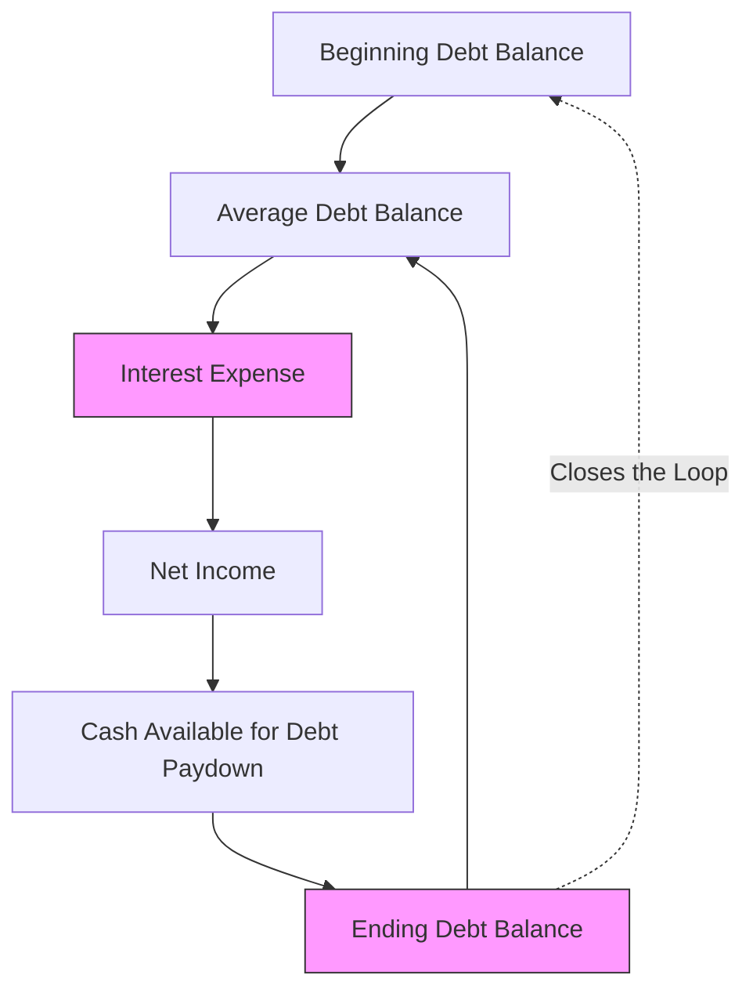

## Managing Circular References in Models

### Overview

Circular references arise in financial models when a calculation chain loops back on itself — most commonly when interest expense depends on a debt balance, that debt balance depends on cash flow available for repayment, and that cash flow itself depends on net income, which is reduced by the very interest expense that started the chain. This is not a modeling error to be eliminated but rather an inherent mathematical feature of how debt-financed cash flow interacts with its own financing cost in reality; the modeling challenge is not avoiding circularity conceptually, but managing it structurally so the spreadsheet resolves to a stable, correct value without generating errors, performance problems, or fragile, hard-to-audit workarounds.

### Why Circularity Arises: The Core Mechanical Loop

**The Classic Interest Expense Circularity**

$$Interest\ Expense_t = Average\ Debt\ Balance_t \times Interest\ Rate$$


$$Average\ Debt\ Balance_t = \frac{Beginning\ Debt_t + Ending\ Debt_t}{2}$$


$$Ending\ Debt_t = Beginning\ Debt_t - Cash\ Available\ for\ Debt\ Paydown_t$$


$$Cash\ Available\ for\ Debt\ Paydown_t = Net\ Income_t + Non\text{-}Cash\ Add\text{-}backs_t - Capex_t - \Delta Working\ Capital_t$$


$$Net\ Income_t = (EBIT_t - Interest\ Expense_t) \times (1 - Tax\ Rate)$$

Tracing the chain: interest expense depends on the average debt balance, which depends on the ending debt balance, which depends on cash available for paydown, which depends on net income, which depends on interest expense — closing the loop. This specific pattern (using an *average* balance for interest calculation, rather than only the beginning balance) is the most common source of circularity, since using only the beginning-of-period balance for interest calculation would break the circular dependency entirely (interest would depend only on a balance already fixed at the start of the period) at the cost of a less precise approximation of actual interest accrual over the period.

**Other Common Sources of Circularity**

- **Revolver draw/paydown mechanics**: A revolving credit facility's balance depends on the cash shortfall or surplus in a given period, which itself depends on interest expense on the revolver balance, creating the same fundamental loop as the term debt example above.
- **Cash flow sweep provisions**: Excess cash flow sweep calculations that determine mandatory debt prepayment based on free cash flow, where free cash flow itself is a function of interest expense on the debt being swept.
- **Fee-based circularity**: Financing fees calculated as a percentage of a debt quantum that is itself being solved for based on a target leverage multiple relative to EBITDA, in models where the fee amount feeds back into total uses and thus total financing required.

===MERMAID_DIAGRAM===





```
### Resolution Method 1: Iterative Calculation

**Mechanics**

Most spreadsheet applications provide a setting to enable iterative calculation, which allows the application to recalculate circular formulas repeatedly (up to a specified maximum number of iterations, or until the change between successive iterations falls below a specified tolerance threshold) until the values converge to a stable solution, rather than immediately throwing a circular reference error.

**Key Points**
- **Convergence behavior**: For a well-behaved circularity like the interest expense loop above, the iterative calculation typically converges quickly (often within a handful of iterations) to a stable value, since the feedback loop has a damping (rather than explosive) mathematical structure — each iteration's correction becomes progressively smaller.
- **Risk of masking unintended circularity**: `[Inference]` Once iterative calculation is globally enabled for a workbook, any *other*, unintended circular reference elsewhere in the model (introduced by an accidental formula error unrelated to the intentional debt-schedule circularity) will also silently resolve via iteration rather than immediately flagging as an error — this is widely considered a meaningful drawback of the iterative calculation approach, since it can hide genuine formula mistakes that would otherwise be caught immediately by the spreadsheet application's circular reference warning.
- **Performance considerations**: Complex models with many interacting circular loops (e.g., a full three-statement model with multiple debt tranches, each with sweep-driven paydown, all feeding back through a consolidated cash flow statement) can experience slower recalculation performance under iterative settings, particularly in very large models, since every recalculation pass must resolve every circular chain simultaneously.
- **Manual recalculation risk**: Some modelers disable automatic recalculation when using iterative circularity (relying on manual recalculation triggers) to avoid performance lag during active editing, but this introduces its own risk: a user may view stale, not-yet-recalculated values without realizing recalculation has not occurred.

### Resolution Method 2: Circuit Breaker (Toggle Switch)

**Mechanics**

A circuit breaker constructs an explicit control cell (commonly a simple 0/1 or TRUE/FALSE toggle) that, when set to "off," forces the circular formula to reference a fixed, non-circular value (such as the prior period's actual balance, or a hard-coded placeholder of zero) instead of the live circular calculation. When set to "on," the formula reverts to the full circular logic.

**Implementation Pattern**

$$Interest\ Expense_t = IF(Circuit\ Breaker = 1,\ Average\ Debt\ Balance_t \times Rate,\ Beginning\ Debt\ Balance_t \times Rate)$$

Using the beginning balance only (rather than the average) when the breaker is "off" eliminates the circularity entirely for that state, since the beginning balance is already a fixed, known value from the prior period's ending calculation, not dependent on the current period's still-to-be-calculated net income.

**Key Points**
- **Troubleshooting workflow**: When a modeler introduces a new formula elsewhere in the model and needs to verify it did not introduce an unintended new circularity, switching the circuit breaker to "off" temporarily removes the intentional circularity from the equation, allowing the spreadsheet application's native circular reference detection to flag any *other*, unintended circular dependency that the intentional one would otherwise have been masking.
- **Explicit documentation value**: A circuit breaker is inherently more self-documenting than relying on a global iterative calculation setting, since the toggle cell itself, typically labeled clearly (e.g., "Circularity Switch: 1 = ON"), signals to any user opening the model that intentional circularity exists and shows exactly where it is controlled — improving auditability relative to a global setting that is not visible anywhere within the workbook itself.
- **Downside — approximation when off**: Using the beginning-balance-only approximation while the breaker is off produces a slightly different (typically negligibly different, but not identical) interest expense figure than the full average-balance circular calculation, meaning the "off" state is a genuine approximation, not merely a temporarily-disabled version of the exact same calculation — a distinction worth documenting clearly so users do not mistake the off-state output for the fully precise result.

### Resolution Method 3: Copy-Paste-Values (Manual Circularity Break)

**Mechanics**

Rather than maintaining live circular formulas at all, this approach periodically calculates the circular values once, then manually (or via a recorded macro) converts the formula results in the relevant cells to static, hard-coded values — permanently breaking the live circular dependency at that point in time.

**Key Points**
- **Use case**: Most appropriate in models where the circular calculation genuinely only needs to be solved once (e.g., establishing a final closing debt schedule for a completed historical period, or "locking in" a specific scenario's output for archival/presentation purposes) rather than needing to remain dynamically responsive to ongoing assumption changes.
- **Trade-off**: This approach sacrifices the model's dynamic recalculation capability for that specific range of cells — if an upstream assumption changes later, the pasted static values will not automatically update, requiring the modeler to remember to re-run the copy-paste-values process, which introduces a manual, error-prone step that a fully live, formula-driven model avoids by construction.
- **Macro-assisted implementation**: `[Speculation]` In practice, this approach is sometimes automated via a simple recorded macro (a button that copies a designated range and pastes it back as values in place) triggered manually by the modeler whenever a fresh solve is needed, reducing but not eliminating the risk of forgetting to refresh the static values after an assumption change, since the process still requires deliberate manual initiation rather than happening automatically on every recalculation.

### Comparing the Three Approaches

| Approach | Auditability | Risk of Masking Errors | Dynamic Responsiveness | Typical Use Case |
|---|---|---|---|---|
| Iterative Calculation | Lower (global, invisible setting) | Higher (masks all circularity, intended or not) | Fully dynamic | Simpler models, experienced modeler teams comfortable managing the global setting |
| Circuit Breaker Toggle | Higher (explicit, visible switch) | Lower (isolates and exposes intentional circularity) | Fully dynamic when "on" | Complex models, collaborative or audited modeling environments, LBO models with multiple debt tranches |
| Copy-Paste-Values | Requires clear documentation | Not applicable (no live circularity) | Not dynamic — requires manual refresh | Archival snapshots, finalized historical periods, one-time solves |

`[Inference]` Among professional modeling practitioners, the circuit breaker approach is generally regarded as a more robust middle ground for complex, collaboratively-built, or externally-reviewed models specifically because of its combination of full dynamic responsiveness with explicit, visible documentation of where and why circularity exists — though the appropriate choice ultimately depends on the model's complexity, the review/audit context it will be used in, and the modeling team's own conventions and comfort level with each approach.

### Diagnosing and Debugging Circular Reference Errors

**Key Points**
- **Trace precedents/dependents tools**: Most spreadsheet applications provide formula auditing tools (tracing which cells feed into a given formula, and which cells depend on a given cell) that can help manually map out an unexpected or unintended circular chain when the application's automatic circular reference warning identifies a general area but not the precise loop structure.
- **Isolating new circularity after a model change**: When a previously circularity-free model suddenly displays a circular reference warning after an edit, the most common cause is a formula that was intended to reference one period's value but was mistakenly constructed (often via an incorrect relative reference during copy-paste) to reference the same period's own, not-yet-calculated output — systematically checking recently edited formulas first is generally more efficient than a full model-wide audit.
- **Distinguishing intentional from unintentional circularity in review**: When auditing or reviewing a model built by someone else, confirming which circular loops are deliberate (typically documented via a circuit breaker or clear labeling) versus potentially accidental is an essential first step, since an unintentional circular reference is a genuine formula error requiring correction, while an intentional one requires only verification that it resolves to a sensible, converged value.

### Practical Recommendations Checklist

1. Default to a circuit breaker toggle structure for any model containing intentional circularity (debt schedules with average-balance interest, cash flow sweeps), rather than relying solely on a global iterative calculation setting, to preserve auditability and error-detection capability.
2. Clearly label the circuit breaker cell and document its function directly adjacent to it within the worksheet, so any subsequent user immediately understands its purpose without needing separate external documentation.
3. Periodically toggle the circuit breaker "off" during active model development (even temporarily) to confirm no new, unintended circularity has been introduced elsewhere in the model, leveraging the spreadsheet application's native circular reference detection as an error-checking mechanism.
4. Avoid combining multiple circularity resolution methods inconsistently within the same model (e.g., some circular loops resolved via iterative calculation, others via circuit breakers), since this inconsistency itself becomes a source of confusion during model review and auditing.
5. Document, wherever a circuit breaker's "off" state uses an approximation (such as beginning-balance-only interest) rather than an exact replica of the "on" state calculation, that the two states are not numerically identical, to avoid a reviewer mistaking the off-state figure for the fully precise result.

**Next Steps**
- Valuation Model Architecture and Best Practices
- LBO Model Structure and Sources and Uses
- Debt Capacity and Financing Structure Analysis
- Three-Statement Financial Modeling Fundamentals
- Sensitivity, Scenario, and Data Table Techniques in Valuation Modeling
- Model Auditing and Peer Review Best Practices


```