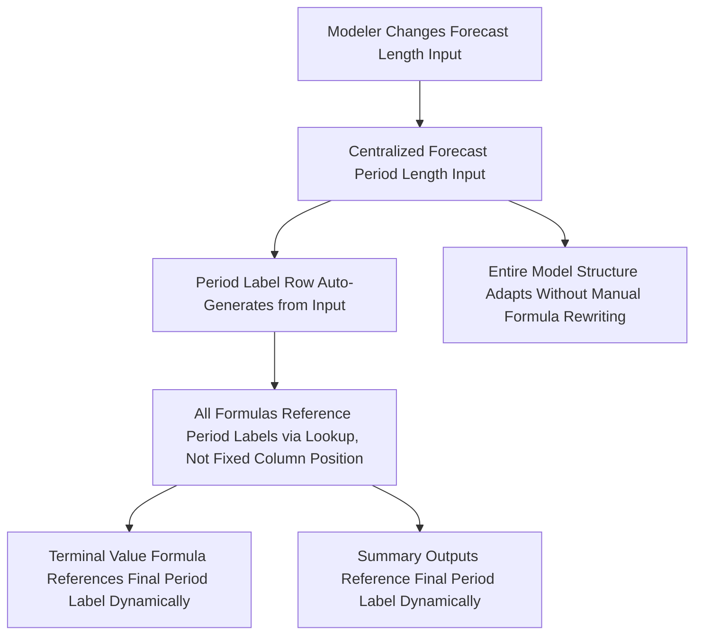

## Dynamic Formula Design and Flexibility

### Overview

Dynamic formula design concerns building financial models whose formulas automatically adapt to changing assumptions, changing time horizons, and changing structural conditions (such as a variable number of debt tranches or forecast periods) without requiring the modeler to manually rewrite or re-copy formulas each time an assumption changes. A model built with genuinely dynamic formulas can flex its forecast period length, toggle between scenarios, or accommodate a changed capital structure purely through input changes, whereas a rigid, "hard-wired" model requires manual restructuring for even modest changes in scope — a fragile and error-prone characteristic that undermines the model's reliability as assumptions evolve over the life of a transaction or analysis.

### Core Principle: Formulas That Generalize, Not Just Calculate

**Key Points**

- A formula is genuinely dynamic when it produces the correct result not only for the specific inputs it was originally built and tested against, but for any reasonable range of alternative inputs the model might plausibly need to accommodate — a materially higher bar than simply "the formula currently returns the right number."
- The most common failure mode is a formula that happens to work correctly for the base-case inputs used during initial construction but breaks (silently, producing a plausible-looking but incorrect result, or overtly, producing an error) when an assumption is pushed to an edge case the modeler did not originally anticipate.
- `[Inference]` Testing formulas against deliberately extreme or edge-case inputs (zero growth, negative growth, a forecast period shortened to a single year, a leverage assumption of zero) during model construction, rather than only against the expected base case, is a widely recommended practice specifically because it surfaces these latent fragilities before they cause a problem in live use, when an unexpected input value is tested for the first time under time pressure.

### Dynamic Time Period Handling

**The Problem with Hard-Coded Period References**

A common rigidity arises when formulas reference a specific column position (e.g., a formula referencing "the value three columns to the left" to represent "three years prior") rather than referencing the actual calendar or fiscal period label, since inserting or removing a column (e.g., extending the forecast period, or converting from an annual to a quarterly model) breaks the intended relationship.

**Dynamic Alternative: Period-Label-Driven Lookups**

Rather than relying on fixed column offsets, a more robust design uses explicit period labels (e.g., a header row containing "2026," "2027," "2028") and lookup functions (such as `INDEX/MATCH` or the modern `XLOOKUP`) to retrieve the correct period's value by matching the label, rather than by counting a fixed number of columns.

$$Value_{t-3} = INDEX(Data\ Range,\ MATCH(Period\ Label_t - 3,\ Period\ Label\ Row,\ 0))$$

This construction continues to return the correct value even if columns are inserted or removed elsewhere in the model, since the lookup is driven by matching the actual period label rather than a fixed positional offset — a materially more resilient design for models expected to be extended, shortened, or restructured over their working life.

**Flexible Forecast Period Length**

A model designed to flexibly extend or shorten its forecast horizon typically uses a single, centralized input cell specifying the number of forecast periods, with formulas throughout the model (particularly terminal value timing, and any summary calculations referencing "the final forecast year") referencing that centralized period-count input rather than being hard-wired to a fixed number of columns — allowing the modeler to extend a 5-year forecast to 7 years, for instance, purely by adjusting the single input and extending the column structure, without needing to manually locate and update every formula that assumed a 5-year horizon.

===MERMAID_DIAGRAM===





```
### Dynamic Scenario and Assumption Switching

**Key Points**
- **CHOOSE and INDEX/MATCH-driven scenario toggles**: Rather than building physically separate copies of a model for each scenario (base, upside, downside), a dynamic design stores each scenario's full assumption set in parallel rows or columns, with a single scenario-selector input cell driving a `CHOOSE` or `INDEX/MATCH` formula that pulls the active scenario's values into the live calculation engine — meaning the entire model recalculates for a different scenario purely by changing one selector value.
- **Dynamic named ranges**: Named ranges that automatically expand or contract based on the actual extent of data present (constructed using formulas like `OFFSET` combined with a count function, or using native dynamic array/table structures in modern spreadsheet applications) prevent the common error where a named range remains fixed at its original size even after the underlying data range has grown, silently excluding newly added periods or line items from calculations and charts that reference the stale, undersized named range.
- **Structured/Table references**: Native table structures (which automatically extend formulas and formatting to newly added rows, and allow formulas to reference table columns by name rather than by fixed cell address) provide a built-in mechanism for dynamic range handling, reducing the need for more manually-constructed dynamic range formulas in many common use cases.

### Dynamic Handling of Variable Structural Elements

**The Problem**

Some model structures need to flexibly accommodate a variable number of discrete elements — a variable number of debt tranches in a capital structure, a variable number of business segments in a consolidation, or a variable number of intangible asset categories in a purchase price allocation — where the actual count is an assumption that might change, not a fixed structural given.

**Dynamic Design Approaches**
- **Building for a maximum plausible count with conditional suppression**: Constructing the model to accommodate the maximum number of elements reasonably anticipated (e.g., up to six debt tranches), with formulas and summary calculations that correctly handle a smaller actual count by testing for and excluding empty or zero-value tranches (using conditional logic such as `IF` combined with a count or sum function) rather than assuming all built-in slots are always populated.
- **Dynamic array formulas**: In spreadsheet applications supporting native dynamic array functions, formulas can be constructed to automatically spill across as many cells as the underlying variable-length data requires, adjusting automatically as the count of elements changes, rather than requiring the modeler to manually extend a fixed formula range.
- **Trade-off consideration**: `[Inference]` Building maximum flexibility into every structural element of a model carries a real cost in model complexity and construction time; a pragmatic middle ground commonly applied in practice is to build full dynamic flexibility only for the structural elements genuinely expected to vary across the model's anticipated use cases (e.g., number of forecast years, number of debt tranches in an LBO), while accepting more fixed, simpler construction for elements very unlikely to change (e.g., the number of components in a standard three-statement structure), rather than applying maximum dynamic flexibility uniformly regardless of actual likelihood of change.

### Modern Dynamic Function Techniques

**Key Points**
- **XLOOKUP and its advantages over legacy VLOOKUP/HLOOKUP**: Modern lookup functions generally allow lookup in either direction (not requiring the lookup column to be positioned to the left of the return column, as classic `VLOOKUP` requires), support more robust handling of lookup values not found (via an explicit "not found" argument rather than an error requiring separate error-handling logic), and are generally less fragile to inserted or deleted columns than `VLOOKUP`'s fixed column-index-number argument.
- **SUMIFS/COUNTIFS/AVERAGEIFS for conditional dynamic aggregation**: Rather than manually constructing a formula that sums a specific, fixed set of cells meeting a condition, conditional aggregation functions dynamically recalculate the correct sum, count, or average across an entire specified range based on one or more criteria, automatically adjusting as underlying data changes or grows, without requiring the formula itself to be rewritten.
- **LET and named intermediate calculations**: Modern spreadsheet functions allowing a complex formula to define and reuse named intermediate variables within a single formula (rather than repeating an identical sub-calculation multiple times within the same formula, or requiring a separate helper cell) improve both formula readability/auditability and reduce the risk of an inconsistency arising if a repeated sub-expression is updated in one instance but not another within the same formula.
- **Dynamic array spill functions**: Functions that return an array of results spilling automatically into adjacent cells (rather than requiring the formula to be manually copied down or across a fixed range) automatically adjust their output range as the underlying data changes in size, reducing the risk of a copied formula range becoming stale (too short, excluding new data) or requiring manual extension.

### Balancing Flexibility Against Complexity and Auditability

**Key Points**
- **Flexibility is not free**: Every layer of dynamic generalization (lookup-based period referencing instead of direct cell references, scenario-selector-driven formulas instead of simple direct formulas) adds a layer of indirection that can make a formula harder for a new reviewer to trace and understand at a glance, compared to a simpler, more direct (but less flexible) formula construction.
- **Matching flexibility investment to actual expected variability**: As referenced above, the appropriate level of dynamic design investment should be calibrated to how likely and how frequently a given structural element or assumption is actually expected to change over the model's working life — over-engineering dynamic flexibility for elements that will, in practice, never change adds complexity and auditability cost without corresponding benefit.
- **Documentation of dynamic mechanisms**: Because dynamic formulas (lookup-driven period referencing, scenario-selector logic, dynamic named ranges) are inherently less immediately transparent than simple direct formulas, clear documentation of how these mechanisms work — ideally including a brief explanatory note directly within the relevant worksheet — is particularly important for dynamic model components, more so than for simpler, self-evident direct calculations.

### Common Pitfalls in Dynamic Formula Design

**Key Points**
- **Partial dynamism creating false confidence**: A model that is dynamic in some areas (e.g., a flexible forecast period length) but still contains hard-wired fixed references elsewhere (e.g., a chart series range that was not updated to reflect the now-dynamic period count) can create a false impression of full flexibility, when in fact only some components will correctly adjust to an input change — a particularly dangerous failure mode since it is not obviously visible without deliberately testing the specific non-dynamic component.
- **Untested edge cases in dynamic formulas**: A lookup-based or conditionally-structured dynamic formula that has only ever been tested against the original base-case input range may still fail or behave unexpectedly at genuine edge cases (e.g., a scenario selector value outside the anticipated valid range, a forecast period count of zero or one), meaning dynamic design does not eliminate the need for deliberate edge-case testing — it changes what needs to be tested, from "does this specific number look right" to "does this formula behave correctly across the full range of valid and invalid inputs it might encounter."
- **Over-reliance on volatile functions**: Certain dynamic-range-enabling functions can be computationally volatile (recalculating on every worksheet change, not only when their direct inputs change), which can degrade performance materially in large, complex models if used extensively — a trade-off worth weighing against more targeted, less volatile alternatives (such as structured table references) where those provide comparable flexibility with better performance characteristics.

**Next Steps**
- Valuation Model Architecture and Best Practices
- Managing Circular References in Models
- Sensitivity, Scenario, and Data Table Techniques in Valuation Modeling
- Three-Statement Financial Modeling Fundamentals
- Model Auditing and Peer Review Best Practices
- Version Control and Collaborative Modeling Workflows


```