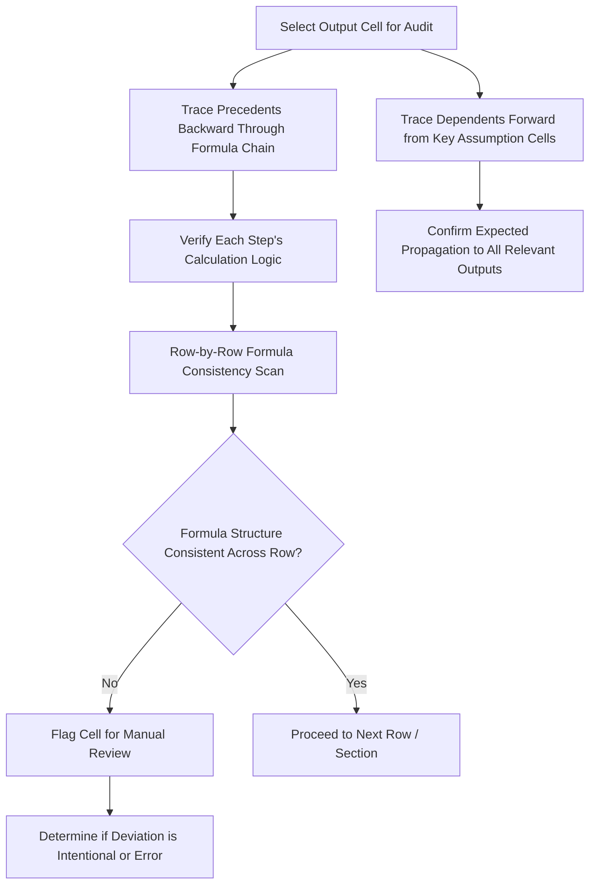

## Model Auditing and Error-Checking Techniques

### Overview

Model auditing is the systematic process of verifying a financial model's structural integrity, formula correctness, and logical consistency — distinct from validating whether the model's underlying business assumptions are reasonable, which is a separate analytical exercise. Auditing focuses on whether the model correctly and consistently implements whatever assumptions it has been given, catching mechanical errors (broken formula chains, inconsistent copy-paste logic, hard-coded values masquerading as formulas, unit mismatches) that can silently corrupt output even when every individual assumption input is entirely reasonable. Given how heavily high-stakes valuation decisions rely on model output, a disciplined, repeatable auditing methodology is a professional necessity rather than an optional final step.

### Categories of Model Errors

**Key Points**

- **Mechanical/formula errors**: Broken cell references, inconsistent formula logic across a row (a common formula copied across a range but manually altered incorrectly in one or more cells), incorrect absolute/relative reference usage causing a formula to silently reference the wrong cell when copied.
- **Logical/structural errors**: Correct formula syntax that nonetheless implements incorrect logic — such as double-counting an item, omitting a required adjustment, or applying a calculation to the wrong period.
- **Unit and sign errors**: Mixing figures expressed in different units (thousands versus millions, or percentages entered as whole numbers like "5" instead of decimals like "0.05") within the same calculation, or inconsistent sign conventions (some cash outflows entered as negative, others as positive) causing incorrect summation.
- **Linking and version errors**: Stale or broken links to external files or other worksheets, or formulas referencing an outdated version of an assumption that was since updated elsewhere but not consistently propagated.
- **Hard-coding errors**: A cell that should contain a live formula instead contains a hard-coded number (often introduced accidentally when a user typed over a formula cell, or deliberately as a quick fix that was never converted back to a live formula), which will not update when upstream assumptions change, silently decoupling that cell from the rest of the model.

### The "Cell Tracing" Audit Method

**Key Points**

- **Trace precedents**: Starting from a specific output cell of interest (e.g., the final enterprise value figure), systematically working backward through every formula that feeds into it, verifying at each step that the calculation logic is correct and that the correct cells are being referenced — most spreadsheet applications provide a built-in "trace precedents" visual auditing tool that draws arrows to all cells feeding a selected cell, useful for visually confirming a formula references what the auditor expects.
- **Trace dependents**: The reverse direction — starting from a specific input assumption cell, tracing forward through every calculation that depends on it, to confirm a proposed change to that assumption will correctly propagate to every output it should affect (and does not unexpectedly affect outputs it should not).
- **Row-by-row consistency scanning**: Systematically checking that every cell within a single row (typically representing a line item across sequential time periods) follows an identical formula structure, using either visual inspection, a formula-comparison tool, or a technique such as displaying all formulas simultaneously (rather than their calculated values) to compare formula text directly across an entire row at a glance.

### Formula Consistency Checking Techniques

**Displaying Formulas Directly for Visual Comparison**

Most spreadsheet applications provide a toggle to display the underlying formula text in each cell (rather than the calculated result), allowing an auditor to visually scan an entire row or region and immediately spot a formula that differs structurally from its neighbors — a fast, effective first-pass technique for catching the common "one cell in the row was overwritten or manually altered" error class.

**Formula Comparison via Text Extraction**

For more rigorous or larger-scale auditing, extracting the literal formula text of each cell in a range (via a formula-text function) into an adjacent helper range allows systematic comparison — for instance, testing whether the formula text pattern (after normalizing for the expected shift in relative cell references) is consistent across an entire row, flagging any cell whose formula deviates from the expected pattern for manual review.

$$Formula\ Consistency\ Check:\ FORMULATEXT(Cell_t) \overset{?}{\approx} FORMULATEXT(Cell_{t-1})\ \text{(pattern-adjusted)}$$

===MERMAID_DIAGRAM===





```
### Reconciliation and Tie-Out Checks

**Key Points**
- **Balance sheet balance check**: As referenced under model architecture, an explicit, always-visible check confirming total assets equal total liabilities plus equity in every projected period — one of the single most valuable error-detection mechanisms in any three-statement model, since a balance sheet imbalance frequently signals a structural error somewhere in the cash flow statement's indirect method construction or in the balance sheet roll-forward logic.
- **Cash flow-to-balance-sheet tie-out**: Confirming the cash flow statement's calculated ending cash balance matches the balance sheet's projected cash line for every period, catching errors in how non-cash items, working capital changes, or financing activities are reflected in the indirect cash flow build.
- **Sources and uses reconciliation**: In any transaction model, confirming total financing sources exactly equal total uses of funds, with any residual difference flagged immediately rather than silently absorbed into an unexplained plug.
- **Schedule-to-statement tie-outs**: Confirming supporting schedules (debt schedule, depreciation schedule, working capital schedule) tie correctly to their corresponding line items in the main financial statements — for instance, confirming the debt schedule's calculated interest expense matches the interest expense line flowing into the income statement, and the ending debt balance matches the balance sheet's debt line.
- **Sum-of-parts reconciliation**: Where a model calculates a total via multiple independent paths (e.g., a valuation derived both from a build-up of segment-level DCFs and from a consolidated enterprise-level DCF), confirming the two approaches reconcile to the same (or an explicably different) total serves as a valuable cross-check on the overall model's internal consistency.

### Sanity Checks on Output Reasonableness

**Key Points**
- **Implied metric plausibility checks**: Confirming that outputs imply economically sensible derived metrics — for instance, that an implied perpetuity growth rate in a DCF terminal value calculation is not negative or implausibly high relative to reasonable long-run economic growth assumptions, or that an implied EV/EBITDA multiple from a DCF output falls within a plausible range relative to observed trading and transaction comparables for similar businesses.
- **Directional sensitivity checks**: Confirming that when a specific input is flexed in a direction with an unambiguously predictable effect (e.g., increasing the discount rate should unambiguously decrease enterprise value; increasing leverage should unambiguously increase projected sponsor IRR in a successful scenario, holding other factors constant), the model's output actually moves in that expected direction — if it moves in the opposite or an unexpected direction, this strongly suggests a sign error or logic error somewhere in the calculation chain.
- **Order-of-magnitude checks**: A simple but effective check comparing a calculated output against a rough independent estimate derived through a different, simpler method (e.g., comparing a detailed DCF's implied enterprise value against a quick sanity-check estimate using a simple EBITDA multiple applied to current-year EBITDA), flagging cases where the detailed model's output differs from the rough estimate by an amount too large to be explained by the specific refinements the detailed model incorporates.

### Stress Testing and Extreme-Value Testing

**Key Points**
- **Zero and negative input testing**: Deliberately setting key assumptions to zero or negative values (zero growth, zero leverage, a negative EBITDA scenario) and confirming the model produces a sensible (even if unfavorable) result rather than an error or a nonsensical output, since edge-case inputs often reveal formula fragilities that base-case testing alone would never surface.
- **Extreme value testing**: Similarly, testing unusually high values for key assumptions (very high growth, very high leverage) to confirm the model continues to calculate correctly rather than breaking down at extreme, though not impossible, parameter values.
- **Single-variable isolation testing**: Changing exactly one input at a time and confirming that only the outputs genuinely expected to be affected by that specific input actually change, while other, logically unrelated outputs remain unchanged — an unexpected change in an unrelated output when a single input is flexed often indicates an unintended cross-dependency or formula error.

### Peer Review and Independent Model Reconstruction

**Key Points**
- **Independent peer review**: Having a second, independent modeler review a completed model — ideally someone who did not build it and thus has no ingrained assumptions about how it is structured — provides a materially different and often more effective error-detection perspective than the original builder's own review, since the original builder is more likely to overlook errors consistent with their own (possibly flawed) mental model of how the calculation should work.
- **Full independent reconstruction (a more rigorous audit standard)**: For particularly high-stakes models, having a second modeler independently rebuild key calculations from the same underlying assumptions and source data, then comparing the two independently-built outputs, provides a more rigorous verification than reviewing a single existing model alone, since it does not risk inheriting a structural blind spot present in the original build.
- **Documentation review**: Confirming the model's assumptions, methodology choices, and any non-obvious judgment calls are adequately documented (as covered under model architecture) is itself part of a thorough audit, since inadequate documentation increases the likelihood that a reviewer misunderstands the model's intended logic and thus fails to correctly assess whether it is functioning as intended.

### Building a Repeatable Audit Checklist

**Key Points**
1. Confirm all balance sheet, cash flow tie-out, and sources-and-uses reconciliation checks pass in every projected period.
2. Visually or systematically scan every row for formula consistency across the full projection horizon.
3. Trace precedents for every key output figure back to its underlying assumption inputs, confirming the calculation logic at each step.
4. Test directional sensitivity for every major input, confirming outputs move in the economically expected direction.
5. Test extreme and edge-case input values (zero, negative, unusually high) to surface latent formula fragilities.
6. Confirm all hard-coded input cells are clearly distinguished (via color-coding or other convention) from formula cells, and spot-check formula cells to confirm no hidden hard-coded values have been embedded.
7. Verify unit and sign consistency throughout the model, particularly at points where data is imported or linked from external sources that may use a different convention.
8. Obtain independent peer review, ideally from a reviewer not involved in the model's original construction.

`[Inference]` A model that has passed a rigorous, repeatable audit checklist of this kind is not thereby guaranteed to have "correct" underlying business assumptions — auditing verifies mechanical and logical integrity given whatever assumptions were used, while the separate and equally important question of whether those assumptions themselves are reasonable requires substantive business, industry, and valuation judgment that a mechanical audit process does not by itself provide.

**Next Steps**
- Valuation Model Architecture and Best Practices
- Managing Circular References in Models
- Dynamic Formula Design and Flexibility
- Sensitivity, Scenario, and Data Table Techniques in Valuation Modeling
- Three-Statement Financial Modeling Fundamentals
- Version Control and Collaborative Modeling Workflows


```