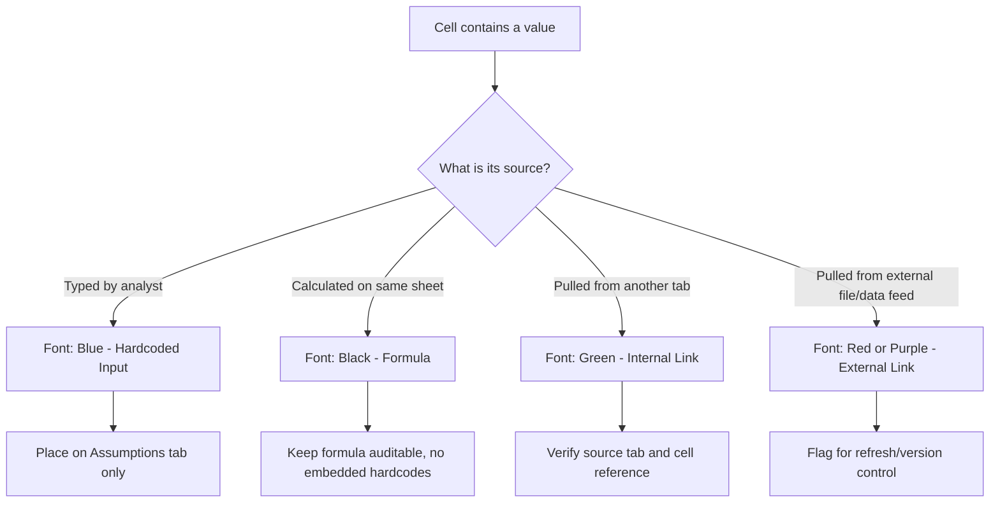

## Formatting and Presentation Standards for Financial Models

### Overview and Purpose

Formatting and presentation standards exist to make a financial model auditable, navigable, and trustworthy at a glance. A model that is analytically correct but visually inconsistent invites errors during review, slows down due diligence, and undermines the credibility of the analyst who built it. Professional standards (used across bulge-bracket investment banks, private equity firms, and corporate FP&A teams) converge on a common philosophy: **color-code by input type, structure by function, and make every number traceable to its source without needing to ask the modeler.**

The three pillars of professional model formatting are:

- **Consistency** — identical treatment of identical concepts across every sheet
- **Traceability** — any reviewer can determine whether a cell is a hardcoded input, a formula, or a cross-sheet link just by looking at it
- **Navigability** — a reviewer can move through the model without getting lost, using consistent structure, labeling, and navigation aids

---

### The Color-Coding Convention

This is the single most important formatting standard in financial modeling. The convention signals **cell provenance** — where a number comes from — using font color.

| Font Color | Meaning | Example |
| --- | --- | --- |
| **Blue** | Hardcoded input / assumption | Typing `0.03` for a growth rate |
| **Black** | Formula (calculated within the same sheet) | `=B5*(1+B6)` |
| **Green** | Link to another sheet/tab in the same workbook | `=Assumptions!B12` |
| **Red** | Link to an external workbook, or a flag/warning | `=[Comps.xlsx]Sheet1!A1` |
| **Purple/Magenta** (some shops) | Link to a different data source, e.g., a Bloomberg or Capital IQ pull | `=BDP("AAPL US Equity","PX_LAST")` |

**Key Points**

- This convention must be applied **without exception**. A single black hardcode buried inside a formula (e.g., `=Revenue*1.03` instead of `=Revenue*(1+$Assumptions.B6)`) is one of the most common and most dangerous modeling errors, because it hides an assumption inside logic where it will never be found or updated.
- Font color should never be used to encode anything other than provenance (i.e., don't also use blue for "important" cells — that overloads the signal).
- Cell fill (background) color is reserved for a separate purpose: flagging outputs, section headers, or scenario toggles (see below), not for the input/formula/link distinction.

[Inference] Different institutions have minor variants (e.g., some use green strictly for intra-workbook links and a separate color for external files), but the blue-input/black-formula core convention is close to universal across bulge-bracket IB, PE, and most corporate finance teams.

---

### Number Formatting Standards

**Key Points**

- **Units consistency**: Declare units once at the top of each sheet or section (e.g., "$ in millions, except per-share data") and format every number to match. Never mix raw dollars and thousands/millions within the same block.
- **Decimal precision**:
  - Dollar figures: typically 0 or 1 decimal place depending on materiality (e.g., `$1,234` vs `$1.2`)
  - Percentages: 1 decimal place standard (`12.3%`), 2 for sensitive rate assumptions (`4.25%`)
  - Per-share figures: 2 decimal places (`$1.23`)
  - Multiples (EV/EBITDA, P/E): 1 decimal place (`8.5x`)
- **Negative numbers**: Parentheses, not minus signs — `(1,234)` not `-1,234`. This is near-universal in finance because minus signs are easy to miss in dense tables, while parentheses are visually distinct.
- **Custom number format codes** commonly used in Excel:



```
#,##0;(#,##0)                    → whole numbers, negatives in parens
#,##0.0;(#,##0.0)                → one decimal, negatives in parens
0.0%;(0.0%)                      → percentages
$#,##0.00;($#,##0.00)            → currency with cents
0.0x;(0.0x)                      → multiples
#,##0;(#,##0);"–"                → zero displays as a dash
```

- **Zero handling**: Many shops format zero to display as a dash (`–`) rather than `0`, reducing visual clutter in sparse tables (e.g., a build-out schedule with many empty future periods).
- **Date formatting**: Consistent across the model — typically `Mar-24` or `3/31/2024` for period headers, never mixed formats within the same row.

---

### Sign Convention

**Key Points**

- Decide once, apply everywhere: is a cash outflow negative or positive? The dominant convention is:
  - **Income statement**: expenses shown as positive numbers, subtracted in formulas (or negative, depending on house style — but pick one)
  - **Cash flow statement**: sources of cash positive, uses of cash negative — this is the most common convention because it makes the net change in cash a simple `SUM()`
  - **Balance sheet**: assets and liabilities both shown as positive; equity as positive
- [Inference] Because sign convention varies by firm and even by team within a firm, the critical standard isn't which convention you choose, but that you document it explicitly (e.g., a note at the top of the CFS: "Uses of cash shown as negative") and never mix conventions within a single statement.

---

### Structural and Layout Standards

**Key Points**

- **Time flows left to right**: Historical periods on the left, forecast periods on the right, with a clear visual break (double border, shaded column, or bold column header) marking the transition — often labeled "Actual | Forecast" or "Historical | Projected."
- **One row = one line item, consistently positioned**: Revenue always appears on the same relative row across scenario tabs, output summaries, and the model tab, so a reviewer building muscle memory for the model doesn't have to re-learn layout per sheet.
- **Frozen panes**: Freeze the row containing period headers and the column(s) containing labels, so users scrolling right or down never lose context of what row/column they're viewing.
- **Consistent column widths** across sheets that will be compared side-by-side or printed together.
- **Section headers**: Use a distinct fill color and bold font for section dividers (e.g., "Income Statement," "Key Assumptions," "Sensitivity Analysis") to allow fast visual scanning.
- **Indentation hierarchy**: Sub-line items indented under their parent total (e.g., "Cost of Goods Sold" indented under "Total Operating Expenses") using Excel's indent feature, not manual spaces, so it remains robust to font changes.

**Example — Typical row indentation hierarchy:**



```
Total Revenue
    Product Revenue
    Service Revenue
Total Operating Expenses
    Cost of Goods Sold
    SG&A
    R&D
Operating Income (EBIT)
```

---

### Sheet and Tab Organization

**Key Points**

- **Tab naming**: Short, descriptive, consistently cased (e.g., `Assumptions`, `IS`, `BS`, `CFS`, `DCF`, `Sens`, `Output`) — avoid `Sheet1`, `Copy of IS (2)`.
- **Tab color-coding**: Many shops color tabs by function — e.g., blue tabs for inputs, black/white for core statements, green for outputs — mirroring the cell font convention at the navigation level.
- **Logical tab order**: Cover/Instructions → Assumptions → Historical Financials → Projections (IS/BS/CFS) → Supporting Schedules (Debt, Capex/Depreciation, Working Capital) → Valuation (DCF, Comps, Precedent) → Output/Summary → Sensitivity/Scenario.
- **Single point of entry for assumptions**: All hardcoded drivers live on one (or a small number of) `Assumptions` tab(s). Statement tabs should contain formulas linking back to Assumptions, never scattered hardcodes.

---

### Navigation and Readability Aids

**Key Points**

- **Named ranges** for key drivers (e.g., `WACC`, `TerminalGrowthRate`) improve formula readability: `=FCF/(WACC-TerminalGrowthRate)` is self-documenting versus `=B45/(B12-B13)`.
- **Cell comments/notes** on non-obvious assumptions — e.g., a note on a tax rate cell explaining "Blended effective rate per 10-K Note 12."
- **Group/outline rows** (Excel's Data > Group feature) to allow collapsing supporting detail while keeping summary rows visible — useful for lengthy working-capital or debt schedules.
- **Checks and flags row**: A dedicated row (often highlighted red/green) that validates internal consistency, e.g., `Balance Sheet Check = Total Assets - Total Liabilities & Equity` should equal zero; formatted with conditional formatting to turn red if nonzero.

**Example — Balance check formula and conditional format:**



```
Balance Check:  =TotalAssets - TotalLiabilitiesAndEquity
Conditional Format: IF(ABS(Check) > 0.01, Red Fill, Green Fill)
```

---

### Conditional Formatting for Model Integrity

**Key Points**

- Apply conditional formatting to **error-check rows**, not to arbitrary data — overuse creates visual noise and trains reviewers to ignore flags.
- Common uses:
  - Balance sheet imbalance flags (red if nonzero)
  - Circular reference / iterative calculation warnings
  - Negative equity or negative cash warnings
  - Scenario toggle indicators (e.g., a cell showing "Base Case" in green, "Downside" in amber, "Upside" in blue)
- [Inference] Because conditional formatting rules are stored in the workbook and can silently break when rows are inserted/deleted, best practice is to audit conditional formatting ranges (`Home > Conditional Formatting > Manage Rules`) after any structural edit to the model.

---

### Font, Borders, and Visual Hierarchy

**Key Points**

- **Single font family** throughout the workbook (Arial and Calibri are the two dominant choices in professional models); mixing fonts signals a model that was assembled from multiple sources without cleanup.
- **Font size hierarchy**: typically 10-11pt for body data, 11-12pt bold for section headers, slightly larger for the title/cover sheet.
- **Borders used sparingly and purposefully**:
  - Single bottom border under the last line before a subtotal
  - Double bottom border under a subtotal that feeds a final total (accounting convention)
  - No full cell-gridlines/boxes around entire tables — this looks like a spreadsheet dump, not a model
- **Bold** reserved for totals, subtotals, and headers — not used for emphasis within body data, where it competes with the totals for visual attention.

---

### Scenario and Sensitivity Presentation

**Key Points**

- **Scenario switches** (often a dropdown via Data Validation, or a numeric toggle 1/2/3) should be prominently placed, usually top-left of the Assumptions or Output tab, with a clear label ("Scenario: Base / Upside / Downside").
- **Data tables for sensitivity analysis** (Excel's `Data Table` feature under What-If Analysis) should be clearly bordered, with the output metric in the top-left corner, row/column input variables labeled, and often a heat-map style conditional format (green-to-red gradient) to make magnitude patterns visually immediate.

**Example sensitivity table layout:**



```
                 WACC →
              7.5%   8.0%   8.5%   9.0%
Terminal  2.0%  ...   ...    ...    ...
Growth ↓  2.5%  ...   ...    ...    ...
          3.0%  ...   ...    ...    ...
```

---

### Diagram: Model Formatting Decision Flow



---

### Illustration: Color-Coding Legend

<svg xmlns="http://www.w3.org/2000/svg" viewBox="0 0 640 260">
<text x="20" y="28" font-family="Arial" font-size="16" font-weight="bold" fill="#1a1a1a">Cell Color-Coding Convention (svg_diagram)</text>
<rect x="20" y="50" width="24" height="24" fill="#ffffff" stroke="#cccccc" />
<text x="55" y="67" font-family="Arial" font-size="14" fill="#0000FF">0.030</text>
<text x="140" y="67" font-family="Arial" font-size="13" fill="#1a1a1a">Blue = Hardcoded Input</text>
<rect x="20" y="90" width="24" height="24" fill="#ffffff" stroke="#cccccc" />
<text x="55" y="107" font-family="Arial" font-size="14" fill="#000000">=B5*B6</text>
<text x="140" y="107" font-family="Arial" font-size="13" fill="#1a1a1a">Black = Same-Sheet Formula</text>
<rect x="20" y="130" width="24" height="24" fill="#ffffff" stroke="#cccccc" />
<text x="55" y="147" font-family="Arial" font-size="14" fill="#008000">=Assum!B4</text>
<text x="140" y="147" font-family="Arial" font-size="13" fill="#1a1a1a">Green = Internal Cross-Sheet Link</text>
<rect x="20" y="170" width="24" height="24" fill="#ffffff" stroke="#cccccc" />
<text x="55" y="187" font-family="Arial" font-size="14" fill="#C00000">=[Ext.xlsx]A1</text>
<text x="140" y="187" font-family="Arial" font-size="13" fill="#1a1a1a">Red = External Workbook Link</text>
<rect x="20" y="210" width="24" height="24" fill="#ffffff" stroke="#cccccc" />
<text x="55" y="227" font-family="Arial" font-size="14" fill="#7030A0">=BDP(...)</text>
<text x="140" y="227" font-family="Arial" font-size="13" fill="#1a1a1a">Purple = Data Feed (Bloomberg/CapIQ)</text>
</svg>

---

### Common Mistakes to Avoid

**Key Points**

- Embedding a hardcoded assumption inside a formula instead of referencing a labeled input cell (breaks traceability and auditability)
- Mixing units (thousands vs. millions) across sheets without clear labeling
- Inconsistent sign conventions between the cash flow statement and supporting schedules
- Using merged cells extensively, which breaks copy/paste, sorting, and formula fill-down behavior [Unverified: exact breakage depends on Excel version and specific operation, but merged cells are widely discouraged in professional modeling for this reason]
- Applying different date or number formats to the same conceptual column across tabs
- Leaving old conditional formatting rules active after rows are deleted, causing rules to apply to blank or wrong ranges

---

### Related Topics

- Excel Modeling Best Practices and the FAST Standard
- Building a Three-Statement Model Architecture
- Circular Reference Management and Iterative Calculations
- Scenario and Sensitivity Analysis Techniques in Excel
- Model Auditing and Error-Checking Frameworks
- Data Validation and Dropdown-Driven Scenario Toggles
- Named Ranges and Formula Readability
- Building Dashboards and Executive Summary Tabs