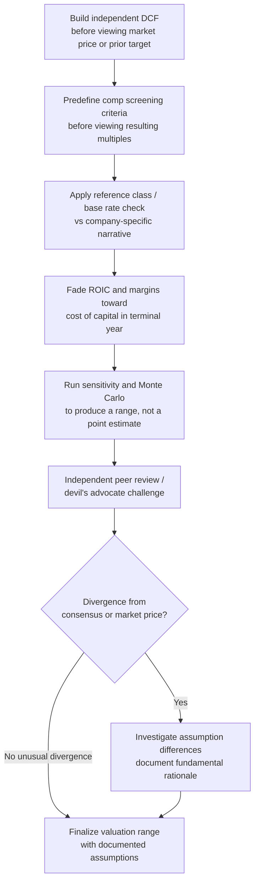

## Common Cognitive Biases in Valuation

### Overview

Cognitive biases in valuation are systematic deviations from rational judgment that distort inputs, assumptions, and conclusions in corporate valuation and DCF analysis. Unlike random errors, which cancel out over many estimates, biases push estimates consistently in one direction. In valuation work, biases enter at every stage: forecasting revenue growth, selecting discount rates, estimating terminal value, and interpreting comparable company data. Because valuation combines quantitative modeling with subjective judgment calls (growth rates, margin trajectories, risk premiums), it is unusually exposed to bias relative to more mechanical financial tasks.

**Key Points**

- Biases are systematic (directional), not random noise — averaging multiple biased estimates does not eliminate them
- Valuation is especially vulnerable because it requires long-horizon forecasts under genuine uncertainty
- Biases can originate from the analyst, the client/stakeholder pressure, or the process/tools used
- Recognizing a bias by name is a necessary but insufficient step; mitigation requires structural changes to process

### Anchoring Bias

Anchoring occurs when an initial reference point (an "anchor") disproportionately influences subsequent estimates, even when that anchor is arbitrary or irrelevant.

**Manifestations in valuation:**

- Starting a DCF from a previously published price target and adjusting only slightly from it
- Using the current market price as an unconscious "sanity check" ceiling or floor for intrinsic value estimates, defeating the purpose of an independent valuation
- Letting a client-stated expectation (e.g., "we think this is worth about $500M") shape subsequent multiple selection or discount rate assumptions
- In M&A, anchoring the target valuation near the initial offer price rather than reassessing fundamentals

**Example**

An analyst valuing a private company for an acquisition learns the seller is asking $120M. Even after building an independent DCF that produces $95M, the analyst "adjusts" assumptions (terminal growth, WACC) until the model outputs something closer to $110M, rationalizing each individual tweak as reasonable.

**Mitigation:**

- Build the model before observing the market price, prior valuation, or deal price; compare only after completion
- Document the DCF output before any peer-review discussion where a target number might be mentioned
- Use blind or masked valuation exercises in training contexts

### Overconfidence Bias

Overconfidence is the tendency to overestimate the precision or accuracy of one's own estimates, forecasts, or judgment.

**Manifestations:**

- Overly narrow sensitivity ranges in scenario or Monte Carlo analysis (e.g., only testing WACC $\pm 0.5\%$ when true uncertainty is much larger)
- Excessive precision in point estimates (presenting a single $47.32/share target rather than a probability-weighted range)
- Underestimating forecast error for long-dated projections, particularly terminal value, which often represents 60-80% of total DCF value
- Dismissing model criticism from peers or reviewers

**Example**

A five-year revenue forecast assumes 15% CAGR with a "worst case" of 12% and "best case" of 18% — a narrow 6-point spread — despite the company operating in a volatile, competitive market where actual five-year outcomes for comparable firms have ranged from -5% to +30% CAGR historically.

**Mitigation:**

- Calibrate ranges against historical base rates for similar companies/industries, not intuition
- Use reference class forecasting (see below) to widen scenario bands
- Track forecast accuracy over time (a "track record" audit) to recalibrate confidence

### Confirmation Bias

Confirmation bias is the tendency to search for, interpret, and recall information in a way that confirms a pre-existing belief or desired conclusion.

**Manifestations:**

- Selectively choosing comparable companies (comps) that support a target valuation range while excluding equally valid comps that would lower it
- Emphasizing management guidance and optimistic analyst estimates while discounting skeptical research
- Interpreting ambiguous industry data (e.g., a slowing growth signal) as "temporary" when it supports a bullish thesis, but as "structural" when it supports a bearish one
- In sell-side contexts, unconsciously favoring assumptions that support the deal being pitched

**Example**

An analyst tasked with a fairness opinion supporting a proposed merger selects a comparable companies set that skews toward higher-multiple peers, justified post hoc as "more similar in growth profile," while excluding lower-multiple peers with similarly comparable business models.

**Mitigation:**

- Predefine comp selection criteria (industry classification, size, growth, margin bands) before viewing the resulting multiples
- Assign a devil's advocate or independent reviewer to argue the opposite conclusion
- Use structured, criteria-based screening tools rather than discretionary picks

### Optimism Bias

Optimism bias is the tendency to overestimate favorable outcomes and underestimate unfavorable ones, distinct from overconfidence in that it concerns the direction of estimates rather than their precision.

**Manifestations:**

- Systematically forecasting revenue growth, margin expansion, or market share gains above what base rates or historical performance justify
- Underestimating capital expenditure, working capital needs, or competitive response
- Assuming synergies in M&A models will be fully realized on schedule, when empirical studies consistently show most deals fail to achieve projected synergies
- Terminal growth rates set near or above long-run GDP/inflation without justification

**Example**

A DCF for a SaaS company assumes gross margins expand from 65% to 82% over five years "as the company scales," without benchmarking against comparable SaaS companies' actual margin trajectories at similar revenue scale, many of which plateau lower due to customer support and infrastructure costs.

**Mitigation:**

- Apply reference class forecasting: gather outcome distributions from a class of similar past projects/companies rather than relying on inside-view reasoning about "this case is different"
- Apply explicit haircuts to management-provided synergy or growth estimates based on historical realization rates
- Require sourcing/benchmarking for any margin or growth assumption that exceeds historical company or peer performance

### Base Rate Neglect (and the Inside View vs. Outside View)

Base rate neglect is the failure to sufficiently weight general statistical information (the "outside view") in favor of case-specific narrative reasoning (the "inside view").

**Manifestations:**

- Valuing a startup based on its specific story and management's narrative, while ignoring the base rate of failure/success for companies at similar stage and sector
- Assuming a company's competitive advantage will persist indefinitely in the terminal value calculation, ignoring the well-documented empirical pattern of return-on-invested-capital (ROIC) fading toward the cost of capital over time (competitive fade)
- Ignoring historical mean-reversion in industry margins and multiples when projecting a company's own trajectory

**Example**

An analyst assumes a company currently earning 35% ROIC will sustain that return indefinitely into the terminal period, despite decades of empirical evidence (see Novy-Marx, Damodaran, and others) that abnormal returns are competed away over 10-15 year horizons in most industries absent durable moats.

**Mitigation:**

- Explicitly fade ROIC/margins toward industry or cost-of-capital benchmarks in terminal-year assumptions unless a specific, defensible moat is identified
- Compare company-specific forecasts against sector/base rate distributions before finalizing

### Availability Bias

Availability bias is the tendency to overweight information that is recent, vivid, or easily recalled, rather than information that is statistically representative.

**Manifestations:**

- Overweighting a recent macroeconomic event (e.g., a recent rate hike cycle or recession) in long-term discount rate or growth assumptions
- Overreacting to a single recent quarterly earnings beat/miss when setting multi-year forecasts
- Overweighting a memorable prior deal or valuation outcome as a template, even when circumstances differ materially

**Example**

Following a period of high inflation and rising rates, an analyst applies an elevated equity risk premium to a 10-year DCF, even though the terminal period assumptions should reflect long-run normalized conditions rather than the current point in the cycle.

**Mitigation:**

- Use long-run historical averages (e.g., long-run equity risk premium, normalized margins) for terminal assumptions rather than trailing recent data
- Explicitly separate "current conditions" (which affect near-term forecast years) from "steady-state" assumptions (terminal year)

### Herding / Social Proof Bias

Herding bias is the tendency to align estimates with those of peers, consensus analyst estimates, or prior internal valuations, rather than independently derived judgment.

**Manifestations:**

- Setting a DCF-derived valuation close to consensus sell-side price targets to avoid appearing as an outlier
- Adjusting WACC or multiples to fall within a "normal-looking" range relative to peer reports
- Following a prior analyst's assumptions in a template without independently re-examining them

**Example**

An internal valuation team's DCF suggests a stock is worth $40/share against a market price of $65 and consensus targets averaging $68. Rather than presenting the divergent $40 figure, the team revises assumptions until the model outputs $60-65, closer to the group consensus, without a fundamentals-based reason for the change.

**Mitigation:**

- Present and defend the independently derived valuation first, before comparing to consensus or market price
- Treat large divergence from consensus as a prompt for review of *assumptions*, not as evidence the model is wrong by default
- Document assumption changes with fundamental justification, not "to align with market"

### Incentive-Driven (Motivated Reasoning) Bias

This bias arises when the analyst's or firm's compensation, career, or relationship incentives shape the valuation output, consciously or unconsciously.

**Manifestations:**

- Sell-side analysts producing valuations that support investment banking relationships (fairness opinions supporting a proposed deal price)
- Management-provided forecasts for goodwill impairment testing that avoid triggering write-downs
- Buy-side analysts under pressure to justify a position already taken, adjusting DCF inputs to support the existing thesis rather than testing it objectively
- Fee-based valuation firms facing pressure from the engaging party to reach a particular conclusion (a documented issue in fairness opinion literature)

**Example**

A company facing potential goodwill impairment instructs (explicitly or implicitly) its valuation team to use a lower discount rate and higher terminal growth rate than used in prior periods, specifically to keep the reporting unit's fair value above carrying value and avoid an impairment charge.

**Mitigation:**

- Structural separation between deal teams and valuation/fairness opinion teams
- External, independent review requirements for high-stakes valuations (impairment testing, fairness opinions)
- Disclosure of assumption changes period-over-period with justification

### Illusion of Precision (False Precision)

This is the tendency to present valuation outputs with more numerical precision than the underlying assumptions justify, creating a false sense of certainty.

**Manifestations:**

- Presenting a DCF output as a single point estimate (e.g., "$52.17/share") rather than a range
- Carrying assumptions to unjustified decimal precision (e.g., WACC of 8.73% derived from inputs each individually uncertain by ±1-2 percentage points)
- Sensitivity tables that vary one input at a time (WACC, growth rate) without acknowledging correlated uncertainty across the full assumption set

**Example**

$$V_0 = \sum_{t=1}^{n} \frac{FCF_t}{(1+r)^t} + \frac{TV_n}{(1+r)^n}$$

Reporting $V_0$ = $1,847,392,000 (to the nearest thousand) when $r$ itself is a judgment-based estimate with realistic uncertainty of ±2 percentage points, which alone can swing $V_0$ by 20-40%, misrepresents the model's actual precision.

**Mitigation:**

- Report valuation ranges (e.g., football field charts) rather than single-point outputs
- Round outputs to a precision consistent with input uncertainty
- Use Monte Carlo or scenario-weighted approaches to generate distributions rather than deterministic point estimates

### Bias Interaction Map (svg_diagram)

The following diagram shows how these biases commonly compound across the valuation workflow, since they are rarely isolated — an anchored initial estimate is often reinforced by confirmation bias in comp selection and validated via herding against consensus.

<svg xmlns="http://www.w3.org/2000/svg" viewBox="0 0 900 480">
<text x="450" y="28" font-family="Arial, sans-serif" font-size="18" font-weight="bold" text-anchor="middle" fill="#222">Bias Interaction Map Across the Valuation Workflow (svg_diagram)</text>
<rect x="30" y="60" width="180" height="60" rx="8" fill="#dbeafe" stroke="#2563eb" stroke-width="1.5" />
<text x="120" y="85" font-family="Arial" font-size="13" text-anchor="middle" fill="#1e3a8a" font-weight="bold">Initial Reference</text>
<text x="120" y="103" font-family="Arial" font-size="11" text-anchor="middle" fill="#1e3a8a">(price, prior target)</text>
<rect x="30" y="200" width="180" height="60" rx="8" fill="#fef3c7" stroke="#d97706" stroke-width="1.5" />
<text x="120" y="225" font-family="Arial" font-size="13" text-anchor="middle" fill="#78350f" font-weight="bold">Anchoring Bias</text>
<text x="120" y="243" font-family="Arial" font-size="11" text-anchor="middle" fill="#78350f">DCF built near anchor</text>
<rect x="330" y="200" width="200" height="60" rx="8" fill="#fee2e2" stroke="#dc2626" stroke-width="1.5" />
<text x="430" y="225" font-family="Arial" font-size="13" text-anchor="middle" fill="#7f1d1d" font-weight="bold">Confirmation Bias</text>
<text x="430" y="243" font-family="Arial" font-size="11" text-anchor="middle" fill="#7f1d1d">Comps/data selected to fit</text>
<rect x="660" y="200" width="210" height="60" rx="8" fill="#dcfce7" stroke="#16a34a" stroke-width="1.5" />
<text x="765" y="225" font-family="Arial" font-size="13" text-anchor="middle" fill="#14532d" font-weight="bold">Optimism / Base Rate Neglect</text>
<text x="765" y="243" font-family="Arial" font-size="11" text-anchor="middle" fill="#14532d">Inflated growth &amp; ROIC fade</text>
<rect x="180" y="340" width="220" height="60" rx="8" fill="#ede9fe" stroke="#7c3aed" stroke-width="1.5" />
<text x="290" y="365" font-family="Arial" font-size="13" text-anchor="middle" fill="#4c1d95" font-weight="bold">Illusion of Precision</text>
<text x="290" y="383" font-family="Arial" font-size="11" text-anchor="middle" fill="#4c1d95">Single point estimate output</text>
<rect x="500" y="340" width="220" height="60" rx="8" fill="#fce7f3" stroke="#db2777" stroke-width="1.5" />
<text x="610" y="365" font-family="Arial" font-size="13" text-anchor="middle" fill="#831843" font-weight="bold">Herding Bias</text>
<text x="610" y="383" font-family="Arial" font-size="11" text-anchor="middle" fill="#831843">Aligned to consensus/peer view</text>
<rect x="330" y="440" width="240" height="35" rx="8" fill="#f1f5f9" stroke="#334155" stroke-width="1.5" />
<text x="450" y="463" font-family="Arial" font-size="12" text-anchor="middle" fill="#0f172a" font-weight="bold">Overstated / Understated Valuation</text>
<line x1="120" y1="120" x2="120" y2="195" stroke="#555" stroke-width="1.5" marker-end="url(#arrow)" />
<line x1="210" y1="230" x2="325" y2="230" stroke="#555" stroke-width="1.5" marker-end="url(#arrow)" />
<line x1="530" y1="230" x2="655" y2="230" stroke="#555" stroke-width="1.5" marker-end="url(#arrow)" />
<line x1="400" y1="260" x2="320" y2="335" stroke="#555" stroke-width="1.5" marker-end="url(#arrow)" />
<line x1="700" y1="260" x2="640" y2="335" stroke="#555" stroke-width="1.5" marker-end="url(#arrow)" />
<line x1="350" y1="400" x2="410" y2="437" stroke="#555" stroke-width="1.5" marker-end="url(#arrow)" />
<line x1="560" y1="400" x2="490" y2="437" stroke="#555" stroke-width="1.5" marker-end="url(#arrow)" />
</svg>

### Debiasing Process Flow

### Summary Table: Bias, Primary Risk, and Core Mitigation

| Bias | Primary Distortion | Core Mitigation |
| --- | --- | --- |
| Anchoring | Estimate pulled toward irrelevant reference point | Build model blind to price/target before comparison |
| Overconfidence | Ranges/scenarios too narrow | Calibrate against historical base rates |
| Confirmation | Selective evidence gathering | Predefine screening criteria; devil's advocate review |
| Optimism | Growth/margin/synergy overestimation | Reference class forecasting; haircut management estimates |
| Base Rate Neglect | Ignoring statistical regularities (e.g., ROIC fade) | Explicit fade to industry/cost-of-capital benchmarks |
| Availability | Overweighting recent/vivid data | Use long-run normalized data for terminal assumptions |
| Herding | Conforming to consensus without basis | Present independent estimate first; justify divergence |
| Incentive-driven | Output shaped by compensation/relationships | Structural separation of deal and valuation teams |
| Illusion of Precision | False certainty in point estimates | Report ranges/distributions, not single figures |

### Conclusion

Cognitive biases in valuation are not occasional errors but structural, recurring distortions rooted in how the human brain processes uncertainty, incentives, and social context. [Inference] Because these biases tend to interact and compound — an anchored estimate reinforced by confirmation bias and validated through herding — a single debiasing technique is generally insufficient; robust valuation practice requires layering multiple structural safeguards (blind initial estimation, predefined criteria, independent review, range-based reporting) rather than relying on individual analyst awareness or willpower alone. [Unverified] The specific magnitude of bias-driven valuation error in any given engagement is difficult to quantify precisely and will vary by analyst, firm process maturity, and situational incentive pressure.

**Related Topics**

- Base Rate Neglect and Reference Class Forecasting in Financial Forecasting
- Terminal Value Estimation and Competitive Fade (ROIC convergence)
- Structuring Independent Peer Review Processes for Valuation
- Scenario Analysis and Monte Carlo Simulation in DCF Modeling
- Fairness Opinions: Conflicts of Interest and Regulatory Safeguards
- Behavioral Finance Foundations (Kahneman, Tversky — Prospect Theory)
- Goodwill Impairment Testing and Management Incentive Effects