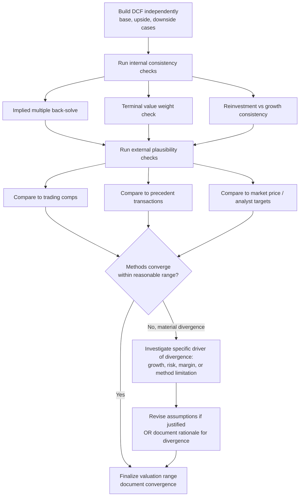

## Sanity-Checking and Cross-Validating Valuation Outputs

### Overview

Sanity-checking and cross-validation are the disciplined processes of testing a valuation's output — and the mechanics that produced it — against independent benchmarks, internal consistency rules, and alternative methodologies before that output is relied upon. A DCF can be mathematically flawless and still be wrong, because it will faithfully compute whatever the analyst feeds it. Cross-validation addresses this by triangulating the DCF-derived value against other valuation methods (multiples, precedent transactions, asset-based approaches) and by testing the model's implied outputs against real-world plausibility.

**Key Points**

- A single valuation method, however carefully built, is a point of failure; cross-validation reduces reliance on any one methodology's blind spots
- Sanity checks fall into two categories: internal consistency (does the model behave logically) and external plausibility (does the output make sense relative to the market/industry)
- The goal is not to force convergence between methods, but to understand and explain divergence
- This process should be built into the standard valuation workflow, not treated as an optional final step

### Internal Consistency Checks

These verify that the DCF model behaves logically on its own terms, independent of external benchmarks.

**Implied Multiple Back-Solve**

Convert the DCF output into implied trading multiples and compare them to where the company or its peers actually trade.

$$\text{Implied EV/EBITDA} = \frac{EV_{DCF}}{EBITDA_{t}}$$

If a DCF implies an EV/EBITDA multiple of 22x for a company whose peer set trades at 9-12x, this is not automatically wrong, but it demands a specific, articulable reason (e.g., structurally superior growth or margins) rather than being accepted at face value.

**Terminal Value Weight Check**

$$\text{TV Weight} = \frac{PV(TV)}{V_0}$$

If the present value of the terminal value represents more than roughly 75-85% of total enterprise value, [Inference] the valuation's credibility rests almost entirely on assumptions about a period the analyst has the least visibility into, warranting closer scrutiny of terminal growth and margin assumptions specifically.

**Implied Perpetuity Growth Reasonableness**

Back-solve the terminal growth rate ($g$) implied by a chosen terminal multiple, or vice versa, using the Gordon Growth relationship:

$$TV_n = \frac{FCF_{n+1}}{r - g} = \frac{FCF_n (1+g)}{r-g}$$

A terminal growth rate exceeding long-run nominal GDP growth (typically cited around 2-4% for developed markets) [Unverified] implies the company grows faster than the overall economy forever, which is generally considered unsustainable absent a specific, justified structural reason.

**Reinvestment Consistency Check**

Verify that assumed growth is internally consistent with assumed reinvestment, using the fundamental growth identity:

$$g = ROIC \times \text{Reinvestment Rate}$$

If the model assumes 8% terminal growth but a reinvestment rate implying only 3-4% supportable growth at the assumed ROIC, the model contains an internal contradiction — growth is being assumed without the capital investment required to produce it.

**WACC Circularity and Capital Structure Check**

Confirm that the WACC used is consistent with the capital structure assumed in the projections (not the current book capital structure, if the projections assume different leverage), and that the discount rate is applied to the correct cash flow measure (unlevered FCF with WACC; levered FCF with cost of equity).

### External Plausibility Checks

These test the DCF output against evidence outside the model itself.

**Football Field / Multi-Method Triangulation**

Present the DCF output alongside outputs from other methodologies on a single comparative range chart:

- Comparable Company Analysis (trading multiples)
- Precedent Transaction Analysis
- DCF (base, upside, downside cases)
- 52-week trading range (for public companies)
- Analyst price targets (as a market-sentiment reference, not a valuation method)

If the DCF sits materially outside the range implied by all other methods, this is a signal to revisit assumptions — not necessarily evidence the DCF is wrong, but evidence that requires explicit reconciliation.

**Market Price Comparison (Public Companies)**

Comparing DCF output to current market price is a standard consistency check, but the interpretation must avoid the anchoring trap discussed in the bias-mitigation process: this check should occur *after* the independent DCF is built, and any adjustment must be justified by identifying a specific input the market may be pricing differently (e.g., growth durability, risk), not by mechanically forcing convergence.

**Reasonableness Against Historical Financials**

Compare projected metrics (revenue growth, margins, capex intensity, working capital as % of revenue) against the company's own 5-10 year historical trend and against industry norms. A projection that requires the company to break sharply from its own historical pattern needs an explicit catalyst identified (new product line, market entry, cost restructuring) rather than an unexplained trend break.

**Sensitivity and Break-Even Analysis**

Identify the assumption values at which the valuation conclusion would change materially or reverse (e.g., "at what WACC does this deal become value-destructive?"). If the break-even point sits inside a plausible range of outcomes rather than at an extreme, the base case conclusion is fragile and should be presented with that caveat.

### Cross-Validation Methodology Comparison

| Method | What It Captures | What It Misses | Best Use as Cross-Check |
| --- | --- | --- | --- |
| DCF | Intrinsic, fundamentals-driven value | Highly sensitive to terminal assumptions | Baseline; test against others for plausibility |
| Comparable Companies | Current market sentiment for similar risk/growth profiles | Assumes market is efficiently pricing peers; ignores company-specific differences | Sanity check DCF-implied multiples |
| Precedent Transactions | Control premium, real deal dynamics | Deal-specific factors (synergies, competitive tension) may not transfer | Useful in M&A context specifically |
| Asset-Based / NAV | Liquidation or replacement-cost floor | Ignores going-concern earning power | Floor check, esp. for asset-heavy or distressed firms |
| LBO / Sponsor Return Analysis | What a financial buyer could pay and achieve target IRR | Only relevant if company is a plausible LBO candidate | Sets a market-clearing price ceiling in some contexts |

### Cross-Validation Workflow

### Cross-Check Dashboard (svg_diagram)

<svg xmlns="http://www.w3.org/2000/svg" viewBox="0 0 880 380">
<text x="440" y="26" font-family="Arial, sans-serif" font-size="17" font-weight="bold" text-anchor="middle" fill="#222">Valuation Cross-Check Dashboard (svg_diagram)</text>
<rect x="40" y="60" width="800" height="40" fill="#f8fafc" stroke="#cbd5e1" />
<text x="60" y="85" font-family="Arial" font-size="12" fill="#0f172a" font-weight="bold">Check Category</text>
<text x="420" y="85" font-family="Arial" font-size="12" fill="#0f172a" font-weight="bold">Signal Threshold</text>
<text x="680" y="85" font-family="Arial" font-size="12" fill="#0f172a" font-weight="bold">Action if Flagged</text>
<rect x="40" y="100" width="800" height="40" fill="#ffffff" stroke="#e2e8f0" />
<text x="60" y="125" font-family="Arial" font-size="11" fill="#334155">TV % of Enterprise Value</text>
<text x="420" y="125" font-family="Arial" font-size="11" fill="#334155">&gt; ~80%</text>
<text x="680" y="125" font-family="Arial" font-size="11" fill="#334155">Scrutinize terminal assumptions</text>
<rect x="40" y="140" width="800" height="40" fill="#f8fafc" stroke="#e2e8f0" />
<text x="60" y="165" font-family="Arial" font-size="11" fill="#334155">Implied Terminal Growth vs GDP</text>
<text x="420" y="165" font-family="Arial" font-size="11" fill="#334155">g &gt; long-run nominal GDP</text>
<text x="680" y="165" font-family="Arial" font-size="11" fill="#334155">Justify or reduce g</text>
<rect x="40" y="180" width="800" height="40" fill="#ffffff" stroke="#e2e8f0" />
<text x="60" y="205" font-family="Arial" font-size="11" fill="#334155">Implied Exit Multiple vs Peers</text>
<text x="420" y="205" font-family="Arial" font-size="11" fill="#334155">Outside peer multiple range</text>
<text x="680" y="205" font-family="Arial" font-size="11" fill="#334155">Identify structural driver or revise</text>
<rect x="40" y="220" width="800" height="40" fill="#f8fafc" stroke="#e2e8f0" />
<text x="60" y="245" font-family="Arial" font-size="11" fill="#334155">g vs ROIC × Reinvestment Rate</text>
<text x="420" y="245" font-family="Arial" font-size="11" fill="#334155">Implied g exceeds supportable g</text>
<text x="680" y="245" font-family="Arial" font-size="11" fill="#334155">Reconcile reinvestment assumption</text>
<rect x="40" y="260" width="800" height="40" fill="#ffffff" stroke="#e2e8f0" />
<text x="60" y="285" font-family="Arial" font-size="11" fill="#334155">DCF vs Comps/Precedents/Market</text>
<text x="420" y="285" font-family="Arial" font-size="11" fill="#334155">Material, unexplained gap</text>
<text x="680" y="285" font-family="Arial" font-size="11" fill="#334155">Document reconciliation rationale</text>
<rect x="40" y="300" width="800" height="40" fill="#f8fafc" stroke="#e2e8f0" />
<text x="60" y="325" font-family="Arial" font-size="11" fill="#334155">Projections vs Historical Trend</text>
<text x="420" y="325" font-family="Arial" font-size="11" fill="#334155">Sharp unexplained trend break</text>
<text x="680" y="325" font-family="Arial" font-size="11" fill="#334155">Identify explicit catalyst</text>
</svg>

### Worked Example: Reconciling Divergence

Suppose a DCF on a mid-cap industrial company produces an enterprise value of $1.2B, implying an EV/EBITDA of 14x, while the peer comp set trades at a median of 9x and the most recent precedent transaction in the sector closed at 10.5x.

**Diagnostic sequence:**

1. **Check TV weight** — if terminal value is 82% of total value, the divergence likely stems from terminal assumptions rather than near-term forecasts
2. **Back-solve implied terminal growth** — if $g$ = 4.5% against peers implicitly priced for ~2.5% long-run growth, the gap is largely explained by an aggressive terminal growth assumption
3. **Check reinvestment consistency** — verify whether the reinvestment rate assumed can actually support 4.5% growth at the company's ROIC; if not, this confirms an internal inconsistency, not just an aggressive-but-defensible assumption
4. **Resolution** — either identify a specific, evidenced reason the company deserves a structural premium to peers (e.g., recent contract wins locking in above-market growth), or revise $g$ toward a level consistent with peer-implied assumptions and re-run

This sequence — rather than simply splitting the difference between $1.2B and the ~$800M implied by comps — preserves the analytical basis for the final number.

**Example**

$$\text{Implied } g \text{ from peer multiple: } P/E_{peer} = \frac{1}{r-g} \Rightarrow g = r - \frac{1}{P/E_{peer}}$$

If peers trade at 9x forward earnings with $r$ = 10%, implied $g \approx 10\% - 11.1\% = -1.1\%$ (i.e., the market may be pricing in a mature/declining terminal state), directly contradicting a DCF that assumes 4.5% perpetual growth for a company in the same sector.

### Common Pitfalls in Sanity-Checking

- **False comfort from convergence**: two methods agreeing does not guarantee correctness if both share the same flawed underlying assumption (e.g., both DCF and comps rely on the same overly optimistic consensus growth estimates)
- **Cherry-picking the comp set to force convergence**: this converts a legitimate cross-check into a form of confirmation bias rather than genuine validation
- **Treating market price as automatically correct**: market price reflects aggregate sentiment and liquidity conditions, not necessarily intrinsic value; divergence from market price is a prompt for investigation, not automatic correction of the DCF
- **Stopping at the first plausible number**: sanity-checking should identify *why* methods converge or diverge, not simply confirm that a number "looks reasonable"

### Conclusion

Sanity-checking and cross-validation convert a valuation from a single, fragile point estimate into a defensible range supported by multiple independent lines of evidence. [Inference] The discipline's core value lies less in producing a "correct" number — which is rarely knowable with certainty for any going concern — and more in surfacing which specific assumptions are driving the result and whether those assumptions can withstand scrutiny against internal logic, peer evidence, and historical pattern. A valuation that has been rigorously cross-validated is not guaranteed to be accurate, but it is far more likely to have its key sensitivities and failure points explicitly identified and understood.

**Related Topics**

- Terminal Value Estimation and the Gordon Growth Model
- Comparable Company Analysis: Screening and Multiple Selection
- Precedent Transaction Analysis and Control Premiums
- Football Field Valuation Summary Construction
- Reinvestment Rate and the Fundamental Growth Equation
- WACC Estimation and Capital Structure Consistency
- Scenario and Sensitivity Analysis in DCF Modeling