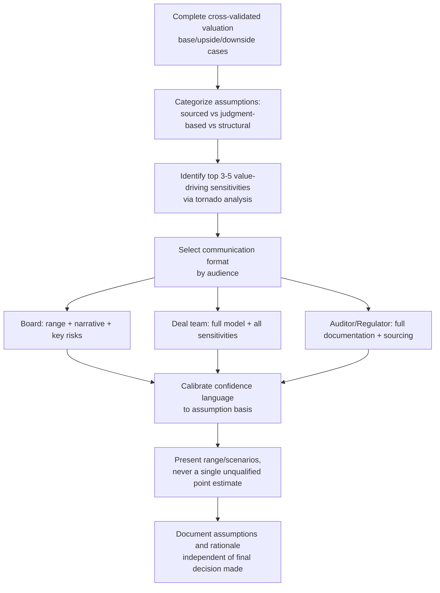

## Communicating Uncertainty and Assumptions to Decision-Makers

### Overview

Communicating uncertainty and assumptions is the practice of presenting valuation conclusions to non-technical or time-constrained decision-makers (boards, investment committees, clients, senior executives) in a way that accurately conveys the confidence level, key drivers, and limitations of the analysis — without either overwhelming the audience with technical detail or falsely implying precision the analysis does not have. This is distinct from the analytical work itself: a technically excellent valuation can still cause poor decisions if its communication misleads the recipient about how certain, sensitive, or assumption-dependent the conclusion is.

**Key Points**

- Decision-makers act on what is communicated, not on what was modeled — a well-built but poorly communicated valuation can still produce bad decisions
- The core tension is between simplicity (decision-makers need an actionable answer) and honesty about uncertainty (a single number implies false precision)
- Effective communication separates "what we know," "what we assumed," and "what we cannot know," rather than presenting all three with equal confidence
- Different audiences (board, deal team, regulators, auditors) require different levels of technical detail from the same underlying analysis

### The Core Communication Problem

Valuation outputs are frequently consumed as if they were facts (e.g., "the company is worth $500M") when they are actually conditional statements (e.g., "the company is worth approximately $500M *if* revenue grows at 12% CAGR, margins expand to 28%, and the discount rate is 9.5%"). The central communication challenge is preserving the conditional nature of the conclusion without making the deliverable unusable for decision-making purposes.

[Inference] This problem is compounded by decision-maker incentives: boards and executives often prefer a single defensible number for reporting, negotiation, or documentation purposes, creating pressure — implicit or explicit — for analysts to collapse a range into a point estimate prematurely.

### Structuring Communication by Audience

| Audience | Primary Need | Appropriate Level of Detail |
| --- | --- | --- |
| Board / Investment Committee | Actionable range + key risk drivers | High-level range, 3-5 key assumption sensitivities, plain-language risk narrative |
| Deal Team / Internal Analysts | Full assumption set and mechanics | Complete model, all sensitivities, methodology detail |
| Auditors / Regulators | Defensibility and methodology compliance | Full documentation, assumption sourcing, standard-compliance rationale |
| Counterparty (M&A negotiation) | Selective, strategically relevant detail | Range and headline drivers only; full model typically not shared |

### Techniques for Communicating Ranges Rather Than Points

**Football Field Presentation**

Present valuation as a range bounded by methodology (DCF, comps, precedents) rather than a single figure, visually showing where methods converge and diverge. This format inherently communicates uncertainty by construction, since a range with visibly different method-based bands cannot be mistaken for false precision.

**Base / Upside / Downside Scenario Framing**

Rather than presenting a single DCF output, present three (or more) named scenarios tied to explicit, named assumption differences:

| Scenario | Key Assumption Driver | Implied Value |
| --- | --- | --- |
| Downside | Revenue growth slows to 5%, margins flat | $X |
| Base | Revenue growth 10%, margins expand 200bps | $Y |
| Upside | Revenue growth 15%, new market entry succeeds | $Z |

This format forces the assumption drivers into the headline presentation itself, rather than burying them in an appendix.

**Tornado / Sensitivity Charts**

Rank the assumptions by their impact on valuation output, so decision-makers can see at a glance which 2-3 inputs matter most — this redirects scrutiny toward the assumptions that actually move the conclusion, rather than treating all inputs as equally important.

$$\Delta V \approx \frac{\partial V}{\partial x_i} \cdot \Delta x_i \quad \text{for each input } x_i$$

**Confidence Language Calibration**

Match verbal confidence language to the underlying analytical basis:

| Confidence Level | Appropriate Language | Underlying Basis |
| --- | --- | --- |
| High | "The analysis indicates," "based on historical data" | Near-term forecasts, well-supported comps, low TV weight |
| Moderate | "Under the assumed scenario," "if X materializes" | Mid-term projections, moderate model sensitivity |
| Low / Speculative | "This scenario assumes," "highly dependent on" | Terminal value, long-dated growth, unprecedented events |

Avoid absolute language ("the company is worth," "will achieve") for outputs that are materially assumption-dependent; prefer conditional framing ("under the base case assumptions, the estimated value is").

### Assumption Documentation Standards

A defensible communication package should make the following explicit and separately identifiable:

1. **Sourced assumptions** — derived from historical company data, verifiable market data, or established benchmarks (e.g., "5-year historical revenue CAGR of 8%")
2. **Judgment-based assumptions** — analyst or management estimates without direct historical support (e.g., "assumed 15% CAGR reflecting planned market expansion")
3. **Structural/mechanical assumptions** — modeling conventions that affect output but are not economic judgments per se (e.g., mid-year discounting convention, terminal year normalization method)
4. **Key sensitivities** — which 3-5 assumptions, if changed within a plausible range, would most change the conclusion

Presenting these categories separately (rather than as an undifferentiated list) allows a decision-maker to identify quickly which parts of the conclusion rest on solid ground versus analyst judgment.

### Communication Workflow

### Common Communication Failures

**Silent precision inflation**: rounding or simplifying a range into a single headline number for a board summary slide, losing the conditional framing that existed in the underlying model (e.g., presenting "$500M" in an executive summary when the model actually produced a $400M-$620M range).

**Burying critical assumptions in appendices**: placing the terminal growth rate or key margin assumption — often the single largest driver of the valuation — in a footnote or appendix while headlining only the output figure.

**Confusing precision with rigor**: using extensive decimal precision or elaborate charts to create an impression of rigor, when the underlying assumption uncertainty does not support that level of apparent precision (see: Illusion of Precision bias).

**Omitting the "what would change this" narrative**: failing to explain to decision-makers what specific future events or data points would materially change the conclusion, leaving them unable to monitor whether the valuation thesis is playing out.

**Overcorrecting into unusable ambiguity**: presenting so many caveats and ranges that the analysis becomes non-actionable; [Inference] the goal is calibrated confidence, not the abdication of a clear recommendation — a well-communicated valuation should still support a decision, just one made with eyes open to its dependencies.

### Example: Executive Summary Framing

**Poor practice:**

> "Based on our DCF analysis, the company is valued at $487.3M."

**Improved practice:**

> "Our analysis indicates an estimated enterprise value in the range of $410M-$560M (base case: ~$487M), driven primarily by assumed revenue growth of 10-12% and margin expansion of 150-250bps over the forecast period. This range is most sensitive to the terminal growth rate assumption (2.0-3.0%) and discount rate (9.0-10.5%); a 1-point change in either would shift the conclusion by approximately $45-60M. Cross-validation against trading comparables (implying $430M-$510M) and recent precedent transactions (implying $460M-$540M) supports the base case range."

The improved version preserves actionability (a usable range and base case) while making the conditional, assumption-dependent nature of the conclusion explicit and quantified.

### Conclusion

Communicating uncertainty and assumptions effectively is what allows a technically sound valuation to actually improve decision quality, rather than simply providing false comfort through an authoritative-looking single number. [Inference] The discipline required is largely one of resisting simplification pressure — from decision-makers who want a clean answer, from time constraints, and from the analyst's own desire to appear confident — while still delivering a genuinely actionable recommendation. Effective practice treats the communication layer as an integral part of the valuation deliverable, not an afterthought applied once the "real" analytical work is complete.

**Related Topics**

- Football Field Valuation Summary Construction
- Scenario and Sensitivity Analysis in DCF Modeling
- Tornado Diagrams and Value Driver Ranking
- Overconfidence Bias and Illusion of Precision in Valuation
- Board and Investment Committee Presentation Design
- Fairness Opinion Documentation Standards
- Monte Carlo Simulation for Valuation Range Estimation