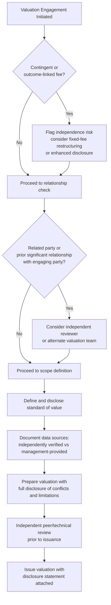

## Independence, Disclosure, and Valuation Ethics

### Overview

Independence, disclosure, and valuation ethics concern the professional and structural safeguards that ensure a valuation's conclusion is driven by analytical merit rather than by the interests of the party commissioning or benefiting from it. Valuation is unusual among analytical disciplines in that it is frequently prepared by a party with a direct or indirect financial stake in the outcome (an investment bank advising on a deal it will be paid to close, a company valuing its own goodwill for impairment testing, an appraiser retained by one side of a dispute). Ethical practice in valuation is therefore concerned less with technical correctness alone and more with the structural conditions under which technically sound analysis can still be compromised.

**Key Points**

- Independence problems arise from *who* commissions and pays for a valuation, not from the technical competence of the analyst
- Disclosure standards exist to make potential conflicts visible to the eventual reader, even when full independence is not achievable
- Professional valuation bodies (e.g., ASA, RICS, CFA Institute) codify ethical standards specifically because self-regulation of bias is unreliable
- Ethical failures in valuation are often not outright fraud but incremental, individually-defensible assumption choices that cumulatively serve an interested party's preferred outcome

### Sources of Independence Impairment

**Fee and Engagement Structure**

- **Contingent fees**: compensation tied to deal closing or to achieving a specific valuation threshold creates a direct financial incentive to reach a particular conclusion. Most professional standards (e.g., CFA Institute Standards of Practice, USPAP) restrict or prohibit contingent fee arrangements for valuations intended to be relied upon by third parties
- **Repeat engagement pressure**: an appraiser or advisor dependent on a single client for a significant share of revenue faces implicit pressure to produce results that preserve the relationship, even without an explicit contingent fee
- **Success-fee-linked M&A advisory**: investment banks earning fees contingent on deal completion face a structural incentive misalignment when also providing a fairness opinion on the same transaction

**Relationship-Based Conflicts**

- Valuing a related party (subsidiary, affiliate, or entity with overlapping ownership/management)
- Prior or concurrent engagements with the same counterparty that create relationship-preservation incentives
- Personal financial interest in the outcome (equity ownership, personal relationships with management)

**Institutional/Structural Conflicts**

- In-house valuation teams reporting to the same executives whose compensation or performance metrics are affected by the valuation conclusion (e.g., goodwill impairment testing performed by teams reporting to the CFO whose bonus is tied to avoiding impairment charges)
- Sell-side fairness opinions prepared by the same bank structuring and earning fees on the underlying transaction

### Disclosure Standards

Disclosure does not eliminate a conflict of interest but makes it visible to the reader, allowing them to weight the conclusion accordingly. Standard disclosure elements include:

| Disclosure Element | Purpose |
| --- | --- |
| Fee structure (fixed vs. contingent) | Reveals whether compensation is tied to outcome |
| Relationship to engaging party | Reveals prior/ongoing business relationships |
| Scope limitations | Clarifies what was and was not independently verified |
| Reliance on management-provided data | Distinguishes analyst-verified data from client-supplied assumptions |
| Prior valuations of the same asset | Reveals whether conclusions have shifted and why |
| Standard of value used | Clarifies whether "fair value," "fair market value," "investment value," etc. was applied, as these are not interchangeable |

**Example disclosure language:**

> "This valuation was prepared on a fixed-fee basis; our fee is not contingent upon the conclusion reached or the outcome of any transaction. [Firm] has provided tax advisory services to [Company] in the past 24 months unrelated to this engagement. This analysis relies on financial projections provided by management, which we have not independently verified for reasonableness beyond the procedures described in Section 3."

### Professional Standards Bodies and Frameworks

- **USPAP (Uniform Standards of Professional Appraisal Practice)** — governs appraisal practice in the U.S., including independence and disclosure requirements, primarily for real property and business valuation appraisers
- **CFA Institute Code of Ethics and Standards of Professional Conduct** — includes specific standards on independence and objectivity (Standard I(B)) applicable to investment analysts performing valuation work
- **ASA (American Society of Appraisers) Business Valuation Standards** — professional and ethical standards specific to business valuation
- **IVS (International Valuation Standards)**, issued by the IVSC (International Valuation Standards Council) — global framework covering valuation bases, independence, and reporting requirements
- **AICPA Statement on Standards for Valuation Services (SSVS)** — governs valuation engagements performed by CPAs

[Unverified] The specific content and version currency of these standards changes periodically; practitioners should confirm the current version in force for their jurisdiction and engagement type before relying on specific provisions, since standards bodies periodically revise requirements.

### Standard of Value: A Frequently Overlooked Ethical Dimension

Selecting the appropriate standard of value is itself an ethical/professional judgment, not merely a technical choice, since different standards can produce materially different conclusions for the same asset:

| Standard of Value | Definition Basis | Typical Use Case |
| --- | --- | --- |
| Fair Market Value | Hypothetical willing buyer/seller, no compulsion, reasonable knowledge | Tax valuations, estate/gift tax |
| Fair Value (legal) | Statutory/case-law defined, often excludes minority/marketability discounts | Shareholder dissent/appraisal actions |
| Fair Value (accounting, ASC 820/IFRS 13) | Exit price in an orderly transaction between market participants | Financial reporting, impairment testing |
| Investment Value | Value to a specific buyer given synergies/strategic fit | M&A negotiations |
| Intrinsic/Fundamental Value | Analyst's independent assessment of true worth | Investment research, activist positions |

Applying the wrong standard of value — even unintentionally — for the stated purpose (e.g., using investment value with synergies in a context requiring fair market value) constitutes both a technical and an ethical error, since it can materially misstate the figure relevant to the actual decision or legal requirement at hand.

### Independence Safeguards in Practice

### Ethical Failure Modes vs. Legitimate Judgment

Distinguishing an ethical lapse from legitimate professional judgment is often the hardest practical challenge in this domain, since both can produce the same visible output (an assumption favorable to the engaging party).

| Indicator | Legitimate Judgment | Potential Ethical Concern |
| --- | --- | --- |
| Assumption sourcing | Grounded in verifiable data, benchmarked to peers/history | Unsupported or contradicted by available data |
| Direction of adjustments | Can move value up or down depending on facts | Consistently favors the interested party's preferred direction |
| Documentation | Rationale explicitly stated and traceable | Rationale vague, post hoc, or absent |
| Consistency over time | Methodology stable across engagements absent fact changes | Methodology or assumptions shift specifically when outcome-relevant |
| Response to challenge | Analyst can defend assumption on independent merits | Assumption defended primarily by reference to desired outcome |

[Inference] In practice, ethical valuation failures are more often characterized by a pattern of individually-plausible but directionally-consistent judgment calls (each defensible in isolation) rather than a single obviously fraudulent input, which is part of why structural safeguards (independent review, disclosure, fee structure rules) are emphasized over reliance on individual judgment alone.

### Governance and Institutional Safeguards

- **Segregation of duties**: separating the team that originates or benefits from a transaction from the team that values it (e.g., separate fairness opinion committees within investment banks)
- **Independent/second-opinion valuations**: engaging a separate, unaffiliated valuation provider for high-stakes or inherently conflicted engagements (common practice for related-party transactions and going-private deals)
- **Valuation committees**: internal review bodies with representation independent of the deal or reporting team, responsible for challenging and approving significant valuation conclusions
- **External audit and regulatory review**: for financial reporting valuations (goodwill impairment, purchase price allocation), external auditors are required to independently test key assumptions
- **Whistleblower and escalation channels**: internal mechanisms allowing analysts to raise concerns about pressure to reach predetermined conclusions without direct reporting-line conflict

### Conclusion

Independence, disclosure, and ethics in valuation address a structural reality that no amount of individual analyst competence or good faith can fully resolve on its own: valuations are frequently prepared under conditions where the preparer, the engaging party, or both have a stake in a particular conclusion. [Inference] Robust practice therefore relies on layered safeguards — fee structure design, disclosure requirements, standard-of-value discipline, segregation of duties, and independent review — operating together, since any single safeguard can be circumvented or is insufficient in isolation. The professional standards bodies governing this space (USPAP, IVS, CFA Institute, ASA) exist precisely because these are recognized as systemic risks to valuation integrity, not merely matters of individual professional conscience.

**Related Topics**

- Fairness Opinions: Structure, Conflicts, and Regulatory Scrutiny
- Standard of Value Selection in Business Valuation
- Goodwill Impairment Testing under ASC 350 / IFRS
- Related-Party Transaction Valuation Requirements
- USPAP and International Valuation Standards (IVS) Frameworks
- Common Cognitive Biases in Valuation
- Peer Review and Valuation Committee Governance Structures