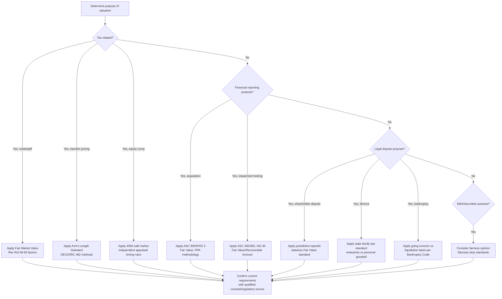

## Legal and Regulatory Contexts for Valuation Opinions

### Overview

Legal and regulatory contexts for valuation opinions concern the specific bodies of law, regulation, and accounting standards that dictate when a formal valuation is required, what standard of value and methodology must be applied, who is qualified to prepare it, and what liability exposure attaches to the preparer. Unlike an internal investment analysis prepared for discretionary decision-making, a valuation performed in a legal or regulatory context is typically bound by externally imposed requirements that constrain the analyst's methodological choices and create formal accountability for the conclusion reached.

**Key Points**

- The legal/regulatory context determines the required standard of value, which materially affects the resulting figure
- Different jurisdictions and regulatory bodies impose different, sometimes conflicting, methodological requirements
- Valuations prepared for regulatory/legal purposes typically carry higher documentation and defensibility burdens than internal analyses
- Practitioners preparing opinions in these contexts should verify current requirements directly with the relevant regulatory body or counsel, since these frameworks are subject to periodic revision

### Tax Valuation Contexts

**Estate and Gift Tax (U.S. — IRC and Treasury Regulations)**

Valuations of closely-held business interests for estate and gift tax purposes generally use the **Fair Market Value** standard, historically informed by Revenue Ruling 59-60, which establishes factors relevant to valuing closely held stock (nature of the business, economic outlook, book value, earning capacity, dividend-paying capacity, goodwill, prior sales of stock, and comparable public company multiples). [Unverified] Specific current Treasury regulations, IRS guidance, and any legislative changes affecting valuation discounts (e.g., minority interest and marketability discounts for family-controlled entities) should be verified against current IRS guidance, as this area has been subject to periodic proposed and enacted regulatory changes.

**Transfer Pricing**

Multinational companies must value intercompany transactions (transfers of goods, services, or intangibles between related entities in different tax jurisdictions) at **arm's length value** under OECD Transfer Pricing Guidelines and corresponding local country regulations (e.g., U.S. IRC Section 482). This context often requires valuing intangible assets (IP, trademarks, know-how) specifically, using methods such as the Comparable Uncontrolled Price (CUP) method, Profit Split method, or income-based approaches analogous to DCF.

**Section 409A (U.S. — Equity Compensation)**

Valuations of common stock in privately held companies for purposes of setting stock option exercise prices must meet specific "safe harbor" requirements under IRC Section 409A to avoid adverse tax treatment for option holders. This typically requires an independent, qualified appraisal performed no more than 12 months prior to the transaction (absent a material event), using recognized valuation methods (income, market, or asset approach, often incorporating an Option Pricing Model or Probability-Weighted Expected Return Method to allocate value across share classes with different liquidation preferences).

### Financial Reporting Contexts

**Purchase Price Allocation (ASC 805 / IFRS 3)**

Following a business combination (acquisition), the acquirer must allocate the purchase price to identifiable tangible and intangible assets and liabilities at **fair value**, with any residual recorded as goodwill. This requires valuing intangible assets (customer relationships, trademarks, developed technology, non-compete agreements) individually, typically using income approaches (relief-from-royalty method for trademarks, multi-period excess earnings method for customer relationships).

**Goodwill and Long-Lived Asset Impairment (ASC 350 / ASC 360, IAS 36)**

Companies must periodically test goodwill and other long-lived assets for impairment, comparing the carrying value of a reporting unit or asset group to its **fair value** (ASC) or **recoverable amount** (IAS 36, the higher of fair value less costs of disposal and value in use). This creates the structural conflict-of-interest dynamic discussed in independence/ethics contexts, since management has a direct incentive to avoid triggering an impairment charge.

$$\text{Impairment Charge} = \max(0, \text{Carrying Value} - \text{Fair Value})$$

**Fair Value Measurement Framework (ASC 820 / IFRS 13)**

Establishes the overarching definition of fair value ("the price that would be received to sell an asset or paid to transfer a liability in an orderly transaction between market participants") and the fair value hierarchy:

| Level | Input Type | Example |
| --- | --- | --- |
| Level 1 | Quoted prices in active markets for identical assets | Publicly traded equity securities |
| Level 2 | Observable inputs other than quoted prices (comparable assets, market-corroborated inputs) | Valuing a bond using observable yield curves |
| Level 3 | Unobservable inputs requiring significant judgment | DCF valuation of a private company using management projections |

Most DCF-based business valuations fall into **Level 3**, which carries heightened disclosure requirements regarding the unobservable inputs used and their sensitivity, given the greater judgment involved.

### Legal Dispute Contexts

**Shareholder Appraisal/Dissenter Rights Actions**

When a company undergoes certain corporate actions (mergers, going-private transactions), dissenting shareholders in many jurisdictions (notably Delaware, under DGCL Section 262) have the right to demand a judicial appraisal of their shares' **fair value**, explicitly excluding synergies from the triggering transaction and, per Delaware case law, [Unverified] historically excluding minority and marketability discounts as well — though the specific treatment of these discounts has evolved through case law and should be verified against current precedent for the relevant jurisdiction.

**Divorce and Marital Dissolution**

Valuation of business interests in divorce proceedings uses standards that vary significantly by state/jurisdiction (fair market value in some, "fair value" or other statutory standards in others), and may require distinguishing enterprise goodwill (transferable, part of the marital estate) from personal/professional goodwill (tied to an individual's reputation or skill, treated differently across jurisdictions).

**Bankruptcy and Insolvency**

Valuations in bankruptcy proceedings (e.g., for plan confirmation under Chapter 11, or solvency opinions) often require valuing the company on a **going concern** basis versus **liquidation** basis, with the comparison itself being central to plan feasibility determinations and creditor recovery analysis (the "best interests of creditors" test).

**Breach of Contract / Damages Valuation**

Litigation-related valuations calculating economic damages (lost profits, business interruption, lost enterprise value) require methodologies tied to legal causation standards and often use "but-for" scenario analysis (comparing actual outcomes to a hypothetical "but-for" scenario absent the alleged breach).

### Securities and Transaction Regulatory Contexts

**Fairness Opinions in M&A**

While not a direct regulatory filing requirement in most jurisdictions, fairness opinions are frequently obtained as part of a board's fiduciary duty of care in evaluating a transaction, and are commonly required or expected in going-private transactions, related-party transactions, and transactions subject to heightened judicial scrutiny (e.g., Revlon duties under Delaware law in a sale-of-control context). [Unverified] Specific procedural requirements and the degree of judicial deference given to a board's reliance on a fairness opinion depend on jurisdiction and the specific transaction structure, and should be confirmed with counsel for any specific transaction.

**SEC Reporting Requirements**

Public company valuations disclosed in SEC filings (e.g., fair value disclosures under ASC 820, purchase price allocations, goodwill impairment analyses) are subject to SEC review and potential comment, creating a regulatory accountability layer beyond the accounting standard itself.

### Regulatory Framework Comparison

| Context | Governing Framework | Standard of Value | Key Distinguishing Feature |
| --- | --- | --- | --- |
| Estate/Gift Tax | IRC, Treasury Regs, Rev. Rul. 59-60 | Fair Market Value | Discounts for lack of control/marketability often applicable |
| Transfer Pricing | OECD Guidelines, IRC §482 | Arm's Length Value | Focus on intercompany intangible/service pricing |
| 409A Compliance | IRC §409A | Fair Market Value | Safe harbor timing and independence requirements |
| Purchase Price Allocation | ASC 805 / IFRS 3 | Fair Value | Intangible-asset-specific valuation required |
| Goodwill Impairment | ASC 350/360, IAS 36 | Fair Value / Recoverable Amount | Management conflict-of-interest risk |
| Shareholder Appraisal | State corporate law (e.g., DGCL §262) | Fair Value (statutory) | Synergies from triggering transaction excluded |
| Divorce | State family law | Varies by jurisdiction | Enterprise vs. personal goodwill distinction |
| Bankruptcy | Bankruptcy Code | Going concern vs. liquidation | Central to plan confirmation/feasibility |

### Regulatory Context Decision Flow

### Practitioner Qualification Requirements

Many of these contexts impose or expect specific professional credentials or qualification standards for the valuation preparer:

- **ASA (Accredited Senior Appraiser)** — American Society of Appraisers credential, often referenced for business valuation and estate/gift tax contexts
- **ABV (Accredited in Business Valuation)** — AICPA credential for CPAs performing business valuation
- **CFA (Chartered Financial Analyst)** — broadly relevant to investment and fairness opinion contexts, governed by CFA Institute ethics standards
- **State-specific real property appraiser licensing** — relevant where real estate valuation intersects with business valuation (e.g., asset-heavy companies)

[Unverified] Specific qualification requirements vary by jurisdiction, regulatory body, and engagement type; requirements for a given engagement should be confirmed against the specific regulatory or legal authority governing that engagement rather than assumed from general practice.

### Conclusion

Legal and regulatory contexts fundamentally shape what "the value" of an asset means in a given engagement, since the applicable framework — not just the underlying economics — determines the standard of value, permissible methodologies, required disclosures, and practitioner qualifications. [Inference] A technically sound DCF or comparable companies analysis can still fail to satisfy a specific regulatory or legal requirement if it applies the wrong standard of value or omits required procedural elements for that context, making early identification of the governing framework a prerequisite to methodology selection rather than an afterthought. Given the frequency of regulatory and case-law updates in this area, practitioners should treat the specific frameworks summarized here as a starting orientation rather than a substitute for current legal, tax, or accounting guidance specific to the engagement's jurisdiction and purpose.

**Related Topics**

- Standard of Value Selection in Business Valuation
- Fair Value Measurement Hierarchy under ASC 820/IFRS 13
- Purchase Price Allocation and Intangible Asset Valuation
- Independence, Disclosure, and Valuation Ethics
- Section 409A Safe Harbor Valuation Requirements
- Shareholder Appraisal Rights and Delaware Case Law
- Transfer Pricing Methods for Intangible Assets