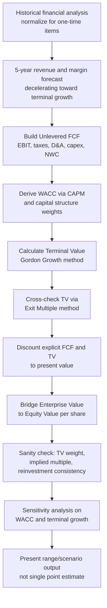

## Full DCF Case Study on a Mature Stable-Growth Company

### Overview

This case study walks through a complete discounted cash flow valuation of a hypothetical mature, stable-growth company — illustrative of firms such as established consumer staples, utilities, or diversified industrials — characterized by low-single-digit to mid-single-digit revenue growth, stable margins, moderate capital intensity, and a limited forecast horizon before reaching a steady-state terminal condition. Mature companies are the archetypal DCF candidate because their relative predictability reduces (though does not eliminate) forecast uncertainty relative to high-growth or distressed firms, making them a useful vehicle for demonstrating full end-to-end DCF mechanics.

**Key Points**

- Mature company DCFs place proportionally more analytical weight on margin stability and reinvestment efficiency than on top-line growth assumptions
- The terminal value calculation is comparatively lower-risk than for high-growth firms, since the forecast period is "closer" to the terminal steady state
- Capital allocation discipline (dividends, buybacks, debt paydown) is often more relevant to a mature company's value drivers than for growth-stage firms
- Despite lower apparent forecast risk, terminal value still typically represents the majority of total enterprise value and must be scrutinized accordingly

### Company Profile (Illustrative)

**"Meridian Consumer Products, Inc." (hypothetical)**

- Established branded consumer packaged goods company, publicly traded
- Current revenue: $4,200M (LTM)
- Historical 5-year revenue CAGR: 3.1%
- EBITDA margin: 22.5%, stable over the past 5 years within a ±100bps band
- Capital expenditure: ~3.5% of revenue (maintenance-level, low growth capex)
- Net debt: $1,100M; Debt/EBITDA: ~1.15x
- Shares outstanding: 180M

### Step 1: Historical Financial Analysis

Before projecting forward, establish the historical baseline and identify normalized figures, adjusting for one-time items (restructuring charges, divestiture gains/losses, litigation settlements) that would distort a forward-looking projection if left unadjusted.

| Metric | Year -4 | Year -3 | Year -2 | Year -1 | LTM |
| --- | --- | --- | --- | --- | --- |
| Revenue ($M) | 3,720 | 3,845 | 3,960 | 4,090 | 4,200 |
| Revenue Growth % | — | 3.4% | 3.0% | 3.3% | 2.7% |
| EBITDA ($M) | 825 | 858 | 885 | 915 | 945 |
| EBITDA Margin % | 22.2% | 22.3% | 22.3% | 22.4% | 22.5% |
| Capex ($M) | 130 | 135 | 138 | 142 | 147 |
| Capex % of Revenue | 3.5% | 3.5% | 3.5% | 3.5% | 3.5% |

**Key Points**

- Stable margin band (22.2-22.5%) supports a low-variance margin assumption going forward, in contrast to a growth-stage company where margin trajectory itself is a major forecast uncertainty
- Consistent capex ratio suggests a maintenance-capex-dominated reinvestment profile appropriate to a mature business

### Step 2: Revenue and Margin Forecast (5-Year Explicit Period)

Mature company forecasts typically use a shorter explicit period (5 years is common, versus 7-10 for high-growth companies) since the business is assumed to already be near its steady state.

| Metric | Year 1 | Year 2 | Year 3 | Year 4 | Year 5 |
| --- | --- | --- | --- | --- | --- |
| Revenue Growth % | 2.8% | 2.7% | 2.6% | 2.5% | 2.5% |
| Revenue ($M) | 4,318 | 4,435 | 4,550 | 4,664 | 4,781 |
| EBITDA Margin % | 22.6% | 22.7% | 22.8% | 22.8% | 22.9% |
| EBITDA ($M) | 976 | 1,007 | 1,037 | 1,063 | 1,095 |

**Assumption basis:** Growth is modeled as a gradual deceleration toward the assumed terminal growth rate (2.5%), reflecting a mature company converging toward GDP-proximate long-run growth rather than sustaining historical rates indefinitely — directly applying the base-rate/competitive-fade discipline discussed in bias mitigation.

### Step 3: Unlevered Free Cash Flow Build

$$UFCF = EBITDA - D\&A - Taxes\ on\ EBIT - Capex - \Delta NWC$$

More precisely, building from EBIT:

$$UFCF = EBIT \times (1 - t) + D\&A - Capex - \Delta NWC$$

| ($M) | Year 1 | Year 2 | Year 3 | Year 4 | Year 5 |
| --- | --- | --- | --- | --- | --- |
| EBITDA | 976 | 1,007 | 1,037 | 1,063 | 1,095 |
| Less: D&A | (155) | (159) | (163) | (167) | (172) |
| EBIT | 821 | 848 | 874 | 896 | 923 |
| Less: Taxes (25%) | (205) | (212) | (219) | (224) | (231) |
| NOPAT | 616 | 636 | 656 | 672 | 692 |
| Plus: D&A | 155 | 159 | 163 | 167 | 172 |
| Less: Capex | (151) | (155) | (159) | (163) | (167) |
| Less: ΔNWC | (13) | (12) | (12) | (11) | (12) |
| **Unlevered FCF** | **607** | **628** | **648** | **665** | **685** |

**Assumption basis:** Tax rate uses the statutory/effective corporate rate applicable to the jurisdiction; D&A and capex are held roughly in line with historical ratios given the maintenance-capex nature of the business; ΔNWC is modeled as a small percentage of revenue growth, consistent with a stable, non-cyclical working capital cycle typical of consumer staples.

### Step 4: Discount Rate (WACC) Derivation

$$WACC = \frac{E}{V} \times r_e + \frac{D}{V} \times r_d \times (1-t)$$

**Cost of Equity (CAPM):**

$$r_e = r_f + \beta \times ERP$$

| Input | Value | Basis |
| --- | --- | --- |
| Risk-free rate ($r_f$) | 4.2% | Long-term government bond yield |
| Beta ($\beta$) | 0.85 | Reflects defensive, low-cyclicality consumer staples profile |
| Equity Risk Premium (ERP) | 5.0% | Long-run historical/implied average |
| **Cost of Equity** | **8.5%** | $4.2\% + 0.85 \times 5.0\%$ |

**Cost of Debt:**

| Input | Value |
| --- | --- |
| Pre-tax cost of debt | 4.8% |
| Tax rate | 25% |
| After-tax cost of debt | 3.6% |

**Capital Structure Weights:**

| Component | Market Value ($M) | Weight |
| --- | --- | --- |
| Equity (market cap) | 6,300 | 85.1% |
| Debt | 1,100 | 14.9% |
| **Total** | **7,400** | **100%** |

$$WACC = 0.851 \times 8.5\% + 0.149 \times 3.6\% = 7.23\% + 0.54\% = 7.77\%$$

[Inference] A beta below 1.0 and resulting WACC in the high-single-digit range is typical for a defensive, low-cyclicality mature consumer company, though the specific inputs (risk-free rate, ERP, beta) should be sourced from current market data at the time of any actual valuation rather than treated as fixed benchmarks.

### Step 5: Terminal Value Calculation

Using the Gordon Growth (perpetuity) method:

$$TV_5 = \frac{UFCF_5 \times (1+g)}{WACC - g} = \frac{685 \times 1.025}{0.0777 - 0.025} = \frac{702}{0.0527} = 13,320$$

**Cross-check via Exit Multiple Method:**

Applying a representative mature consumer staples EV/EBITDA exit multiple of 12.5x to Year 5 EBITDA:

$$TV_5 = 12.5 \times 1,095 = 13,688$$

The two methods converge closely ($13,320M vs. $13,688M), which is a favorable internal consistency signal — [Inference] material divergence between the perpetuity growth and exit multiple methods would typically prompt a re-examination of either the terminal growth rate or the exit multiple's peer comparability, per standard cross-validation practice.

Using the perpetuity method figure of $13,320M for the base case.

### Step 6: Enterprise Value and Equity Value Bridge

| Step | $M | Formula |
| --- | --- | --- |
| PV of Explicit FCF (Yrs 1-5) | 2,532 | $\sum \frac{UFCF_t}{(1+WACC)^t}$ |
| PV of Terminal Value | 9,192 | $\frac{TV_5}{(1+WACC)^5}$ |
| **Enterprise Value** | **11,724** | Sum of above |
| Less: Net Debt | (1,100) |  |
| **Equity Value** | **10,624** |  |
| Shares Outstanding (M) | 180 |  |
| **Implied Value per Share** | **$59.02** |  |

**PV of Explicit FCF detail:**

| Year | UFCF | Discount Factor | PV |
| --- | --- | --- | --- |
| 1 | 607 | 0.9279 | 563 |
| 2 | 628 | 0.8610 | 541 |
| 3 | 648 | 0.7990 | 518 |
| 4 | 665 | 0.7414 | 493 |
| 5 | 685 | 0.6880 | 471 |
| **Total** |  |  | **2,586** |

*(Minor rounding differences from the summary table above reflect intermediate rounding; a live model should carry full precision through all calculation steps.)*

### Step 7: Sanity Checks and Cross-Validation

**TV Weight Check:**

$$\text{TV Weight} = \frac{9,192}{11,724} = 78.4\%$$

[Inference] A TV weight in the upper-70s% range is common and generally considered acceptable for a mature company DCF given the shorter, more defensible explicit period, though it still means the majority of value rests on the terminal growth and margin assumptions, warranting the exit-multiple cross-check performed above.

**Implied Multiple Back-Solve:**

$$\text{Implied EV/EBITDA (LTM)} = \frac{11,724}{945} = 12.4x$$

Compared against a peer set of mature consumer staples companies trading at a median of 11.5x-13.0x EV/EBITDA, the implied multiple falls within the observed range, supporting the DCF's plausibility.

**Reinvestment Consistency Check:**

$$g = ROIC \times \text{Reinvestment Rate}$$

Verify that the terminal 2.5% growth rate is achievable given the terminal-year reinvestment rate (capex + ΔNWC less D&A, as a share of NOPAT) and the company's demonstrated ROIC, ensuring the model has not assumed growth without corresponding capital deployment.

### Sensitivity Analysis

| WACC \ Terminal g | 2.0% | 2.5% | 3.0% |
| --- | --- | --- | --- |
| **7.25%** | $64.10 | $70.85 | $79.40 |
| **7.77%** | $54.20 | $59.02 | $64.85 |
| **8.25%** | $47.30 | $50.95 | $55.30 |

**Key Points**

- The per-share value swings by roughly ±20-25% across a plausible ±0.5 percentage point range on both WACC and terminal growth, illustrating that even a "stable" mature company DCF carries meaningful sensitivity to these two terminal-period assumptions
- This range should be presented to decision-makers as a range/scenario output rather than the single $59.02 base case figure, per standard communication practice

### Case Study Workflow Summary

### Key Takeaways from the Case Study

1. **Stability reduces but does not eliminate terminal value dependence** — even with a short, well-supported explicit forecast period, TV still represented ~78% of enterprise value
2. **Cross-validation between perpetuity growth and exit multiple methods** provided confidence in the terminal value, since the two independently-derived figures converged
3. **The implied multiple back-solve against peers** confirmed the output was within a defensible market-observed range, rather than relying solely on the DCF mechanics in isolation
4. **Sensitivity analysis revealed meaningful value dispersion** (~±20-25%) even for a "stable" company, reinforcing that a single point-estimate output would misrepresent the analysis's actual precision
5. [Inference] For mature, stable-growth companies specifically, capital allocation policy (dividend consistency, buyback activity, leverage stability) often carries more incremental analytical relevance than for growth-stage firms, since it directly affects the reinvestment and capital structure assumptions feeding the model

### Conclusion

This case study demonstrates the full DCF mechanics applied to a mature, stable-growth company: historical normalization, a decelerating growth forecast, unlevered FCF construction, WACC derivation, dual-method terminal value calculation, present value discounting, and a full suite of sanity checks and sensitivity analysis. [Inference] While mature companies are often treated as the "easier" DCF case due to lower top-line forecast uncertainty, this case illustrates that terminal value dependence and assumption sensitivity remain material even in this context, underscoring that no DCF — regardless of company maturity — should be presented as a single, unqualified point estimate without accompanying cross-validation and sensitivity disclosure.

**Related Topics**

- Terminal Value Estimation: Gordon Growth vs. Exit Multiple Methods
- WACC Derivation and CAPM Cost of Equity Estimation
- Sanity-Checking and Cross-Validating Valuation Outputs
- Sensitivity and Scenario Analysis in DCF Modeling
- Capital Allocation Policy and Its Effect on Reinvestment Assumptions
- Communicating Uncertainty and Assumptions to Decision-Makers
- Full DCF Case Study on a High-Growth Company