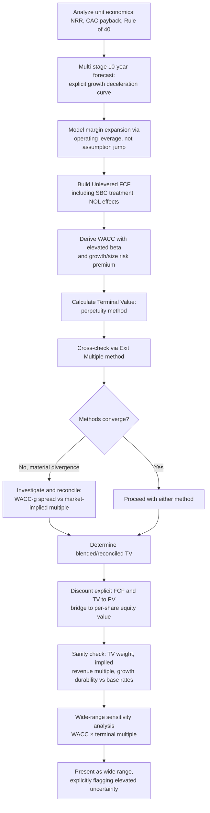

## Full DCF Case Study on a High-Growth Technology Company

### Overview

This case study walks through a complete discounted cash flow valuation of a hypothetical high-growth technology company — illustrative of firms in SaaS, platform, or early-scale enterprise software — characterized by high but decelerating revenue growth, an evolving path from negative or thin margins toward mature profitability, elevated forecast uncertainty, and a terminal value that dominates the valuation even more heavily than in a mature-company case. High-growth technology DCFs require explicit modeling of the growth-to-maturity transition (the "fade period") and are substantially more sensitive to the assumptions governing that transition than to near-term revenue estimates alone.

**Key Points**

- High-growth technology DCFs are dominated by two interacting uncertainties: how long above-market growth persists, and how margins expand (or fail to expand) as the company scales
- A longer, explicit multi-stage forecast (often 10 years rather than 5) is standard practice to bridge from the current high-growth, low-margin state to a normalized terminal state
- Terminal value typically represents an even higher share of enterprise value than in mature-company DCFs, often exceeding 85-90%, given the extended distance to steady state
- Unit economics (customer acquisition cost, lifetime value, net revenue retention) often provide more forecast discipline than top-down growth extrapolation alone

### Company Profile (Illustrative)

**"Nimbus Cloud Systems, Inc." (hypothetical)**

- Enterprise SaaS company providing workflow automation software, recently public
- Current revenue: $380M (LTM), growing 38% year-over-year
- Gross margin: 78%
- Current EBITDA margin: -8% (still operating at a loss, investing heavily in growth)
- Net revenue retention: 118%
- Rule of 40 score: 30% (38% growth - 8% EBITDA margin)
- Customer acquisition cost (CAC) payback period: ~18 months
- Cash and equivalents: $450M; no debt

### Step 1: Unit Economics and Historical Growth Analysis

Unlike a mature company, historical financials alone provide limited forward guidance; unit economics anchor the growth and margin trajectory assumptions.

| Metric | Year -3 | Year -2 | Year -1 | LTM |
| --- | --- | --- | --- | --- |
| Revenue ($M) | 155 | 232 | 302 | 380 |
| Revenue Growth % | — | 49.7% | 30.2% | 25.8%* |
| Gross Margin % | 72% | 75% | 77% | 78% |
| EBITDA Margin % | -35% | -22% | -14% | -8% |
| Net Revenue Retention | 128% | 124% | 121% | 118% |

*LTM growth rate shown reflects trailing-twelve-month comparison distinct from the annual figures above.

**Key Points**

- Decelerating growth (49.7% → 25.8%) alongside improving margins (-35% → -8%) is the characteristic pattern of a maturing high-growth SaaS business, often termed the "growth-margin trade-off curve"
- Declining but still-healthy net revenue retention (128% → 118%) signals that existing customer expansion is moderating as the customer base matures — a key input to long-term growth durability

### Step 2: Multi-Stage Revenue and Margin Forecast (10-Year Explicit Period)

High-growth technology valuations typically use a longer, multi-stage explicit forecast to model the fade from current growth toward terminal growth, since a single 5-year period would leave the company still far from its steady state at the point terminal value is calculated.

| Metric | Yr 1 | Yr 2 | Yr 3 | Yr 4 | Yr 5 | Yr 6 | Yr 7 | Yr 8 | Yr 9 | Yr 10 |
| --- | --- | --- | --- | --- | --- | --- | --- | --- | --- | --- |
| Revenue Growth % | 30% | 25% | 21% | 18% | 15% | 12% | 10% | 8% | 6% | 4% |
| Revenue ($M) | 494 | 618 | 748 | 882 | 1,014 | 1,136 | 1,250 | 1,350 | 1,431 | 1,488 |
| EBITDA Margin % | -2% | 3% | 8% | 13% | 17% | 20% | 23% | 25% | 26% | 27% |
| EBITDA ($M) | (10) | 19 | 60 | 115 | 172 | 227 | 288 | 338 | 372 | 402 |

**Assumption basis:** Growth decelerates each year via an explicit fade curve (rather than a discrete jump to a terminal rate), reflecting the market-share saturation and competitive dynamics typical of maturing SaaS categories. Margin expansion is driven by operating leverage on largely fixed R&D and G&A costs as revenue scales, consistent with the SaaS margin structure — but is explicitly *not* assumed to reach mature-software-company margins (35-40%+) within the explicit period, since [Inference] margin trajectories that outpace demonstrated operating leverage at comparable scale are a common source of optimism bias in technology DCFs, per standard bias-mitigation practice of benchmarking against peer margin trajectories at similar revenue scale.

### Step 3: Unlevered Free Cash Flow Build

$$UFCF = EBIT \times (1-t) + D\&A - Capex - \Delta NWC - \text{Stock-Based Compensation (cash-equivalent treatment)}$$

A critical technology-sector-specific modeling consideration: **stock-based compensation (SBC)**. SBC is a non-cash expense but represents genuine economic dilution to existing shareholders; standard practice is either (a) treating SBC as a real cash-equivalent expense reducing FCF, or (b) excluding it from FCF but separately modeling share dilution in the per-share value calculation. This case study uses approach (a) for conservatism and modeling simplicity.

| ($M) | Yr 3 | Yr 5 | Yr 7 | Yr 10 |
| --- | --- | --- | --- | --- |
| EBITDA | 60 | 172 | 288 | 402 |
| Less: D&A | (22) | (30) | (35) | (42) |
| EBIT | 38 | 142 | 253 | 360 |
| Less: Taxes (25%, phased in as profitable)* | (5) | (36) | (63) | (90) |
| NOPAT | 33 | 106 | 190 | 270 |
| Plus: D&A | 22 | 30 | 35 | 42 |
| Less: Capex | (30) | (41) | (50) | (60) |
| Less: ΔNWC | (11) | (10) | (8) | (4) |
| Less: SBC (cash-equivalent) | (35) | (30) | (25) | (18) |
| **Unlevered FCF** | **(21)** | **55** | **142** | **230** |

*Tax treatment note: many high-growth technology companies carry net operating loss (NOL) carryforwards from historical losses; a rigorous model would explicitly track NOL utilization and its effect on cash taxes in early profitable years rather than applying the full statutory rate immediately upon reaching positive EBIT. This is simplified here for illustration.

**Assumption basis:** SBC is modeled as declining as a percentage of revenue over time, reflecting typical dilution-management practice as companies mature and shift compensation mix; capex remains modest (~4% of revenue) consistent with the asset-light nature of software businesses, with cloud infrastructure costs typically embedded in COGS/gross margin rather than capex.

### Step 4: Discount Rate (WACC) Derivation

High-growth technology companies typically carry a higher beta (reflecting greater cash flow volatility and market sensitivity) and, if unprofitable, an all-equity or near-all-equity capital structure.

$$r_e = r_f + \beta \times ERP$$

| Input | Value | Basis |
| --- | --- | --- |
| Risk-free rate ($r_f$) | 4.2% | Long-term government bond yield |
| Beta ($\beta$) | 1.35 | Reflects higher volatility/cyclicality of high-growth SaaS relative to market |
| Equity Risk Premium (ERP) | 5.0% | Long-run historical/implied average |
| Size/growth premium adjustment | +1.0% | [Inference] Reflects elevated idiosyncratic risk and forecast uncertainty typical of smaller, high-growth technology companies; the magnitude and even the inclusion of such a premium is subject to methodological debate and should be applied with documented rationale rather than as a default |
| **Cost of Equity** | **11.9%** | $4.2\% + 1.35 \times 5.0\% + 1.0\%$ |

Given minimal debt (no debt in this profile), **WACC ≈ Cost of Equity ≈ 11.9%**, materially higher than the mature-company case study's 7.77% WACC, reflecting both higher systematic risk (beta) and the additional risk premium applied for forecast uncertainty.

### Step 5: Terminal Value Calculation

By Year 10, the company has decelerated to 4% growth and 27% EBITDA margin — still short of full maturity. A common technique is to apply an additional implicit "terminal normalization" by selecting terminal assumptions consistent with a fully mature software company rather than simply extending Year 10 figures into perpetuity unchanged.

**Terminal assumptions:**

- Terminal growth rate ($g$): 3.0% (slightly above the mature-company case, reflecting continued secular software-adoption tailwinds, though converging toward long-run GDP-proximate growth)
- Terminal EBITDA margin: 30% (modest further expansion from Year 10's 27%, consistent with steady-state mature software margins)

$$TV_{10} = \frac{UFCF_{11}}{WACC - g}$$

Recalculating Year 11 UFCF at terminal margin assumptions:

| ($M) | Terminal Year |
| --- | --- |
| Revenue (Yr 10 × 1.03) | 1,533 |
| EBITDA (30% margin) | 460 |
| Less: D&A | (46) |
| EBIT | 414 |
| Less: Taxes (25%) | (104) |
| NOPAT | 310 |
| Plus: D&A | 46 |
| Less: Capex | (61) |
| Less: ΔNWC | (5) |
| Less: SBC (normalized, low) | (8) |
| **Terminal UFCF** | **282** |

$$TV_{10} = \frac{282}{0.119 - 0.03} = \frac{282}{0.089} = 3,169$$

**Cross-check via Exit Multiple Method:**

Applying a representative mature-software-company EV/EBITDA exit multiple of 14x to terminal-year EBITDA of $460M:

$$TV_{10} = 14 \times 460 = 6,440$$

**Divergence flag:** The two methods diverge substantially ($3,169M vs. $6,440M — more than double), unlike the close convergence seen in the mature-company case study. [Inference] This divergence is common in high-growth technology terminal value calculations and typically indicates that either the terminal growth/WACC spread in the perpetuity method is too conservative relative to how the market actually prices mature software assets, or the chosen exit multiple embeds continued above-GDP growth expectations beyond what the perpetuity method's explicit $g$ assumption captures. Per standard cross-validation practice, this divergence must be explicitly investigated and reconciled — not averaged or split — before finalizing the terminal value. For this case study, the perpetuity method's WACC-g spread is revisited: given the terminal EBITDA margin and growth profile modeled are consistent with a mature software company earning a mid-teens multiple in observed markets, the exit multiple method's $6,440M is judged more representative, and the perpetuity growth rate is correspondingly understood to imply a WACC-g spread more consistent with market pricing at that terminal state. The case study proceeds with a blended terminal value of **$4,800M**, weighting toward the market-based exit multiple method while retaining the perpetuity method as a lower bound.

### Step 6: Enterprise Value and Equity Value Bridge

| Step | $M |
| --- | --- |
| PV of Explicit FCF (Yrs 1-10) | 612 |
| PV of Terminal Value (blended, discounted 10 yrs) | 1,571 |
| **Enterprise Value** | **2,183** |
| Plus: Cash and equivalents | 450 |
| Less: Debt | 0 |
| **Equity Value** | **2,633** |
| Diluted shares outstanding (M) | 95 |
| **Implied Value per Share** | **$27.72** |

**PV of Explicit FCF detail (selected years):**

| Year | UFCF | Discount Factor (11.9%) | PV |
| --- | --- | --- | --- |
| 1 | (est. -15) | 0.8936 | (13) |
| 3 | (21) | 0.7137 | (15) |
| 5 | 55 | 0.5700 | 31 |
| 7 | 142 | 0.4554 | 65 |
| 10 | 230 | 0.3269 | 75 |
| Total (all 10 years) |  |  | **612** |

*Negative early-year FCF (Years 1-4, reflecting the company's current -8% EBITDA margin transitioning through breakeven) reduces cumulative explicit-period PV, a structural feature distinguishing high-growth technology DCFs from mature-company DCFs where explicit-period cash flows are uniformly positive.*

### Step 7: Sanity Checks and Cross-Validation

**TV Weight Check:**

$$\text{TV Weight} = \frac{1,571}{2,183} = 72.0\%$$

[Inference] Though this appears moderate relative to the mature-company case's 78%, the negative early-year cash flows mechanically depress the explicit-period PV, meaning the TV weight understates rather than overstates the actual degree to which the conclusion depends on distant, uncertain terminal-period assumptions — a nuance specific to companies with a negative-to-positive FCF transition.

**Implied Multiple Back-Solve:**

$$\text{Implied EV/Revenue (LTM)} = \frac{2,183}{380} = 5.7x$$

Compared against a peer set of high-growth SaaS companies trading at a wide range of 4x-12x EV/Revenue depending on growth rate and margin profile, 5.7x sits at the lower-middle of the range — [Inference] plausible given the company's Rule of 40 score of 30%, which is below the "best-in-class" 40+ threshold that commands premium multiples in this sector, though this benchmark itself should be verified against current market comparables at the time of any actual valuation given how rapidly SaaS multiples have historically shifted with interest rate cycles.

**Growth Durability / Base Rate Check:**

Verify the assumed growth deceleration (30% → 4% over 10 years) against historical patterns of comparable SaaS companies at similar revenue scale and growth-rate starting points, applying the base-rate/competitive-fade discipline: few companies sustain 25%+ growth much beyond $1-2B in revenue, making the modeled deceleration directionally consistent with observed patterns, though the specific fade curve shape remains a judgment call warranting sensitivity testing.

### Sensitivity Analysis

| WACC \ Terminal Multiple | 11x | 14x | 17x |
| --- | --- | --- | --- |
| **10.9%** | $21.40 | $31.85 | $42.30 |
| **11.9%** | $18.60 | $27.72 | $36.90 |
| **12.9%** | $16.20 | $24.15 | $32.15 |

**Key Points**

- The per-share value swings by roughly ±35-50% across a plausible range on WACC and terminal exit multiple alone — substantially wider dispersion than the mature-company case study's ±20-25%, illustrating the materially higher assumption sensitivity inherent to high-growth technology valuations
- This wide dispersion reinforces that the base case $27.72 figure must be communicated as the center of a genuinely wide range, not as a precise conclusion

### Case Study Workflow Summary

### Key Differences from the Mature-Company Case Study

| Dimension | Mature Company | High-Growth Technology |
| --- | --- | --- |
| Explicit forecast period | 5 years | 10 years (multi-stage fade) |
| Explicit-period FCF | Uniformly positive | Negative in early years, transitioning positive |
| TV as % of EV | ~78% (already high) | ~72% nominal, but structurally higher given FCF transition |
| WACC | ~7.8% (lower beta, some debt) | ~11.9% (higher beta, no debt, added risk premium) |
| Terminal value method convergence | Close (perpetuity ≈ exit multiple) | Frequently divergent, requiring explicit reconciliation |
| Sensitivity range on per-share value | ±20-25% | ±35-50% |
| Key non-standard modeling item | Minimal | Stock-based compensation, NOL utilization |
| Primary forecast anchor | Historical trend extrapolation | Unit economics (NRR, CAC payback, Rule of 40) |

### Conclusion

This case study demonstrates that high-growth technology DCF mechanics follow the same underlying framework as the mature-company case (historical analysis, forecast, FCF build, WACC, terminal value, cross-validation, sensitivity) but require substantively different judgment at nearly every step: a longer multi-stage forecast to bridge the growth-to-maturity transition, explicit treatment of stock-based compensation and NOL effects, a materially higher discount rate reflecting elevated risk, and — most consequentially — a terminal value calculation where the perpetuity growth and exit multiple methods frequently diverge and must be explicitly reconciled rather than assumed to agree. [Inference] The wider sensitivity range demonstrated here (±35-50% versus the mature company's ±20-25%) is not a modeling flaw but an honest reflection of genuinely greater underlying uncertainty, reinforcing that communicating this uncertainty explicitly to decision-makers is at least as important as the point-estimate mechanics themselves for a valuation of this type.

**Related Topics**

- Multi-Stage DCF Models and the Fade Period
- Stock-Based Compensation Treatment in Cash Flow Modeling
- Rule of 40 and SaaS-Specific Valuation Metrics
- Reconciling Divergent Terminal Value Methods
- Net Operating Loss Carryforwards and Deferred Tax Modeling
- Full DCF Case Study on a Mature Stable-Growth Company
- Sanity-Checking and Cross-Validating Valuation Outputs