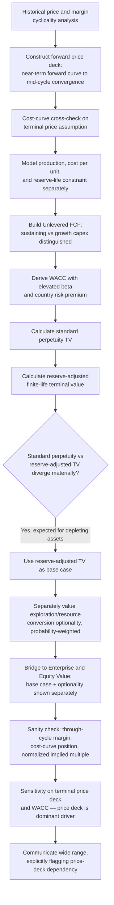

## Full DCF Case Study on a Cyclical or Commodity Company

### Overview

This case study walks through a complete discounted cash flow valuation of a hypothetical cyclical/commodity company — illustrative of firms in mining, oil and gas, steel, chemicals, or other basic-materials sectors — characterized by revenue and margins driven substantially by an underlying commodity price rather than company-specific execution, high earnings volatility across the business cycle, and capital intensity with lumpy, discrete capacity investments. Cyclical and commodity company DCFs require an explicitly different architecture from steady-growth models: rather than smoothing toward a single normalized growth trajectory, the model must represent cycle-driven volatility honestly while still producing a usable, defensible long-run valuation.

**Key Points**

- The central modeling challenge is separating *cyclical* variation (temporary, reverting) from *structural* change (permanent shifts in the cost curve, demand structure, or competitive position)
- Point-in-time DCFs anchored to current commodity prices are especially vulnerable to anchoring bias, since a high current price can make a business appear far more valuable than its through-cycle earning power supports, and vice versa
- Mid-cycle or normalized pricing, rather than spot or current-year pricing, should anchor terminal value assumptions
- Reserve/resource life, cost-curve positioning, and capital cycle timing are first-order value drivers distinct from typical revenue-growth-driven models

### Company Profile (Illustrative)

**"Continental Copper Corp." (hypothetical)**

- Mid-tier copper mining company with two operating mines and one development-stage project
- Current copper price: $4.35/lb (elevated relative to 10-year average)
- 10-year average (mid-cycle) copper price: $3.60/lb
- Current annual production: 220,000 tonnes copper-equivalent
- All-in sustaining cost (AISC): $2.55/lb
- Proven and probable reserves: ~11 years at current production rate
- Net debt: $650M; Debt/EBITDA (at current prices): 0.9x

### Step 1: Historical Price and Margin Cyclicality Analysis

Unlike a stable-growth company, historical revenue and margin figures for a commodity producer are dominated by the price cycle rather than company execution, making raw historical trend extrapolation inappropriate.

| Metric | Yr -4 | Yr -3 | Yr -2 | Yr -1 | LTM (current) |
| --- | --- | --- | --- | --- | --- |
| Copper Price ($/lb) | 2.85 | 3.95 | 3.40 | 4.10 | 4.35 |
| Production (000 tonnes) | 205 | 210 | 215 | 218 | 220 |
| Revenue ($M) | 1,288 | 1,829 | 1,611 | 1,970 | 2,111 |
| AISC ($/lb) | 2.35 | 2.40 | 2.48 | 2.52 | 2.55 |
| EBITDA Margin % | 17.5% | 39.2% | 27.1% | 38.5% | 41.4% |

**Key Points**

- EBITDA margin swings from 17.5% to 41.4% across five years despite relatively stable production volumes and gradually rising costs — the swing is almost entirely price-driven, not operationally driven
- Rising AISC over time (2.35 → 2.55) reflects typical cost inflation and grade decline common to maturing mining operations, a structural (not cyclical) trend that should be extrapolated forward, unlike the price series

### Step 2: Price Deck Construction (The Central Modeling Decision)

The single most consequential assumption in a commodity company DCF is the forward price deck — the assumed commodity price path over the forecast and terminal periods. Three primary approaches exist:

| Approach | Description | Appropriate Use |
| --- | --- | --- |
| Spot/current price flat-lined | Hold current price constant across forecast | Generally inappropriate for long-lived assets; embeds current-cycle position into perpetuity |
| Forward curve / futures-implied | Use exchange-traded futures prices where available and liquid | Useful for near-term years (1-3) where liquid forward markets exist |
| Mid-cycle / normalized price | Long-run average, cost-curve-based, or consensus long-term price | Standard for terminal value and later explicit years |

**Price deck used in this case study:**

| Year | Yr 1 | Yr 2 | Yr 3 | Yr 4 | Yr 5+ (Terminal) |
| --- | --- | --- | --- | --- | --- |
| Copper Price ($/lb) | 4.10 | 3.85 | 3.70 | 3.65 | 3.60 |

**Assumption basis:** Near-term prices (Years 1-2) partially reflect the current elevated spot environment via a forward-curve-informed glide path, while prices converge to the 10-year mid-cycle average of $3.60/lb by Year 5 and are held flat thereafter. [Inference] This convergence approach directly applies the base-rate/mean-reversion discipline discussed in bias mitigation: commodity prices have historically exhibited strong mean-reversion around marginal-cost-of-production levels over multi-year horizons, though the specific speed and terminal level of convergence remains a significant judgment call that should be cross-checked against independent price forecasts (e.g., sell-side commodity analysts, cost-curve analysis of global supply) rather than set unilaterally.

**Cost-curve cross-check:** An independent sanity check for the terminal price assumption is to position the company (and the broader industry) on the global cost curve — the terminal price should generally sit at or above the cost of production for the marginal (highest-cost) producer needed to meet long-run demand, since prices persistently below marginal cost would be expected to trigger supply curtailment and price recovery.

### Step 3: Production, Cost, and Reserve-Life Modeling

Commodity company forecasts require modeling production volume and cost per unit *separately* from price, and explicitly bounding the forecast by reserve life — a structural constraint with no equivalent in most other industries.

| Metric | Yr 1 | Yr 2 | Yr 3 | Yr 4 | Yr 5 |
| --- | --- | --- | --- | --- | --- |
| Production (000 tonnes) | 222 | 224 | 218* | 220 | 221 |
| AISC ($/lb) | 2.60 | 2.65 | 2.70 | 2.72 | 2.75 |
| Copper Price ($/lb) | 4.10 | 3.85 | 3.70 | 3.65 | 3.60 |
| Margin per lb ($/lb) | 1.50 | 1.20 | 1.00 | 0.93 | 0.85 |

*Year 3 production dips reflecting a scheduled lower-grade mining phase at one operation, illustrating the mine-plan-driven (rather than smooth-trend) production profile typical of mining assets.

**Reserve-life constraint on terminal value:** With ~11 years of proven and probable reserves at current production rates, the terminal value calculation cannot simply apply a standard Gordon Growth perpetuity without addressing this finite-life reality. Two adjustments are standard:

1. **Reserve depletion modeling**: explicitly model declining production in years approaching reserve exhaustion, rather than assuming flat perpetual production
2. **Resource conversion / life extension**: separately assess and probability-weight the likelihood of converting additional resources to reserves or discovering additional mineralization, which is often modeled as a separate optionality component rather than embedded in the base-case perpetuity

### Step 4: Unlevered Free Cash Flow Build

| ($M) | Yr 1 | Yr 2 | Yr 3 | Yr 4 | Yr 5 |
| --- | --- | --- | --- | --- | --- |
| Revenue (Production × Price) | 2,007 | 1,904 | 1,779 | 1,769 | 1,753 |
| Less: AISC-based Cash Costs | (1,271) | (1,308) | (1,296) | (1,317) | (1,338) |
| EBITDA | 736 | 596 | 483 | 452 | 415 |
| Less: D&A | (185) | (188) | (190) | (192) | (194) |
| EBIT | 551 | 408 | 293 | 260 | 221 |
| Less: Taxes (25%) | (138) | (102) | (73) | (65) | (55) |
| NOPAT | 413 | 306 | 220 | 195 | 166 |
| Plus: D&A | 185 | 188 | 190 | 192 | 194 |
| Less: Sustaining Capex | (140) | (143) | (146) | (149) | (152) |
| Less: Growth/Development Capex | (85) | (60) | (30) | 0 | 0 |
| Less: ΔNWC | (15) | 8 | 10 | 2 | 3 |
| **Unlevered FCF** | **358** | **299** | **244** | **240** | **211** |

**Assumption basis:** Sustaining capex (required to maintain current production and reserve replacement) is distinguished explicitly from growth/development capex (funding the development-stage project), since these serve fundamentally different purposes and should not be blended into a single capex line — a distinction of limited relevance in non-capital-intensive industries but central to mining/commodity modeling. Notably, FCF *declines* across the explicit period despite relatively stable production, driven almost entirely by the assumed price convergence toward mid-cycle levels — the inverse pattern of the high-growth technology case study, where FCF rises through the forecast period.

### Step 5: Discount Rate (WACC) Derivation

Commodity/cyclical companies typically carry elevated beta reflecting high operating leverage (fixed costs against volatile commodity-price-driven revenue) and country/political risk premiums where operations are in higher-risk jurisdictions.

| Input | Value | Basis |
| --- | --- | --- |
| Risk-free rate ($r_f$) | 4.2% | Long-term government bond yield |
| Beta ($\beta$) | 1.45 | Reflects high operating leverage and commodity price sensitivity |
| Equity Risk Premium (ERP) | 5.0% | Long-run historical/implied average |
| Country risk premium | +0.8% | [Inference] Reflects incremental risk from operating jurisdictions with elevated political/regulatory risk relative to the base ERP's typically developed-market reference; the appropriate country risk premium methodology (e.g., sovereign spread-based approaches) and magnitude should be sourced from current jurisdiction-specific data rather than assumed |
| **Cost of Equity** | **12.25%** | $4.2\% + 1.45 \times 5.0\% + 0.8\%$ |

**Cost of Debt and Capital Structure:**

| Component | Market Value ($M) | Weight | Cost |
| --- | --- | --- | --- |
| Equity | 2,850 | 81.4% | 12.25% |
| Debt | 650 | 18.6% | 5.5% pre-tax / 4.1% after-tax |
| **WACC** |  |  | **10.74%** |

$$WACC = 0.814 \times 12.25\% + 0.186 \times 4.1\% = 9.97\% + 0.76\% = 10.74\%$$

### Step 6: Terminal Value Calculation

Given the finite reserve life, terminal value construction for a commodity company differs structurally from a standard perpetuity. This case study uses a **mid-cycle perpetuity value applied to a normalized, reserve-life-adjusted production and price assumption**, explicitly distinct from simply extending Year 5 figures.

**Terminal assumptions:**

- Terminal copper price: $3.60/lb (mid-cycle, held flat — no real price escalation assumed beyond inflation, consistent with the long-run historical tendency of real commodity prices to be roughly flat-to-declining as extraction technology improves)
- Terminal production: held at Year 5 level (221,000 tonnes) as an approximation, with the *explicit caveat* that actual terminal value should reflect declining production as the ~11-year reserve base depletes — addressed via the reserve-adjustment overlay below

$$TV_5 = \frac{UFCF_{6}}{WACC - g}$$

With $g$ = 2.0% (inflation-only, no real growth assumed given finite reserves and no additional development capex modeled beyond Year 3):

$$UFCF_6 \approx 211 \times 1.02 = 215$$

$$TV_5 = \frac{215}{0.1074 - 0.02} = \frac{215}{0.0874} = 2,461$$

**Reserve-life adjustment overlay:** Because the standard perpetuity formula implicitly assumes infinite production, and actual reserves support only ~11 years total (6 years beyond the explicit forecast), a reserve-adjusted terminal value is calculated separately as the present value of an explicit 6-year production decline to zero, replacing the perpetuity for cross-check purposes:

$$TV_{5,\text{reserve-adjusted}} \approx 1,680 \text{ (illustrative, based on declining 6-year production tail)}$$

**Divergence and reconciliation:** The standard perpetuity method ($2,461M) overstates value relative to the reserve-constrained reality ($1,680M) by roughly 46%, since the perpetuity formula does not "know" the mine will physically run out of ore. [Inference] This divergence is a structural feature specific to depleting-asset industries (mining, oil and gas) rather than a modeling error requiring the same kind of reconciliation seen in the technology case study; standard practice is to use the reserve-adjusted (finite-life) terminal value as the primary figure, and to treat resource-to-reserve conversion or exploration upside as a separate, explicitly probability-weighted optionality value added afterward rather than embedded in the base terminal value. This case study proceeds with the **reserve-adjusted terminal value of $1,680M**.

### Step 7: Enterprise Value and Equity Value Bridge

| Step | $M |
| --- | --- |
| PV of Explicit FCF (Yrs 1-5) | 1,048 |
| PV of Reserve-Adjusted Terminal Value | 1,010 |
| **Enterprise Value (base case, no exploration upside)** | **2,058** |
| Less: Net Debt | (650) |
| **Equity Value** | **1,408** |
| Shares Outstanding (M) | 140 |
| **Implied Value per Share (base case)** | **$10.06** |

**Separately: Exploration/Resource Conversion Optionality**

| Component | Estimated Value ($M) | Probability Weight | Risk-Adjusted Value ($M) |
| --- | --- | --- | --- |
| Probable resource-to-reserve conversion | 420 | 55% | 231 |
| Exploration upside (early-stage targets) | 680 | 15% | 102 |
| **Total risk-adjusted optionality** |  |  | **333** |

**Total Implied Equity Value (including optionality):** $1,408M + $333M = $1,741M → **$12.44/share**

Presenting the base case and optionality value separately, rather than blending them into a single terminal growth assumption, keeps the reserve-constrained core valuation distinct from speculative upside — a communication practice particularly important in this sector given the tendency for exploration/resource upside to be systematically overstated (optimism bias) in company-provided technical reports.

### Step 8: Sanity Checks and Cross-Validation

**Through-Cycle Margin Check:**

Compare the *implied* through-cycle margin embedded in the DCF against the company's own long-run historical average and peer averages, rather than against the current (cyclically elevated) 41.4% margin — the DCF's Year 5/terminal margin of ~24% ($415M EBITDA / $1,753M revenue in Year 5) should be benchmarked against the company's 5-year average margin of ~32.7% and against mid-cycle-normalized peer margins, not against the current-year figure.

**Cost-Curve Positioning Check:**

Verify the company's AISC ($2.55-2.75/lb across the forecast) against the global cost curve for copper production; [Inference] a company positioned in the lower half of the global cost curve should be expected to remain profitable even at trough cycle prices, providing a plausibility check on the downside case, while a company near the top of the cost curve faces materially higher cyclical risk that should be reflected in a wider downside scenario.

**Implied Multiple Back-Solve (Normalized):**

$$\text{Implied EV/EBITDA (mid-cycle normalized)} \approx \frac{2,058}{415} = 5.0x$$

Commodity/mining companies typically trade at lower through-cycle multiples than stable-growth industrials (often 4-7x normalized EV/EBITDA) reflecting the earnings volatility and finite-life nature of the assets; a 5.0x normalized implied multiple falls within a plausible range for a mid-tier copper producer.

### Sensitivity Analysis: Mid-Cycle Price and Discount Rate

| WACC \ Terminal Copper Price | $3.30/lb | $3.60/lb | $3.90/lb |
| --- | --- | --- | --- |
| **9.74%** | $7.85 | $11.20 | $14.90 |
| **10.74%** | $7.10 | $10.06 | $13.35 |
| **11.74%** | $6.45 | $9.15 | $12.10 |

**Key Points**

- A ±$0.30/lb swing in the assumed terminal (mid-cycle) copper price — a plausible range given historical price volatility — moves per-share value by roughly ±30%, exceeding even the high-growth technology case study's sensitivity range
- This underscores that for commodity companies, the single most important sensitivity to communicate to decision-makers is the terminal price deck assumption, more so than company-specific operational assumptions

### Case Study Workflow Summary

### Key Differences from Prior Case Studies

| Dimension | Mature Company | High-Growth Tech | Cyclical/Commodity |
| --- | --- | --- | --- |
| Primary value driver | Steady growth/margin | Growth-to-maturity fade | Commodity price deck |
| Terminal value method | Standard perpetuity | Perpetuity vs. exit multiple reconciliation | Reserve-adjusted finite-life + separate optionality |
| Historical data usability | Directly extrapolable | Partially (unit economics more relevant) | Requires price/margin decomposition first |
| Dominant sensitivity | WACC / terminal growth | WACC / terminal multiple | Terminal commodity price |
| Capex structure | Single maintenance capex line | Modest, asset-light | Sustaining vs. growth capex split |
| Distinctive risk | Competitive fade | Execution/market risk | Cyclicality + finite reserve life |

### Conclusion

This case study demonstrates that cyclical and commodity company DCFs require a fundamentally different analytical architecture from both stable-growth and high-growth models: the forward price deck (not company-specific growth or margin assumptions) is the dominant value driver, terminal value must be reserve-life-constrained rather than treated as an infinite perpetuity, and exploration/resource upside is best isolated as a separately probability-weighted component rather than blended into the base case. [Inference] The wide sensitivity to the terminal price assumption (±30% per-share value swing) demonstrated here reinforces that, for this asset class specifically, cross-validating the price deck against independent forecasts and cost-curve positioning is arguably the single highest-value sanity check an analyst can perform — more consequential than refinements to operational or cost assumptions, which by comparison exert far smaller influence on the final conclusion.

**Related Topics**

- Commodity Price Deck Construction and Mean Reversion
- Reserve-Life-Constrained Terminal Value Modeling
- Cost-Curve Analysis and Marginal Producer Economics
- Real Options Valuation for Exploration and Development Assets
- Full DCF Case Study on a Mature Stable-Growth Company
- Full DCF Case Study on a High-Growth Technology Company
- Sanity-Checking and Cross-Validating Valuation Outputs