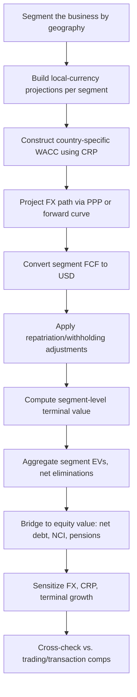

## Full Case Study on Cross-Border Multinational Valuation


### Case Overview and Objectives

This case study walks through the end-to-end valuation of a hypothetical multinational company, "GlobalTech Industries" (GTI), with operations spanning the United States (home/reporting currency: USD), Germany (EUR), Brazil (BRL), and India (INR). The purpose is to demonstrate how cross-border complexity — multi-currency cash flows, differing country risk premiums, transfer pricing, repatriation frictions, and jurisdiction-specific tax regimes — modifies the standard DCF framework covered in earlier chapters.

**Key Points**

- The core DCF mechanics (FCFF, WACC, terminal value) remain unchanged; what changes is **how each input is constructed** for a multi-jurisdictional entity.
- Two valid methodological approaches exist and are both demonstrated: **(1) consolidate-then-discount** (single global WACC applied to USD-converted consolidated FCF) and **(2) value-then-aggregate** (discount each country's FCF in local currency at a local WACC, then convert to USD via spot rate, summing the segments — a "sum-of-the-parts" approach).
- [Inference] Most practitioners favor the sum-of-the-parts approach when country risk profiles diverge materially, because a single blended WACC can mask offsetting distortions (overvaluing high-risk segments, undervaluing low-risk ones).

---

### Step 1 — Segment the Business by Geography

**Key Points**

- Break the consolidated income statement into geographic segments using 10-K/annual report segment disclosures (ASC 280 / IFRS 8 requires this for public companies).
- For GTI, assume the following FY0 (last actual year) segment revenue and EBIT:

| Segment | Currency | Revenue (local) | EBIT (local) | EBIT Margin |
| --- | --- | --- | --- | --- |
| US (HQ) | USD | $1,200M | $240M | 20.0% |
| Germany | EUR | €450M | €81M | 18.0% |
| Brazil | BRL | R$900M | R$135M | 15.0% |
| India | INR | ₹8,000M | ₹1,200M | 15.0% |

**Example — Consolidation check**: Convert each segment to USD at FY0 average FX rates (EUR/USD 1.08, BRL/USD 0.20, INR/USD 0.012) to confirm the segment sum reconciles to consolidated reported revenue of approximately $1,200M + $486M + $180M + $96M = $1,962M before eliminations.

---

### Step 2 — Build Segment-Level Financial Projections

**Key Points**

- Each segment gets its own 5-10 year explicit forecast, driven by **local** macro assumptions (local GDP growth, local inflation, local market share dynamics) rather than a single blended global growth rate.
- Margin trajectories should reflect local competitive dynamics — e.g., Brazil and India margins may expand toward the US level as scale efficiencies emerge (an [Inference]-labeled assumption unless supported by explicit management guidance or analyst consensus).
- Working capital and capex assumptions are built in **local currency**, using local revenue-to-NWC and revenue-to-capex ratios, because these reflect local operating realities (payment terms, local supplier financing norms, local capital costs).

**Example forecast build (Germany segment, EUR millions):**



```
                       FY1    FY2    FY3    FY4    FY5
Revenue                477    506    536    568    602
  Growth %             6.0%   6.0%   6.0%   6.0%   6.0%
EBIT                    87     92     98    105    112
  EBIT Margin         18.2%  18.3%  18.4%  18.5%  18.6%
Less: Taxes (local)    (26)   (28)   (29)   (31)   (34)
NOPAT                   61     64     69     74     78
Plus: D&A               19     20     21     23     24
Less: Capex             (24)   (25)   (27)   (28)   (30)
Less: Δ NWC              (5)    (5)    (6)    (6)    (6)
Unlevered FCF (EUR)      51     54     57     63     66
```

---

### Step 3 — Country-Specific WACC Construction

**Key Points**

- Each segment's discount rate must reflect **that segment's** cost of capital, not the parent's blended rate. This requires building the CAPM cost of equity with a **country risk premium (CRP)** layered on top of the base (typically US) equity risk premium.

$$k_e = R_f + \beta \times (ERP_{US}) + CRP_{country}$$

- **Country Risk Premium** is commonly derived from sovereign bond default spreads (local government bond yield minus equivalent-maturity US Treasury yield) or from published sources such as Damodaran's country risk premium tables, which are updated periodically and should be sourced fresh rather than assumed static. [Inference] Because CRP estimates vary by source and methodology (default spread approach vs. relative equity market volatility approach), practitioners often triangulate across 2-3 sources.

**Example CRP build for Brazil:**



```
Brazil 10-yr USD-denominated sovereign bond yield:    7.2%
US 10-yr Treasury yield:                              4.3%
Sovereign Default Spread (raw CRP):                   2.9%
Equity volatility adjustment factor (σ_equity/σ_bond): 1.5x
Adjusted CRP for equity:                              4.35%
```

- **Local risk-free rate vs. USD-denominated approach**: Two conventions exist —
  1. Build the WACC entirely in USD (US risk-free rate + US ERP + CRP), discount USD-converted FCF — avoids needing local inflation-adjusted risk-free rates, and is the more common practitioner shortcut
  2. Build a fully local-currency WACC (local risk-free rate + local ERP), discount local-currency FCF, convert the resulting local-currency value to USD via spot rate at the end
- Both should, in theory, converge under **covered interest rate parity** and consistent inflation differentials; in practice they can diverge due to capital controls, market segmentation, or CRP estimation error — this divergence itself is often flagged as a sensitivity range rather than resolved to a single point estimate.

**Segment WACC summary (illustrative):**

| Segment | Risk-Free Rate | Beta | ERP | CRP | Cost of Equity | After-Tax Kd | D/V | WACC |
| --- | --- | --- | --- | --- | --- | --- | --- | --- |
| US | 4.3% | 1.10 | 5.5% | 0.0% | 10.4% | 4.8% | 25% | 9.0% |
| Germany | 4.3%* | 1.05 | 5.5% | 0.3% | 9.4% | 4.5% | 25% | 8.2% |
| Brazil | 4.3%* | 1.30 | 5.5% | 4.35% | 15.8% | 8.0% | 30% | 13.5% |
| India | 4.3%* | 1.25 | 5.5% | 3.1% | 14.3% | 7.5% | 20% | 12.9% |

*Using USD risk-free rate convention (Approach 1) for consistency across the illustration.

---

### Step 4 — Currency Conversion Methodology

**Key Points**

- Two conversion points exist in the model and must not be conflated:
  1. **Historical/actual conversion** (for reconciling reported consolidated results) — uses period **average** FX rates for income statement items, **spot/period-end** rates for balance sheet items (standard under both ASC 830 and IAS 21).
  2. **Forecast conversion** (for projecting future FCF into USD) — requires a **forward curve** or a **purchasing power parity (PPP)-implied** projected FX path, not a static "hold current spot rate flat" assumption, since that implicitly ignores inflation differentials.
- **PPP-implied forward rate** (relative form), used when explicit forward curves are unavailable or extend beyond liquid market tenors:

$$FX_{t} = FX_{0} \times \frac{(1+\pi_{foreign})^t}{(1+\pi_{domestic})^t}$$

**Example — Brazil BRL/USD projected depreciation path (using inflation differential):**



```
BRL inflation forecast: 4.5%/yr    USD inflation forecast: 2.5%/yr
FX0 (BRL per USD):      5.00

FY1: 5.00 × (1.045/1.025)^1 = 5.098
FY2: 5.00 × (1.045/1.025)^2 = 5.198
FY3: 5.00 × (1.045/1.025)^3 = 5.300
```

- This depreciation path is then applied to convert the Brazil segment's local-currency FCF into USD for aggregation, embedding the currency risk directly into projected cash flows rather than only in the discount rate — avoiding **double-counting currency risk** (a common error when analysts both inflate the discount rate for currency risk AND apply a depreciating FX path).

[Inference] Whether currency risk belongs in the discount rate, the cash flow projection, or both, is a genuinely debated point in valuation methodology; the double-counting caution above reflects the mainstream practitioner view (e.g., as articulated by Damodaran), but reasonable alternative treatments exist.

---

### Step 5 — Repatriation Frictions and Trapped Cash

**Key Points**

- Unlike a domestic single-entity DCF, multinational FCF is not always freely accessible to the parent. Adjustments to consider:
  - **Withholding taxes on dividend repatriation**: e.g., Brazil may impose a withholding tax on dividends paid to a foreign parent (rate varies by treaty); this reduces the FCF actually available to equity holders at the parent level.
  - **Capital controls**: some jurisdictions restrict the pace or amount of currency conversion/repatriation, which can be modeled as a repatriation lag or haircut.
  - **Trapped cash**: cash generated in a segment but management intends to reinvest locally (not repatriate) should still be valued (it retains value to the consolidated enterprise) but may warrant a **liquidity discount** if there's genuine uncertainty about the parent's ability to access it, or if reinvestment returns are below the segment's cost of capital.
- **Example treatment**: If Brazil's FCF is $50M and the dividend withholding tax is 15%, with an assumed 100% repatriation policy, the effective FCF to the consolidated entity for valuation purposes may be modeled net of this friction, or the friction can be captured as a separate deduction in a reconciliation bridge — either is defensible provided it's applied consistently and disclosed.

---

### Step 6 — Terminal Value Construction Per Segment

**Key Points**

- Terminal growth rates should be capped near each segment's **long-run nominal GDP growth** (local, not the parent's home country), consistent with the standard Gordon Growth Model constraint that a firm cannot grow faster than the economy indefinitely.

$$TV_n = \frac{FCF_{n} \times (1+g)}{WACC - g}$$

**Example terminal growth caps:**



```
US:       g ≈ 2.0-2.5%  (mature developed market)
Germany:  g ≈ 1.5-2.0%  (mature, slower demographic growth)
Brazil:   g ≈ 4.5-5.5%  (higher nominal growth, higher local inflation)
India:    g ≈ 6.0-7.0%  (higher real growth + inflation)
```

- Because Brazil and India terminal growth rates embed higher local inflation, the nominal WACC used in the terminal value denominator must also be internally consistent (nominal cash flows discounted at nominal WACC) — mixing a real growth rate with a nominal WACC is a common and material error.

---

### Step 7 — Aggregation into Enterprise Value

**Example — Sum-of-the-parts EV build (illustrative, USD millions, PV of explicit FCF + PV of TV per segment):**

| Segment | PV of Explicit FCF | PV of Terminal Value | Segment EV (USD) |
| --- | --- | --- | --- |
| US | 620 | 2,850 | 3,470 |
| Germany | 210 | 1,180 | 1,390 |
| Brazil | 95 | 410 | 505 |
| India | 70 | 380 | 450 |
| **Less: Corporate/HQ costs (PV)** |  |  | (180) |
| **Consolidated Enterprise Value** |  |  | **5,635** |

**Key Points**

- Unallocated corporate/HQ overhead (costs not attributable to any single segment) should be valued as its own "segment" with negative FCF, typically discounted at the parent/blended WACC, and subtracted.
- Cross-segment eliminations (e.g., intercompany royalty or management fee flows) must be netted out to avoid double-counting — a royalty paid by Brazil to the US parent is a cash outflow for Brazil's segment FCF and a cash inflow for the US segment FCF; if both are counted as if they were external, EV is overstated.

---

### Step 8 — Bridge from Enterprise Value to Equity Value

**Key Points**

- Standard bridge applies, but with cross-border nuance:
  - Net debt should be measured in **consolidated USD terms**, with foreign-currency-denominated debt converted at the **current spot rate** (not the forecast rate), consistent with balance sheet translation conventions.
  - Non-controlling interests (NCI) — common in multinational structures with local joint-venture partners (e.g., a 70%-owned Brazilian subsidiary) — must be deducted, valued either at book value, fair value (if disclosed), or a proportional multiple-based estimate.
  - Foreign tax credits, deferred tax liabilities on unrepatriated earnings, and pension obligations in foreign jurisdictions (which may follow different discount-rate conventions, e.g., German pension liabilities often use local AA corporate bond yields) should be itemized separately in the bridge rather than netted silently into "other."

**Example bridge:**



```
Consolidated Enterprise Value                     5,635
Less: Total Debt (USD-converted, spot rate)         (890)
Plus: Cash & Equivalents (USD-converted)              310
Less: Non-Controlling Interests (Brazil JV, 30%)     (95)
Less: Unfunded Pension Obligations (Germany)          (60)
                                                    ------
Implied Equity Value                                4,900
÷ Diluted Shares Outstanding                          210
                                                    ------
Implied Value per Share (USD)                       $23.33
```

---

### Step 9 — Sensitivity and Scenario Analysis

**Key Points**

- Given the number of moving cross-border variables, sensitivity analysis should prioritize the highest-impact, highest-uncertainty inputs:
  - FX depreciation path (Brazil, India) vs. flat-spot assumption
  - Country risk premium (± 100-200 bps) for emerging market segments
  - Repatriation tax/withholding rate changes (policy risk)
  - Terminal growth rate divergence between segments
- A **two-way data table** (Brazil CRP vs. BRL depreciation rate) is a natural sensitivity output given these are the two largest sources of estimation uncertainty in the emerging-market segments.

**Illustrative Mermaid diagram — case study workflow:**



---

### Step 10 — Cross-Check via Relative Valuation

**Key Points**

- The DCF output should be triangulated against comparable company multiples, ideally using **regional peer sets** for each segment (US peers for the US segment, LatAm peers for Brazil, etc.) rather than a single global peer group, since multiples embed region-specific growth and risk expectations.
- A sum-of-the-parts multiples check (applying segment-appropriate EV/EBITDA multiples to each segment's EBITDA) provides an independent cross-check on the DCF-derived segment EVs.

**Example cross-check:**



```
Segment    DCF-Implied EV/EBITDA    Regional Peer Median EV/EBITDA
US               11.2x                      10.8x
Germany           9.8x                       9.5x
Brazil            6.1x                       6.5x
India             7.3x                       7.0x
```

A reasonably tight spread (as shown) supports the DCF assumptions; a wide divergence on any segment should trigger a re-examination of that segment's WACC, growth, or margin assumptions before finalizing the valuation.

---

### Key Takeaways from the Case

**Conclusion**

- Cross-border valuation does not require new theory — it requires **discipline in decomposing a single blended global assumption into jurisdiction-specific inputs** for growth, margin, tax, discount rate, and currency.
- The most common analytical errors in this domain are: (1) using a single global WACC across segments with materially different risk profiles, (2) double-counting currency risk in both the discount rate and the cash flow projection, (3) failing to net intercompany eliminations, and (4) mixing real and nominal figures inconsistently between growth rates and discount rates.
- Sum-of-the-parts, cross-checked against regional comparable multiples, is generally more defensible than a single consolidated global DCF when segment risk profiles diverge materially — though for firms with highly integrated, non-separable operations across borders, the segmentation itself may be more art than science and warrants transparent disclosure of the allocation methodology used.

---

### Related Topics

- Country Risk Premium Estimation Methodologies (Damodaran Approach vs. Credit Default Swap–Implied)
- Purchasing Power Parity and Forward FX Curve Construction
- Sum-of-the-Parts Valuation Framework
- Transfer Pricing Impact on Segment-Level Profitability
- Non-Controlling Interest Valuation Techniques
- Cross-Border M&A Tax Structuring Considerations
- Emerging Market Discount Rate Adjustments
- Regional Comparable Company Selection Criteria