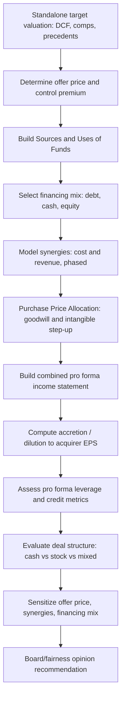

## Full Case Study on M&A Valuation and Deal Structuring


### Case Overview and Objectives

This case study walks through a full M&A analysis in which "Apex Industrial Corp" (Apex, the acquirer) evaluates the acquisition of "Meridian Components Inc." (Meridian, the target), a mid-market industrial parts manufacturer. The case demonstrates the complete workflow: standalone valuation of the target, structuring the offer, modeling synergies, building a merger (accretion/dilution) model, evaluating financing alternatives, and assessing the deal through both the acquirer's and target's lenses.

**Key Points**

- M&A valuation differs from standalone DCF/comps work in one fundamental respect: the analysis must answer not just "what is Meridian worth?" but "what is Meridian worth **to Apex, in this specific transaction structure**?" — a question that depends on synergies, financing mix, and tax treatment, none of which exist in a standalone valuation.
- The case integrates four previously covered disciplines: DCF valuation, comparable company/precedent transaction analysis, capital structure/financing, and now merger consequence modeling.

---

### Step 1 — Standalone Valuation of the Target (Meridian)

**Key Points**

- Before any deal-specific adjustments, establish Meridian's standalone intrinsic value using the standard toolkit: DCF, trading comps, and precedent transactions. This forms the "walk-away" reference point against which any offer premium is measured.

**Example — Summary football field (illustrative, USD millions):**



```
Methodology                     Low      High
DCF (WACC 9.5-10.5%, g 2-2.5%)  820      960
Trading Comps (EV/EBITDA 7-8x)  770      880
Precedent Transactions (8-9.5x) 880     1,045
                                 -----   -----
Standalone EV Range             770     1,045
Current Trading EV (pre-deal)          ~810
```

- Precedent transactions typically show a premium over trading comps because they embed **control premiums** paid in prior deals — this is expected and should not be "corrected," but the source and comparability of precedent deals (similar size, timing, strategic vs. financial buyer) should be scrutinized.

---

### Step 2 — Determine the Offer Price and Premium

**Key Points**

- The **control premium** is the difference between the offer price per share and the target's unaffected pre-announcement trading price, typically expressed as a percentage.

$$\text{Control Premium} = \frac{\text{Offer Price} - \text{Unaffected Price}}{\text{Unaffected Price}}$$

- Historical average control premiums in industrial/mid-market M&A typically cluster in the 25-40% range, though this varies significantly by sector, deal competitiveness (single bidder vs. auction), and market conditions. [Unverified: precise current-market premium benchmarks should be sourced from a live transaction database such as FactSet or Refinitiv at the time of analysis, as this figure drifts with market cycles.]
- **Example**: Meridian's unaffected share price is $38.00. Apex offers $50.00/share, a 31.6% premium. With 40M diluted shares outstanding, the total equity purchase price is $2,000M.

---

### Step 3 — Sources and Uses of Funds

**Key Points**

- The Sources & Uses table is the central financing summary of any M&A model — it forces explicit reconciliation of exactly how the deal is paid for and what it's paying for.

**Example Sources & Uses (illustrative, USD millions):**



```
USES                                    SOURCES
Purchase of Equity          2,000       New Term Loan B          900
Refinance Target Debt         350       New Senior Notes         500
Transaction Fees               45       Revolver Draw             50
Financing Fees                 20       Acquirer Cash on Hand     400
                                         Acquirer New Equity Issued 565
-----                       -----       -----                    -----
Total Uses                  2,415       Total Sources            2,415
```

- Transaction and financing fees are typically capitalized and amortized (financing fees) or expensed (advisory/legal fees, under most current GAAP/IFRS treatment) — this distinction affects the pro forma income statement and should be modeled explicitly rather than lumped together.

---

### Step 4 — Financing Structure and Capital Stack

**Key Points**

- The financing mix (debt vs. equity vs. cash) directly drives accretion/dilution, pro forma leverage, and covenant headroom. A layered capital stack for an industrial LBO-adjacent strategic deal typically resembles:

| Tranche | Amount | Rate | Seniority |
| --- | --- | --- | --- |
| Revolver (undrawn capacity) | $150M | SOFR + 250bps | Senior Secured |
| Term Loan B | $900M | SOFR + 325bps | Senior Secured |
| Senior Notes | $500M | 7.25% fixed | Senior Unsecured |
| Acquirer Cash | $400M | — (opportunity cost) | — |
| New Equity Issuance | $565M | — (cost of equity) | — |

- **Pro forma leverage** is a key output monitored by rating agencies and lenders:

$$\text{Pro Forma Net Debt / EBITDA} = \frac{\text{New Total Debt} - \text{Pro Forma Cash}}{\text{Combined LTM EBITDA (incl. synergies, if permitted by credit agreement)}}$$

- [Inference] Whether synergies can be included in the leverage covenant calculation depends on the specific credit agreement's definition of "Adjusted EBITDA" — many agreements permit a capped, time-limited synergy add-back (e.g., synergies realized within 18-24 months, capped at 10-25% of EBITDA), which should be checked against the actual credit documentation rather than assumed.

---

### Step 5 — Synergy Modeling

**Key Points**

- Synergies are categorized into two types with very different valuation treatment:
  - **Cost synergies**: overlapping SG&A, procurement scale, facility consolidation, headcount reduction — generally considered higher-confidence and are the primary driver of most strategic deal models
  - **Revenue synergies**: cross-selling, expanded distribution, pricing power — generally treated with more skepticism by both sell-side analysts and rating agencies, and are often **excluded or heavily discounted** in conservative merger models because they are harder to substantiate and slower to realize
- Synergies should be phased in over a realistic timeline (rarely 100% Year 1), and one-time costs to achieve synergies ("cost to achieve," CTA) must be modeled as a cash outflow, typically front-loaded.

**Example synergy phase-in schedule (USD millions):**



```
                          Year 1   Year 2   Year 3   Year 4 (run-rate)
Cost Synergies (gross)      15       35       55        60
Cost to Achieve (CTA)      (25)     (15)      (5)        0
Net Synergy Impact          (10)     20        50        60
Revenue Synergies            0        5        12        18
  (modeled separately, 50% confidence-weighted in base case)
```

- A **confidence-weighted** or **risk-adjusted** synergy case (e.g., presenting the base case at 100% of cost synergies but only 50% of revenue synergies) is standard practice to avoid overstating deal value to the board or financing sources.

---

### Step 6 — Accretion / Dilution Analysis

**Key Points**

- This is the signature output of a strategic M&A model: does the transaction increase (accretive) or decrease (dilutive) the acquirer's pro forma earnings per share relative to its standalone EPS?

$$\% \text{Accretion/(Dilution)} = \frac{\text{Pro Forma EPS} - \text{Standalone Acquirer EPS}}{\text{Standalone Acquirer EPS}}$$

**Example simplified accretion/dilution build (Year 1, USD millions except per-share):**



```
                                    Acquirer      Target      Adjustments   Pro Forma
Net Income                            180           95            —          275 (pre-adj)
Plus: After-tax Net Synergies          —            —            8            8
Less: Incremental Interest Expense     —            —          (75)         (75)
  (net of interest income foregone
   on cash used, and tax shield)
Less: Incremental D&A from            —            —           (12)         (12)
  Purchase Price Allocation step-up
Plus: Tax shield on incremental D&A    —            —             3            3
                                                                            -------
Pro Forma Net Income                                                         199
÷ Pro Forma Diluted Shares
  (Acquirer shares + new shares issued)             85 + 11.3 = 96.3
                                                                            -------
Pro Forma EPS                                                              $2.07

Standalone Acquirer EPS ($180M ÷ 85M shares)                               $2.12

% Accretion / (Dilution)                                                  (2.4)%
```

- **Key drivers of accretion/dilution** (the standard heuristic set, each demonstrated in the build above):
  1. **Relative P/E**: if the acquirer's P/E exceeds the target's implied P/E (i.e., the acquirer is "buying earnings cheap" relative to its own valuation), the deal tends toward accretion, all else equal — a widely cited shorthand, though the incremental interest/financing cost below can easily overwhelm this effect.
  2. **Financing mix**: cash/debt-funded deals are typically more accretive near-term than equity-funded deals, because new share issuance dilutes the share count immediately while debt's after-tax cost is often lower than the target's earnings yield — but this comes at the cost of increased leverage and financial risk.
  3. **Synergies**: directly additive to pro forma net income.
  4. **Purchase Price Allocation (PPA) step-up**: incremental D&A from writing up acquired tangible and intangible assets to fair value reduces pro forma net income (a non-cash but real GAAP earnings effect).

---

### Step 7 — Purchase Price Allocation (PPA) and Goodwill

**Key Points**

- Under both ASC 805 (US GAAP) and IFRS 3, the purchase price must be allocated to the fair value of identifiable tangible and intangible assets acquired and liabilities assumed, with any residual recorded as **goodwill**.

$$\text{Goodwill} = \text{Purchase Price} - \text{Fair Value of Net Identifiable Assets Acquired}$$

**Example PPA build (illustrative, USD millions):**



```
Total Purchase Price (Equity + Assumed Debt)              2,350
Less: Fair Value of Net Tangible Assets                    (680)
Less: Fair Value of Identifiable Intangibles
   Customer Relationships (12-yr useful life)      210
   Developed Technology (8-yr useful life)          95
   Trade Name (indefinite life)                     40      (345)
                                                            ------
Residual Goodwill                                          1,325
```

- Identifiable intangibles with finite useful lives are amortized, creating the incremental D&A that flows through the accretion/dilution build above; goodwill and indefinite-lived intangibles (like an indefinite trade name) are **not amortized** but are tested annually for impairment.
- [Inference] The precise fair value allocation between tangible assets, each intangible category, and residual goodwill requires a formal valuation (often performed by a third-party valuation specialist) using methods such as the multi-period excess earnings method (MPEEM) for customer relationships or relief-from-royalty for trade names — the illustrative figures above are simplified for pedagogical purposes and would not substitute for an actual PPA study.

---

### Step 8 — Deal Structure: Stock vs. Cash vs. Mixed Consideration

**Key Points**

- **All-cash deal**: simplest structure, fully accretive/dilutive math flows through interest expense only; target shareholders bear no ongoing risk/reward in combined entity; generally taxable to target shareholders (triggers capital gains recognition).
- **All-stock deal**: no cash outlay, but dilutes existing acquirer shareholders' ownership percentage; can often qualify as a tax-free reorganization for target shareholders under IRC Section 368 (US) if structural requirements are met (e.g., continuity of interest, continuity of business enterprise) — a material consideration for closely-held targets with low-basis stock.
- **Mixed consideration**: blends the two, often used to balance financing capacity constraints, target shareholder tax preferences, and signaling considerations (offering stock can signal the acquirer's confidence in future value creation, or conversely can signal the acquirer believes its own stock is overvalued — the "market timing" signaling literature is relevant here).
- **Exchange ratio mechanics** (for stock deals): typically structured as either a **fixed exchange ratio** (number of acquirer shares per target share is fixed; target shareholders bear acquirer stock price risk between signing and closing) or a **floating/collared exchange ratio** (designed to deliver a fixed dollar value to target shareholders, with collars limiting extreme movements).

$$\text{Exchange Ratio} = \frac{\text{Offer Price per Target Share}}{\text{Acquirer Share Price}}$$


---

### Step 9 — Deal Structure Diagram



---

### Step 10 — Target Shareholder Perspective and Fairness Opinion Considerations

**Key Points**

- Investment banks issuing a fairness opinion to the target's board typically present the same football field (DCF, comps, precedents) shown in Step 1, framed around whether the offer price falls within or above the range of implied values — this is the primary quantitative basis for the board's fiduciary determination of fairness.
- **Premiums paid analysis**: a specific sub-analysis within precedent transactions, examining historical premiums paid in comparable deals (by sector, deal size, and time period) to benchmark whether the offered premium is reasonable relative to market norms.
- Break fees, go-shop provisions, and deal protection mechanisms (no-shop clauses, matching rights) are negotiated structural elements that, while not valuation inputs per se, affect the **effective certainty** of deal completion and are often discussed alongside the valuation in board materials.

---

### Step 11 — Sensitivity Analysis on Deal Value Creation

**Key Points**

- The most decision-relevant sensitivities in an M&A case typically vary (1) synergy realization percentage and (2) financing mix (cash/debt vs. equity proportion), since these two variables have the largest swing impact on accretion/dilution and pro forma leverage.

**Example — Two-way sensitivity: % Synergies Achieved vs. % Cash/Debt Financing (Year 1 accretion/dilution):**



```
                          20% Equity Financed   50% Equity Financed   80% Equity Financed
100% Synergies Achieved        +1.8%                  (0.5)%                (3.1)%
 75% Synergies Achieved        +0.6%                  (1.6)%                (4.0)%
 50% Synergies Achieved        (0.7)%                 (2.7)%                (5.0)%
```

- This table illustrates the standard trade-off: heavier equity financing reduces leverage risk but increases dilution; heavier debt/cash financing improves near-term EPS accretion but raises pro forma leverage and financial risk — the "optimal" mix depends on the acquirer's credit rating constraints, existing leverage, and strategic risk tolerance rather than a single objectively correct answer.

---

### Key Takeaways from the Case

**Conclusion**

- A complete M&A valuation and deal structuring exercise integrates standalone valuation, offer/premium determination, financing structure, synergy modeling, purchase accounting, and accretion/dilution analysis into a single coherent framework — no individual technique stands alone.
- Accretion/dilution is an **earnings mechanics** test, not a value-creation test — a deal can be EPS-accretive and simultaneously value-destructive (e.g., if financed with excessive leverage or if paid-for synergies never materialize), and conversely can be dilutive yet strategically and economically sound (e.g., early-stage, high-growth-potential acquisitions). Both the accretion/dilution model and the standalone DCF/NPV-based analysis should be reviewed together, not in isolation.
- Financing mix, synergy realism, and purchase accounting mechanics each materially affect the reported outcome, meaning the same deal can be presented as either attractive or unattractive depending on modeling assumptions — underscoring the importance of transparent, well-documented, and appropriately conservative assumption-setting throughout.

---

### Related Topics

- Leveraged Buyout (LBO) Modeling Fundamentals
- Purchase Price Allocation and Intangible Asset Valuation Methods (MPEEM, Relief-from-Royalty)
- Tax-Free Reorganization Structures Under IRC Section 368
- Credit Agreement Covenant Analysis and Adjusted EBITDA Definitions
- Fairness Opinions and Board Fiduciary Duty Frameworks
- Contribution Analysis in Stock-for-Stock Mergers
- Synergy Realization Tracking and Post-Merger Integration Metrics
- Break Fee and Deal Protection Mechanism Design