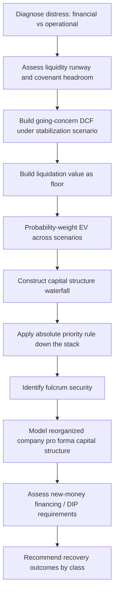

## Full Case Study on Distressed Company Valuation


### Case Overview and Objectives

This case study walks through the valuation of "Sentinel Manufacturing Corp" (Sentinel), a hypothetical mid-cap industrial company experiencing acute financial distress: covenant breaches, deteriorating liquidity, and a capital structure that exceeds the sustainable value of its operations. The case demonstrates how standard valuation tools (DCF, comps) must be adapted — and supplemented with restructuring-specific frameworks — when a company's viability itself is in question.

**Key Points**

- Distressed valuation differs from healthy-company valuation in three fundamental ways: (1) **going concern is not a given assumption** and must itself be evaluated, (2) the **capital structure becomes the central object of analysis** (who gets paid, in what order, and how much), and (3) valuation must be performed under multiple scenarios (reorganization, liquidation, sale) with probability-weighting, rather than a single base case.
- The core analytical shift is from "what is the enterprise worth" to "what is the enterprise worth, **and how does that value get allocated across the capital structure** given the absolute priority rule and negotiating leverage of each stakeholder class."

---

### Step 1 — Diagnose the Distress and Assess Viability

**Key Points**

- Before valuing anything, determine whether the distress is **financial** (viable business, over-levered balance sheet — a capital structure problem) or **operational/economic** (structurally challenged business model, secular decline — an enterprise value problem). This distinction drives the entire subsequent analysis.
- Diagnostic indicators reviewed:
  - Liquidity runway: cash + available revolver capacity ÷ monthly cash burn
  - Covenant headroom: current leverage/coverage ratios vs. covenant thresholds
  - Trade creditor behavior: tightening payment terms, credit insurance withdrawal (early warning signs before formal default)
  - Going-concern qualification in the auditor's opinion (a formal signal under both AICPA and PCAOB standards when substantial doubt exists about the entity's ability to continue operating for the next 12 months)

**Example — Sentinel's liquidity and leverage snapshot:**



```
Cash on hand                          $28M
Revolver availability (undrawn)       $15M
Monthly cash burn (run-rate)          $12M
Estimated liquidity runway            ~3.6 months

LTM EBITDA                            $95M
Total Debt                            $780M
Net Debt / EBITDA                     7.9x
Interest Coverage (EBITDA/Interest)   1.3x
Covenant Maximum Leverage             6.5x   ← BREACHED
```

- This snapshot signals acute financial distress with a short runway, supporting the case for a financial (capital-structure-driven) rather than purely operational diagnosis — though Sentinel's underlying EBITDA margin compression over the prior 3 years (assumed in this case) also points to some operational deterioration requiring separate assessment.

---

### Step 2 — Enterprise Valuation Under Distress: Methodology Adjustments

**Key Points**

- **DCF adjustments for distress**:
  - Explicit forecast period often shortened or restructured around a "stabilization" scenario (post-restructuring operating plan) rather than a smooth continuation of historical trends
  - Discount rate should reflect distress-specific risk — using a standard CAPM-derived WACC without adjustment understates risk, since CAPM assumes going-concern and diversifiable/non-diversifiable risk separation that breaks down near financial distress. Practitioners often add a **distress premium** or, more rigorously, use **scenario-weighted (probability-weighted) cash flows** discounted at a scenario-appropriate rate rather than inflating a single discount rate to compensate for bankruptcy risk.
  - Terminal value construction should be approached cautiously — an indefinite going-concern terminal value may not be appropriate if there's meaningful probability of liquidation; a **probability-weighted terminal outcome** (weighted average of a going-concern TV and a liquidation value) is more defensible.
- **Comps and precedent transaction adjustments**:
  - Comparable company multiples should be drawn from **other distressed or recently-restructured companies**, not healthy-sector peers, since healthy-company multiples embed growth and stability assumptions that don't apply
  - **Distressed transaction precedents** (Section 363 sales, prepackaged bankruptcy exits, out-of-court exchanges) provide the most relevant multiple benchmarks, though these are less frequent and less standardized than healthy M&A precedents, often requiring a wider comparable set across time and sub-sector

---

### Step 3 — Liquidation Value Analysis

**Key Points**

- Liquidation value serves as the **floor** in most distressed valuation frameworks — the absolute priority rule requires that no class of claims receive less in a reorganization than they would receive in a hypothetical Chapter 7 liquidation (the "best interests of creditors" test under US Bankruptcy Code Section 1129(a)(7)).
- Liquidation value is built asset-by-asset, applying **recovery rates** (a percentage of book or appraised value) that reflect forced-sale/distressed-sale conditions rather than orderly market conditions.

**Example — Sentinel liquidation analysis (illustrative, USD millions):**



```
Asset                        Book Value    Recovery Rate    Liquidation Value
Cash                              28           100%                28
Accounts Receivable               85            75%                64
Inventory                        110            45%                50
PP&E (owned facilities)          320            55%               176
Intangibles / Goodwill           140             0%                 0
                                 -----                            -----
Total Liquidation Proceeds                                        318
Less: Wind-down / Trustee Costs                                   (25)
Less: Priority Claims (admin, taxes)                               (18)
                                                                   -----
Net Proceeds Available for Distribution                           275
```

- [Inference] Recovery rate assumptions vary significantly by industry, asset specificity, and market conditions at the time of liquidation — the rates shown are illustrative; a real analysis would draw on appraisals, auctioneer estimates, and comparable liquidation recovery data for the specific asset classes and industry involved.

---

### Step 4 — Capital Structure Waterfall and the Absolute Priority Rule

**Key Points**

- The **absolute priority rule (APR)** dictates that value flows through the capital structure in strict seniority order: senior secured claims are paid in full before any recovery flows to unsecured claims, which are paid in full before any recovery flows to equity. This is the central organizing principle of distressed valuation.
- Building the waterfall requires: (1) the estimated total enterprise value (from Step 2 or Step 3, whichever governs), (2) a complete capital structure schedule with face amounts and seniority ranking, and (3) allocation of value down the stack until exhausted.

**Example — Sentinel capital structure waterfall (Enterprise Value = $450M, from probability-weighted DCF/comps blend):**



```
Claim Class                    Face Value    Seniority    Recovery ($)   Recovery (%)
1st Lien Term Loan                 300         1st           300           100%
2nd Lien Notes                     150         2nd           150           100%
Senior Unsecured Notes             200         3rd            0             0%
Subordinated Notes                 100         4th            0             0%
Existing Equity                     —          Last           0             0%
                                   -----                     -----
Total Claims / Allocated EV        750                       450
```

- This waterfall illustrates the core distressed-investing insight: with EV of $450M against $750M of total claims, value "breaks" between the 2nd Lien Notes (fully recovered) and the Senior Unsecured Notes (zero recovery) — this break point is often referred to as the **"fulcrum security"** boundary.

---

### Step 5 — Identifying the Fulcrum Security

**Key Points**

- The **fulcrum security** is the most junior class of claims that receives a partial (not full, not zero) recovery — this class effectively becomes the new equity of the reorganized company under a standard debt-for-equity restructuring, because it's the class whose claim value is genuinely uncertain and therefore most exposed to (and most likely to negotiate for) the enterprise's post-reorganization value.
- In the Sentinel example above, if enterprise value estimates range from $420M to $500M across the scenario analysis, the Senior Unsecured Notes (ranked 3rd, face value $200M, positioned right where value breaks) are the fulcrum security — distressed debt investors specifically target this class because a successful restructuring negotiation can convert a discounted par claim into significant post-reorganization equity value.

**Example — Fulcrum sensitivity across EV scenarios:**



```
                          Low EV ($420M)   Mid EV ($450M)   High EV ($500M)
1st Lien (Face $300M)         100%             100%             100%
2nd Lien (Face $150M)          80%             100%             100%
Sr. Unsecured (Face $200M)      0%               0%              25%
Subordinated (Face $100M)       0%               0%               0%
```

- Across this range, the 2nd Lien and Senior Unsecured classes show the most recovery sensitivity to the enterprise value estimate — these are the classes with the greatest incentive to contest the valuation methodology in a contested bankruptcy proceeding, which is a recurring real-world dynamic in Chapter 11 valuation disputes.

---

### Step 6 — Restructuring Diagram



---

### Step 7 — Restructuring Alternatives: In-Court vs. Out-of-Court

**Key Points**

- **Out-of-court restructuring** (exchange offer, amend-and-extend, distressed debt exchange): faster, cheaper, avoids public bankruptcy stigma and professional fees, but requires **unanimous or near-unanimous** creditor consent in most jurisdictions absent statutory cross-class cram-down mechanisms — a significant practical constraint when creditor classes are large or fragmented ("holdout problem").
- **Prepackaged or pre-negotiated Chapter 11**: creditor support is negotiated and largely locked up before the formal filing, allowing a much faster court process (sometimes 30-45 days) than a traditional free-fall filing, while still obtaining the benefits of court-sanctioned cram-down over dissenting minority classes.
- **Traditional (free-fall) Chapter 11**: used when consensus cannot be reached pre-filing; provides the automatic stay (halting creditor collection actions), debtor-in-possession (DIP) financing access, and the ability to reject or assume executory contracts — but is slower, more expensive (professional fees), and carries greater business disruption risk (customer/vendor confidence effects).
- **Section 363 sale**: sale of substantially all assets free and clear of liens, claims, and encumbrances through the bankruptcy court, often used when going-concern value depends on a strategic buyer or when the debtor cannot confirm a standalone reorganization plan.

[Inference] The choice among these paths depends heavily on creditor composition (concentrated vs. fragmented holders), the presence of a credible reorganization plan, and jurisdiction-specific considerations — this case simplifies the decision framework for pedagogical purposes; actual restructuring path selection involves extensive legal, financial advisory, and negotiation dynamics beyond pure valuation.

---

### Step 8 — DIP Financing and New Money Considerations

**Key Points**

- **Debtor-in-possession (DIP) financing** provides liquidity during the bankruptcy process, typically senior to (or *pari passu* with) pre-petition secured debt via "priming lien" court approval, and is often provided by existing lenders seeking to protect their pre-petition position (a common and important dynamic — existing lenders may extend DIP financing specifically to maintain control over the restructuring process and enterprise value outcome).
- DIP financing terms (pricing, covenants, milestones) function as a **de facto restructuring timeline enforcement mechanism** — DIP credit agreements typically include milestones (e.g., "file plan of reorganization by day 60," "obtain confirmation by day 120") that effectively force the pace of the case.

---

### Step 9 — Reorganized Company Valuation and New Capital Structure

**Key Points**

- Once a plan of reorganization is contemplated, the reorganized (post-emergence) enterprise is valued on a **going-concern basis reflecting the deleveraged, post-restructuring capital structure** — this "reorganization value" becomes the basis for allocating new securities (typically new debt plus new equity) to claimants per the waterfall.

**Example — Sentinel pro forma post-emergence structure (illustrative):**



```
                              Pre-Petition        Post-Emergence
Total Debt                      $780M                $180M
  (from cancelled Sr. Unsecured
   and Subordinated claims,
   converted to equity)
New Equity (100% to former      —                    100%
  1st Lien / 2nd Lien / fulcrum
  Sr. Unsecured holders per
  waterfall allocation)
Net Debt / EBITDA                7.9x                 1.7x
```

- New equity in the reorganized entity is typically valued using the same going-concern EV estimate from Step 2 (adjusted for the now-deleveraged structure and any operational restructuring initiatives), less the new post-emergence debt, to arrive at implied reorganized equity value — which is then allocated to the fulcrum and junior classes per the negotiated plan.

---

### Step 10 — Sensitivity and Scenario Weighting

**Key Points**

- Given the wide range of potential outcomes in distressed situations, the final valuation conclusion is typically presented as a **probability-weighted blend** across explicit scenarios rather than a single point estimate.

**Example scenario weighting:**



```
Scenario                          Probability    EV ($M)    Weighted EV
Successful Operational Turnaround     25%          580          145.0
Standard Reorganization (base case)   45%          450          202.5
Extended Distress / Further Decline   20%          380           76.0
Liquidation                           10%          275           27.5
                                      -----                    -------
Probability-Weighted EV                                          451.0
```

- This blended EV (~$451M) closely approximates the mid-case waterfall used in Step 4/5, providing a useful cross-check; material divergence between the probability-weighted blend and the "base case only" figure should prompt closer examination of tail-scenario assumptions (particularly the liquidation floor and the upside turnaround case, which are often the least certain).

---

### Key Takeaways from the Case

**Conclusion**

- Distressed valuation requires layering restructuring-specific frameworks (liquidation analysis, capital structure waterfalls, absolute priority rule, fulcrum security identification) on top of standard DCF/comps tools — the underlying valuation techniques don't change, but the **context and application** change substantially.
- The central analytical deliverable in most distressed situations is not a single enterprise value, but the **allocation of that value across the capital structure**, since this allocation determines whose claims convert to how much of the reorganized company's equity — this is the essential difference from healthy-company valuation, where enterprise value primarily serves shareholders and is not being contested/allocated among multiple competing claimant classes.
- Scenario-based, probability-weighted valuation is the norm rather than the exception in distressed situations, reflecting the genuinely higher uncertainty (going-concern doubt, litigation risk, negotiation dynamics) inherent in these situations relative to standard corporate valuation.

---

### Related Topics

- Chapter 11 Bankruptcy Process and Plan Confirmation Mechanics
- Distressed Debt Investing and Fulcrum Security Strategies
- Liquidation Analysis and Asset Recovery Rate Benchmarking
- DIP Financing Structures and Priming Lien Negotiations
- Distressed M&A and Section 363 Asset Sale Process
- Debt-for-Equity Exchange Structuring
- Going-Concern Assessment Under Auditing Standards
- Cram-Down Mechanics and Cross-Class Voting Requirements