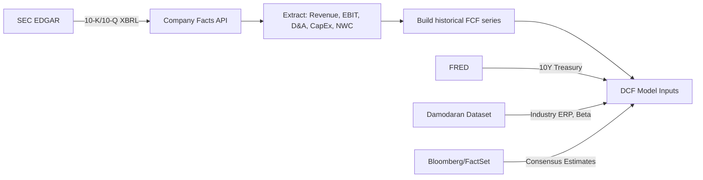

## Market Data Platforms for Valuation Inputs


### Overview

Market data platforms supply the raw inputs a DCF and comparable-company analysis depend on: risk-free rates, equity risk premiums, beta, capital structure data, peer multiples, consensus estimates, and industry financials. The choice of platform materially affects valuation outputs because different providers use different methodologies (e.g., beta calculation windows, ERP estimation approaches), so consistency in sourcing is as important as accuracy.

### Category 1: Institutional Terminal Platforms

**Bloomberg Terminal**

- Industry-standard for equity research, fixed income, and M&A workflows
- Key functions for valuation: `WACC` (pre-built cost of capital calculator), `BETA`, `EQRP` (equity risk premium), `RV` (relative valuation / comps), `DDIS` (dividend discount), `FA` (financial analysis)
- Provides Bloomberg's own adjusted beta (Blume-adjusted: $\beta_{adj} = 0.67 \times \beta_{raw} + 0.33 \times 1.0$)
- Consensus estimates via `EE` (earnings estimates) aggregating sell-side analyst models
- [Unverified] Exact ERP methodology weighting is proprietary and not fully disclosed in public documentation

**Refinitiv Eikon (formerly Thomson Reuters)**

- Comparable functionality to Bloomberg: `StarMine` for analyst estimate quality scoring, `Datastream` for long-history time series
- Screener tools for building comparable company sets by SIC/GICS/NAICS codes
- I/B/E/S database is a primary source for consensus EPS, revenue, and target price data used in the industry

**FactSet**

- Preferred in buy-side and investment banking workflows for its Excel plug-in (`FactSet Add-In`) enabling live-linked spreadsheet models
- Strong in ownership/screening data (`Ownership`, `Screening`) and supply chain relationship mapping (`RBICS`, `Revere`)
- `Portfolio Analytics` module supports factor-based beta and risk decomposition

### Category 2: Public/Free Data Sources

| Source | Primary Use | Update Frequency | Cost |
| --- | --- | --- | --- |
| SEC EDGAR (`sec.gov/edgar`) | 10-K/10-Q filings, primary financials | Per filing | Free |
| FRED (Federal Reserve Economic Data) | Risk-free rate (10Y/30Y Treasury), inflation, GDP | Daily | Free |
| Damodaran Online (NYU Stern) | Industry ERP, betas by sector, growth rates, margins by industry | Annual (updated ~January) | Free |
| Yahoo Finance / Google Finance | Historical prices, basic multiples | Real-time (delayed) | Free |
| macrotrends.net | Long-history historical financials, pre-built ratio charts | Per filing | Free |
| stockanalysis.com | Clean financial statement extraction, quick multiples | Per filing | Free |

**Damodaran's dataset deserves special emphasis** for DCF work specifically: it publishes industry-average unlevered betas, ERP estimates (both implied and historical), and country risk premiums, updated annually. This is the most commonly cited free academic source for cost-of-capital inputs in both practitioner and academic valuation work.

### Category 3: SEC EDGAR — Primary Source Deep-Dive

EDGAR full-text search (`efts.sec.gov`) and the structured XBRL API (`data.sec.gov/api/xbrl`) allow programmatic extraction of financial statement line items.



**Key API endpoint pattern:**



```
GET https://data.sec.gov/api/xbrl/companyconcept/CIK{10-digit-CIK}/us-gaap/{tag}.json
```

Common `us-gaap` tags for DCF inputs: `Revenues`, `OperatingIncomeLoss`, `DepreciationDepletionAndAmortization`, `PaymentsToAcquirePropertyPlantAndEquipment`, `IncreaseDecreaseInOperatingCapital`.

A required header (`User-Agent`) identifying the requester is mandatory for programmatic EDGAR access; requests without it are rejected.

### Category 4: Risk-Free Rate and ERP Sourcing

**Risk-free rate convention**

- U.S. valuations: 10-year Treasury constant maturity yield, sourced from FRED series `DGS10` or Treasury.gov directly
- Matching duration to cash flow horizon is standard practice — some practitioners use 20Y or 30Y Treasury for terminal-value-heavy models with long horizons
- [Inference] Practitioners disagree on whether to use spot rate or a smoothed/forward rate during periods of high rate volatility; this is a judgment call not settled by a single authoritative source

**Equity risk premium approaches**

1. **Historical ERP**: realized equity returns minus realized risk-free returns over a long lookback (Ibbotson/Duff & Phelps data, now part of Kroll)
2. **Implied ERP**: back-solved from current index price using a dividend/FCF discount model (Damodaran publishes a monthly implied ERP for the S&P 500)
3. **Survey-based ERP**: Fernandez et al. annual survey of academics and practitioners

$$ERP_{implied} = \frac{D_1}{P_0} + g - r_f$$

where $D_1$ is expected next-period dividend/FCF yield on the index, $g$ is expected long-term growth, $r_f$ is the risk-free rate.

### Category 5: Beta Sourcing and Adjustment

Raw regression beta from different platforms can vary meaningfully due to:

- Return interval (daily vs. weekly vs. monthly)
- Lookback window (2yr vs. 5yr)
- Benchmark index choice (S&P 500 vs. broader market index)
- Adjustment methodology (Blume, Vasicek, or unadjusted)

**Bottom-up (unlevered industry) beta** is generally preferred over single-company regression beta for DCF work, since it reduces estimation noise:

$$\beta_{unlevered} = \frac{\beta_{levered}}{1 + (1-t)\times \frac{D}{E}}$$

Process: pull comparable company betas → unlever each using their respective capital structure → average the unlevered betas → relever at the target company's own capital structure and tax rate.

Damodaran's industry-average unlevered betas are the most widely cited free source for this bottom-up approach.

### Category 6: Comparable Company / Multiples Data

| Platform | Comps Strength | Notes |
| --- | --- | --- |
| Capital IQ (S&P Capital IQ Pro) | Deep private company estimates, M&A comps (`CIQ Screening`) | Dominant in PE/IB for precedent transaction comps |
| PitchBook | VC/PE-focused, private market multiples | Strong private company valuation multiples database |
| Bloomberg `RV` | Public comps, customizable peer sets | Real-time |
| stockanalysis.com / finviz.com | Free screener with basic multiples (P/E, EV/EBITDA) | Limited historical depth, good for quick checks |

### Practical Sourcing Workflow for a DCF

1. Pull 3-5 years of historical financials from SEC EDGAR XBRL API or the company's investor relations filings
2. Source risk-free rate from FRED (`DGS10`) as of valuation date
3. Source industry-average unlevered beta from Damodaran's dataset, filtered to target's industry classification
4. Relever beta using target's actual or target capital structure and marginal tax rate
5. Source ERP from Damodaran's implied ERP series (most defensible for forward-looking DCF) or historical ERP if precedent/convention requires it
6. Pull consensus revenue/EBITDA estimates from Bloomberg/FactSet/Refinitiv (or Yahoo Finance analyst estimates page as a free proxy) to sanity-check management's forecast against street expectations
7. Build comparable company set via GICS/SIC code screening, pull EV/EBITDA and EV/Revenue multiples for terminal value cross-check

### Data Quality Considerations

- **[Inference]** Free sources like Yahoo Finance have historically had data accuracy issues (split adjustments, delisted tickers) that are less common in paid institutional feeds; this is a widely reported practitioner concern rather than a benchmarked statistic
- Always reconcile pulled financial data against the primary 10-K/10-Q source before use in a model — aggregator platforms occasionally misclassify non-recurring items
- Currency and fiscal year-end mismatches across cross-border comparable sets require normalization before multiples comparison

### SVG: Data Source → DCF Input Mapping (svg_diagram)

<svg xmlns="http://www.w3.org/2000/svg" viewBox="0 0 780 380">
\<style\>
.box{fill:#1e293b;stroke:#475569;stroke-width:1.5;rx:6;}
.input{fill:#0f766e;stroke:#134e4a;stroke-width:1.5;rx:6;}
.txt{font-family:sans-serif;font-size:12px;fill:#f1f5f9;}
.lbl{font-family:sans-serif;font-size:11px;fill:#94a3b8;}
.title{font-family:sans-serif;font-size:14px;fill:#f1f5f9;font-weight:bold;}
line{stroke:#64748b;stroke-width:1.5;marker-end:url(#arrow);}
\</style\>
<text x="20" y="24" class="title">Market Data Platforms for Valuation Inputs (svg_diagram)</text>
<rect x="20" y="50" width="160" height="40" class="box" />
<text x="30" y="74" class="txt">SEC EDGAR</text>
<rect x="20" y="110" width="160" height="40" class="box" />
<text x="30" y="134" class="txt">FRED</text>
<rect x="20" y="170" width="160" height="40" class="box" />
<text x="30" y="194" class="txt">Damodaran Online</text>
<rect x="20" y="230" width="160" height="40" class="box" />
<text x="30" y="254" class="txt">Bloomberg/FactSet</text>
<rect x="20" y="290" width="160" height="40" class="box" />
<text x="30" y="314" class="txt">Capital IQ/PitchBook</text>
<rect x="440" y="50" width="180" height="40" class="input" />
<text x="450" y="74" class="txt">Historical FCF series</text>
<rect x="440" y="110" width="180" height="40" class="input" />
<text x="450" y="134" class="txt">Risk-free rate</text>
<rect x="440" y="170" width="180" height="40" class="input" />
<text x="450" y="194" class="txt">Beta &amp; ERP</text>
<rect x="440" y="230" width="180" height="40" class="input" />
<text x="450" y="254" class="txt">Consensus estimates</text>
<rect x="440" y="290" width="180" height="40" class="input" />
<text x="450" y="314" class="txt">Comparable multiples</text>
<line x1="180" y1="70" x2="440" y2="70" />
<line x1="180" y1="130" x2="440" y2="130" />
<line x1="180" y1="190" x2="440" y2="190" />
<line x1="180" y1="250" x2="440" y2="250" />
<line x1="180" y1="310" x2="440" y2="310" />
<rect x="660" y="150" width="100" height="60" class="box" />
<text x="672" y="175" class="txt">DCF</text>
<text x="672" y="192" class="txt">Model</text>
<line x1="620" y1="70" x2="710" y2="150" />
<line x1="620" y1="130" x2="710" y2="150" />
<line x1="620" y1="190" x2="710" y2="180" />
<line x1="620" y1="250" x2="710" y2="210" />
<line x1="620" y1="310" x2="710" y2="210" />
</svg>

### Next Steps

- Cost of Capital: WACC Construction Methodology
- Equity Risk Premium: Historical vs. Implied vs. Survey-Based Approaches
- Beta Estimation: Regression, Bottom-Up, and Adjustment Techniques
- Comparable Company Analysis: Screening Criteria and Multiple Selection
- Precedent Transaction Analysis: Sourcing and Control Premium Adjustments
- Financial Statement Normalization for Cross-Company Comparability
- SEC EDGAR XBRL API: Programmatic Financial Data Extraction