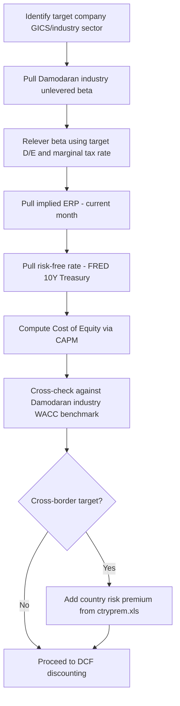

## Damodaran Data Sets and Academic Resources

### Overview

Aswath Damodaran (NYU Stern School of Business) maintains a publicly available, freely downloadable set of datasets that function as the de facto academic and practitioner benchmark for corporate valuation inputs. These are distributed as Excel/CSV files updated on a regular cadence (most annually in January, some monthly), hosted at `pages.stern.nyu.edu/~adamodar/`. Unlike terminal-based sources (Bloomberg, FactSet), the datasets are derived from aggregating public company data across the full universe of global public equities, then organized by industry sector.

### Dataset Categories

**1. Cost of Capital Inputs**

- **Betas by industry** (`Betas.xls`): unlevered and levered beta by sector, computed as regression beta against a market index, then averaged within each industry group and unlevered using each firm's D/E ratio and marginal tax rate
- **Equity Risk Premiums** (`histretSP.xls`, `ERP` monthly updates): three parallel series — historical ERP (geometric and arithmetic, multiple lookback windows), implied ERP (current, back-solved monthly using S&P 500 dividend/buyback yield and analyst growth estimates), and country-specific ERP additions (`ctryprem.xls`) that layer sovereign default spread onto the base U.S. ERP
- **Cost of capital by industry** (`wacc.xls`): pre-computed WACC by sector, useful as a sanity-check benchmark against a bottom-up calculation

**2. Margins, Growth, and Multiples by Industry**

- **Operating and net margins by sector** (`margin.xls`)
- **Revenue growth rates, historical and expected** (`fundgr.xls`)
- **Industry-average multiples**: EV/EBITDA, EV/Sales, P/E, P/BV (`pedata.xls`, `vebitda.xls`) — used for relative valuation cross-checks and terminal value multiple selection
- **Capital expenditure and reinvestment rates by industry** (`capex.xls`) — relevant for normalizing CapEx assumptions in FCF projections

**3. Country and Macro Data**

- **Country default spreads and risk premiums** (`ctryprem.xls`): sovereign bond spread over U.S. Treasury, mapped to a country risk premium addition, segmented by credit rating
- Relevant for global/emerging-market DCF work: the total ERP for a non-U.S. company is typically constructed as:

$$ERP_{country} = ERP_{mature} + \lambda \times CRP_{country}$$

where $CRP_{country}$ is the country risk premium (sovereign spread), $ERP_{mature}$ is the base U.S./developed-market ERP, and $\lambda$ is a company-specific exposure factor (often proxied by the ratio of the company's revenue exposure to that country, sometimes simplified to 1.0)

**4. Distress and Private Company Data**

- Failure probability and distress datasets — used for adjusting discount rates or applying probability-weighted scenarios in the DCF of financially distressed firms
- Private company discount data (illiquidity discounts) for use in private company valuation adjustments to public-market-derived multiples

### Access and Update Cadence

| Dataset Type | Update Frequency | Format |
| --- | --- | --- |
| Betas, margins, growth, multiples by industry | Annual (~January) | .xls/.xlsx |
| Implied ERP (S&P 500) | Monthly | .xls, plus a downloadable historical time series |
| Country risk premiums | Updated periodically as sovereign ratings change | .xls |
| Historical ERP | Annual | .xls |

[Unverified] Exact update timing can shift year to year; always verify the "last updated" date on the dataset page before using in time-sensitive work rather than assuming a fixed calendar date.

### Academic Paper Repository

Damodaran also publishes working papers and teaching notes (accessible via SSRN and directly on his site) covering the methodology behind each dataset. Key papers relevant to DCF practice:

- *"Equity Risk Premiums (ERP): Determinants, Estimation and Implications"* — the primary methodology reference for both historical and implied ERP construction, updated annually alongside the dataset
- *"Estimating Risk Parameters"* — covers bottom-up beta methodology in detail, including the unlevering/relevering mechanics
- *"Country Risk: Determinants, Measures and Implications"* — methodology behind the country risk premium dataset

These papers document the *exact* formulas used to build each spreadsheet, which is valuable because it lets a practitioner reproduce or audit the numbers rather than treating them as a black box.

### Practical Use Pattern in a DCF Build

**CAPM formula using Damodaran inputs:**

$$r_e = r_f + \beta_{relevered} \times ERP_{implied}$$

### Other Academic and Free Resources

Beyond Damodaran, several other free/academic sources are commonly used alongside his datasets:

- **Kroll (formerly Duff & Phelps) Cost of Capital Navigator** — subscription-based but the historical Ibbotson data underlying it is the other major historical ERP benchmark cited alongside Damodaran's series; commonly used together for cross-validation
- **Fernandez, Martinez, and Fernández Acín — annual ERP survey** (IESE Business School) — a survey-based ERP estimate compiled from responses of finance professors, analysts, and companies across many countries, published as a working paper on SSRN annually
- **AQR Capital Management research library** — publishes factor and risk premium research (not valuation-specific but relevant for beta/factor discussions)
- **SSRN Finance Working Paper archives** — general repository where most of the above are hosted and searchable

### Reliability and Usage Notes

- Damodaran's datasets are widely cited in both academic literature and industry practice, and are considered a reasonable, transparent default when a paid terminal is unavailable
- **[Inference]** Because the industry classifications and beta computation are Damodaran's own methodology (not identical to Bloomberg's or FactSet's), mixing his ERP/beta inputs with a comparable set sourced from a different platform's multiples can introduce inconsistency; best practice is to source cost-of-capital inputs and comparable multiples from the same methodology family where possible, though this is a judgment call rather than a hard rule
- The implied ERP series is generally regarded as more defensible for forward-looking valuation work than trailing historical ERP, since it reflects current market pricing rather than a backward-looking average, though the choice ultimately depends on the valuation's purpose and audience conventions (e.g., some fairness opinion standards prescribe historical ERP)

### Next Steps

- Equity Risk Premium: Historical vs. Implied vs. Survey-Based Approaches (deep dive)
- Bottom-Up Beta: Unlevering and Relevering Mechanics
- Country Risk Premium and Emerging Market DCF Adjustments
- WACC Construction Methodology
- Building a Reproducible Valuation Input Pipeline (Damodaran + SEC EDGAR + FRED)
- Private Company Valuation: Illiquidity Discounts and Adjustments