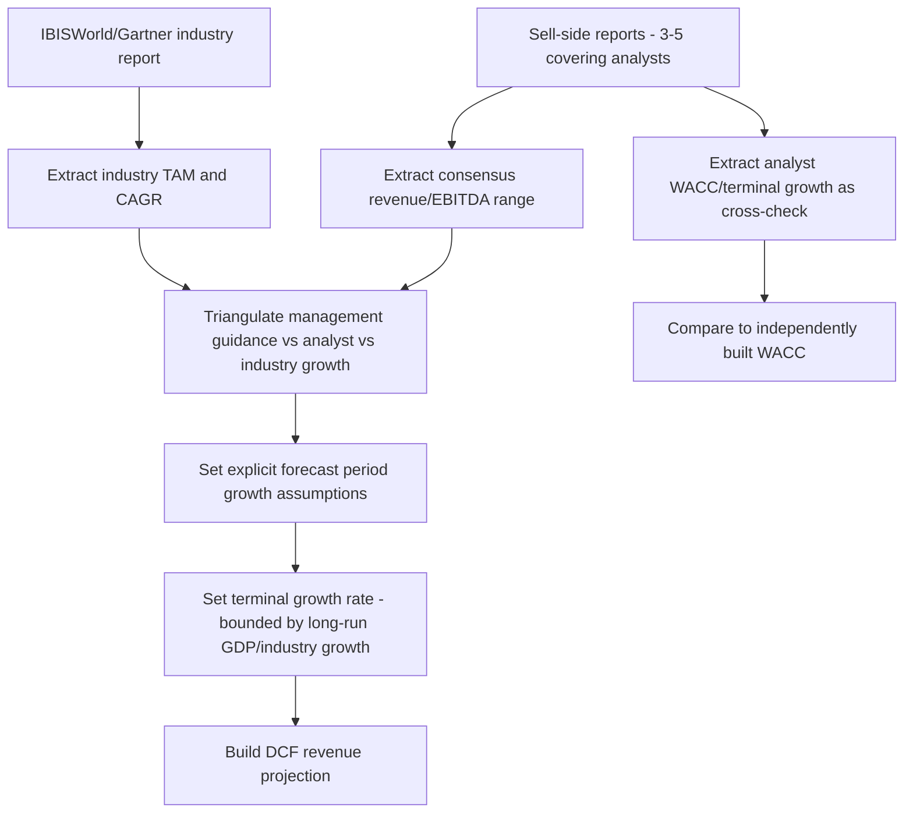

## Industry Research and Equity Research Reports

### Overview

Equity research reports and industry research publications provide qualitative context and forward-looking assumptions that raw financial databases cannot supply: analyst thesis, competitive positioning, management guidance interpretation, and industry-specific KPIs. In a DCF context, these sources primarily inform revenue growth assumptions, margin trajectory, and terminal value judgment — areas where historical financial statements alone are insufficient.

### Category 1: Sell-Side Equity Research

**Structure of a typical sell-side report**

- **Investment thesis/rating** (Buy/Hold/Sell or equivalent) with price target
- **Financial model summary**: analyst's own revenue/EBITDA/EPS forecasts, typically 2-3 years out
- **Valuation section**: usually shows the analyst's own DCF or multiple-based target price derivation, with stated WACC and terminal growth assumptions — useful as a direct comparison point against an independently built model
- **Catalysts and risks**: forward-looking qualitative drivers (new product launches, regulatory changes, competitive threats)

**Access channels**

| Source | Access Model | Notes |
| --- | --- | --- |
| Bloomberg `BRC` / Refinitiv `Research` | Terminal subscription | Aggregates reports from most major banks |
| Broker direct portals (e.g., Morgan Stanley MSDW, Goldman Marquee) | Institutional client access | Full report access, primary source |
| TipRanks, Seeking Alpha (Premium) | Consumer subscription | Aggregated summaries, price target consensus, not full reports |
| Company investor relations pages | Free | Some companies compile analyst coverage lists with links |

[Unverified] Exact analyst WACC and terminal growth assumptions embedded in sell-side models are not always disclosed in the published report; some banks show only the target price and implied multiple, requiring the reader to back-solve assumptions.

### Category 2: Industry and Market Research Firms

**Broad market/industry research**

- **IBISWorld** — standardized industry reports covering U.S. and global industries, with 5-year historical and forecast data on industry revenue, key drivers, competitive landscape, and profitability benchmarks; commonly used for sizing a company's total addressable market (TAM) and sanity-checking long-run industry growth assumptions used in terminal value
- **Gartner / Forrester** — technology sector-specific, strong for enterprise software and IT market sizing, often cited for market share and adoption curve data relevant to growth-stage company valuation
- **Euromonitor** — consumer goods and retail sector focus, strong international/country-level breakdowns
- **S&P Global Market Intelligence (formerly S&P Capital IQ)** — industry surveys (`S&P Industry Surveys`) combining company-level and sector-level data

**Regulatory and government sources**

- **U.S. Census Bureau / Bureau of Economic Analysis (BEA)** — industry-level GDP contribution, useful for top-down TAM sizing
- **Federal Reserve Beige Book** — qualitative regional economic conditions, useful context for cyclical industry assumptions
- **Sector-specific regulators** (FDA for pharma, FCC for telecom, FERC for utilities) — primary source for regulatory catalysts/risks that directly affect terminal value durability assumptions

### Category 3: Using Research Reports in the DCF Workflow

**Practical triangulation approach**

1. Pull 3-5 sell-side analyst models covering the same company; compute range and median of near-term (Y1-Y3) revenue/EBITDA growth
2. Pull the relevant IBISWorld or Gartner industry report to establish the addressable market's long-run growth ceiling
3. Compare management's own guidance (from earnings call transcripts/investor presentations) against both
4. Use the **industry long-run growth rate** as an upper bound anchor for the DCF's terminal growth rate — a company cannot grow faster than its addressable market indefinitely without an implicit market-share-gain assumption that should be explicitly justified

### Category 4: Earnings Call Transcripts and Management Guidance

- **Primary sources**: company investor relations pages (often free, near real-time), SEC EDGAR (transcripts sometimes furnished as 8-K exhibits)
- **Aggregators**: Seeking Alpha (free transcripts, community-contributed), AlphaSense (paid, searchable across companies with NLP-based theme extraction), Bloomberg `ETR` function
- Management guidance (typically given as a revenue or EPS range for next quarter/year) is a critical DCF input for near-term forecast periods, though it should be treated with appropriate skepticism regarding historical guidance accuracy (i.e., checking whether the company has a track record of beating, meeting, or missing its own guidance)

### Category 5: Credit Research (for Capital Structure/Cost of Debt Inputs)

- **Rating agency reports** (Moody's, S&P Global Ratings, Fitch) — provide credit rating, which maps to a synthetic cost of debt via a default spread table (Damodaran publishes a ratings-to-spread mapping table alongside his cost-of-capital datasets)
- **Credit research from banks** — often embedded within the same institutional platforms (Bloomberg, Refinitiv) as equity research, useful for corroborating the debt side of WACC

$$r_d = r_f + \text{default spread}_{rating}$$

### Reliability and Bias Considerations

- **[Inference]** Sell-side research has a documented historical tendency toward optimistic bias (more Buy ratings than Sell ratings across the industry on average), commonly attributed to investment banking relationship incentives; this is a widely discussed structural concern in the finance literature rather than a claim about any specific analyst or report
- Cross-referencing multiple analysts (rather than relying on a single report) and industry-level data (which has less company-specific incentive bias) mitigates this when setting DCF growth assumptions
- Industry research firm forecasts (IBISWorld, Gartner) are themselves projections and subject to their own methodological assumptions — treat as directional input rather than ground truth, particularly for emerging or fast-evolving sectors

### Next Steps

- Terminal Growth Rate Selection and GDP-Bound Sanity Checks
- Cost of Debt: Synthetic Rating and Default Spread Methodology
- Reading Earnings Call Transcripts for Forecast Assumptions
- Building a Revenue Forecast from Bottom-Up Market Sizing
- Analyst Consensus Aggregation and Triangulation Techniques
- Terminal Value: Perpetuity Growth vs. Exit Multiple Method