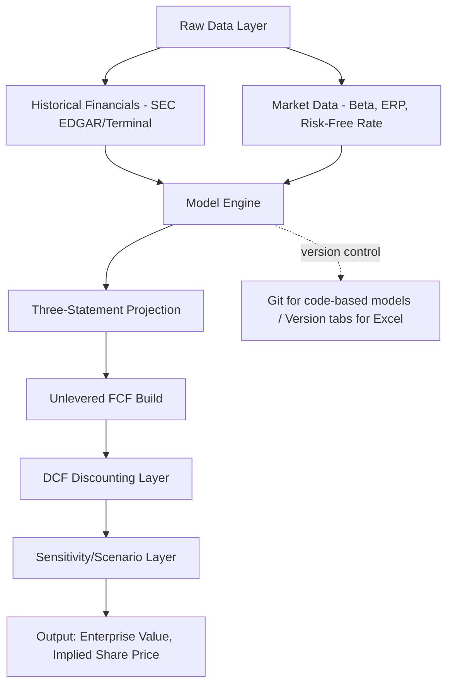

## Valuation Software and Modeling Tools


### Overview

Valuation modeling tooling spans a spectrum from general-purpose spreadsheet software (the industry default) through dedicated financial modeling add-ins, to full valuation/financial planning platforms used in institutional settings. The choice of tool affects auditability, collaboration, version control, and the ease of running sensitivity/scenario analysis on a DCF.

### Category 1: Spreadsheet-Based Modeling (Industry Standard)

**Microsoft Excel**

- Remains the dominant tool for DCF construction across investment banking, private equity, corporate development, and equity research
- Core native features used in valuation models: `Data Tables` (for 2-variable sensitivity analysis, e.g., WACC vs. terminal growth), `Goal Seek`, `Scenario Manager`, circular reference handling (via iterative calculation settings, needed when interest expense depends on debt balance which depends on cash flow which depends on interest expense)
- **Add-ins commonly layered on top**:
  - **Capital IQ / FactSet Excel plug-ins** — live-linked data pulls directly into cells, refreshable
  - **Macabacus** — modeling productivity add-in (formatting shortcuts, error checking, model auditing tools, sensitivity table automation)
  - **Wall Street Prep / BIWS templates** — pre-built DCF, LBO, and merger model templates used as teaching/starting-point structures

**Google Sheets**

- Increasingly used for collaborative/startup valuation work due to real-time multi-user editing
- Weaker circular reference handling and fewer native financial modeling add-ins compared to Excel; [Inference] generally considered less suited to complex institutional-grade models (e.g., full three-statement LBOs) though adequate for simpler single-company DCFs

### Category 2: Dedicated Valuation and Corporate Finance Platforms

| Platform | Primary Use Case | Notes |
| --- | --- | --- |
| Bloomberg `DCF`/`WACC` functions | Quick-build DCF with terminal auto-populated inputs | Fast but less customizable than a bespoke model |
| Capital IQ `Excel Plug-In` | Live comps and precedent transaction screening feeding directly into Excel | Dominant in IB/PE workflows |
| Oracle Crystal Ball / `@RISK` (Palisade) | Monte Carlo simulation layered on top of Excel DCF | Used for probabilistic sensitivity on key DCF drivers (WACC, growth, margin) |
| Finbox | Web-based DCF/valuation automation | Templated DCF with pre-populated consensus data; lighter-weight than Excel-native |
| simplywall.st | Retail-oriented DCF visualization | Simplified, not suited to institutional-grade work |

### Category 3: Programmatic/Code-Based Modeling

For reproducible, version-controlled, or large-scale (multi-company) valuation work, code-based approaches are increasingly used alongside or instead of spreadsheets.

**Python ecosystem**

- `pandas` — financial statement data manipulation
- `numpy-financial` — IRR, NPV calculation functions (replaces deprecated `numpy.irr`/`numpy.npv`)
- `yfinance` — free Yahoo Finance data pull wrapper (subject to the same reliability caveats as the underlying free source)
- `sec-edgar-api` / direct `requests` against `data.sec.gov` — programmatic financial statement extraction
- Jupyter notebooks — common for building reproducible, auditable valuation models with embedded sensitivity analysis and Monte Carlo simulation via `scipy.stats`

**Minimal example: NPV/IRR calculation pattern**

```python
import numpy_financial as npf

# Explicit forecast period free cash flows (Year 1-5)
fcf = [-1000, 150, 180, 210, 245, 280]  # Year 0 = initial outlay

npv = npf.npv(rate=0.10, values=fcf)
irr = npf.irr(fcf)

print(f"NPV: {npv:,.2f}")
print(f"IRR: {irr:.2%}")
```

**R ecosystem**

- `quantmod` — market data retrieval
- `FinCal` / `FinancialMath` — time value of money and valuation-specific functions
- Less common than Python in current industry practice but still used in academic finance settings

### Category 4: Model Architecture and Version Control Considerations



- **Excel-native version control**: typically manual (dated file naming, "Save As" checkpoints, or tracked via SharePoint/OneDrive version history); genuine diff-based version control is weak compared to code
- **Code-based models**: can use standard Git version control, enabling proper diffing of assumption changes, branching for scenario variants, and code review workflows — [Inference] this is a meaningful advantage for teams building repeatable, auditable valuation pipelines (e.g., quarterly refreshed comps or multi-company screens), though the learning curve and lack of a visual grid interface is a real adoption barrier relative to Excel for finance professionals not already comfortable with code

### Category 5: Model Auditing and Error-Checking Tools

- **Macabacus error checker** — flags broken formula references, inconsistent formulas across a row, hardcoded values within formula cells
- **Spreadsheet Advantage / Spreadsheet Detective** — trace precedents/dependents, formula documentation
- Manual best practices still form the backbone of model integrity regardless of tooling:
  - Separate input/assumption cells (typically colored blue) from formula cells (black) and cross-sheet links (green) — a widely adopted convention across IB/PE model templates
  - Single source of truth for each assumption (avoid the same growth rate hardcoded in multiple places)
  - Explicit circularity switches (a manual toggle to break interest expense circularity for debugging)

### Category 6: Collaboration and Presentation Tools

- **PowerPoint / Google Slides** — standard for presenting DCF output as part of a broader valuation deck (football field chart, sensitivity table exhibits)
- **Tableau / Power BI** — increasingly used for building interactive sensitivity dashboards on top of a DCF's output range, particularly when presenting a range of outcomes across multiple scenarios to non-technical stakeholders

### Tool Selection Guidance by Context

| Context | Recommended Tooling |
| --- | --- |
| Single-company DCF, one-off | Excel, manual structure |
| Repeatable quarterly refresh across many companies | Python/pandas pipeline + Excel/BI output layer |
| Institutional IB/PE deliverable | Excel + Capital IQ plug-in + Macabacus |
| Probabilistic/Monte Carlo sensitivity | Excel + `@RISK`/Crystal Ball, or Python `scipy.stats` |
| Academic/teaching reproducibility | Python/R notebooks with version control |

### Next Steps

- Building a Three-Statement Model with Circularity Handling
- Sensitivity and Scenario Analysis: Data Tables vs. Monte Carlo Methods
- Model Auditing Best Practices and Common Error Patterns
- Python for Financial Modeling: pandas and numpy-financial Workflows
- Building a Football Field Valuation Chart from Multiple Methodologies
- Automating Comparable Company Screens with the SEC EDGAR API