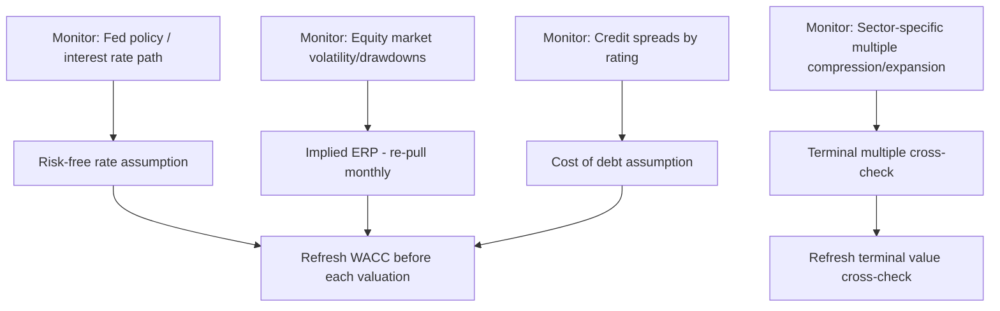

## Staying Current with Valuation Theory and Market Conditions

### Overview

Corporate valuation practice does not stand still: discount rate conventions shift with monetary policy regimes, terminal value methodology is periodically challenged by academic critique, and sector-specific valuation norms evolve (e.g., the shift toward SaaS metrics like Rule of 40, or the periodic re-litigation of how to value negative-FCF growth companies). Staying current requires a mix of academic literature tracking, market condition monitoring, and professional community engagement.

### Category 1: Academic and Theoretical Literature

**Core ongoing sources**

- **Journal of Finance, Journal of Financial Economics, Review of Financial Studies** — top-tier peer-reviewed journals where foundational shifts in valuation theory (e.g., critiques of CAPM, multi-factor model development) originate
- **Financial Analysts Journal (CFA Institute)** — more practitioner-oriented than the academic journals above, frequently publishes applied valuation methodology pieces
- **SSRN Financial Economics Network** — preprint repository; faster-moving than peer-reviewed journals, good for catching emerging methodological debates before formal publication
- **Damodaran's blog** (`aswathdamodaran.blogspot.com`) — informal but highly influential ongoing commentary connecting current market events to valuation theory application; frequently addresses "how do I value X in the current environment" questions in real time (e.g., posts on valuing AI companies, negative-rate environments, crypto-adjacent valuation)

**Recurring theoretical debate areas relevant to DCF practice**

- CAPM's empirical validity and the ongoing use of multi-factor models (Fama-French three/five-factor, momentum) as alternatives or supplements to single-factor beta for cost of equity
- The appropriate treatment of R&D and other intangible investment as CapEx-like (capitalization) vs. expense in FCF construction — a live debate given the rising share of intangible-driven business models
- ESG-adjusted discount rates and whether/how climate transition risk should be reflected in WACC or explicit cash flow scenarios

[Inference] These remain areas of active disagreement among academics and practitioners rather than settled methodology; a practitioner's choice on these points should be treated as a documented judgment call, not a universally "correct" answer.

### Category 2: Market Condition Monitoring (Inputs That Change)

- **Interest rate environment**: risk-free rate is the most directly market-sensitive DCF input; a valuation built during a low-rate regime and reused unchanged during a high-rate regime will materially understate the appropriate discount rate
- **Credit spread environment**: widening spreads during risk-off periods raise cost of debt independent of company-specific credit quality changes
- **Equity risk premium**: Damodaran's monthly implied ERP update is the standard mechanism for capturing shifts in market-wide risk pricing without needing a full historical ERP recalculation
- **Sector multiple regimes**: growth-stock multiple compression (e.g., 2021-2022 tech de-rating) directly affects the defensibility of exit-multiple-based terminal value assumptions; monitoring current sector multiple levels against historical ranges is standard practice before finalizing a terminal value

**Recommended monitoring cadence**: risk-free rate and ERP should generally be re-checked at the time of each new valuation (not reused from a prior model without verification), given how directly they flow into the discount rate.

### Category 3: Professional and Practitioner Communities

- **CFA Institute** — continuing education requirements, Financial Analysts Journal, and local society events function as a structured mechanism for staying current; the CFA curriculum itself is periodically revised to reflect evolving standard practice
- **Wall Street Oasis, r/FinancialCareers, r/SecurityAnalysis** — informal practitioner forums where current market-specific valuation debates (e.g., "how are people valuing AI infrastructure capex right now") surface faster than formal literature
- **Investment bank/PE firm published research** (Goldman Sachs Research, McKinsey's *Valuation* updates, KPMG/Deloitte valuation methodology whitepapers) — periodically published thought pieces addressing current market valuation questions
- **AICPA/ASA business valuation standards updates** — relevant for practitioners doing formal valuation for financial reporting (ASC 820 fair value) or litigation support, where standards bodies periodically update guidance

### Category 4: Textbook and Reference Updates

| Source | Update Pattern | Relevance |
| --- | --- | --- |
| Damodaran, *Investment Valuation* / *The Little Book of Valuation* | Periodic new editions | Foundational DCF theory, regularly refreshed with current examples |
| McKinsey, *Valuation: Measuring and Managing the Value of Companies* | Periodic new editions | Institutional-standard corporate finance/valuation reference |
| CFA Institute curriculum (Equity, Corporate Finance topic areas) | Annual revision | Reflects current consensus practitioner methodology |

### Category 5: Practical Habits for Ongoing Currency

1. **Re-pull cost of capital inputs at the start of each new valuation** rather than reusing a prior model's WACC — risk-free rate and ERP are point-in-time inputs
2. **Subscribe to or periodically review Damodaran's blog and annual data updates** as a low-effort, high-signal way to track both data changes and methodology commentary
3. **Track sector-specific metric evolution** — valuation heuristics shift by sector cycle (e.g., SaaS moved from revenue multiples toward Rule of 40-adjusted multiples during the 2022-2023 rate-driven de-rating); staying current means periodically checking whether the standard comp screen metric for a given sector has shifted
4. **Read post-mortem/case-study analyses of high-profile valuation disputes** (e.g., appraisal rights litigation in Delaware Chancery Court, which frequently produces detailed judicial opinions dissecting competing DCF methodologies) as a source of applied methodology scrutiny
5. **Periodically revisit terminal value assumption bounds** against updated long-run GDP growth forecasts (IMF, World Bank, OECD publish periodic long-run growth projections) to ensure terminal growth rate assumptions remain defensible

### Reliability Note

**[Inference]** There is no single authoritative real-time feed for "current valuation theory" — staying current is necessarily a synthesis exercise across academic, market-data, and practitioner-community sources rather than a single subscription; the sources listed above are complementary rather than substitutes for one another.

### Next Steps

- CAPM Critiques and Multi-Factor Cost of Equity Models
- R&D Capitalization Treatment in Free Cash Flow Construction
- ESG and Climate Risk Adjustments to Discount Rates
- Delaware Chancery Court DCF Methodology Case Studies
- Sector-Specific Valuation Metric Evolution (SaaS, Biotech, Financials)
- Building a Recurring Valuation Input Refresh Checklist